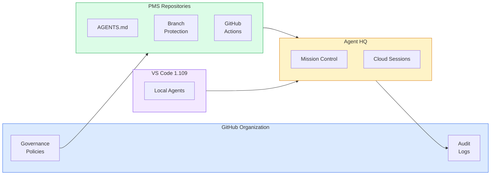

# GitHub Agent HQ Setup Guide for PMS Integration

**Document ID:** PMS-EXP-GITHUB-AGENT-HQ-001
**Version:** 1.0
**Date:** March 3, 2026
**Applies To:** PMS project (all platforms)
**Prerequisites Level:** Beginner

---

## Table of Contents

1. [Overview](#1-overview)
2. [Prerequisites](#2-prerequisites)
3. [Part A: Configure Agent HQ Organization Policies](#3-part-a-configure-agent-hq-organization-policies)
4. [Part B: Set Up Repository Agent Configuration](#4-part-b-set-up-repository-agent-configuration)
5. [Part C: Integrate with VS Code and CI/CD](#5-part-c-integrate-with-vs-code-and-cicd)
6. [Part D: Testing and Verification](#6-part-d-testing-and-verification)
7. [Troubleshooting](#7-troubleshooting)
8. [Reference Commands](#8-reference-commands)

---

## 1. Overview

This guide walks you through configuring **GitHub Agent HQ** for the PMS organization. By the end you will have:

- Organization-level agent governance policies (whitelisting, permissions, audit)
- `AGENTS.md` files in each PMS repository defining healthcare-specific guardrails
- Branch protection rules preventing agents from merging to main without human approval
- Cloud agent session templates for async tasks (security audit, test generation)
- Mission Control dashboard configured with Slack notifications
- VS Code connected to Agent HQ for seamless local-to-cloud agent handoff

### Architecture at a Glance



---

## 2. Prerequisites

### 2.1 Required Accounts & Subscriptions

| Requirement | Details |
|------------|---------|
| GitHub Organization | PMS org with admin access |
| Copilot Business/Enterprise | Required for Agent HQ access |
| VS Code 1.109+ | For local Agent HQ integration |
| GitHub CLI | For command-line agent management |

### 2.2 Install GitHub CLI

```bash
# macOS
brew install gh

# Verify
gh --version

# Authenticate
gh auth login
```

### 2.3 Verify Access

```bash
# Check Copilot status
gh copilot --help

# Verify org membership
gh api user/orgs --jq '.[].login'
```

---

## 3. Part A: Configure Agent HQ Organization Policies

### Step 1: Access the governance control plane

1. Navigate to your GitHub organization settings
2. Under **Code, planning, and automation**, find **Copilot** > **Agent HQ**
3. Click **Governance policies**

### Step 2: Configure agent whitelisting

Enable only approved agents for PMS repositories:

| Agent | Status | Rationale |
|-------|--------|-----------|
| GitHub Copilot | Approved | Default code assistance |
| Anthropic Claude | Approved | Complex architecture and clinical logic |
| OpenAI Codex | Approved | Async cloud tasks and refactoring |
| Custom agents | Requires admin approval | Must pass security review |

### Step 3: Set organization-wide permissions

```
Agent Permissions:
- Repository access: Read-write on development repos only
- Branch creation: Allowed (agent-prefixed branches only)
- Direct commits to main/develop: Blocked
- Pull request creation: Allowed
- Pull request merge: Blocked (requires human code owner)
- Issue creation: Allowed (with confidence threshold)
- Issue assignment: Allowed
- Secret access: Blocked
- Actions trigger: Allowed (read-only workflows only)
```

### Step 4: Enable audit logging

1. In org settings > Audit log, enable **Agent activity logging**
2. Configure log retention: minimum 90 days (HIPAA requirement)
3. Enable log export to your SIEM if applicable

**Checkpoint:** Organization-level governance is configured with agent whitelisting, permission boundaries, and audit logging.

---

## 4. Part B: Set Up Repository Agent Configuration

### Step 1: Create AGENTS.md for pms-backend

Create `AGENTS.md` in the pms-backend repository root:

```markdown
# PMS Backend Agent Configuration

## Identity
You are a development agent working on the PMS Backend (FastAPI, Python 3.11+).
This is a HIPAA-regulated healthcare application.

## Rules (MUST follow)

### HIPAA Compliance
- Never log PHI (patient names, MRNs, DOBs, SSNs, addresses, phone numbers)
- Every data access endpoint MUST have @audit_log decorator
- Every endpoint returning patient data MUST have @require_auth decorator
- All PHI fields in database models MUST use EncryptedString column type
- External API calls MUST pass through PHI de-identification gateway

### Code Conventions
- Use async/await for all IO operations
- Use Pydantic models for all request/response validation
- Place routes in app/api/routes/{domain}.py
- Place services in app/services/{domain}.py
- Place models in app/models/{domain}.py
- Use type hints on all function signatures

### Testing
- Every new endpoint requires unit tests AND integration tests
- Test files: tests/{module}/test_{feature}.py
- Use pytest fixtures from conftest.py
- Minimum 80% coverage for new code
- Never use real PHI in test data

### Prohibited Patterns
- Do not use dynamic code evaluation or deserialization of untrusted data
- Do not construct SQL with string formatting — use parameterized queries
- Do not commit .env files or API keys
- Do not modify alembic migration files without explicit approval
```

### Step 2: Create AGENTS.md for pms-frontend

Create `AGENTS.md` in the pms-frontend repository root:

```markdown
# PMS Frontend Agent Configuration

## Identity
You are a development agent working on the PMS Frontend (Next.js 15, React 19, TypeScript).
This is a HIPAA-regulated healthcare application.

## Rules (MUST follow)

### Security
- Never render user-provided content without sanitization
- Use server components by default; client components only when needed
- Never expose API keys or tokens in client-side code
- All API calls go through /api/ proxy routes — never call backend directly

### Code Conventions
- Use functional React components with hooks
- TypeScript strict mode — no any types
- Components: src/components/{domain}/{ComponentName}.tsx
- Pages: src/app/{route}/page.tsx
- Use Tailwind CSS for styling

### Prohibited Patterns
- Do not use inline styles (use Tailwind)
- Do not use class components
- Do not disable TypeScript strict checks
```

### Step 3: Configure branch protection for agent branches

For each PMS repository, configure branch protection via the GitHub UI:

1. Go to repository Settings > Branches > Branch protection rules
2. Add rule for `main`:
   - Require status checks (test, lint, security)
   - Require pull request reviews (1 approver, code owner required)
   - Enforce for administrators
3. Agent branches follow naming: `agent/{agent-name}/{task-description}`

### Step 4: Create cloud agent task templates

Create `.github/agent-tasks/security-audit.md`:

```markdown
# Security Audit Task

## Instructions
Perform a comprehensive security audit of this repository focusing on:
1. HIPAA compliance: PHI handling, audit logging, encryption
2. Injection vulnerabilities: SQL injection, command injection, XSS
3. Authentication/authorization: Missing auth checks, privilege escalation
4. Dependency vulnerabilities: Known CVEs in dependencies
5. Secret exposure: Hardcoded credentials, API keys, tokens

## Output
Create an issue titled "Security Audit: {date}" with findings by severity.
```

Create `.github/agent-tasks/test-generation.md`:

```markdown
# Test Generation Task

## Instructions
Analyze the repository for code without test coverage and generate tests:
1. Identify untested functions and endpoints
2. Generate unit tests following the TDD conventions in AGENTS.md
3. Include edge cases and error scenarios
4. Use synthetic data — never real PHI

## Output
Create a PR with title "test: add missing tests for {module}" on branch agent/codex/test-generation-{date}.
```

**Checkpoint:** All PMS repositories have AGENTS.md files, branch protection rules, and cloud agent task templates.

---

## 5. Part C: Integrate with VS Code and CI/CD

### Step 1: Connect VS Code to Agent HQ

VS Code 1.109 automatically connects to Agent HQ when:
1. You're signed into GitHub with Copilot Business/Enterprise
2. The repository has an `AGENTS.md` file
3. Agent HQ is enabled for the organization

Verify: Command Palette > "Agent HQ: Show Status" — should show Connected.

### Step 2: Create GitHub Actions workflow for agent tasks

Create `.github/workflows/agent-security-audit.yml`:

```yaml
name: Agent Security Audit (Weekly)

on:
  schedule:
    - cron: '0 6 * * 1'  # Every Monday at 6 AM UTC
  workflow_dispatch:

permissions:
  contents: read
  issues: write
  pull-requests: read

jobs:
  security-audit:
    runs-on: ubuntu-latest
    steps:
      - uses: actions/checkout@v4
      - name: Trigger Agent Security Audit
        uses: github/agent-task@v1
        with:
          agent: claude
          task-file: .github/agent-tasks/security-audit.md
          timeout: 30m
```

### Step 3: Configure Slack notifications

1. In GitHub organization settings > Integrations > Slack
2. Add the PMS development channel
3. Configure notifications for agent task completions, security findings, and agent PR creation

### Step 4: Set up Mission Control dashboard

1. Navigate to github.com/{org} > Agent HQ > Mission Control
2. Pin the PMS repositories to the dashboard
3. Configure widgets: active sessions, recent PRs, usage metrics, security findings

**Checkpoint:** VS Code connected to Agent HQ, GitHub Actions agent workflows configured, Slack notifications enabled, and Mission Control dashboard set up.

---

## 6. Part D: Testing and Verification

### Step 1: Verify Agent HQ connection

In VS Code, open Chat and verify Claude and Codex appear in the agent dropdown.

### Step 2: Test AGENTS.md enforcement

1. Open VS Code in the pms-backend repository
2. Ask Claude: "Create a patient lookup function that logs the patient name"
3. The agent should refuse to log the patient name (HIPAA rule in AGENTS.md)

### Step 3: Test branch protection

1. Ask a cloud agent to make a code change
2. Verify the agent creates a branch with the `agent/` prefix
3. Verify a PR is created requiring code owner review

### Step 4: Test cloud agent task

1. Navigate to GitHub.com > repository > Agent HQ
2. Click "New Task" and select the security-audit template
3. Assign to Claude and wait for completion

### Step 5: Test Mission Control

1. Open github.com/{org} > Agent HQ > Mission Control
2. Verify the active task from Step 4 appears

### Step 6: Verify audit log

1. Go to org settings > Audit log
2. Filter by "agent" events
3. Verify the cloud agent task is logged

**Checkpoint:** All six verification steps pass.

---

## 7. Troubleshooting

### Agent HQ Not Available

**Symptom:** Agent HQ menu missing from GitHub organization settings.
**Solution:** Verify Copilot Business/Enterprise subscription is active.

### Cloud Agent Session Fails to Start

**Symptom:** "Session failed to start" error.
**Solution:** Check premium request allocation, verify agent whitelisting, check AGENTS.md exists.

### AGENTS.md Not Applied

**Symptom:** Agent ignores repository-specific rules.
**Solution:** Verify AGENTS.md is committed (not just local), rules are specific, and `/init` has been run.

### Branch Protection Blocking Agent

**Symptom:** Agent cannot create branches or PRs.
**Solution:** Verify agent permissions allow branch creation and PR creation in governance policies.

### Premium Requests Exhausted

**Symptom:** "No premium requests remaining."
**Solution:** Check usage in org settings > Copilot > Usage. Wait for monthly reset or upgrade plan.

---

## 8. Reference Commands

### GitHub CLI Agent Commands

```bash
# List active agent sessions
gh copilot agent list

# Start a cloud agent task
gh copilot agent run --agent claude --task "Review this PR for HIPAA compliance"

# Check agent session status
gh copilot agent status --session-id <id>

# View agent audit log
gh api orgs/{org}/audit-log --jq '.[] | select(.action | startswith("agent"))'
```

### Key Files

| File | Purpose |
|------|---------|
| `AGENTS.md` | Repository-level agent behavior configuration |
| `.github/copilot-instructions.md` | Workspace priming instructions |
| `.github/agent-tasks/*.md` | Cloud agent task templates |
| `.github/workflows/agent-*.yml` | GitHub Actions agent workflows |

### Useful URLs

| Resource | URL |
|----------|-----|
| Agent HQ Dashboard | github.com/{org} > Agent HQ |
| Mission Control | github.com/{org} > Agent HQ > Mission Control |
| Agent Documentation | https://code.visualstudio.com/docs/copilot/agents/overview |

---

## Next Steps

1. Work through the [Agent HQ Developer Tutorial](32-GitHubAgentHQ-Developer-Tutorial.md)
2. Review the [PRD](32-PRD-GitHubAgentHQ-PMS-Integration.md) for the full agent governance strategy
3. Coordinate with [VS Code Multi-Agent (Exp 31)](31-VSCodeMultiAgent-PMS-Developer-Setup-Guide.md) for local IDE configuration

---

## Resources

- **Agent HQ Announcement:** [Welcome Home, Agents](https://github.blog/news-insights/company-news/welcome-home-agents/)
- **Claude & Codex on Agent HQ:** [Pick Your Agent](https://github.blog/news-insights/company-news/pick-your-agent-use-claude-and-codex-on-agent-hq/)
- **Agent Docs:** [Using Agents in VS Code](https://code.visualstudio.com/docs/copilot/agents/overview)
- **Copilot Agents:** [github.com/features/copilot/agents](https://github.com/features/copilot/agents)
