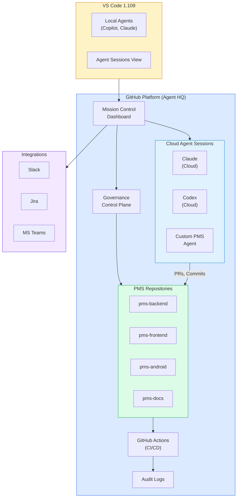

# Product Requirements Document: GitHub Agent HQ Integration into Patient Management System (PMS)

**Document ID:** PRD-PMS-GITHUB-AGENT-HQ-001
**Version:** 1.0
**Date:** March 3, 2026
**Author:** Ammar (CEO, MPS Inc.)
**Status:** Draft

---

## 1. Executive Summary

GitHub Agent HQ is GitHub's multi-agent platform announced February 4, 2026, that transforms GitHub into an open ecosystem where Claude, Codex, Copilot, and custom agents work side-by-side across GitHub.com, VS Code, GitHub Mobile, and the CLI. Agent HQ provides a **Mission Control dashboard** for assigning tasks, tracking agent sessions, managing cloud-based async work, and enforcing enterprise governance — all through the familiar Git-based workflow of branches, pull requests, and code reviews.

Integrating Agent HQ into the PMS development workflow provides three critical capabilities: (1) **multi-agent task assignment** where Claude handles complex clinical logic, Codex runs async documentation and refactoring tasks in the cloud, and Copilot handles real-time completions; (2) **enterprise governance** with branch protection rules, agent whitelisting, audit trails, and permission controls enforcing HIPAA-compliant development practices; and (3) **custom PMS agents** defined via `AGENTS.md` files that encode healthcare-specific guardrails, coding conventions, and quality requirements.

Agent HQ complements VS Code 1.109 Multi-Agent (Experiment 31) by adding the **GitHub platform layer** — while VS Code handles local IDE orchestration, Agent HQ manages the repository-level agent governance, cloud agent infrastructure, CI/CD integration, and cross-team agent coordination that VS Code cannot provide.

---

## 2. Problem Statement

- **No repository-level agent governance:** While VS Code 1.109 provides local agent management, there is no way to enforce consistent agent policies across all PMS repositories and team members at the GitHub organization level.
- **No cloud agent infrastructure:** Complex tasks like large-scale refactoring, comprehensive security audits, or cross-repository documentation generation require cloud-hosted agents that run asynchronously without tying up developer machines.
- **No agent audit trail for compliance:** Healthcare software development requires audit trails for all code changes. When AI agents generate code, there is no centralized log of which agent made what changes, with what context, across which repositories.
- **No agent whitelisting for organizations:** Individual developers can use any AI model, potentially introducing unapproved or non-compliant agents into the PMS codebase without organizational oversight.
- **No custom agent definitions in source control:** Agent behavior is configured in local IDE settings rather than committed to the repository, leading to inconsistency across the team.
- **No integration between agents and GitHub workflows:** Agents cannot automatically participate in issue triage, PR review, or CI/CD pipelines as first-class workflow participants.

---

## 3. Proposed Solution

Adopt **GitHub Agent HQ** as the platform-level agent governance and orchestration layer for all PMS repositories, complementing VS Code 1.109's local IDE capabilities with repository-level agent policies, cloud agent infrastructure, and CI/CD integration.

### 3.1 Architecture Overview

### 3.2 Deployment Model

- **GitHub-hosted (SaaS):** Agent HQ runs entirely on GitHub's infrastructure — no self-hosting required
- **Cloud agent sessions:** Claude and Codex run in GitHub's sandboxed cloud environments
- **Source-controlled configuration:** `AGENTS.md` files in each repository define agent behavior and guardrails
- **Branch protection:** Agents can only push to branches they create; merges require human code owner approval
- **Subscription:** Copilot Business ($19/user/month) or Enterprise ($39/user/month) — agent sessions consume premium requests from monthly allocation

---

## 4. PMS Data Sources

| PMS Resource | Agent HQ Integration | Use Case |
|-------------|---------------------|----------|
| GitHub Issues | Agent task assignment | Assign bug triage, feature implementation, or docs to agents |
| Pull Requests | Agent code review | Agents review PRs for HIPAA compliance, security, and conventions |
| GitHub Actions | CI/CD integration | Agents triggered by pipeline events (test failure, security scan) |
| Repository Code | Agent development | Agents read/write code with branch protection guardrails |
| `AGENTS.md` | Agent configuration | Source-controlled agent behavior definitions |

---

## 5. Component/Module Definitions

### 5.1 PMS Agent Governance Policy

**Description:** Organization-level Agent HQ governance configuration.

**Configuration:**
- Approved agents: Copilot, Claude, Codex (custom agents require admin approval)
- Branch protection: Agents create feature branches only; main/develop are human-only merge
- Repository access: Agents have read-write on development repos; read-only on production configs
- Audit logging: All agent sessions logged with full context

### 5.2 Custom PMS Agent (AGENTS.md)

**Description:** Source-controlled agent definition for PMS-specific behavior.

**Location:** `AGENTS.md` in each PMS repository root.

**Content:** Healthcare coding conventions, HIPAA guardrails, testing requirements, file organization rules, and prohibited patterns.

### 5.3 Agent-Powered Issue Triage

**Description:** Automated issue classification and routing using Agent HQ.

**Flow:**
1. New issue created in PMS repository
2. Agent HQ triggers a Claude agent to analyze the issue
3. Agent classifies: bug/feature/docs/security
4. Agent assigns labels, priority, and suggested assignee
5. Agent may propose a fix for simple bugs

### 5.4 Agent-Powered PR Review

**Description:** Automated code review using Agent HQ with HIPAA-specific checks.

**Flow:**
1. PR opened against PMS repository
2. Agent HQ triggers review agents:
   - Security agent: Check for PHI exposure, injection vulnerabilities
   - HIPAA agent: Verify audit logging, encryption, access controls
   - Convention agent: Check file naming, API patterns, test coverage
3. Agents comment on PR with findings
4. Human code owner reviews and merges

### 5.5 Cloud Agent Task Templates

**Description:** Pre-defined task templates for common async agent work.

**Templates:**
- `security-audit` — Full repository security scan with HIPAA focus
- `docs-update` — Generate/update API documentation from code
- `test-generation` — Generate missing tests for uncovered code
- `dependency-update` — Update dependencies with security advisories
- `refactor-suggestion` — Identify refactoring opportunities with proposals

### 5.6 Mission Control Integration

**Description:** Dashboard configuration for PMS team visibility.

**Integrations:**
- Slack: Agent completion notifications, security alert escalation
- Jira: Sync agent-created issues and PR links
- Metrics: Agent productivity dashboard (accepted suggestions, PRs merged, issues resolved)

---

## 6. Non-Functional Requirements

### 6.1 Security and HIPAA Compliance

- **Agent whitelisting:** Only approved agents (Copilot, Claude, Codex) permitted on PMS repositories
- **Branch protection:** Agents cannot merge to main/develop; human code owner approval required
- **No PHI in agent context:** Repository configurations and issue descriptions must never contain real PHI
- **Audit trail:** Every agent session logged with: agent type, user who assigned, files modified, branches created, PR references
- **Sandboxed execution:** Cloud agent sessions run in GitHub's isolated environments with no access to production systems
- **Secret scanning:** Agent-generated code scanned for accidentally committed secrets before PR creation
- **Access control:** Agent permissions aligned with developer role-based access

### 6.2 Performance

| Metric | Target |
|--------|--------|
| Cloud agent session start | < 30 seconds |
| Issue triage response | < 2 minutes |
| PR review completion | < 5 minutes |
| Mission Control dashboard load | < 3 seconds |
| Agent task assignment | < 5 seconds |

### 6.3 Infrastructure

- **GitHub Enterprise Cloud** or **GitHub Team** subscription
- **Copilot Business/Enterprise** for agent access
- **No self-hosted infrastructure** — all agent compute on GitHub's cloud
- **Premium request allocation:** Plan capacity based on team size and expected agent usage

---

## 7. Implementation Phases

### Phase 1: Foundation — Governance & Configuration (Sprint 1)

- Configure Agent HQ governance policies at the GitHub organization level
- Create `AGENTS.md` files for all PMS repositories
- Set up branch protection rules for agent-created branches
- Enable agent audit logging
- Configure agent whitelisting (Copilot, Claude, Codex only)

### Phase 2: Automated Workflows (Sprints 2-3)

- Deploy agent-powered issue triage for pms-backend and pms-frontend repos
- Deploy agent-powered PR review with HIPAA-specific checks
- Create cloud agent task templates (security audit, docs, tests)
- Configure Slack integration for agent notifications
- Team training on Mission Control dashboard

### Phase 3: Advanced Orchestration (Sprints 4-5)

- Build custom PMS agent with healthcare-specific capabilities
- Integrate agent tasks with GitHub Actions CI/CD pipelines
- Deploy cross-repository agent workflows (e.g., backend API change triggers frontend agent)
- Build agent productivity metrics dashboard
- Optimize premium request allocation based on usage patterns

---

## 8. Success Metrics

| Metric | Target | Measurement Method |
|--------|--------|--------------------|
| Issue triage automation | 70% of issues auto-classified | GitHub issue analytics |
| PR review coverage | 100% of PRs receive agent review | PR metrics |
| HIPAA compliance findings | Zero missed HIPAA violations | Security audit comparison |
| Agent task completion rate | > 80% of assigned tasks completed | Mission Control metrics |
| Developer satisfaction | > 4.0/5.0 with agent workflows | Team survey |
| Premium request efficiency | < 50% of allocation used | GitHub billing dashboard |

---

## 9. Risks and Mitigations

| Risk | Impact | Mitigation |
|------|--------|------------|
| Premium request exhaustion | Agents become unavailable mid-sprint | Monitor usage, set per-team quotas, escalate to Enterprise tier |
| Agent generates insecure code | Security vulnerability in codebase | Branch protection + human review + CI security gates |
| Over-reliance on agent PR review | False sense of security | Require human code owner approval; agents augment, don't replace |
| Agent creates noisy issues/PRs | Developer fatigue | Tune triage sensitivity; require confidence threshold for auto-creation |
| Vendor lock-in to GitHub platform | Migration difficulty | Keep AGENTS.md portable; maintain Claude Code CLI as alternative |
| Cost escalation with team growth | Budget pressure | Monitor per-user costs; right-size subscription tier |

---

## 10. Dependencies

| Dependency | Version | Purpose |
|------------|---------|---------|
| GitHub Enterprise Cloud / Team | Current | Agent HQ platform access |
| GitHub Copilot Business/Enterprise | Current | Agent sessions and premium requests |
| VS Code | >= 1.109 | Local IDE integration with Agent HQ |
| GitHub Actions | Current | CI/CD integration with agent workflows |
| Slack (optional) | Current | Agent notification integration |
| Jira (optional) | Current | Issue sync integration |

---

## 11. Comparison with Existing Experiments

| Aspect | Agent HQ (Exp 32) | VS Code Multi-Agent (Exp 31) | Claude Code (Exp 27) | Superpowers (Exp 19) |
|--------|-------------------|------------------------------|---------------------|---------------------|
| **Scope** | GitHub platform-level | Local IDE | CLI terminal | Claude Code plugins |
| **Governance** | Org-level control plane | Workspace settings | CLAUDE.md | Plugin config |
| **Cloud agents** | Claude, Codex (GitHub cloud) | Codex only | No | No |
| **Audit trail** | Platform-level logs | Local VS Code logs | None | None |
| **Branch protection** | Agent-specific rules | No | No | No |
| **Issue/PR integration** | Native (agents participate) | No | No | No |
| **Custom agents** | AGENTS.md (source-controlled) | .github/skills/ | .claude/skills/ | Plugin skills |
| **Team coordination** | Mission Control dashboard | Agent Sessions view | N/A | N/A |

**Complementary roles:**
- **Agent HQ** provides platform-level governance, cloud agent infrastructure, and GitHub workflow integration
- **VS Code Multi-Agent (Exp 31)** provides local IDE agent orchestration with Skills and MCP
- **Claude Code (Exp 27)** provides terminal-based agent for CI/CD, headless automation, and worktrees
- Together, they form a **three-layer agent stack**: platform (Agent HQ) → IDE (VS Code) → CLI (Claude Code)

---

## 12. Research Sources

### Official Announcements
- [Introducing Agent HQ: Any Agent, Any Way You Work](https://github.blog/news-insights/company-news/welcome-home-agents/) — Official GitHub blog announcement
- [Pick Your Agent: Claude and Codex on Agent HQ](https://github.blog/news-insights/company-news/pick-your-agent-use-claude-and-codex-on-agent-hq/) — Claude and Codex integration details
- [Claude and Codex Public Preview Changelog](https://github.blog/changelog/2026-02-04-claude-and-codex-are-now-available-in-public-preview-on-github/) — Feature availability details

### Analysis & Coverage
- [Why Agent HQ Matters for Engineering Teams (Eficode)](https://www.eficode.com/blog/why-github-agent-hq-matters-for-engineering-teams-in-2026) — Enterprise impact analysis
- [VS Code Multi-Agent Command Center (The New Stack)](https://thenewstack.io/vs-code-becomes-multi-agent-command-center-for-developers/) — VS Code integration deep dive
- [GitHub Agent HQ Multi-AI Coding Hub (SecZine)](https://seczine.com/technology/2026/02/github-agent-hq-multiai-coding-hub-features-you-ne/) — Security features overview

### Documentation
- [Using Agents in VS Code](https://code.visualstudio.com/docs/copilot/agents/overview) — Agent architecture documentation
- [Third-Party Agents in VS Code](https://code.visualstudio.com/docs/copilot/agents/third-party-agents) — Claude and Codex setup
- [GitHub Copilot Agents](https://github.com/features/copilot/agents) — Feature page with capabilities overview

---

## 13. Appendix: Related Documents

- [GitHub Agent HQ Setup Guide](32-GitHubAgentHQ-PMS-Developer-Setup-Guide.md)
- [GitHub Agent HQ Developer Tutorial](32-GitHubAgentHQ-Developer-Tutorial.md)
- [VS Code Multi-Agent PRD (Experiment 31)](31-PRD-VSCodeMultiAgent-PMS-Integration.md)
- [Claude Code Developer Tutorial (Experiment 27)](27-ClaudeCode-Developer-Tutorial.md)
- [MCP PRD (Experiment 9)](09-PRD-MCP-PMS-Integration.md)
