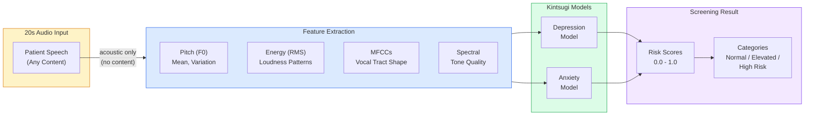
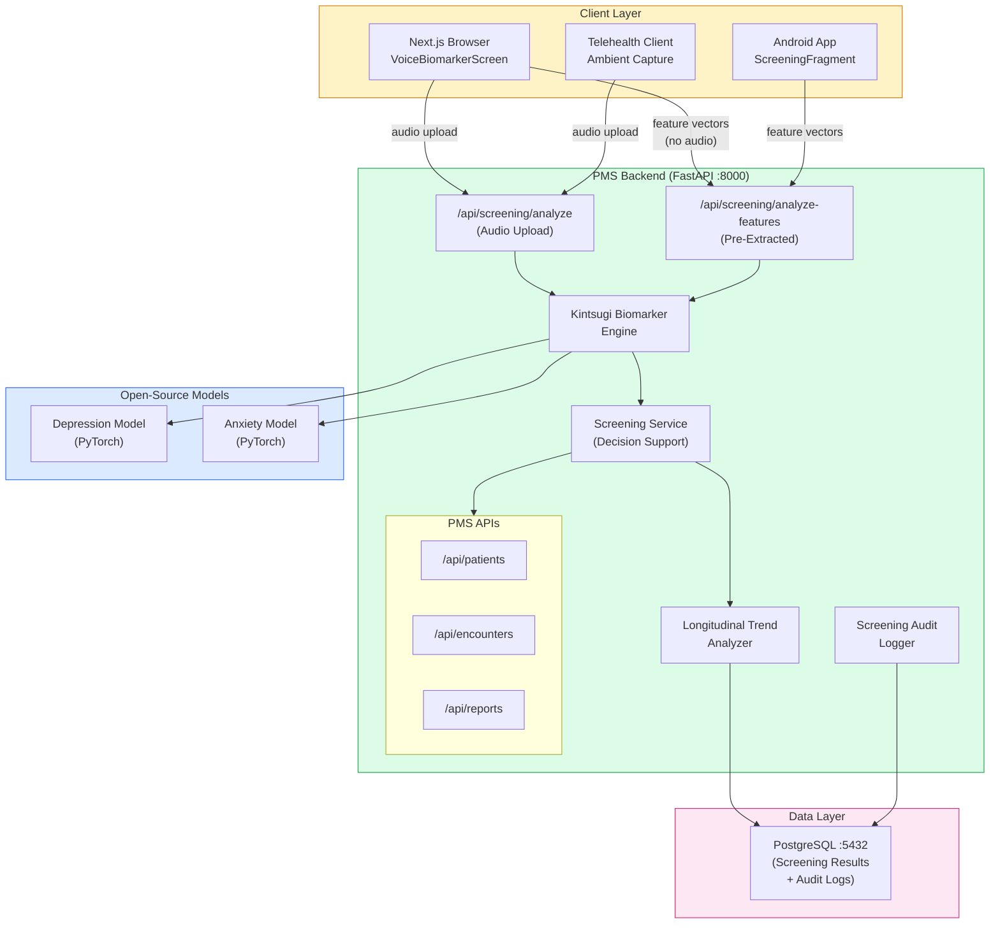

# Kintsugi Open-Source Voice Biomarker Developer Onboarding Tutorial

**Welcome to the MPS PMS Kintsugi Voice Biomarker Integration Team**

This tutorial will take you from zero to building your first mental health voice biomarker screening integration with the PMS. By the end, you will understand how Kintsugi's open-source models detect depression and anxiety from acoustic features, have a running local environment, and have built and tested a longitudinal screening pipeline end-to-end.

**Document ID:** PMS-EXP-KINTSUGI-002
**Version:** 1.0
**Date:** March 3, 2026
**Applies To:** PMS project (all platforms)
**Prerequisite:** [Kintsugi Open-Source Setup Guide](35-KintsugiOpenSource-PMS-Developer-Setup-Guide.md)
**Estimated time:** 2-3 hours
**Difficulty:** Beginner-friendly

---

## What You Will Learn

1. What Kintsugi voice biomarkers are and why they were open-sourced
2. How acoustic features (not speech content) reveal mental health signals
3. How the 20-second analysis pipeline works (audio to feature vector to score)
4. How to build privacy-preserving screening that never records speech content
5. How to integrate screening results with PMS patient encounters
6. How to build longitudinal mood tracking across multiple encounters
7. How clinical validation metrics (71.3% sensitivity, 73.5% specificity) guide threshold tuning
8. How to implement HIPAA-compliant consent and audit workflows for voice screening
9. How Kintsugi compares to questionnaire-based screening (PHQ-9, GAD-7)
10. How to combine voice biomarker screening with other PMS voice technologies

---

## Part 1: Understanding Kintsugi Voice Biomarkers (15 min read)

### 1.1 What Problem Does Kintsugi Solve?

The US Preventive Services Task Force recommends universal depression screening in primary care. But PHQ-9 questionnaires are time-consuming (5-10 minutes per patient), subject to self-report bias, and often skipped during busy clinical encounters. The result: an estimated 50% of depression cases go undetected in primary care settings.

> *The intake coordinator sees 30 patients daily. Administering PHQ-9 to every patient adds 2.5-5 hours to the workday. Most days, screening gets skipped for "less concerning" patients -- precisely the ones who might benefit most.*

Kintsugi solves this by detecting depression and anxiety biomarkers from **20 seconds of any speech** -- no questionnaire needed. The key insight is that depression and anxiety produce measurable changes in vocal acoustics: reduced pitch variation, lower energy, altered speech rhythm, and changed pause patterns. These changes are detectable by machine learning models even when the patient is talking about the weather.

Critically, Kintsugi analyzes **acoustic properties only** -- it does not process, record, or store what the patient says. This privacy-by-design approach means screening can happen during routine interactions (phone calls, telehealth visits, intake conversations) without the HIPAA burden of recording patient speech.

### 1.2 How Kintsugi Works -- The Key Pieces



**Three key concepts:**

1. **Acoustic features, not speech content:** The extractor computes numerical properties of the sound wave (pitch frequency, energy levels, spectral shape) without any speech-to-text processing. The output is a vector of 35 numbers -- not words.

2. **20-second minimum analysis window:** Clinical validation showed that 20 seconds of speech provides sufficient acoustic information for reliable screening. Longer samples increase confidence but 20 seconds is the minimum.

3. **Screening, not diagnosis:** Kintsugi provides risk scores (0.0-1.0) and categories (normal/elevated/high-risk) as clinical decision support. It does not diagnose depression or anxiety -- that requires clinician evaluation.

### 1.3 How Kintsugi Fits with Other PMS Technologies

| Feature | Kintsugi (Exp 35) | Speechmatics (Exp 10/33) | ElevenLabs (Exp 30) | MedASR (Exp 7) |
|---------|-------------------|--------------------------|---------------------|----------------|
| What it analyzes | Acoustic features | Speech content | Speech content | Speech content |
| Privacy model | Content-free | Content-based | Content-based | Content-based |
| Output | Risk scores | Transcription | Text/audio | Transcription |
| Clinical purpose | Mental health screening | Clinical dictation | Voice agents | Dictation |
| Requires transcription | No | Yes (core function) | Yes | Yes |
| Self-hosted | Yes (open-source) | Optional | No | Yes |
| Cost | Free | Per-minute API | Per-minute API | Self-hosted |
| Clinical validation | Published (Annals of Family Med) | Accuracy benchmarked | General purpose | Medical vocabulary |

### 1.4 Key Vocabulary

| Term | Meaning |
|------|---------|
| Voice Biomarker | Measurable acoustic property of speech that correlates with a health condition |
| MFCC | Mel-Frequency Cepstral Coefficients -- features representing vocal tract shape |
| F0 (Fundamental Frequency) | The base pitch of a speaker's voice |
| PHQ-9 | Patient Health Questionnaire-9 -- standard depression screening tool (9 questions) |
| GAD-7 | Generalized Anxiety Disorder-7 -- standard anxiety screening tool (7 questions) |
| Sensitivity | Proportion of true positive cases correctly identified (71.3% for Kintsugi) |
| Specificity | Proportion of true negative cases correctly identified (73.5% for Kintsugi) |
| Feature Vector | Numerical array of acoustic measurements extracted from audio |
| Screening Category | Risk classification: normal, elevated, or high-risk |
| Longitudinal Tracking | Monitoring biomarker changes across multiple encounters over time |
| Content-Free Analysis | Processing that examines acoustic properties without recognizing speech words |
| SCID-5 | Structured Clinical Interview for DSM-5 -- gold-standard diagnostic assessment |

### 1.5 Our Architecture



---

## Part 2: Environment Verification (15 min)

### 2.1 Checklist

1. **PMS backend running:**
   ```bash
   curl http://localhost:8000/health
   ```
   Expected: `{"status": "healthy"}`

2. **Screening engine health check:**
   ```bash
   curl http://localhost:8000/api/screening/health
   ```
   Expected: `{"status": "ok", "service": "kintsugi-voice-biomarker", ...}`

3. **PostgreSQL running:**
   ```bash
   psql -h localhost -p 5432 -U pms -d pms_dev -c "SELECT 1"
   ```
   Expected: `1`

4. **Frontend running:**
   ```bash
   curl -s http://localhost:3000 | head -1
   ```
   Expected: HTML response

5. **Python dependencies installed:**
   ```bash
   python -c "import torch, librosa, numpy; print('All dependencies OK')"
   ```
   Expected: `All dependencies OK`

### 2.2 Quick Test

```bash
# Generate test audio and run screening
python -c "
import numpy as np
sr = 16000
audio = (np.sin(2 * np.pi * 200 * np.linspace(0, 25, sr * 25)) * 16000).astype(np.int16)
audio.tofile('/tmp/test_screening.raw')
print('Test audio generated')
"

curl -X POST http://localhost:8000/api/screening/analyze \
  -F "audio=@/tmp/test_screening.raw"
```

Expected: JSON with depression_score, anxiety_score, and categories.

---

## Part 3: Build Your First Integration (45 min)

### 3.1 What We Are Building

A **Longitudinal Mood Tracking Pipeline** that:
1. Screens a patient's voice during each encounter
2. Stores screening results linked to the patient and encounter
3. Tracks mood trends across multiple encounters
4. Alerts clinicians when a significant change is detected
5. Displays a mood timeline on the patient dashboard

### 3.2 Step 1: Create the Longitudinal Trend Service

Create `app/services/mood_tracking.py`:

```python
"""Longitudinal mood tracking service using Kintsugi voice biomarkers."""

import logging
from datetime import datetime, timezone
from typing import Optional

logger = logging.getLogger(__name__)


class MoodDataPoint:
    """A single mood measurement from a voice screening."""

    def __init__(
        self,
        encounter_id: str,
        depression_score: float,
        anxiety_score: float,
        confidence: float,
        screened_at: datetime,
    ):
        self.encounter_id = encounter_id
        self.depression_score = depression_score
        self.anxiety_score = anxiety_score
        self.confidence = confidence
        self.screened_at = screened_at


class MoodTrend:
    """Analyzed mood trend across multiple data points."""

    def __init__(
        self,
        patient_id: str,
        data_points: list[MoodDataPoint],
    ):
        self.patient_id = patient_id
        self.data_points = sorted(data_points, key=lambda d: d.screened_at)

    @property
    def depression_trend(self) -> str:
        """Calculate depression trend direction."""
        if len(self.data_points) < 2:
            return "insufficient_data"
        scores = [d.depression_score for d in self.data_points[-5:]]
        if len(scores) < 2:
            return "insufficient_data"
        change = scores[-1] - scores[0]
        if change > 0.1:
            return "worsening"
        elif change < -0.1:
            return "improving"
        return "stable"

    @property
    def anxiety_trend(self) -> str:
        """Calculate anxiety trend direction."""
        if len(self.data_points) < 2:
            return "insufficient_data"
        scores = [d.anxiety_score for d in self.data_points[-5:]]
        if len(scores) < 2:
            return "insufficient_data"
        change = scores[-1] - scores[0]
        if change > 0.1:
            return "worsening"
        elif change < -0.1:
            return "improving"
        return "stable"

    @property
    def alert_needed(self) -> bool:
        """Check if clinician alert is warranted."""
        if len(self.data_points) < 2:
            return False
        latest = self.data_points[-1]
        previous = self.data_points[-2]
        # Alert if depression score jumped 0.2+ since last screening
        dep_jump = latest.depression_score - previous.depression_score
        anx_jump = latest.anxiety_score - previous.anxiety_score
        return dep_jump > 0.2 or anx_jump > 0.2

    def to_dict(self) -> dict:
        return {
            "patient_id": self.patient_id,
            "total_screenings": len(self.data_points),
            "depression_trend": self.depression_trend,
            "anxiety_trend": self.anxiety_trend,
            "alert_needed": self.alert_needed,
            "latest_screening": {
                "depression_score": round(
                    self.data_points[-1].depression_score, 3
                ),
                "anxiety_score": round(
                    self.data_points[-1].anxiety_score, 3
                ),
                "screened_at": self.data_points[-1].screened_at.isoformat(),
            }
            if self.data_points
            else None,
            "timeline": [
                {
                    "encounter_id": d.encounter_id,
                    "depression_score": round(d.depression_score, 3),
                    "anxiety_score": round(d.anxiety_score, 3),
                    "screened_at": d.screened_at.isoformat(),
                }
                for d in self.data_points
            ],
        }
```

### 3.3 Step 2: Add Trend API Endpoint

Add to `app/api/routes/screening.py`:

```python
from app.services.mood_tracking import MoodDataPoint, MoodTrend


@router.get("/trend/{patient_id}")
async def get_mood_trend(patient_id: str):
    """
    Get longitudinal mood trend for a patient across encounters.

    Returns trend direction (improving/stable/worsening),
    alert status, and full screening timeline.
    """
    # In production, fetch from database
    # screenings = await db.query(VoiceBiomarkerScreening).filter_by(
    #     patient_id_hash=hash_patient_id(patient_id)
    # ).order_by(VoiceBiomarkerScreening.created_at).all()

    # Mock data for development
    from datetime import timedelta

    now = datetime.now(timezone.utc)
    mock_points = [
        MoodDataPoint("ENC-001", 0.35, 0.30, 0.8, now - timedelta(days=90)),
        MoodDataPoint("ENC-002", 0.40, 0.35, 0.85, now - timedelta(days=60)),
        MoodDataPoint("ENC-003", 0.55, 0.45, 0.9, now - timedelta(days=30)),
        MoodDataPoint("ENC-004", 0.60, 0.50, 0.9, now - timedelta(days=7)),
    ]

    trend = MoodTrend(patient_id=patient_id, data_points=mock_points)
    return trend.to_dict()
```

### 3.4 Step 3: Create the Mood Timeline Component

Create `src/components/screening/MoodTimeline.tsx`:

```tsx
"use client";

import { useState, useEffect } from "react";

interface TimelinePoint {
  encounter_id: string;
  depression_score: number;
  anxiety_score: number;
  screened_at: string;
}

interface MoodTrendData {
  patient_id: string;
  total_screenings: number;
  depression_trend: string;
  anxiety_trend: string;
  alert_needed: boolean;
  timeline: TimelinePoint[];
}

interface MoodTimelineProps {
  patientId: string;
}

export function MoodTimeline({ patientId }: MoodTimelineProps) {
  const [trend, setTrend] = useState<MoodTrendData | null>(null);

  useEffect(() => {
    fetch(`/api/screening/trend/${patientId}`)
      .then((r) => r.json())
      .then(setTrend)
      .catch(console.error);
  }, [patientId]);

  if (!trend) return <div className="text-sm text-gray-400">Loading...</div>;

  const getTrendIcon = (direction: string) => {
    switch (direction) {
      case "worsening":
        return "arrow-up text-red-500";
      case "improving":
        return "arrow-down text-green-500";
      case "stable":
        return "minus text-gray-500";
      default:
        return "question text-gray-400";
    }
  };

  const maxScore = Math.max(
    ...trend.timeline.flatMap((p) => [
      p.depression_score,
      p.anxiety_score,
    ])
  );

  return (
    <div className="rounded-lg border border-gray-200 bg-white p-6 shadow-sm">
      <div className="mb-4 flex items-center justify-between">
        <h3 className="text-lg font-semibold text-gray-900">Mood Timeline</h3>
        {trend.alert_needed && (
          <span className="rounded-full bg-red-100 px-3 py-1 text-xs font-medium text-red-700">
            Alert: Significant Change Detected
          </span>
        )}
      </div>

      {/* Trend Summary */}
      <div className="mb-4 grid grid-cols-3 gap-3">
        <div className="rounded bg-gray-50 p-3 text-center">
          <div className="text-xs text-gray-500">Screenings</div>
          <div className="text-xl font-bold">{trend.total_screenings}</div>
        </div>
        <div className="rounded bg-gray-50 p-3 text-center">
          <div className="text-xs text-gray-500">Depression Trend</div>
          <div className="text-sm font-medium capitalize">
            {trend.depression_trend.replace("_", " ")}
          </div>
        </div>
        <div className="rounded bg-gray-50 p-3 text-center">
          <div className="text-xs text-gray-500">Anxiety Trend</div>
          <div className="text-sm font-medium capitalize">
            {trend.anxiety_trend.replace("_", " ")}
          </div>
        </div>
      </div>

      {/* Visual Timeline */}
      <div className="space-y-2">
        {trend.timeline.map((point, i) => (
          <div key={i} className="flex items-center gap-3">
            <div className="w-20 text-xs text-gray-500">
              {new Date(point.screened_at).toLocaleDateString()}
            </div>
            <div className="flex-1">
              {/* Depression bar */}
              <div className="mb-1 flex items-center gap-2">
                <span className="w-8 text-xs text-gray-400">DEP</span>
                <div className="h-3 flex-1 rounded-full bg-gray-100">
                  <div
                    className="h-3 rounded-full bg-blue-400"
                    style={{
                      width: `${(point.depression_score / Math.max(maxScore, 1)) * 100}%`,
                    }}
                  />
                </div>
                <span className="w-10 text-right text-xs text-gray-600">
                  {(point.depression_score * 100).toFixed(0)}%
                </span>
              </div>
              {/* Anxiety bar */}
              <div className="flex items-center gap-2">
                <span className="w-8 text-xs text-gray-400">ANX</span>
                <div className="h-3 flex-1 rounded-full bg-gray-100">
                  <div
                    className="h-3 rounded-full bg-purple-400"
                    style={{
                      width: `${(point.anxiety_score / Math.max(maxScore, 1)) * 100}%`,
                    }}
                  />
                </div>
                <span className="w-10 text-right text-xs text-gray-600">
                  {(point.anxiety_score * 100).toFixed(0)}%
                </span>
              </div>
            </div>
          </div>
        ))}
      </div>

      <div className="mt-3 text-xs text-gray-400">
        Advisory only -- clinical judgment required for all decisions
      </div>
    </div>
  );
}
```

### 3.5 Step 4: Test the Longitudinal Pipeline

```bash
# Get mood trend for a patient
curl http://localhost:8000/api/screening/trend/test-patient-001 | python -m json.tool
```

Expected:
```json
{
  "patient_id": "test-patient-001",
  "total_screenings": 4,
  "depression_trend": "worsening",
  "anxiety_trend": "worsening",
  "alert_needed": false,
  "timeline": [...]
}
```

### 3.6 Step 5: Verify Frontend Display

1. Open http://localhost:3000/patients/test-patient-001
2. Verify the **Mood Timeline** panel shows:
   - 4 screening data points
   - Depression and anxiety bar charts
   - Trend direction (worsening/improving/stable)
   - Alert badge if significant change detected

---

## Part 4: Evaluating Strengths and Weaknesses (15 min)

### 4.1 Strengths

- **Privacy by design:** Analyzes acoustic features, never speech content -- dramatically reduces HIPAA burden compared to transcription-based approaches
- **Passive screening:** Can analyze ambient speech during routine interactions -- no dedicated questionnaire time required
- **Open-source and free:** No per-analysis API fees after initial deployment -- scales to unlimited screenings at compute cost only
- **Clinically validated:** Published peer-reviewed study (Annals of Family Medicine) with 71.3% sensitivity and 73.5% specificity
- **Self-hosted:** All processing runs on-premise with zero data egress -- ideal for HIPAA-regulated environments
- **Lightweight inference:** CPU-only, no GPU required -- runs on standard server hardware
- **Content-agnostic:** Works with any 20 seconds of speech in any language -- patients do not need to answer specific questions
- **Longitudinal tracking:** Enables mood monitoring across encounters -- detects trends before they become acute

### 4.2 Weaknesses

- **Moderate accuracy:** 71.3% sensitivity means ~29% of true depression cases are missed; 73.5% specificity means ~27% of healthy patients are falsely flagged
- **Open-source maintenance risk:** Kintsugi Health shut down -- no commercial entity maintaining the models long-term
- **No FDA clearance:** Kintsugi's FDA De Novo submission was not completed before company closure -- regulatory status is ambiguous
- **English-only validation:** Clinical validation study was conducted with US/Canadian English speakers -- accuracy for other languages is unvalidated
- **Screening only:** Cannot diagnose or treat -- always requires clinician follow-up, adding to workload for false positives
- **Bias concerns:** Training data demographics may not represent all patient populations equally -- accuracy may vary by age, gender, and ethnicity
- **20-second minimum:** Requires sufficient speech duration -- very quiet or non-verbal patients cannot be screened

### 4.3 When to Use Kintsugi vs Alternatives

| Scenario | Best Choice | Why |
|----------|-------------|-----|
| Passive mental health screening | **Kintsugi (Exp 35)** | Content-free analysis, no questionnaire burden |
| Standard depression assessment | **PHQ-9 questionnaire** | Validated, accepted by insurers, regulatory clarity |
| Clinical dictation/transcription | **Speechmatics (Exp 10/33)** | Speech recognition, not mental health screening |
| Voice agent conversations | **ElevenLabs (Exp 30)** or **Flow API (Exp 33)** | Interactive voice agents, not passive screening |
| Combined screening + dictation | **Kintsugi + Speechmatics** | Parallel analysis: acoustic features + transcription |
| High-confidence diagnosis | **Clinician assessment (SCID-5)** | Gold standard, regulatory requirement |

### 4.4 HIPAA / Healthcare Considerations

1. **Content-free design is a major advantage:** Since Kintsugi analyzes acoustic features (not speech content), the privacy exposure is dramatically lower than speech-to-text systems
2. **Patient consent is still mandatory:** Even though speech content is not processed, patients must consent to voice biomarker screening -- document consent in the PMS
3. **Results are PHI:** Screening scores linked to patient IDs are protected health information -- encrypt at rest and in transit, apply access controls
4. **Advisory-only positioning:** Results must be presented as clinical decision support, not diagnosis -- add clear disclaimers in all UI and reports
5. **Audit every screening:** Log when screenings occur, who initiated them, which encounters they are linked to, and the result categories (not raw scores for non-clinician views)
6. **No raw audio storage:** Raw audio must be discarded immediately after feature extraction -- only the numerical feature vector and screening result are stored
7. **Bias documentation:** Document known model limitations (English-only validation, potential demographic biases) in clinical governance materials

---

## Part 5: Debugging Common Issues (15 min read)

### Issue 1: All Patients Score as "Normal"

**Symptom:** Every screening returns depression and anxiety scores below threshold.
**Cause:** Using heuristic fallback instead of trained models, or thresholds set too high.
**Fix:** Verify trained model files exist in `kintsugi_model_path`. Check `engine._loaded` returns True. Lower thresholds if using heuristic for development.

### Issue 2: Audio Feature Extraction Takes 10+ Seconds

**Symptom:** `/api/screening/analyze` response time exceeds 10 seconds.
**Cause:** librosa running pitch extraction (pyin) on long audio segments.
**Fix:** Trim audio to 30 seconds maximum before feature extraction. Use `librosa.load(file, duration=30)`. Consider pre-computing features on the client.

### Issue 3: Trend API Shows "insufficient_data"

**Symptom:** `/api/screening/trend/{id}` returns "insufficient_data" for all trends.
**Cause:** Patient has fewer than 2 screening data points.
**Fix:** At least 2 screenings are required for trend analysis. Run additional screenings or seed development data.

### Issue 4: Screening Results Differ Between Server and Client Feature Extraction

**Symptom:** Same audio produces different scores when analyzed via `/analyze` vs `/analyze-features`.
**Cause:** Client-side feature extraction uses different parameters than server-side.
**Fix:** Ensure both use identical librosa parameters (n_mfcc=13, fmin=50, fmax=500, sr=16000). Compare feature vectors directly to identify discrepancies.

### Issue 5: Model File Compatibility Error

**Symptom:** `RuntimeError: Error loading model` when loading `.pt` files.
**Cause:** PyTorch version mismatch between model export and inference environment.
**Fix:** Check model export PyTorch version. Install matching version: `pip install torch==2.x.x`. If unable to match, re-export the model with your local PyTorch version.

---

## Part 6: Practice Exercises (45 min)

### Exercise 1: Ambient Telehealth Screening

Build a feature that passively screens patients during telehealth video calls:
1. Capture audio from the telehealth WebSocket stream (already available for Speechmatics)
2. Buffer 20 seconds of patient speech (filter out clinician speech if possible)
3. Extract features and run biomarker analysis
4. Display screening results to the clinician after the call ends
5. Store results linked to the telehealth encounter

**Hints:**
- Reuse the WebSocket audio capture from Speechmatics Flow API (Experiment 33)
- Run feature extraction client-side to avoid transmitting audio
- Display results only to clinicians (never to patients directly)

### Exercise 2: PHQ-9 Comparison Dashboard

Build a dashboard that compares Kintsugi voice biomarker scores with PHQ-9 questionnaire scores:
1. For patients who have both voice screening and PHQ-9 scores, display side-by-side
2. Calculate correlation between voice biomarker depression score and PHQ-9 total score
3. Flag discrepancies where voice screening suggests elevated risk but PHQ-9 is normal (or vice versa)
4. Track whether discrepancy cases had better outcomes when clinicians investigated further

**Hints:**
- PHQ-9 scores are stored in the PMS encounters table (0-27 scale)
- Map Kintsugi depression score (0-1) to approximate PHQ-9 range for visual comparison
- Use Chart.js or Recharts for the correlation scatter plot

### Exercise 3: Android On-Device Feature Extraction

Build client-side feature extraction in the Android app:
1. Implement MFCC, pitch, and energy extraction using Android's AudioRecord API
2. Send only the feature vector (not audio) to the PMS backend
3. Compare feature vectors with Python librosa output to ensure consistency
4. Measure battery and CPU impact of on-device feature extraction

**Hints:**
- Use TarsosDSP library for audio feature extraction on Android
- AudioRecord with 16kHz, 16-bit, mono configuration
- Feature vector should be 35 floats -- same as the Python extractor

---

## Part 7: Development Workflow and Conventions

### 7.1 File Organization

```
pms-backend/
├── app/
│   ├── integrations/
│   │   ├── kintsugi/
│   │   │   ├── __init__.py
│   │   │   ├── config.py           # Settings, enums, result dataclass
│   │   │   ├── features.py         # Audio feature extraction (privacy-preserving)
│   │   │   └── engine.py           # Biomarker inference engine
│   │   └── kintsugi_models/        # Open-source model files (.pt)
│   ├── api/routes/
│   │   └── screening.py            # FastAPI screening endpoints
│   ├── models/
│   │   └── screening.py            # SQLAlchemy screening result model
│   └── services/
│       └── mood_tracking.py        # Longitudinal trend analysis

pms-frontend/
├── src/
│   └── components/screening/
│       ├── VoiceBiomarkerScreen.tsx # Screening recording + results UI
│       └── MoodTimeline.tsx         # Longitudinal mood timeline
```

### 7.2 Naming Conventions

| Item | Convention | Example |
|------|-----------|---------|
| API endpoints | `/api/screening/{action}` | `/api/screening/analyze` |
| React components | PascalCase | `VoiceBiomarkerScreen.tsx` |
| Python modules | snake_case | `mood_tracking.py` |
| Model files | descriptive with `.pt` extension | `depression_model.pt` |
| Database table | snake_case plural | `voice_biomarker_screenings` |
| Feature vectors | numpy array, float32 | `np.ndarray (35,)` |

### 7.3 PR Checklist

- [ ] No speech content is processed, stored, or logged in any code path
- [ ] Patient consent check exists before screening activation
- [ ] Screening results displayed with "advisory only" disclaimer
- [ ] Patient ID is hashed in audit logs (never cleartext)
- [ ] Audio is discarded after feature extraction (not stored)
- [ ] Model files are not committed to git (use git-lfs or external storage)
- [ ] Tests cover normal, elevated, and high-risk score paths
- [ ] Longitudinal trend analysis handles edge cases (0, 1, 2+ data points)

### 7.4 Security Reminders

1. **Never store raw audio** -- extract features and discard immediately
2. **Hash patient IDs in logs** -- use SHA-256, never log cleartext patient identifiers
3. **Encrypt screening results** at rest -- AES-256 for the screening results table
4. **Rate-limit screening API** -- prevent abuse by limiting analyses per user per hour
5. **Display results to clinicians only** -- screening scores should never be shown to patients through the PMS

---

## Part 8: Quick Reference Card

### Key Endpoints

| Endpoint | Method | Purpose |
|----------|--------|---------|
| `/api/screening/analyze` | POST | Analyze audio file for biomarkers |
| `/api/screening/analyze-features` | POST | Analyze pre-extracted feature vector |
| `/api/screening/trend/{patient_id}` | GET | Get longitudinal mood trend |
| `/api/screening/health` | GET | Service health check |

### Key Files

| File | Purpose |
|------|---------|
| `config.py` | Settings, thresholds, screening categories |
| `features.py` | Privacy-preserving audio feature extraction |
| `engine.py` | Kintsugi model inference engine |
| `screening.py` (routes) | FastAPI API endpoints |
| `mood_tracking.py` | Longitudinal trend analysis |
| `VoiceBiomarkerScreen.tsx` | Recording + results UI |
| `MoodTimeline.tsx` | Longitudinal mood timeline |

### Clinical Validation Reference

| Metric | Value | Source |
|--------|-------|--------|
| Sensitivity (depression) | 71.3% | Annals of Family Medicine |
| Specificity (depression) | 73.5% | Annals of Family Medicine |
| PPV (depression) | 69.3% | Annals of Family Medicine |
| NPV (depression) | 75.3% | Annals of Family Medicine |
| Minimum audio duration | 20 seconds | Kintsugi clinical validation |
| Gold standard comparison | SCID-5 + PHQ-9 (cutoff 10) | FDA De Novo submission |

---

## Next Steps

1. Deploy trained Kintsugi models (once available from open-source repository) and validate accuracy locally
2. Build ambient telehealth screening by integrating with [Speechmatics Flow API (Exp 33)](33-SpeechmaticsFlow-Developer-Tutorial.md)
3. Create PHQ-9 comparison dashboard to validate screening accuracy against established measures
4. Implement Android on-device feature extraction for mobile clinical encounters
5. Review [ElevenLabs (Exp 30)](30-ElevenLabs-Developer-Tutorial.md) for combining voice agents with passive mental health screening
