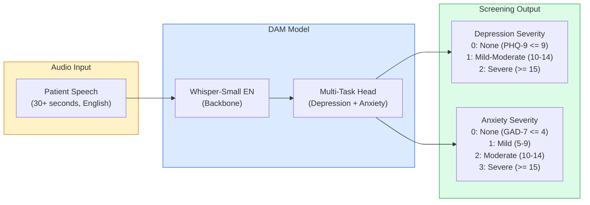
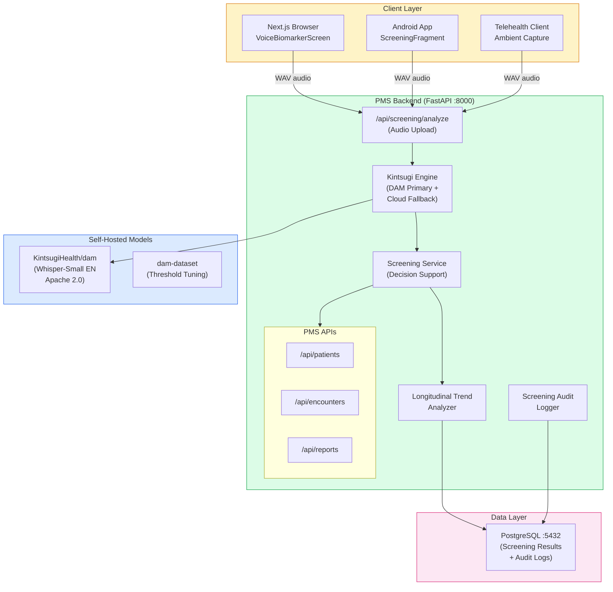

# Kintsugi Voice Biomarker Developer Onboarding Tutorial

**Welcome to the MPS PMS Kintsugi Voice Biomarker Integration Team**

This tutorial will take you from zero to building your first mental health voice biomarker screening integration with the PMS. By the end, you will understand how the Kintsugi DAM model detects depression and anxiety from acoustic features, have a running local environment, and have built and tested a longitudinal screening pipeline end-to-end.

**Document ID:** PMS-EXP-KINTSUGI-002
**Version:** 2.0
**Date:** March 6, 2026
**Applies To:** PMS project (all platforms)
**Prerequisite:** [Kintsugi Setup Guide](35-KintsugiOpenSource-PMS-Developer-Setup-Guide.md)
**Estimated time:** 2-3 hours
**Difficulty:** Beginner-friendly

---

## What You Will Learn

1. What Kintsugi voice biomarkers are and why the technology was open-sourced
2. How the DAM model (fine-tuned Whisper-Small EN) detects depression and anxiety from audio
3. How severity scores map to PHQ-9 and GAD-7 clinical scales
4. How to run the self-hosted DAM model for privacy-preserving screening
5. How to use the `kintsugi-python` PyPI SDK as a cloud API fallback
6. How to integrate screening results with PMS patient encounters
7. How to build longitudinal mood tracking across multiple encounters
8. How to tune severity thresholds using the dam-dataset from Hugging Face
9. How to implement HIPAA-compliant consent and audit workflows for voice screening
10. How Kintsugi compares to questionnaire-based screening (PHQ-9, GAD-7)

---

## Part 1: Understanding Kintsugi Voice Biomarkers (15 min read)

### 1.1 What Problem Does Kintsugi Solve?

The US Preventive Services Task Force recommends universal depression screening in primary care. But PHQ-9 questionnaires are time-consuming (5-10 minutes per patient), subject to self-report bias, and often skipped during busy clinical encounters. The result: an estimated 50% of depression cases go undetected in primary care settings.

> *The intake coordinator sees 30 patients daily. Administering PHQ-9 to every patient adds 2.5-5 hours to the workday. Most days, screening gets skipped for "less concerning" patients -- precisely the ones who might benefit most.*

Kintsugi solves this by detecting depression and anxiety biomarkers from **30 seconds of any speech** -- no questionnaire needed. The key insight is that depression and anxiety produce measurable changes in vocal acoustics: reduced pitch variation, lower energy, altered speech rhythm, and changed pause patterns. These changes are detectable by machine learning models even when the patient is talking about the weather.

### 1.2 How the DAM Model Works -- The Key Pieces

The **DAM (Depression-Anxiety Model)** is a fine-tuned version of OpenAI's Whisper-Small EN model, adapted for audio classification rather than transcription. It was trained on ~863 hours of speech from ~35,000 individuals with clinician-administered PHQ-9 and GAD-7 ground truth labels.



**Three key concepts:**

1. **Whisper backbone extracts voice biomarkers:** The pre-trained Whisper encoder converts audio into rich acoustic representations. The multi-task head then maps these to depression and anxiety severity predictions -- trained jointly to leverage shared representations between the conditions.

2. **30-second minimum speech window:** The DAM model requires at least 30 seconds of speech (after voice activity detection). Longer samples increase accuracy but 30 seconds is the validated minimum.

3. **Screening, not diagnosis:** DAM provides severity categories mapped to clinical scales (PHQ-9 for depression, GAD-7 for anxiety) as clinical decision support. It does not diagnose -- that requires clinician evaluation.

### 1.3 Three Integration Paths

| Feature | DAM Model (Hugging Face) | PyPI SDK (`kintsugi-python`) | Cloud REST API |
|---------|--------------------------|------------------------------|----------------|
| Source | [KintsugiHealth/dam](https://huggingface.co/KintsugiHealth/dam) | [PyPI](https://pypi.org/project/kintsugi-python/) | api.kintsugihealth.com/v2 |
| License | Apache 2.0 | MIT | N/A (service) |
| Runs where | Self-hosted (CPU or GPU) | Calls cloud API | Cloud |
| Audio leaves network | No | Yes | Yes |
| HIPAA advantage | Maximum -- no data egress | Requires PHI gateway | Requires PHI gateway |
| Continuity risk | None -- model is downloaded | High -- company shut down | High -- company shut down |
| Output format | `{depression: int, anxiety: int}` | Severity strings + PHQ/GAD | Severity strings + PHQ/GAD |
| Threshold tuning | Yes (dam-dataset provided) | No | No |
| **Recommended for PMS** | **Yes (primary)** | Optional fallback | Not recommended |

### 1.4 How Kintsugi Fits with Other PMS Technologies

| Feature | Kintsugi DAM (Exp 35) | Speechmatics (Exp 10/33) | ElevenLabs (Exp 30) | MedASR (Exp 7) |
|---------|----------------------|--------------------------|---------------------|----------------|
| What it analyzes | Acoustic features | Speech content | Speech content | Speech content |
| Privacy model | Self-hosted, no transcription | Cloud or on-prem | Cloud only | Self-hosted |
| Output | Depression/anxiety severity | Transcription text | Text/audio | Transcription |
| Clinical purpose | Mental health screening | Clinical dictation | Voice agents | Dictation |
| Self-hosted | Yes (HF model) | Optional | No | Yes |
| Complementary use | Screen audio that Speechmatics transcribes | Transcribe audio that Kintsugi screens | Kintsugi screens patient voice in ElevenLabs conversations | N/A |

### 1.5 Key Vocabulary

| Term | Meaning |
|------|---------|
| DAM | Depression-Anxiety Model -- Kintsugi's fine-tuned Whisper model for mental health screening |
| PHQ-9 | Patient Health Questionnaire-9 -- standard depression screening tool (9 questions, score 0-27) |
| GAD-7 | Generalized Anxiety Disorder-7 -- standard anxiety screening tool (7 questions, score 0-21) |
| Whisper-Small EN | OpenAI's small English speech model -- the backbone of DAM |
| Voice Biomarker | Measurable acoustic property of speech that correlates with a health condition |
| Severity Category | DAM output: depression (0-2) and anxiety (0-3) mapped to clinical severity |
| Quantized Output | DAM integer categories (e.g., depression=2 means severe) |
| Raw Output | DAM float scores correlating monotonically with PHQ-9/GAD-7 |
| dam-dataset | Hugging Face dataset with ~863 hours of labeled audio metadata for threshold tuning |
| Indeterminate Region | Scores between severity thresholds where the model is uncertain |
| kintsugi-python | PyPI SDK (v0.1.8) for calling Kintsugi's cloud API V2 |

### 1.6 Our Architecture



---

## Part 2: Environment Verification (15 min)

### 2.1 Checklist

1. **PMS backend running:**
   ```bash
   curl http://localhost:8000/health
   ```
   Expected: `{"status": "healthy"}`

2. **Screening engine health check:**
   ```bash
   curl http://localhost:8000/api/screening/health
   ```
   Expected: `{"status": "ok", "service": "kintsugi-voice-biomarker", "dam_model_loaded": true, ...}`

3. **PostgreSQL running:**
   ```bash
   psql -h localhost -p 5432 -U pms -d pms_dev -c "SELECT 1"
   ```
   Expected: `1`

4. **Frontend running:**
   ```bash
   curl -s http://localhost:3000 | head -1
   ```
   Expected: HTML response

5. **DAM model loaded:**
   ```bash
   python -c "
   import sys
   sys.path.insert(0, 'pms-backend/app/integrations/kintsugi_dam')
   from pipeline import Pipeline
   p = Pipeline()
   print('DAM model loaded successfully')
   "
   ```
   Expected: `DAM model loaded successfully`

### 2.2 Quick Test

```bash
# Generate test WAV and run screening
python -c "
import numpy as np, wave
sr = 16000; dur = 35
t = np.linspace(0, dur, sr * dur)
audio = (np.sin(2 * np.pi * 200 * t) * 16000).astype(np.int16)
with wave.open('/tmp/test_screening.wav', 'w') as wf:
    wf.setnchannels(1); wf.setsampwidth(2); wf.setframerate(sr)
    wf.writeframes(audio.tobytes())
print('Test WAV generated')
"

curl -X POST http://localhost:8000/api/screening/analyze \
  -F "audio=@/tmp/test_screening.wav"
```

Expected: JSON with `depression_severity`, `anxiety_severity`, `depression_label`, `anxiety_label`, and `source`.

---

## Part 3: Build Your First Integration (45 min)

### 3.1 What We Are Building

A **Longitudinal Mood Tracking Pipeline** that:
1. Screens a patient's voice during each encounter using the DAM model
2. Stores screening results linked to the patient and encounter
3. Tracks mood trends across multiple encounters using raw scores
4. Alerts clinicians when a significant change is detected
5. Displays a mood timeline on the patient dashboard

### 3.2 Step 1: Create the Longitudinal Trend Service

Create `app/services/mood_tracking.py`:

```python
"""Longitudinal mood tracking service using Kintsugi voice biomarkers."""

import logging
from datetime import datetime, timezone
from typing import Optional

logger = logging.getLogger(__name__)


class MoodDataPoint:
    """A single mood measurement from a voice screening."""

    def __init__(
        self,
        encounter_id: str,
        depression_severity: int,
        anxiety_severity: int,
        depression_raw: float,
        anxiety_raw: float,
        screened_at: datetime,
    ):
        self.encounter_id = encounter_id
        self.depression_severity = depression_severity
        self.anxiety_severity = anxiety_severity
        self.depression_raw = depression_raw
        self.anxiety_raw = anxiety_raw
        self.screened_at = screened_at


class MoodTrend:
    """Analyzed mood trend across multiple data points."""

    DEP_LABELS = {0: "None", 1: "Mild-Moderate", 2: "Severe"}
    ANX_LABELS = {0: "None", 1: "Mild", 2: "Moderate", 3: "Severe"}

    def __init__(self, patient_id: str, data_points: list[MoodDataPoint]):
        self.patient_id = patient_id
        self.data_points = sorted(data_points, key=lambda d: d.screened_at)

    @property
    def depression_trend(self) -> str:
        """Calculate depression trend using raw scores."""
        if len(self.data_points) < 2:
            return "insufficient_data"
        scores = [d.depression_raw for d in self.data_points[-5:]]
        change = scores[-1] - scores[0]
        if change > 0.1:
            return "worsening"
        elif change < -0.1:
            return "improving"
        return "stable"

    @property
    def anxiety_trend(self) -> str:
        """Calculate anxiety trend using raw scores."""
        if len(self.data_points) < 2:
            return "insufficient_data"
        scores = [d.anxiety_raw for d in self.data_points[-5:]]
        change = scores[-1] - scores[0]
        if change > 0.1:
            return "worsening"
        elif change < -0.1:
            return "improving"
        return "stable"

    @property
    def alert_needed(self) -> bool:
        """Check if clinician alert is warranted."""
        if len(self.data_points) < 2:
            return False
        latest = self.data_points[-1]
        previous = self.data_points[-2]
        # Alert if severity category increased
        dep_jump = latest.depression_severity > previous.depression_severity
        anx_jump = latest.anxiety_severity > previous.anxiety_severity
        return dep_jump or anx_jump

    def to_dict(self) -> dict:
        return {
            "patient_id": self.patient_id,
            "total_screenings": len(self.data_points),
            "depression_trend": self.depression_trend,
            "anxiety_trend": self.anxiety_trend,
            "alert_needed": self.alert_needed,
            "latest_screening": {
                "depression_severity": self.data_points[-1].depression_severity,
                "depression_label": self.DEP_LABELS.get(
                    self.data_points[-1].depression_severity, "Unknown"
                ),
                "anxiety_severity": self.data_points[-1].anxiety_severity,
                "anxiety_label": self.ANX_LABELS.get(
                    self.data_points[-1].anxiety_severity, "Unknown"
                ),
                "depression_raw": round(self.data_points[-1].depression_raw, 4),
                "anxiety_raw": round(self.data_points[-1].anxiety_raw, 4),
                "screened_at": self.data_points[-1].screened_at.isoformat(),
            }
            if self.data_points
            else None,
            "timeline": [
                {
                    "encounter_id": d.encounter_id,
                    "depression_severity": d.depression_severity,
                    "depression_label": self.DEP_LABELS.get(d.depression_severity, "?"),
                    "anxiety_severity": d.anxiety_severity,
                    "anxiety_label": self.ANX_LABELS.get(d.anxiety_severity, "?"),
                    "depression_raw": round(d.depression_raw, 4),
                    "anxiety_raw": round(d.anxiety_raw, 4),
                    "screened_at": d.screened_at.isoformat(),
                }
                for d in self.data_points
            ],
        }
```

### 3.3 Step 2: Add Trend API Endpoint

Add to `app/api/routes/screening.py`:

```python
from app.services.mood_tracking import MoodDataPoint, MoodTrend


@router.get("/trend/{patient_id}")
async def get_mood_trend(patient_id: str):
    """
    Get longitudinal mood trend for a patient across encounters.

    Returns trend direction (improving/stable/worsening),
    alert status, and full screening timeline.
    """
    # In production, fetch from database
    # screenings = await db.query(VoiceBiomarkerScreening).filter_by(
    #     patient_id_hash=hash_patient_id(patient_id)
    # ).order_by(VoiceBiomarkerScreening.created_at).all()

    # Mock data for development
    from datetime import timedelta

    now = datetime.now(timezone.utc)
    mock_points = [
        MoodDataPoint("ENC-001", 0, 0, 0.25, 0.20, now - timedelta(days=90)),
        MoodDataPoint("ENC-002", 0, 1, 0.35, 0.55, now - timedelta(days=60)),
        MoodDataPoint("ENC-003", 1, 1, 0.60, 0.65, now - timedelta(days=30)),
        MoodDataPoint("ENC-004", 1, 2, 0.70, 0.80, now - timedelta(days=7)),
    ]

    trend = MoodTrend(patient_id=patient_id, data_points=mock_points)
    return trend.to_dict()
```

### 3.4 Step 3: Create the Mood Timeline Component

Create `src/components/screening/MoodTimeline.tsx`:

```tsx
"use client";

import { useState, useEffect } from "react";

interface TimelinePoint {
  encounter_id: string;
  depression_severity: number;
  depression_label: string;
  anxiety_severity: number;
  anxiety_label: string;
  depression_raw: number;
  anxiety_raw: number;
  screened_at: string;
}

interface MoodTrendData {
  patient_id: string;
  total_screenings: number;
  depression_trend: string;
  anxiety_trend: string;
  alert_needed: boolean;
  timeline: TimelinePoint[];
}

interface MoodTimelineProps {
  patientId: string;
}

const SEVERITY_BADGE: Record<string, string> = {
  None: "bg-green-100 text-green-700",
  Mild: "bg-yellow-100 text-yellow-700",
  "Mild-Moderate": "bg-orange-100 text-orange-700",
  Moderate: "bg-orange-100 text-orange-700",
  Severe: "bg-red-100 text-red-700",
};

export function MoodTimeline({ patientId }: MoodTimelineProps) {
  const [trend, setTrend] = useState<MoodTrendData | null>(null);

  useEffect(() => {
    fetch(`/api/screening/trend/${patientId}`)
      .then((r) => r.json())
      .then(setTrend)
      .catch(console.error);
  }, [patientId]);

  if (!trend) return <div className="text-sm text-gray-400">Loading...</div>;

  return (
    <div className="rounded-lg border border-gray-200 bg-white p-6 shadow-sm">
      <div className="mb-4 flex items-center justify-between">
        <h3 className="text-lg font-semibold text-gray-900">Mood Timeline</h3>
        {trend.alert_needed && (
          <span className="rounded-full bg-red-100 px-3 py-1 text-xs font-medium text-red-700">
            Alert: Severity Increased
          </span>
        )}
      </div>

      {/* Trend Summary */}
      <div className="mb-4 grid grid-cols-3 gap-3">
        <div className="rounded bg-gray-50 p-3 text-center">
          <div className="text-xs text-gray-500">Screenings</div>
          <div className="text-xl font-bold">{trend.total_screenings}</div>
        </div>
        <div className="rounded bg-gray-50 p-3 text-center">
          <div className="text-xs text-gray-500">Depression Trend</div>
          <div className="text-sm font-medium capitalize">
            {trend.depression_trend.replace("_", " ")}
          </div>
        </div>
        <div className="rounded bg-gray-50 p-3 text-center">
          <div className="text-xs text-gray-500">Anxiety Trend</div>
          <div className="text-sm font-medium capitalize">
            {trend.anxiety_trend.replace("_", " ")}
          </div>
        </div>
      </div>

      {/* Timeline */}
      <div className="space-y-3">
        {trend.timeline.map((point, i) => (
          <div key={i} className="flex items-center gap-3 rounded bg-gray-50 p-3">
            <div className="w-20 text-xs text-gray-500">
              {new Date(point.screened_at).toLocaleDateString()}
            </div>
            <div className="flex flex-1 gap-2">
              <span
                className={`rounded px-2 py-0.5 text-xs font-medium ${SEVERITY_BADGE[point.depression_label] || "bg-gray-100"}`}
              >
                DEP: {point.depression_label}
              </span>
              <span
                className={`rounded px-2 py-0.5 text-xs font-medium ${SEVERITY_BADGE[point.anxiety_label] || "bg-gray-100"}`}
              >
                ANX: {point.anxiety_label}
              </span>
            </div>
            <div className="text-xs text-gray-400">{point.encounter_id}</div>
          </div>
        ))}
      </div>

      <div className="mt-3 text-xs text-gray-400">
        Advisory only -- clinical judgment required for all decisions
      </div>
    </div>
  );
}
```

### 3.5 Step 4: Test the Longitudinal Pipeline

```bash
# Get mood trend for a patient
curl http://localhost:8000/api/screening/trend/test-patient-001 | python -m json.tool
```

Expected:
```json
{
  "patient_id": "test-patient-001",
  "total_screenings": 4,
  "depression_trend": "worsening",
  "anxiety_trend": "worsening",
  "alert_needed": true,
  "timeline": [...]
}
```

### 3.6 Step 5: Verify Frontend Display

1. Open http://localhost:3000/patients/test-patient-001
2. Verify the **Mood Timeline** panel shows:
   - 4 screening data points with severity badges
   - Depression and anxiety severity labels (color-coded)
   - Trend direction (worsening/improving/stable)
   - Alert badge when severity increases between encounters

---

## Part 4: Evaluating Strengths and Weaknesses (15 min)

### 4.1 Strengths

- **Self-hosted model available:** The DAM model runs entirely on-premise from Hugging Face -- no cloud dependency, no API fees, no data egress. This is the ideal HIPAA path.
- **Apache 2.0 license:** DAM model can be used, modified, and deployed commercially without restriction.
- **Clinically validated:** Published peer-reviewed study (Annals of Family Medicine) with 71.3% sensitivity and 73.5% specificity.
- **Whisper backbone:** Built on a well-understood, widely-deployed foundation model with strong acoustic feature extraction.
- **Multi-task learning:** Joint depression and anxiety prediction leverages shared representations for better accuracy on both tasks.
- **Threshold tuning dataset:** The dam-dataset (~863 hours, ~35K individuals) enables customizing severity thresholds for specific patient populations.
- **Multiple integration paths:** Self-hosted model (primary), PyPI SDK (fallback), and cloud API provide flexibility.
- **Clinical scale mapping:** Output maps directly to PHQ-9 and GAD-7 severity categories -- familiar to clinicians.

### 4.2 Weaknesses

- **Company shut down:** Kintsugi Health closed in February 2026. No commercial entity maintains the model or API. The cloud API and PyPI SDK may stop working.
- **English-only:** DAM was trained and validated on predominantly American English speakers. Accuracy for other languages/accents is unvalidated.
- **30-second minimum:** Requires sufficient speech duration -- very quiet or non-verbal patients cannot be screened.
- **No FDA clearance:** Kintsugi's FDA De Novo submission was not completed before company closure.
- **Moderate accuracy:** 71.3% sensitivity means ~29% of true depression cases are missed; 73.5% specificity means ~27% of healthy patients are falsely flagged.
- **No content analysis:** Because DAM analyzes only acoustic features, it cannot identify specific stressors, ideation, or clinical context from what the patient says.
- **Model size:** Whisper-Small EN backbone requires ~500MB RAM -- modest but not negligible for resource-constrained environments.

### 4.3 When to Use Kintsugi vs Alternatives

| Scenario | Best Choice | Why |
|----------|-------------|-----|
| Passive mental health screening | **Kintsugi DAM (Exp 35)** | Self-hosted, no transcription, clinical scale mapping |
| Standard depression assessment | **PHQ-9 questionnaire** | Validated, accepted by insurers, regulatory clarity |
| Clinical dictation/transcription | **Speechmatics (Exp 10/33)** | Speech recognition, not mental health screening |
| Voice agent conversations | **ElevenLabs (Exp 30)** or **Flow API (Exp 33)** | Interactive voice, not passive screening |
| Combined screening + dictation | **Kintsugi + Speechmatics** | Parallel analysis: acoustic screening + transcription |
| High-confidence diagnosis | **Clinician assessment (SCID-5)** | Gold standard, regulatory requirement |

### 4.4 HIPAA / Healthcare Considerations

| Consideration | DAM Model (Self-Hosted) | PyPI SDK / Cloud API |
|---------------|------------------------|---------------------|
| Audio leaves network | No | Yes |
| BAA required | No (self-hosted) | Yes (but unavailable -- company shut down) |
| PHI De-ID Gateway needed | No | Yes (mandatory) |
| Patient consent | Required | Required |
| Audit logging | Required | Required |
| Results are PHI | Yes -- encrypt at rest and in transit | Yes -- encrypt at rest and in transit |
| Advisory disclaimers | Required in all UI | Required in all UI |

---

## Part 5: Debugging Common Issues (15 min read)

### Issue 1: DAM Model Returns Unexpected Severity for Test Audio

**Symptom:** Synthetic test tones produce non-zero depression/anxiety scores.
**Cause:** The model expects real speech, not synthetic tones. The Whisper backbone may produce unpredictable features from non-speech audio.
**Fix:** Test with real speech recordings (at least 30 seconds). Use the dam-dataset validation split for benchmarking.

### Issue 2: `ImportError: No module named 'pipeline'`

**Symptom:** DAM model fails to load.
**Cause:** Model directory not in Python path, or Git LFS didn't download files.
**Fix:**
```bash
cd pms-backend/app/integrations/kintsugi_dam
git lfs pull
ls pipeline.py  # Should exist
```

### Issue 3: Audio Duration Below Minimum

**Symptom:** Screening returns null / 400 error.
**Cause:** Audio has less than 30 seconds of content.
**Fix:** DAM requires 30 seconds (not 20 seconds like the legacy Kintsugi API). The frontend enforces this with a countdown.

### Issue 4: Cloud API Returns 403

**Symptom:** Cloud fallback fails with authentication error.
**Cause:** API key invalid or Kintsugi API shut down.
**Fix:** The cloud API is at risk of discontinuation. Verify `api.kintsugihealth.com` is reachable. If not, rely exclusively on the self-hosted DAM model.

### Issue 5: High Memory Usage at Startup

**Symptom:** Backend uses ~1GB RAM after loading DAM model.
**Cause:** Whisper-Small EN backbone loads weights into memory (~500MB).
**Fix:** This is expected. Use the singleton pattern (one engine instance). Consider lazy loading -- load the model on first screening request, not at startup.

---

## Part 6: Practice Exercises (45 min)

### Exercise 1: Threshold Tuning with dam-dataset

Use the Hugging Face dam-dataset to tune severity thresholds for your patient population:

1. Download the validation split: `load_dataset("KintsugiHealth/dam-dataset", split="validation")`
2. Use the model's `tuning/indet_roc.py` module to find optimal binary thresholds for depression (PHQ-9 >= 10)
3. Experiment with the indeterminate region budget (10%, 20%, 30%) to trade off certainty vs coverage
4. Evaluate on the test split and compare sensitivity/specificity to published results (71.3%/73.5%)

**Hints:**
- The dam-dataset includes `scores_depression`, `scores_anxiety`, `phq`, and `gad` columns
- Use `BinaryLabeledScores` from `tuning/indet_roc.py` for ROC analysis
- The `roc_curve(budget).sn_eq_sp()` method finds balanced sensitivity/specificity

### Exercise 2: PHQ-9 Comparison Dashboard

Build a dashboard that compares DAM voice screening results with PHQ-9 questionnaire scores:

1. For patients who have both voice screening and PHQ-9 scores, display side-by-side
2. Show DAM severity level next to actual PHQ-9 score
3. Flag discrepancies where DAM suggests different severity than PHQ-9
4. Track whether discrepancy cases had better outcomes when clinicians investigated

**Hints:**
- PHQ-9 scores are stored in the PMS encounters table (0-27 scale)
- Map DAM depression severity (0-2) to PHQ-9 ranges for visual comparison
- Use Recharts for the comparison visualization

### Exercise 3: Ambient Telehealth Screening

Build a feature that passively screens patients during telehealth calls:

1. Capture audio from the telehealth WebSocket stream
2. Buffer 30+ seconds of patient speech
3. Submit to DAM model for screening
4. Display results to the clinician after the call ends
5. Store results linked to the telehealth encounter

**Hints:**
- Reuse WebSocket audio capture from Speechmatics Flow API (Experiment 33)
- Run DAM inference server-side after audio capture
- Display results only to clinicians (never to patients directly)

---

## Part 7: Development Workflow and Conventions

### 7.1 File Organization

```
pms-backend/
├── app/
│   ├── integrations/
│   │   ├── kintsugi/
│   │   │   ├── __init__.py
│   │   │   ├── config.py           # Settings, severity enums, result dataclass
│   │   │   └── engine.py           # DAM inference + cloud API fallback
│   │   └── kintsugi_dam/           # Cloned from HuggingFace (git submodule)
│   │       ├── pipeline.py         # DAM Pipeline class
│   │       ├── requirements.txt    # Model dependencies
│   │       └── tuning/             # Threshold tuning utilities
│   ├── api/routes/
│   │   └── screening.py            # FastAPI screening endpoints
│   ├── models/
│   │   └── screening.py            # SQLAlchemy screening result model
│   └── services/
│       └── mood_tracking.py        # Longitudinal trend analysis

pms-frontend/
├── src/
│   └── components/screening/
│       ├── VoiceBiomarkerScreen.tsx # Screening recording + results UI
│       └── MoodTimeline.tsx         # Longitudinal mood timeline
```

### 7.2 Naming Conventions

| Item | Convention | Example |
|------|-----------|---------|
| API endpoints | `/api/screening/{action}` | `/api/screening/analyze` |
| React components | PascalCase | `VoiceBiomarkerScreen.tsx` |
| Python modules | snake_case | `mood_tracking.py` |
| Database table | snake_case plural | `voice_biomarker_screenings` |
| Severity categories | DAM integer output | `depression_severity: 0, 1, 2` |

### 7.3 PR Checklist

- [ ] Self-hosted DAM model used as primary inference path (not cloud API)
- [ ] Patient consent check exists before screening activation
- [ ] Screening results displayed with "advisory only" disclaimer
- [ ] Patient ID is hashed in audit logs (never cleartext)
- [ ] Audio is discarded after inference (not stored)
- [ ] DAM model weights are not committed to git (use git-lfs or submodule)
- [ ] Tests cover all severity levels (depression 0-2, anxiety 0-3)
- [ ] Longitudinal trend analysis handles edge cases (0, 1, 2+ data points)
- [ ] Cloud fallback gracefully degrades if API is unavailable

### 7.4 Security Reminders

1. **Never store raw audio** -- run inference and discard immediately
2. **Hash patient IDs in logs** -- use SHA-256, never log cleartext patient identifiers
3. **Encrypt screening results** at rest -- AES-256 for the screening results table
4. **Rate-limit screening API** -- prevent abuse by limiting analyses per user per hour
5. **Display results to clinicians only** -- screening scores should never be shown to patients through the PMS
6. **Self-hosted model is the HIPAA-preferred path** -- use cloud fallback only when necessary and with patient consent

---

## Part 8: Quick Reference Card

### Key Endpoints

| Endpoint | Method | Purpose |
|----------|--------|---------|
| `/api/screening/analyze` | POST | Analyze audio file for biomarkers |
| `/api/screening/trend/{patient_id}` | GET | Get longitudinal mood trend |
| `/api/screening/health` | GET | Service health check |

### Key Files

| File | Purpose |
|------|---------|
| `kintsugi_dam/pipeline.py` | DAM model Pipeline class (from Hugging Face) |
| `kintsugi/config.py` | Settings, severity enums, result dataclass |
| `kintsugi/engine.py` | DAM inference + cloud fallback engine |
| `screening.py` (routes) | FastAPI API endpoints |
| `mood_tracking.py` | Longitudinal trend analysis |
| `VoiceBiomarkerScreen.tsx` | Recording + results UI |
| `MoodTimeline.tsx` | Longitudinal mood timeline |

### DAM Model Output Reference

| Condition | Severity | Label | Clinical Scale |
|-----------|----------|-------|---------------|
| Depression | 0 | None | PHQ-9 <= 9 |
| Depression | 1 | Mild-Moderate | PHQ-9 10-14 |
| Depression | 2 | Severe | PHQ-9 >= 15 |
| Anxiety | 0 | None | GAD-7 <= 4 |
| Anxiety | 1 | Mild | GAD-7 5-9 |
| Anxiety | 2 | Moderate | GAD-7 10-14 |
| Anxiety | 3 | Severe | GAD-7 >= 15 |

### Clinical Validation Reference

| Metric | Value | Source |
|--------|-------|--------|
| Sensitivity (depression) | 71.3% | Annals of Family Medicine |
| Specificity (depression) | 73.5% | Annals of Family Medicine |
| Training data | ~863 hours, ~35K individuals | dam-dataset |
| Minimum audio | 30 seconds of speech | DAM model card |
| Foundation model | Whisper-Small EN | OpenAI |
| License | Apache 2.0 | Hugging Face |

---

## Next Steps

1. Tune severity thresholds using [dam-dataset](https://huggingface.co/datasets/KintsugiHealth/dam-dataset) for your patient population
2. Build ambient telehealth screening by integrating with [Speechmatics Flow API (Exp 33)](33-SpeechmaticsFlow-Developer-Tutorial.md)
3. Create PHQ-9 comparison dashboard to validate screening accuracy against established measures
4. Implement Android audio capture for mobile clinical encounters
5. Review [ElevenLabs (Exp 30)](30-ElevenLabs-Developer-Tutorial.md) for combining voice agents with passive mental health screening
