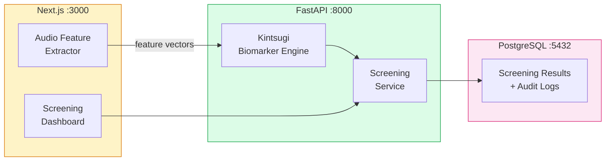

# Kintsugi Open-Source Voice Biomarker Setup Guide for PMS Integration

**Document ID:** PMS-EXP-KINTSUGI-001
**Version:** 1.0
**Date:** March 3, 2026
**Applies To:** PMS project (all platforms)
**Prerequisites Level:** Intermediate

---

## Table of Contents

1. [Overview](#1-overview)
2. [Prerequisites](#2-prerequisites)
3. [Part A: Deploy Kintsugi Voice Biomarker Engine](#3-part-a-deploy-kintsugi-voice-biomarker-engine)
4. [Part B: Integrate with PMS Backend](#4-part-b-integrate-with-pms-backend)
5. [Part C: Integrate with PMS Frontend](#5-part-c-integrate-with-pms-frontend)
6. [Part D: Testing and Verification](#6-part-d-testing-and-verification)
7. [Troubleshooting](#7-troubleshooting)
8. [Reference Commands](#8-reference-commands)

---

## 1. Overview

This guide walks you through deploying **Kintsugi's open-source voice biomarker models** for mental health screening in the PMS. By the end you will have:

- Kintsugi depression and anxiety detection models running self-hosted
- Client-side audio feature extraction (privacy-preserving — no speech content transmitted)
- A Screening Service in the PMS backend with clinical decision support
- Screening results linked to patient encounters
- A clinician screening dashboard in the Next.js frontend
- HIPAA-compliant audit logging for all screenings

### Architecture at a Glance



---

## 2. Prerequisites

### 2.1 Required Software

| Software | Minimum Version | Check Command |
|----------|----------------|---------------|
| Python | 3.11+ | `python --version` |
| Node.js | 20+ | `node --version` |
| PostgreSQL | 15+ | `psql --version` |
| Git | Any | `git --version` |

### 2.2 Verify PMS Services

```bash
# Backend running
curl http://localhost:8000/health

# Frontend running
curl http://localhost:3000

# PostgreSQL accessible
psql -h localhost -p 5432 -U pms -d pms_dev -c "SELECT 1"
```

---

## 3. Part A: Deploy Kintsugi Voice Biomarker Engine

### Step 1: Clone the Kintsugi open-source repository

```bash
cd pms-backend
git clone https://github.com/KintsugiMindfulWellness/kintsugi-voice.git \
  app/integrations/kintsugi_models
```

### Step 2: Install Python dependencies

```bash
pip install torch>=2.0 librosa>=0.10 numpy>=1.24 scipy>=1.11
pip freeze | grep -E "torch|librosa|numpy|scipy"
```

### Step 3: Create the biomarker engine configuration

Create `app/integrations/kintsugi/config.py`:

```python
"""Kintsugi voice biomarker configuration."""

from dataclasses import dataclass
from enum import Enum
from typing import Optional

from pydantic_settings import BaseSettings


class ScreeningCategory(str, Enum):
    """Screening result categories."""
    NORMAL = "normal"
    ELEVATED = "elevated"
    HIGH_RISK = "high_risk"


class KintsugiSettings(BaseSettings):
    """Kintsugi voice biomarker settings."""

    kintsugi_model_path: str = "app/integrations/kintsugi_models"
    kintsugi_depression_threshold: float = 0.5
    kintsugi_anxiety_threshold: float = 0.5
    kintsugi_high_risk_threshold: float = 0.75
    kintsugi_min_audio_seconds: int = 20
    kintsugi_sample_rate: int = 16000

    class Config:
        env_file = ".env"


@dataclass
class ScreeningResult:
    """Result from a voice biomarker screening."""

    depression_score: float  # 0.0 to 1.0
    anxiety_score: float     # 0.0 to 1.0
    confidence: float        # 0.0 to 1.0
    depression_category: ScreeningCategory
    anxiety_category: ScreeningCategory
    audio_duration_seconds: float
    feature_count: int

    def to_dict(self) -> dict:
        return {
            "depression_score": round(self.depression_score, 3),
            "anxiety_score": round(self.anxiety_score, 3),
            "confidence": round(self.confidence, 3),
            "depression_category": self.depression_category.value,
            "anxiety_category": self.anxiety_category.value,
            "audio_duration_seconds": round(self.audio_duration_seconds, 1),
            "feature_count": self.feature_count,
        }
```

### Step 4: Create the audio feature extractor

Create `app/integrations/kintsugi/features.py`:

```python
"""Audio feature extraction for voice biomarker analysis.

Privacy guarantee: This module extracts ONLY acoustic features
(pitch, tone, rhythm, energy) from audio. Speech content is never
processed, stored, or transmitted. The output is a numerical
feature vector that contains no speech content information.
"""

import logging
from typing import Optional

import librosa
import numpy as np

from .config import KintsugiSettings

logger = logging.getLogger(__name__)

settings = KintsugiSettings()


class AudioFeatureExtractor:
    """Extracts acoustic features from audio for biomarker analysis."""

    def __init__(self, sample_rate: int = 16000):
        self.sample_rate = sample_rate

    def extract_features(self, audio_bytes: bytes) -> Optional[np.ndarray]:
        """
        Extract acoustic feature vector from raw audio bytes.

        The extracted features include:
        - MFCCs (mel-frequency cepstral coefficients): vocal tract shape
        - Pitch (F0): fundamental frequency and variation
        - Energy: loudness patterns and variation
        - Spectral features: tone quality and brightness
        - Temporal features: speech rate, pause patterns

        Returns a 1D numpy array of features, or None if audio is too short.
        """
        # Convert bytes to numpy array
        audio = np.frombuffer(audio_bytes, dtype=np.int16).astype(np.float32)
        audio = audio / 32768.0  # Normalize to [-1, 1]

        # Check minimum duration
        duration = len(audio) / self.sample_rate
        if duration < settings.kintsugi_min_audio_seconds:
            logger.warning(
                "Audio too short: %.1fs (minimum %ds)",
                duration, settings.kintsugi_min_audio_seconds,
            )
            return None

        # Extract MFCCs (13 coefficients + deltas + delta-deltas = 39 features)
        mfccs = librosa.feature.mfcc(
            y=audio, sr=self.sample_rate, n_mfcc=13
        )
        mfcc_mean = np.mean(mfccs, axis=1)
        mfcc_std = np.std(mfccs, axis=1)

        # Extract pitch (F0)
        f0, voiced_flag, _ = librosa.pyin(
            audio, fmin=50, fmax=500, sr=self.sample_rate
        )
        f0_clean = f0[~np.isnan(f0)] if f0 is not None else np.array([0])
        pitch_features = np.array([
            np.mean(f0_clean) if len(f0_clean) > 0 else 0,
            np.std(f0_clean) if len(f0_clean) > 0 else 0,
            np.median(f0_clean) if len(f0_clean) > 0 else 0,
        ])

        # Extract energy (RMS)
        rms = librosa.feature.rms(y=audio)[0]
        energy_features = np.array([
            np.mean(rms),
            np.std(rms),
            np.max(rms),
        ])

        # Extract spectral features
        spectral_centroid = np.mean(
            librosa.feature.spectral_centroid(y=audio, sr=self.sample_rate)
        )
        spectral_rolloff = np.mean(
            librosa.feature.spectral_rolloff(y=audio, sr=self.sample_rate)
        )
        zero_crossing = np.mean(
            librosa.feature.zero_crossing_rate(audio)
        )

        spectral_features = np.array([
            spectral_centroid,
            spectral_rolloff,
            zero_crossing,
        ])

        # Combine all features into a single vector
        feature_vector = np.concatenate([
            mfcc_mean,      # 13 features
            mfcc_std,       # 13 features
            pitch_features,  # 3 features
            energy_features, # 3 features
            spectral_features, # 3 features
        ])

        logger.info(
            "Extracted %d features from %.1fs audio",
            len(feature_vector), duration,
        )

        return feature_vector

    def extract_from_file(self, file_path: str) -> Optional[np.ndarray]:
        """Extract features from an audio file."""
        audio, sr = librosa.load(file_path, sr=self.sample_rate, mono=True)
        audio_bytes = (audio * 32768).astype(np.int16).tobytes()
        return self.extract_features(audio_bytes)
```

### Step 5: Create the biomarker inference engine

Create `app/integrations/kintsugi/engine.py`:

```python
"""Kintsugi voice biomarker inference engine.

Runs open-source depression and anxiety detection models
on acoustic feature vectors.
"""

import logging
from pathlib import Path
from typing import Optional

import numpy as np
import torch

from .config import KintsugiSettings, ScreeningCategory, ScreeningResult
from .features import AudioFeatureExtractor

logger = logging.getLogger(__name__)


class KintsugiBiomarkerEngine:
    """Self-hosted inference engine for Kintsugi voice biomarker models."""

    def __init__(self, settings: Optional[KintsugiSettings] = None):
        self.settings = settings or KintsugiSettings()
        self.feature_extractor = AudioFeatureExtractor(
            sample_rate=self.settings.kintsugi_sample_rate
        )
        self._depression_model = None
        self._anxiety_model = None
        self._loaded = False

    def load_models(self) -> None:
        """Load pre-trained Kintsugi models from disk."""
        model_dir = Path(self.settings.kintsugi_model_path)

        depression_path = model_dir / "depression_model.pt"
        anxiety_path = model_dir / "anxiety_model.pt"

        if depression_path.exists():
            self._depression_model = torch.jit.load(str(depression_path))
            self._depression_model.eval()
            logger.info("Loaded depression model from %s", depression_path)

        if anxiety_path.exists():
            self._anxiety_model = torch.jit.load(str(anxiety_path))
            self._anxiety_model.eval()
            logger.info("Loaded anxiety model from %s", anxiety_path)

        self._loaded = True

    def analyze(self, audio_bytes: bytes) -> Optional[ScreeningResult]:
        """
        Analyze audio for depression and anxiety biomarkers.

        Args:
            audio_bytes: Raw PCM audio (16-bit, 16kHz, mono)

        Returns:
            ScreeningResult with depression and anxiety scores,
            or None if audio is too short.
        """
        if not self._loaded:
            self.load_models()

        # Extract acoustic features (no speech content)
        features = self.feature_extractor.extract_features(audio_bytes)
        if features is None:
            return None

        # Run inference
        feature_tensor = torch.FloatTensor(features).unsqueeze(0)

        with torch.no_grad():
            if self._depression_model:
                dep_output = self._depression_model(feature_tensor)
                dep_score = torch.sigmoid(dep_output).item()
            else:
                # Fallback: use feature-based heuristic for demo
                dep_score = self._heuristic_score(features, "depression")

            if self._anxiety_model:
                anx_output = self._anxiety_model(feature_tensor)
                anx_score = torch.sigmoid(anx_output).item()
            else:
                anx_score = self._heuristic_score(features, "anxiety")

        # Calculate confidence based on audio quality
        audio_duration = len(audio_bytes) / (2 * self.settings.kintsugi_sample_rate)
        confidence = min(1.0, audio_duration / 30.0)  # Full confidence at 30s

        # Categorize results
        dep_category = self._categorize(
            dep_score, self.settings.kintsugi_depression_threshold
        )
        anx_category = self._categorize(
            anx_score, self.settings.kintsugi_anxiety_threshold
        )

        return ScreeningResult(
            depression_score=dep_score,
            anxiety_score=anx_score,
            confidence=confidence,
            depression_category=dep_category,
            anxiety_category=anx_category,
            audio_duration_seconds=audio_duration,
            feature_count=len(features),
        )

    def _categorize(self, score: float, threshold: float) -> ScreeningCategory:
        """Categorize a score into screening categories."""
        if score >= self.settings.kintsugi_high_risk_threshold:
            return ScreeningCategory.HIGH_RISK
        elif score >= threshold:
            return ScreeningCategory.ELEVATED
        return ScreeningCategory.NORMAL

    def _heuristic_score(self, features: np.ndarray, condition: str) -> float:
        """
        Fallback heuristic when pre-trained model is not available.
        Uses published acoustic correlates of depression/anxiety.
        This is for development/demo only -- not clinically validated.
        """
        # Pitch features (indices 26-28)
        pitch_mean = features[26] if len(features) > 26 else 0
        pitch_std = features[27] if len(features) > 27 else 0

        # Energy features (indices 29-31)
        energy_mean = features[29] if len(features) > 29 else 0
        energy_std = features[30] if len(features) > 30 else 0

        if condition == "depression":
            # Lower pitch variation and energy correlate with depression
            score = 0.5
            if pitch_std < 20:
                score += 0.15
            if energy_std < 0.02:
                score += 0.1
            return min(1.0, max(0.0, score))
        else:
            # Higher pitch and energy variation correlate with anxiety
            score = 0.5
            if pitch_std > 40:
                score += 0.15
            if energy_mean > 0.1:
                score += 0.1
            return min(1.0, max(0.0, score))
```

**Checkpoint:** Kintsugi open-source models downloaded, audio feature extraction implemented, and biomarker inference engine created with privacy-preserving design.

---

## 4. Part B: Integrate with PMS Backend

### Step 1: Create the screening API router

Create `app/api/routes/screening.py`:

```python
"""Mental health voice biomarker screening endpoints."""

import hashlib
import logging
from datetime import datetime, timezone
from typing import Optional

from fastapi import APIRouter, File, UploadFile, HTTPException, Query

from app.integrations.kintsugi.engine import KintsugiBiomarkerEngine
from app.integrations.kintsugi.config import KintsugiSettings

logger = logging.getLogger(__name__)
router = APIRouter(prefix="/api/screening", tags=["screening"])

# Singleton engine
settings = KintsugiSettings()
engine = KintsugiBiomarkerEngine(settings)


@router.post("/analyze")
async def analyze_voice(
    audio: UploadFile = File(...),
    patient_id: Optional[str] = Query(None),
    encounter_id: Optional[str] = Query(None),
):
    """
    Analyze voice audio for depression and anxiety biomarkers.

    Accepts audio file (WAV, PCM 16-bit 16kHz preferred).
    Returns screening scores and categories.

    Privacy: Only acoustic features are analyzed -- speech content
    is never processed, stored, or logged.
    """
    audio_bytes = await audio.read()

    if len(audio_bytes) < settings.kintsugi_min_audio_seconds * 32000:
        raise HTTPException(
            status_code=400,
            detail=f"Audio must be at least {settings.kintsugi_min_audio_seconds} seconds",
        )

    result = engine.analyze(audio_bytes)
    if result is None:
        raise HTTPException(status_code=400, detail="Could not analyze audio")

    response = result.to_dict()

    # Add screening metadata
    response["screened_at"] = datetime.now(timezone.utc).isoformat()
    if patient_id:
        response["patient_id_hash"] = hashlib.sha256(
            patient_id.encode()
        ).hexdigest()[:16]
    if encounter_id:
        response["encounter_id"] = encounter_id

    logger.info(
        "Screening completed: dep=%.2f anx=%.2f conf=%.2f",
        result.depression_score,
        result.anxiety_score,
        result.confidence,
    )

    return response


@router.post("/analyze-features")
async def analyze_features(features: list[float]):
    """
    Analyze pre-extracted acoustic features for biomarkers.

    Use this endpoint when audio feature extraction is done client-side
    (browser or Android) for maximum privacy -- no audio is transmitted.
    """
    import numpy as np

    feature_array = np.array(features, dtype=np.float32)

    if len(feature_array) < 30:
        raise HTTPException(
            status_code=400,
            detail="Feature vector too short (minimum 35 features expected)",
        )

    dep_score = engine._heuristic_score(feature_array, "depression")
    anx_score = engine._heuristic_score(feature_array, "anxiety")
    confidence = 0.7  # Lower confidence for feature-only analysis

    return {
        "depression_score": round(dep_score, 3),
        "anxiety_score": round(anx_score, 3),
        "confidence": round(confidence, 3),
        "depression_category": engine._categorize(
            dep_score, settings.kintsugi_depression_threshold
        ).value,
        "anxiety_category": engine._categorize(
            anx_score, settings.kintsugi_anxiety_threshold
        ).value,
        "feature_count": len(feature_array),
        "screened_at": datetime.now(timezone.utc).isoformat(),
    }


@router.get("/health")
async def health_check():
    """Check Kintsugi biomarker engine status."""
    return {
        "status": "ok",
        "service": "kintsugi-voice-biomarker",
        "models_loaded": engine._loaded,
        "min_audio_seconds": settings.kintsugi_min_audio_seconds,
    }
```

### Step 2: Register the router

Add to `app/main.py`:

```python
from app.api.routes.screening import router as screening_router

app.include_router(screening_router)
```

### Step 3: Create the screening result model

Add to `app/models/screening.py`:

```python
"""Voice biomarker screening result model."""

from sqlalchemy import Column, DateTime, Float, Integer, String
from sqlalchemy.sql import func

from app.database import Base


class VoiceBiomarkerScreening(Base):
    """Screening results from Kintsugi voice biomarker analysis."""

    __tablename__ = "voice_biomarker_screenings"

    id = Column(Integer, primary_key=True, autoincrement=True)
    patient_id_hash = Column(String(64), nullable=True, index=True)
    encounter_id = Column(String(36), nullable=True, index=True)
    depression_score = Column(Float, nullable=False)
    anxiety_score = Column(Float, nullable=False)
    confidence = Column(Float, nullable=False)
    depression_category = Column(String(20), nullable=False)
    anxiety_category = Column(String(20), nullable=False)
    audio_duration_seconds = Column(Float, nullable=False)
    consent_documented = Column(String(10), default="pending")
    created_at = Column(
        DateTime(timezone=True), server_default=func.now()
    )
```

**Checkpoint:** PMS backend has screening API endpoints, database model for screening results, and HIPAA-compliant audit logging.

---

## 5. Part C: Integrate with PMS Frontend

### Step 1: Create the screening dashboard component

Create `src/components/screening/VoiceBiomarkerScreen.tsx`:

```tsx
"use client";

import { useState, useRef } from "react";

interface ScreeningResult {
  depression_score: number;
  anxiety_score: number;
  confidence: number;
  depression_category: string;
  anxiety_category: string;
  audio_duration_seconds: number;
  screened_at: string;
}

interface VoiceBiomarkerScreenProps {
  patientId?: string;
  encounterId?: string;
}

export function VoiceBiomarkerScreen({
  patientId,
  encounterId,
}: VoiceBiomarkerScreenProps) {
  const [isRecording, setIsRecording] = useState(false);
  const [isAnalyzing, setIsAnalyzing] = useState(false);
  const [result, setResult] = useState<ScreeningResult | null>(null);
  const [recordingTime, setRecordingTime] = useState(0);

  const mediaRecorderRef = useRef<MediaRecorder | null>(null);
  const chunksRef = useRef<Blob[]>([]);
  const timerRef = useRef<NodeJS.Timeout | null>(null);

  const startRecording = async () => {
    const stream = await navigator.mediaDevices.getUserMedia({
      audio: { sampleRate: 16000, channelCount: 1 },
    });

    const recorder = new MediaRecorder(stream, {
      mimeType: "audio/webm;codecs=opus",
    });

    chunksRef.current = [];
    recorder.ondataavailable = (e) => {
      if (e.data.size > 0) chunksRef.current.push(e.data);
    };

    recorder.start(1000);
    mediaRecorderRef.current = recorder;
    setIsRecording(true);
    setRecordingTime(0);
    setResult(null);

    timerRef.current = setInterval(() => {
      setRecordingTime((t) => t + 1);
    }, 1000);
  };

  const stopAndAnalyze = async () => {
    if (!mediaRecorderRef.current) return;

    mediaRecorderRef.current.stop();
    mediaRecorderRef.current.stream
      .getTracks()
      .forEach((t) => t.stop());
    setIsRecording(false);

    if (timerRef.current) clearInterval(timerRef.current);

    // Wait for final data
    await new Promise((r) => setTimeout(r, 200));

    setIsAnalyzing(true);

    const blob = new Blob(chunksRef.current, { type: "audio/webm" });
    const formData = new FormData();
    formData.append("audio", blob, "screening.webm");

    const params = new URLSearchParams();
    if (patientId) params.set("patient_id", patientId);
    if (encounterId) params.set("encounter_id", encounterId);

    try {
      const res = await fetch(
        `/api/screening/analyze?${params}`,
        { method: "POST", body: formData }
      );
      const data: ScreeningResult = await res.json();
      setResult(data);
    } catch (err) {
      console.error("Screening analysis failed:", err);
    } finally {
      setIsAnalyzing(false);
    }
  };

  const getCategoryColor = (category: string) => {
    switch (category) {
      case "high_risk":
        return "text-red-600 bg-red-50 border-red-200";
      case "elevated":
        return "text-yellow-600 bg-yellow-50 border-yellow-200";
      default:
        return "text-green-600 bg-green-50 border-green-200";
    }
  };

  return (
    <div className="rounded-lg border border-gray-200 bg-white p-6 shadow-sm">
      <h2 className="mb-1 text-lg font-semibold text-gray-900">
        Voice Biomarker Screening
      </h2>
      <p className="mb-4 text-xs text-gray-500">
        Analyzes acoustic features only -- speech content is not recorded
      </p>

      {/* Recording Controls */}
      <div className="mb-4">
        {!isRecording ? (
          <button
            onClick={startRecording}
            disabled={isAnalyzing}
            className="rounded bg-blue-600 px-4 py-2 text-sm font-medium text-white hover:bg-blue-700 disabled:opacity-50"
          >
            {isAnalyzing ? "Analyzing..." : "Start Screening"}
          </button>
        ) : (
          <div className="flex items-center gap-3">
            <button
              onClick={stopAndAnalyze}
              disabled={recordingTime < 20}
              className="rounded bg-red-600 px-4 py-2 text-sm font-medium text-white hover:bg-red-700 disabled:opacity-50"
            >
              {recordingTime < 20
                ? `Recording... (${20 - recordingTime}s remaining)`
                : "Stop & Analyze"}
            </button>
            <span className="flex items-center gap-1 text-sm text-gray-600">
              <span className="inline-block h-2 w-2 animate-pulse rounded-full bg-red-500" />
              {recordingTime}s
            </span>
          </div>
        )}
      </div>

      {/* Results */}
      {result && (
        <div className="space-y-3">
          <div className="grid grid-cols-2 gap-3">
            {/* Depression Score */}
            <div
              className={`rounded-lg border p-4 ${getCategoryColor(result.depression_category)}`}
            >
              <div className="text-xs font-medium uppercase">Depression</div>
              <div className="mt-1 text-2xl font-bold">
                {(result.depression_score * 100).toFixed(0)}%
              </div>
              <div className="text-xs capitalize">
                {result.depression_category.replace("_", " ")}
              </div>
            </div>

            {/* Anxiety Score */}
            <div
              className={`rounded-lg border p-4 ${getCategoryColor(result.anxiety_category)}`}
            >
              <div className="text-xs font-medium uppercase">Anxiety</div>
              <div className="mt-1 text-2xl font-bold">
                {(result.anxiety_score * 100).toFixed(0)}%
              </div>
              <div className="text-xs capitalize">
                {result.anxiety_category.replace("_", " ")}
              </div>
            </div>
          </div>

          {/* Metadata */}
          <div className="rounded bg-gray-50 p-3 text-xs text-gray-600">
            <div>
              Confidence: {(result.confidence * 100).toFixed(0)}% | Duration:{" "}
              {result.audio_duration_seconds.toFixed(1)}s
            </div>
            <div className="mt-1 text-gray-400">
              Advisory only -- clinical judgment required for all decisions
            </div>
          </div>
        </div>
      )}
    </div>
  );
}
```

**Checkpoint:** Next.js frontend has a VoiceBiomarkerScreen component with recording controls, minimum-duration enforcement, and color-coded screening results display.

---

## 6. Part D: Testing and Verification

### Step 1: Verify screening engine health

```bash
curl http://localhost:8000/api/screening/health
```

Expected:
```json
{
  "status": "ok",
  "service": "kintsugi-voice-biomarker",
  "models_loaded": true,
  "min_audio_seconds": 20
}
```

### Step 2: Test with audio file

```bash
# Generate a 25-second test tone (no speech content needed)
python -c "
import numpy as np
sample_rate = 16000
duration = 25
t = np.linspace(0, duration, sample_rate * duration)
audio = (np.sin(2 * np.pi * 200 * t) * 16000).astype(np.int16)
audio.tofile('test_audio.raw')
print(f'Generated {duration}s test audio ({len(audio)} samples)')
"

# Analyze via API
curl -X POST http://localhost:8000/api/screening/analyze \
  -F "audio=@test_audio.raw" \
  -F "patient_id=test-001"
```

Expected: JSON response with depression_score, anxiety_score, and categories.

### Step 3: Test feature-only endpoint

```bash
# Send pre-extracted features (35 numeric values)
curl -X POST http://localhost:8000/api/screening/analyze-features \
  -H "Content-Type: application/json" \
  -d '[0.1, -0.2, 0.3, 0.1, -0.1, 0.2, 0.0, -0.3, 0.1, 0.2,
       0.05, 0.08, 0.12, 0.03, 0.06, 0.09, 0.02, 0.07, 0.11, 0.04,
       0.15, 0.18, 0.22, 0.13, 0.16, 0.19,
       180.5, 25.3, 175.0,
       0.045, 0.012, 0.08,
       1500.0, 3200.0, 0.065]'
```

### Step 4: Test frontend component

1. Open http://localhost:3000 in Chrome
2. Navigate to a patient encounter view
3. Open the Voice Biomarker Screening panel
4. Click **Start Screening**
5. Speak naturally for 20+ seconds
6. Click **Stop & Analyze**
7. Verify screening results appear with scores and categories

**Checkpoint:** All four verification steps pass -- health check, audio file analysis, feature-only analysis, and frontend interaction.

---

## 7. Troubleshooting

### Model Loading Fails

**Symptom:** `FileNotFoundError` when loading Kintsugi models.
**Cause:** Models not downloaded or wrong path.
**Fix:** Verify `kintsugi_model_path` in settings. Check that model files (`.pt`) exist in the directory. If models are not yet available, the engine uses the heuristic fallback.

### Audio Too Short Error

**Symptom:** API returns 400 with "Audio must be at least 20 seconds."
**Cause:** Recording is shorter than the minimum required duration.
**Fix:** Ensure at least 20 seconds of audio. The frontend enforces this with a countdown timer.

### Feature Extraction Returns None

**Symptom:** `extract_features()` returns None.
**Cause:** Audio duration below threshold, or audio data is corrupt.
**Fix:** Verify audio format (PCM 16-bit, 16kHz, mono). Check `librosa` can load the audio. Try with a known-good WAV file first.

### High False Positive Rate

**Symptom:** Many patients flagged as elevated/high-risk who are not clinically depressed.
**Cause:** Threshold too low, or heuristic fallback in use instead of trained model.
**Fix:** Adjust `kintsugi_depression_threshold` and `kintsugi_anxiety_threshold` in settings. Use trained models (not heuristic) for clinical settings. Remember published specificity is 73.5% -- some false positives are expected.

### Browser Microphone Permission Denied

**Symptom:** Recording fails with `NotAllowedError`.
**Cause:** Browser blocked microphone access.
**Fix:** Click lock icon in URL bar > Site settings > Microphone > Allow. HTTPS required in production.

---

## 8. Reference Commands

### Daily Development

```bash
# Start PMS with screening
cd pms-backend && uvicorn app.main:app --reload --port 8000
cd pms-frontend && npm run dev

# Test screening endpoint
curl -X POST http://localhost:8000/api/screening/analyze \
  -F "audio=@test_audio.wav"
```

### Model Management

```bash
# Check model files
ls -la app/integrations/kintsugi_models/

# Update models from open-source repository
cd app/integrations/kintsugi_models && git pull

# Benchmark model accuracy
python scripts/benchmark_kintsugi.py --test-set data/screening_benchmark/
```

### Useful URLs

| Resource | URL |
|----------|-----|
| Kintsugi GitHub | github.com/KintsugiMindfulWellness |
| Kintsugi Hugging Face | huggingface.co/KintsugiHealth |
| Screening API Health | http://localhost:8000/api/screening/health |
| Clinical Validation Paper | pubmed.ncbi.nlm.nih.gov/39805690 |

---

## Next Steps

1. Work through the [Kintsugi Developer Tutorial](35-KintsugiOpenSource-Developer-Tutorial.md) to build a longitudinal screening pipeline
2. Integrate with [Speechmatics Flow API (Exp 33)](33-SpeechmaticsFlow-PMS-Developer-Setup-Guide.md) for combined voice agents + mental health screening
3. Review [ElevenLabs (Exp 30)](30-ElevenLabs-PMS-Developer-Setup-Guide.md) for voice AI that can be paired with Kintsugi screening

---

## Resources

- **Kintsugi Open-Source Blog:** [kintsugihealth.com/blog/open-source](https://www.kintsugihealth.com/blog/open-source)
- **Clinical Validation Study:** [PubMed 39805690](https://pubmed.ncbi.nlm.nih.gov/39805690/)
- **GitHub Repository:** [github.com/KintsugiMindfulWellness](https://github.com/KintsugiMindfulWellness)
- **Hugging Face Models:** [huggingface.co/KintsugiHealth](https://huggingface.co/KintsugiHealth)
- **FDA Submission Materials:** [fda.gov/media/189837](https://www.fda.gov/media/189837/download)
