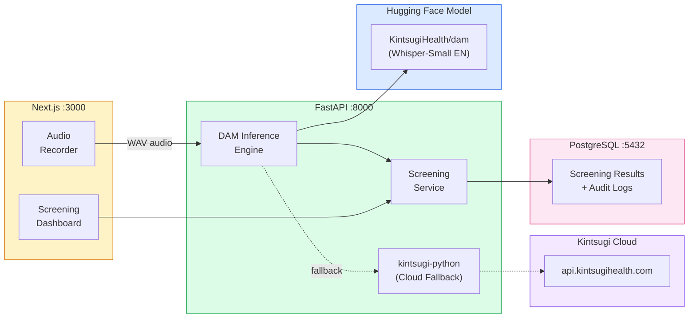

# Kintsugi Voice Biomarker Setup Guide for PMS Integration

**Document ID:** PMS-EXP-KINTSUGI-001
**Version:** 2.0
**Date:** March 6, 2026
**Applies To:** PMS project (all platforms)
**Prerequisites Level:** Intermediate

---

## Table of Contents

1. [Overview](#1-overview)
2. [Prerequisites](#2-prerequisites)
3. [Part A: Deploy the DAM Model from Hugging Face](#3-part-a-deploy-the-dam-model-from-hugging-face)
4. [Part B: Set Up the PyPI SDK (Cloud API Fallback)](#4-part-b-set-up-the-pypi-sdk-cloud-api-fallback)
5. [Part C: Integrate with PMS Backend](#5-part-c-integrate-with-pms-backend)
6. [Part D: Integrate with PMS Frontend](#6-part-d-integrate-with-pms-frontend)
7. [Part E: Testing and Verification](#7-part-e-testing-and-verification)
8. [Troubleshooting](#8-troubleshooting)
9. [Reference Commands](#9-reference-commands)

---

## 1. Overview

This guide walks you through deploying **Kintsugi's voice biomarker models** for mental health screening in the PMS using three available integration paths:

- **Path A (recommended):** Self-hosted DAM model from Hugging Face -- runs locally, no cloud dependency, Apache 2.0 license
- **Path B (optional fallback):** Cloud API via `kintsugi-python` PyPI SDK -- calls `api.kintsugihealth.com/v2`

By the end you will have:

- The DAM model (fine-tuned Whisper-Small EN) running self-hosted for depression/anxiety screening
- Optionally, the `kintsugi-python` SDK configured as a cloud API fallback
- A Screening Service in the PMS backend with clinical decision support
- Screening results linked to patient encounters
- A clinician screening dashboard in the Next.js frontend
- HIPAA-compliant audit logging for all screenings

### Architecture at a Glance



---

## 2. Prerequisites

### 2.1 Required Software

| Software | Minimum Version | Check Command |
|----------|----------------|---------------|
| Python | 3.8+ | `python --version` |
| Git | Any | `git --version` |
| Git LFS | Any | `git lfs --version` |
| Node.js | 20+ | `node --version` |
| PostgreSQL | 15+ | `psql --version` |

### 2.2 Install Git LFS

The DAM model on Hugging Face uses Git LFS for large model files:

```bash
# macOS
brew install git-lfs

# Ubuntu/Debian
sudo apt install git-lfs

# Initialize
git lfs install
```

### 2.3 Verify PMS Services

```bash
# Backend running
curl http://localhost:8000/health

# Frontend running
curl http://localhost:3000

# PostgreSQL accessible
psql -h localhost -p 5432 -U pms -d pms_dev -c "SELECT 1"
```

---

## 3. Part A: Deploy the DAM Model from Hugging Face

### Step 1: Clone the DAM model repository

```bash
cd pms-backend

# Clone the model (includes Pipeline class, weights, and requirements)
git clone https://huggingface.co/KintsugiHealth/dam \
  app/integrations/kintsugi_dam

# Verify model files are present (Git LFS should download them)
ls -la app/integrations/kintsugi_dam/
```

You should see: `pipeline.py`, `requirements.txt`, model weight files, and the `tuning/` directory.

### Step 2: Install model dependencies

```bash
cd app/integrations/kintsugi_dam
pip install -r requirements.txt
cd ../../..

# Verify key dependencies
python -c "import torch; import whisper; print('Dependencies OK')"
```

### Step 3: Verify the model loads and runs

```bash
python -c "
import sys
sys.path.insert(0, 'app/integrations/kintsugi_dam')
from pipeline import Pipeline

pipeline = Pipeline()
print('DAM model loaded successfully')
print('Model ready for inference')
"
```

### Step 4: Test with a sample audio file

```bash
# Generate a 35-second test WAV file
python -c "
import numpy as np
import wave

sample_rate = 16000
duration = 35
t = np.linspace(0, duration, sample_rate * duration)
# Simulate speech-like audio with varying frequency
audio = np.sin(2 * np.pi * (200 + 50 * np.sin(2 * np.pi * 0.5 * t)) * t)
audio = (audio * 16000).astype(np.int16)

with wave.open('/tmp/test_dam.wav', 'w') as wf:
    wf.setnchannels(1)
    wf.setsampwidth(2)
    wf.setframerate(sample_rate)
    wf.writeframes(audio.tobytes())

print(f'Generated {duration}s test WAV at /tmp/test_dam.wav')
"

# Run inference
python -c "
import sys
sys.path.insert(0, 'app/integrations/kintsugi_dam')
from pipeline import Pipeline

pipeline = Pipeline()

# Quantized output: severity categories
result_q = pipeline.run_on_file('/tmp/test_dam.wav', quantized=True)
print(f'Quantized: {result_q}')

# Raw output: float scores
result_r = pipeline.run_on_file('/tmp/test_dam.wav', quantized=False)
print(f'Raw scores: {result_r}')
"
```

Expected output format:
```
Quantized: {'depression': 0, 'anxiety': 0}
Raw scores: {'depression': 0.123, 'anxiety': 0.087}
```

**Checkpoint:** DAM model cloned from Hugging Face, dependencies installed, model loads successfully, and inference produces depression/anxiety scores from audio.

---

## 4. Part B: Set Up the PyPI SDK (Cloud API Fallback)

> **Note:** This step is optional. The DAM model (Part A) is the primary integration path. The PyPI SDK provides a cloud API fallback for validation or when local inference is unavailable. Be aware that Kintsugi Health shut down in February 2026 -- the cloud API may become unavailable.

### Step 1: Install the kintsugi-python package

```bash
pip install kintsugi-python==0.1.8
```

### Step 2: Configure API key

Obtain an API key from [Kintsugi's developer portal](https://www.kintsugihealth.com/api/get-started) (if still available).

Add to `pms-backend/.env`:

```bash
KINTSUGI_API_KEY=your_api_key_here
```

### Step 3: Verify SDK connectivity

```bash
python -c "
from kintsugi.api import Api
import os

api_key = os.environ.get('KINTSUGI_API_KEY', 'test-key')
api = Api(x_api_key=api_key)
print(f'Kintsugi SDK initialized (API key: {api_key[:8]}...)')
print('Note: Actual API calls require a valid key')
"
```

### Step 4: Understand the SDK workflow

The `kintsugi-python` SDK follows a three-step async workflow:

```python
from kintsugi.api import Api

api = Api(x_api_key="YOUR_API_KEY")

# Step 1: Initiate a session
session = api.prediction().initiate(user_id="hashed-patient-id")
session_id = session["session_id"]

# Step 2: Submit audio for prediction
prediction = api.prediction().predict(
    session_id=session_id,
    user_id="hashed-patient-id",
    audio_file=open("patient_audio.wav", "rb"),
)

# Step 3: Retrieve results (async -- may need polling)
result = api.prediction().get_prediction_by_session(session_id)
score = result.get_score()
```

**Cloud API response fields include:**
- `predicted_score_depression`: `no_to_mild` / `mild_to_moderate` / `moderate_to_severe`
- `predicted_score_anxiety`: `no_to_minimal` / `mild` / `moderate` / `moderate_severe`
- Clinical inventory estimates: PHQ-2, PHQ-9, GAD-7

**Checkpoint:** `kintsugi-python` SDK installed and configured. Cloud API workflow understood.

---

## 5. Part C: Integrate with PMS Backend

### Step 1: Create the screening configuration

Create `app/integrations/kintsugi/config.py`:

```python
"""Kintsugi voice biomarker configuration."""

from dataclasses import dataclass
from enum import Enum
from typing import Optional

from pydantic_settings import BaseSettings


class DepressionSeverity(int, Enum):
    """DAM depression severity levels (mapped to PHQ-9)."""
    NONE = 0          # PHQ-9 <= 9
    MILD_MODERATE = 1  # PHQ-9 10-14
    SEVERE = 2         # PHQ-9 >= 15


class AnxietySeverity(int, Enum):
    """DAM anxiety severity levels (mapped to GAD-7)."""
    NONE = 0       # GAD-7 <= 4
    MILD = 1       # GAD-7 5-9
    MODERATE = 2   # GAD-7 10-14
    SEVERE = 3     # GAD-7 >= 15


class KintsugiSettings(BaseSettings):
    """Kintsugi voice biomarker settings."""

    # DAM model (primary)
    kintsugi_dam_model_path: str = "app/integrations/kintsugi_dam"
    kintsugi_min_audio_seconds: int = 30

    # Cloud API fallback (optional)
    kintsugi_api_key: Optional[str] = None
    kintsugi_use_cloud_fallback: bool = False

    class Config:
        env_file = ".env"


@dataclass
class ScreeningResult:
    """Result from a voice biomarker screening."""

    depression_severity: int       # 0, 1, or 2
    anxiety_severity: int          # 0, 1, 2, or 3
    depression_raw: float          # raw model score
    anxiety_raw: float             # raw model score
    audio_duration_seconds: float
    source: str                    # "dam_local" or "cloud_api"

    @property
    def depression_label(self) -> str:
        labels = {0: "none", 1: "mild_to_moderate", 2: "severe"}
        return labels.get(self.depression_severity, "unknown")

    @property
    def anxiety_label(self) -> str:
        labels = {0: "none", 1: "mild", 2: "moderate", 3: "severe"}
        return labels.get(self.anxiety_severity, "unknown")

    def to_dict(self) -> dict:
        return {
            "depression_severity": self.depression_severity,
            "depression_label": self.depression_label,
            "anxiety_severity": self.anxiety_severity,
            "anxiety_label": self.anxiety_label,
            "depression_raw": round(self.depression_raw, 4),
            "anxiety_raw": round(self.anxiety_raw, 4),
            "audio_duration_seconds": round(self.audio_duration_seconds, 1),
            "source": self.source,
        }
```

### Step 2: Create the DAM inference engine

Create `app/integrations/kintsugi/engine.py`:

```python
"""Kintsugi DAM inference engine.

Primary path: self-hosted DAM model from Hugging Face.
Fallback: kintsugi-python SDK (cloud API).
"""

import logging
import sys
import wave
from io import BytesIO
from pathlib import Path
from typing import Optional

from .config import KintsugiSettings, ScreeningResult

logger = logging.getLogger(__name__)


class KintsugiEngine:
    """Voice biomarker screening engine with local DAM model and cloud fallback."""

    def __init__(self, settings: Optional[KintsugiSettings] = None):
        self.settings = settings or KintsugiSettings()
        self._pipeline = None
        self._cloud_api = None
        self._loaded = False

    def load_models(self) -> None:
        """Load the DAM model from the local Hugging Face clone."""
        model_dir = Path(self.settings.kintsugi_dam_model_path)

        if not model_dir.exists():
            logger.warning("DAM model directory not found: %s", model_dir)
            self._loaded = False
            return

        # Add model directory to Python path for pipeline import
        model_path_str = str(model_dir.resolve())
        if model_path_str not in sys.path:
            sys.path.insert(0, model_path_str)

        try:
            from pipeline import Pipeline
            self._pipeline = Pipeline()
            self._loaded = True
            logger.info("DAM model loaded from %s", model_dir)
        except Exception as e:
            logger.error("Failed to load DAM model: %s", e)
            self._loaded = False

    def _init_cloud_api(self):
        """Initialize cloud API fallback if configured."""
        if self._cloud_api is not None:
            return

        if not self.settings.kintsugi_api_key:
            logger.warning("No Kintsugi API key configured for cloud fallback")
            return

        try:
            from kintsugi.api import Api
            self._cloud_api = Api(x_api_key=self.settings.kintsugi_api_key)
            logger.info("Kintsugi cloud API initialized")
        except ImportError:
            logger.warning("kintsugi-python not installed; cloud fallback unavailable")
        except Exception as e:
            logger.error("Failed to initialize cloud API: %s", e)

    def analyze(self, audio_bytes: bytes) -> Optional[ScreeningResult]:
        """
        Analyze audio for depression and anxiety biomarkers.

        Tries local DAM model first, falls back to cloud API if configured.

        Args:
            audio_bytes: Raw audio file bytes (WAV format)

        Returns:
            ScreeningResult with severity scores, or None on failure.
        """
        # Get audio duration
        duration = self._get_wav_duration(audio_bytes)
        if duration is not None and duration < self.settings.kintsugi_min_audio_seconds:
            logger.warning(
                "Audio too short: %.1fs (minimum %ds)",
                duration, self.settings.kintsugi_min_audio_seconds,
            )
            return None

        # Try local DAM model first
        result = self._analyze_local(audio_bytes, duration or 0.0)
        if result is not None:
            return result

        # Fall back to cloud API
        if self.settings.kintsugi_use_cloud_fallback:
            return self._analyze_cloud(audio_bytes, duration or 0.0)

        logger.error("No inference method available")
        return None

    def _analyze_local(
        self, audio_bytes: bytes, duration: float
    ) -> Optional[ScreeningResult]:
        """Run inference using the local DAM model."""
        if not self._loaded:
            self.load_models()

        if self._pipeline is None:
            return None

        # Write audio to temp file (DAM Pipeline expects a file path)
        import tempfile
        with tempfile.NamedTemporaryFile(suffix=".wav", delete=False) as tmp:
            tmp.write(audio_bytes)
            tmp_path = tmp.name

        try:
            # Get quantized severity categories
            result_q = self._pipeline.run_on_file(tmp_path, quantized=True)
            # Get raw float scores for longitudinal tracking
            result_r = self._pipeline.run_on_file(tmp_path, quantized=False)

            return ScreeningResult(
                depression_severity=result_q["depression"],
                anxiety_severity=result_q["anxiety"],
                depression_raw=result_r["depression"],
                anxiety_raw=result_r["anxiety"],
                audio_duration_seconds=duration,
                source="dam_local",
            )
        except Exception as e:
            logger.error("DAM model inference failed: %s", e)
            return None
        finally:
            Path(tmp_path).unlink(missing_ok=True)

    def _analyze_cloud(
        self, audio_bytes: bytes, duration: float
    ) -> Optional[ScreeningResult]:
        """Run inference using the Kintsugi cloud API via PyPI SDK."""
        self._init_cloud_api()

        if self._cloud_api is None:
            return None

        try:
            import hashlib
            user_id = hashlib.sha256(b"pms-screening").hexdigest()[:16]

            prediction_api = self._cloud_api.prediction()
            session = prediction_api.initiate(user_id=user_id)
            session_id = session["session_id"]

            audio_file = BytesIO(audio_bytes)
            audio_file.name = "screening.wav"
            prediction_api.predict(
                session_id=session_id,
                user_id=user_id,
                audio_file=audio_file,
            )

            result = prediction_api.get_prediction_by_session(session_id)

            # Map cloud API severity strings to DAM integer levels
            dep_map = {"no_to_mild": 0, "mild_to_moderate": 1, "moderate_to_severe": 2}
            anx_map = {"no_to_minimal": 0, "mild": 1, "moderate": 2, "moderate_severe": 3}

            dep_label = result.get("predicted_score_depression", "no_to_mild")
            anx_label = result.get("predicted_score_anxiety", "no_to_minimal")

            return ScreeningResult(
                depression_severity=dep_map.get(dep_label, 0),
                anxiety_severity=anx_map.get(anx_label, 0),
                depression_raw=0.0,  # cloud API doesn't return raw floats
                anxiety_raw=0.0,
                audio_duration_seconds=duration,
                source="cloud_api",
            )
        except Exception as e:
            logger.error("Cloud API analysis failed: %s", e)
            return None

    @staticmethod
    def _get_wav_duration(audio_bytes: bytes) -> Optional[float]:
        """Get duration of a WAV file in seconds."""
        try:
            with wave.open(BytesIO(audio_bytes), "rb") as wf:
                frames = wf.getnframes()
                rate = wf.getframerate()
                return frames / rate if rate > 0 else None
        except Exception:
            return None
```

### Step 3: Create the screening API router

Create `app/api/routes/screening.py`:

```python
"""Mental health voice biomarker screening endpoints."""

import hashlib
import logging
from datetime import datetime, timezone
from typing import Optional

from fastapi import APIRouter, File, UploadFile, HTTPException, Query

from app.integrations.kintsugi.engine import KintsugiEngine
from app.integrations.kintsugi.config import KintsugiSettings

logger = logging.getLogger(__name__)
router = APIRouter(prefix="/api/screening", tags=["screening"])

# Singleton engine
settings = KintsugiSettings()
engine = KintsugiEngine(settings)


@router.post("/analyze")
async def analyze_voice(
    audio: UploadFile = File(...),
    patient_id: Optional[str] = Query(None),
    encounter_id: Optional[str] = Query(None),
):
    """
    Analyze voice audio for depression and anxiety biomarkers.

    Accepts WAV audio file (single-channel, 30+ seconds of speech).
    Returns depression and anxiety severity scores mapped to PHQ-9 and GAD-7.

    Uses self-hosted DAM model (primary) or cloud API (fallback).
    """
    audio_bytes = await audio.read()

    if len(audio_bytes) < 1000:
        raise HTTPException(status_code=400, detail="Audio file too small")

    result = engine.analyze(audio_bytes)
    if result is None:
        raise HTTPException(
            status_code=400,
            detail=f"Could not analyze audio. Ensure WAV format, single-channel, "
                   f"and at least {settings.kintsugi_min_audio_seconds}s of speech.",
        )

    response = result.to_dict()

    # Add screening metadata
    response["screened_at"] = datetime.now(timezone.utc).isoformat()
    if patient_id:
        response["patient_id_hash"] = hashlib.sha256(
            patient_id.encode()
        ).hexdigest()[:16]
    if encounter_id:
        response["encounter_id"] = encounter_id

    logger.info(
        "Screening completed: dep=%d(%s) anx=%d(%s) source=%s",
        result.depression_severity, result.depression_label,
        result.anxiety_severity, result.anxiety_label,
        result.source,
    )

    return response


@router.get("/health")
async def health_check():
    """Check Kintsugi screening engine status."""
    return {
        "status": "ok",
        "service": "kintsugi-voice-biomarker",
        "dam_model_loaded": engine._loaded,
        "cloud_fallback_configured": settings.kintsugi_use_cloud_fallback,
        "min_audio_seconds": settings.kintsugi_min_audio_seconds,
    }
```

### Step 4: Register the router

Add to `app/main.py`:

```python
from app.api.routes.screening import router as screening_router

app.include_router(screening_router)
```

### Step 5: Create the screening result model

Add to `app/models/screening.py`:

```python
"""Voice biomarker screening result model."""

from sqlalchemy import Column, DateTime, Float, Integer, String
from sqlalchemy.sql import func

from app.database import Base


class VoiceBiomarkerScreening(Base):
    """Screening results from Kintsugi voice biomarker analysis."""

    __tablename__ = "voice_biomarker_screenings"

    id = Column(Integer, primary_key=True, autoincrement=True)
    patient_id_hash = Column(String(64), nullable=True, index=True)
    encounter_id = Column(String(36), nullable=True, index=True)
    depression_severity = Column(Integer, nullable=False)
    anxiety_severity = Column(Integer, nullable=False)
    depression_raw = Column(Float, nullable=True)
    anxiety_raw = Column(Float, nullable=True)
    audio_duration_seconds = Column(Float, nullable=False)
    source = Column(String(20), nullable=False)  # "dam_local" or "cloud_api"
    consent_documented = Column(String(10), default="pending")
    created_at = Column(
        DateTime(timezone=True), server_default=func.now()
    )
```

**Checkpoint:** PMS backend has a dual-path screening engine (DAM local + cloud fallback), API endpoints, and database model for screening results.

---

## 6. Part D: Integrate with PMS Frontend

### Step 1: Create the screening dashboard component

Create `src/components/screening/VoiceBiomarkerScreen.tsx`:

```tsx
"use client";

import { useState, useRef } from "react";

interface ScreeningResult {
  depression_severity: number;
  depression_label: string;
  anxiety_severity: number;
  anxiety_label: string;
  depression_raw: number;
  anxiety_raw: number;
  audio_duration_seconds: number;
  source: string;
  screened_at: string;
}

interface VoiceBiomarkerScreenProps {
  patientId?: string;
  encounterId?: string;
}

const SEVERITY_COLORS: Record<string, string> = {
  none: "text-green-600 bg-green-50 border-green-200",
  mild: "text-yellow-600 bg-yellow-50 border-yellow-200",
  mild_to_moderate: "text-orange-600 bg-orange-50 border-orange-200",
  moderate: "text-orange-600 bg-orange-50 border-orange-200",
  severe: "text-red-600 bg-red-50 border-red-200",
};

export function VoiceBiomarkerScreen({
  patientId,
  encounterId,
}: VoiceBiomarkerScreenProps) {
  const [isRecording, setIsRecording] = useState(false);
  const [isAnalyzing, setIsAnalyzing] = useState(false);
  const [result, setResult] = useState<ScreeningResult | null>(null);
  const [recordingTime, setRecordingTime] = useState(0);

  const mediaRecorderRef = useRef<MediaRecorder | null>(null);
  const chunksRef = useRef<Blob[]>([]);
  const timerRef = useRef<NodeJS.Timeout | null>(null);

  const startRecording = async () => {
    const stream = await navigator.mediaDevices.getUserMedia({
      audio: { sampleRate: 16000, channelCount: 1 },
    });

    const recorder = new MediaRecorder(stream, {
      mimeType: "audio/webm;codecs=opus",
    });

    chunksRef.current = [];
    recorder.ondataavailable = (e) => {
      if (e.data.size > 0) chunksRef.current.push(e.data);
    };

    recorder.start(1000);
    mediaRecorderRef.current = recorder;
    setIsRecording(true);
    setRecordingTime(0);
    setResult(null);

    timerRef.current = setInterval(() => {
      setRecordingTime((t) => t + 1);
    }, 1000);
  };

  const stopAndAnalyze = async () => {
    if (!mediaRecorderRef.current) return;

    mediaRecorderRef.current.stop();
    mediaRecorderRef.current.stream
      .getTracks()
      .forEach((t) => t.stop());
    setIsRecording(false);

    if (timerRef.current) clearInterval(timerRef.current);

    await new Promise((r) => setTimeout(r, 200));

    setIsAnalyzing(true);

    const blob = new Blob(chunksRef.current, { type: "audio/webm" });
    const formData = new FormData();
    formData.append("audio", blob, "screening.webm");

    const params = new URLSearchParams();
    if (patientId) params.set("patient_id", patientId);
    if (encounterId) params.set("encounter_id", encounterId);

    try {
      const res = await fetch(
        `/api/screening/analyze?${params}`,
        { method: "POST", body: formData }
      );
      const data: ScreeningResult = await res.json();
      setResult(data);
    } catch (err) {
      console.error("Screening analysis failed:", err);
    } finally {
      setIsAnalyzing(false);
    }
  };

  const formatLabel = (label: string) =>
    label.replace(/_/g, " ").replace(/\b\w/g, (c) => c.toUpperCase());

  return (
    <div className="rounded-lg border border-gray-200 bg-white p-6 shadow-sm">
      <h2 className="mb-1 text-lg font-semibold text-gray-900">
        Voice Biomarker Screening
      </h2>
      <p className="mb-4 text-xs text-gray-500">
        Analyzes acoustic features only -- speech content is not transcribed
      </p>

      {/* Recording Controls */}
      <div className="mb-4">
        {!isRecording ? (
          <button
            onClick={startRecording}
            disabled={isAnalyzing}
            className="rounded bg-blue-600 px-4 py-2 text-sm font-medium text-white hover:bg-blue-700 disabled:opacity-50"
          >
            {isAnalyzing ? "Analyzing..." : "Start Screening"}
          </button>
        ) : (
          <div className="flex items-center gap-3">
            <button
              onClick={stopAndAnalyze}
              disabled={recordingTime < 30}
              className="rounded bg-red-600 px-4 py-2 text-sm font-medium text-white hover:bg-red-700 disabled:opacity-50"
            >
              {recordingTime < 30
                ? `Recording... (${30 - recordingTime}s remaining)`
                : "Stop & Analyze"}
            </button>
            <span className="flex items-center gap-1 text-sm text-gray-600">
              <span className="inline-block h-2 w-2 animate-pulse rounded-full bg-red-500" />
              {recordingTime}s
            </span>
          </div>
        )}
      </div>

      {/* Results */}
      {result && (
        <div className="space-y-3">
          <div className="grid grid-cols-2 gap-3">
            {/* Depression */}
            <div
              className={`rounded-lg border p-4 ${SEVERITY_COLORS[result.depression_label] || SEVERITY_COLORS.none}`}
            >
              <div className="text-xs font-medium uppercase">Depression</div>
              <div className="mt-1 text-xl font-bold">
                {formatLabel(result.depression_label)}
              </div>
              <div className="text-xs">PHQ-9 mapped severity {result.depression_severity}/2</div>
            </div>

            {/* Anxiety */}
            <div
              className={`rounded-lg border p-4 ${SEVERITY_COLORS[result.anxiety_label] || SEVERITY_COLORS.none}`}
            >
              <div className="text-xs font-medium uppercase">Anxiety</div>
              <div className="mt-1 text-xl font-bold">
                {formatLabel(result.anxiety_label)}
              </div>
              <div className="text-xs">GAD-7 mapped severity {result.anxiety_severity}/3</div>
            </div>
          </div>

          {/* Metadata */}
          <div className="rounded bg-gray-50 p-3 text-xs text-gray-600">
            <div>
              Duration: {result.audio_duration_seconds.toFixed(1)}s | Source:{" "}
              {result.source === "dam_local" ? "Self-hosted DAM" : "Cloud API"}
            </div>
            <div className="mt-1 text-gray-400">
              Advisory only -- clinical judgment required for all decisions
            </div>
          </div>
        </div>
      )}
    </div>
  );
}
```

**Checkpoint:** Next.js frontend has a VoiceBiomarkerScreen component with recording controls, 30-second minimum enforcement, severity-labeled results, and source indication (local vs cloud).

---

## 7. Part E: Testing and Verification

### Step 1: Verify screening engine health

```bash
curl http://localhost:8000/api/screening/health
```

Expected:
```json
{
  "status": "ok",
  "service": "kintsugi-voice-biomarker",
  "dam_model_loaded": true,
  "cloud_fallback_configured": false,
  "min_audio_seconds": 30
}
```

### Step 2: Test with audio file (DAM model)

```bash
# Generate a 35-second test WAV
python -c "
import numpy as np, wave
sr = 16000; dur = 35
t = np.linspace(0, dur, sr * dur)
audio = (np.sin(2 * np.pi * 200 * t) * 16000).astype(np.int16)
with wave.open('/tmp/test_screening.wav', 'w') as wf:
    wf.setnchannels(1); wf.setsampwidth(2); wf.setframerate(sr)
    wf.writeframes(audio.tobytes())
print('Test WAV generated')
"

# Analyze via API
curl -X POST http://localhost:8000/api/screening/analyze \
  -F "audio=@/tmp/test_screening.wav" \
  -F "patient_id=test-001"
```

Expected: JSON with `depression_severity`, `anxiety_severity`, `depression_label`, `anxiety_label`, and `source: "dam_local"`.

### Step 3: Test frontend component

1. Open http://localhost:3000 in Chrome
2. Navigate to a patient encounter view
3. Open the Voice Biomarker Screening panel
4. Click **Start Screening**
5. Speak naturally for 30+ seconds
6. Click **Stop & Analyze**
7. Verify screening results appear with severity labels and source indicator

**Checkpoint:** All verification steps pass -- health check, DAM model inference via API, and frontend interaction.

---

## 8. Troubleshooting

### DAM Model Loading Fails

**Symptom:** `ModuleNotFoundError: No module named 'pipeline'` or model files missing.
**Cause:** Git LFS didn't download model weights, or model path is incorrect.
**Fix:**
```bash
cd app/integrations/kintsugi_dam
git lfs pull  # Download large files
ls -la *.pt *.bin  # Verify model weights exist
```
Also verify `kintsugi_dam_model_path` in `.env` or `KintsugiSettings`.

### Audio Too Short Error

**Symptom:** API returns 400 with "Audio must be at least 30 seconds."
**Cause:** Recording is shorter than the minimum required duration for DAM model.
**Fix:** Ensure at least 30 seconds of speech. The frontend enforces this with a countdown timer. Note: DAM requires 30s (not 20s like the old Kintsugi API).

### Cloud API Returns 401/403

**Symptom:** Cloud fallback fails with authentication error.
**Cause:** Invalid or expired API key, or API shut down.
**Fix:** Verify `KINTSUGI_API_KEY` in `.env`. Check if `api.kintsugihealth.com` is still operational. If not, rely on the self-hosted DAM model (primary path).

### PyTorch Version Mismatch

**Symptom:** `RuntimeError` when loading DAM model weights.
**Cause:** PyTorch version doesn't match the version used to save the model.
**Fix:** Install the PyTorch version specified in the DAM model's `requirements.txt`:
```bash
cd app/integrations/kintsugi_dam
pip install -r requirements.txt
```

### High Memory Usage

**Symptom:** DAM model uses more RAM than expected.
**Cause:** Whisper-Small EN backbone loads into memory (~500MB).
**Fix:** This is expected. For lower memory, ensure only one model instance (singleton pattern in engine). Consider running inference in a separate process with memory limits.

### Browser Microphone Permission Denied

**Symptom:** Recording fails with `NotAllowedError`.
**Cause:** Browser blocked microphone access.
**Fix:** Click lock icon in URL bar > Site settings > Microphone > Allow. HTTPS required in production.

---

## 9. Reference Commands

### Daily Development

```bash
# Start PMS with screening
cd pms-backend && uvicorn app.main:app --reload --port 8000
cd pms-frontend && npm run dev

# Test screening endpoint
curl -X POST http://localhost:8000/api/screening/analyze \
  -F "audio=@test_audio.wav"
```

### Model Management

```bash
# Check DAM model files
ls -la app/integrations/kintsugi_dam/

# Update model from Hugging Face
cd app/integrations/kintsugi_dam && git pull

# Run threshold tuning with dam-dataset
python -c "
from datasets import load_dataset
val = load_dataset('KintsugiHealth/dam-dataset', split='validation')
print(f'Validation samples: {len(val)}')
"
```

### Useful URLs

| Resource | URL |
|----------|-----|
| DAM Model (Hugging Face) | https://huggingface.co/KintsugiHealth/dam |
| DAM Dataset (Hugging Face) | https://huggingface.co/datasets/KintsugiHealth/dam-dataset |
| kintsugi-python (PyPI) | https://pypi.org/project/kintsugi-python/ |
| Kintsugi Voice API Docs | https://www.kintsugihealth.com/api/voice-api |
| Screening API Health | http://localhost:8000/api/screening/health |
| Clinical Validation Paper | https://pubmed.ncbi.nlm.nih.gov/39805690/ |

---

## Next Steps

1. Work through the [Kintsugi Developer Tutorial](35-KintsugiOpenSource-Developer-Tutorial.md) to build a longitudinal screening pipeline
2. Download the [dam-dataset](https://huggingface.co/datasets/KintsugiHealth/dam-dataset) and tune severity thresholds for your patient population
3. Integrate with [Speechmatics Flow API (Exp 33)](33-SpeechmaticsFlow-PMS-Developer-Setup-Guide.md) for combined voice agents + mental health screening

---

## Resources

- **DAM Model:** [huggingface.co/KintsugiHealth/dam](https://huggingface.co/KintsugiHealth/dam) -- Apache 2.0, fine-tuned Whisper-Small EN
- **DAM Dataset:** [huggingface.co/datasets/KintsugiHealth/dam-dataset](https://huggingface.co/datasets/KintsugiHealth/dam-dataset) -- ~863 hours, ~35K individuals
- **PyPI SDK:** [pypi.org/project/kintsugi-python](https://pypi.org/project/kintsugi-python/) -- v0.1.8, MIT license
- **Clinical Validation:** [PubMed 39805690](https://pubmed.ncbi.nlm.nih.gov/39805690/) -- 71.3% sensitivity, 73.5% specificity
- **Annals of Family Medicine:** [Full paper](https://www.annfammed.org/content/early/2025/01/07/afm.240091)
- **FDA Submission Materials:** [fda.gov/media/189837](https://www.fda.gov/media/189837/download)
