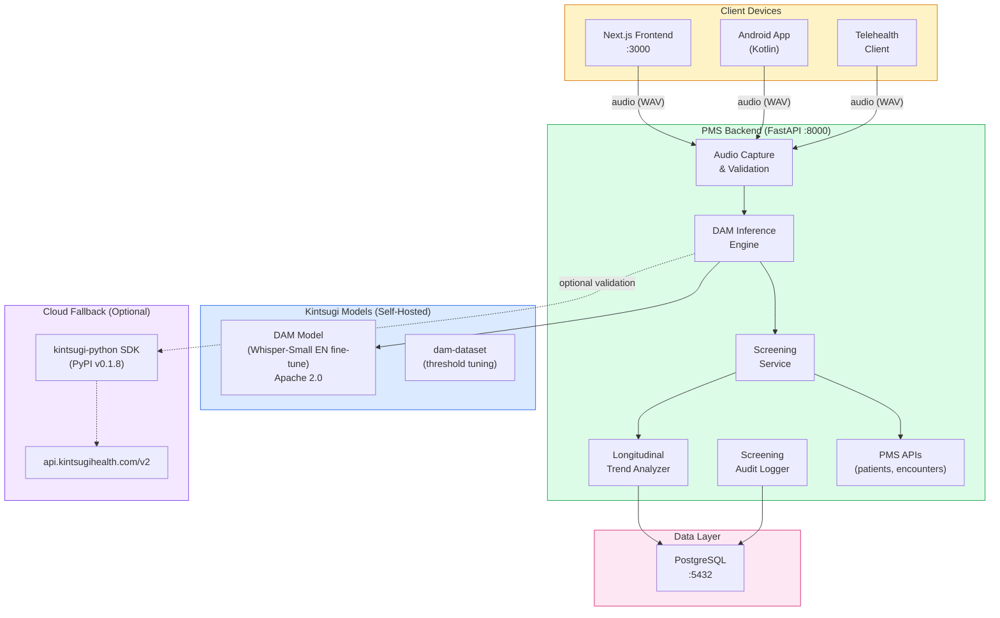

# Product Requirements Document: Kintsugi Voice Biomarker Integration into Patient Management System (PMS)

**Document ID:** PRD-PMS-KINTSUGI-001
**Version:** 2.0
**Date:** March 6, 2026
**Author:** Ammar (CEO, MPS Inc.)
**Status:** Draft

---

## 1. Executive Summary

Kintsugi is a voice biomarker AI platform that detects signs of clinical depression and anxiety from short speech samples. Originally developed by Kintsugi Health (which raised $30M+ in venture funding), the company open-sourced its core model and research in February 2026 after FDA regulatory costs made the venture-backed model unsustainable. The technology analyzes acoustic features (pitch, intonation, tone, pauses) rather than speech content, meaning it can screen for mental health conditions without transcribing what the patient says -- a significant privacy advantage.

Three integration paths are available:

1. **Hugging Face DAM Model** (recommended for PMS): The [KintsugiHealth/dam](https://huggingface.co/KintsugiHealth/dam) model is a fine-tuned OpenAI Whisper-Small EN model for audio classification of depression and anxiety severity. It runs entirely self-hosted, requires no cloud API, is licensed under **Apache 2.0**, and outputs scores mapped to PHQ-9 (depression) and GAD-7 (anxiety) clinical scales. A companion dataset ([KintsugiHealth/dam-dataset](https://huggingface.co/datasets/KintsugiHealth/dam-dataset)) with ~863 hours of labeled speech from ~35,000 individuals is available for threshold tuning and validation. This is the recommended path for HIPAA-compliant healthcare deployment.

2. **PyPI SDK** (`kintsugi-python` v0.1.8, MIT license): A Python SDK that wraps the Kintsugi Voice API V2 at `api.kintsugihealth.com`. Provides an async workflow (initiate session, submit audio, retrieve results) with severity scores and clinical inventory estimates. Useful as a validation baseline or fallback, but sends audio to Kintsugi's cloud infrastructure.

3. **Cloud REST API** (`api.kintsugihealth.com/v2`): Direct REST API with endpoints for session initiation, audio prediction, and result retrieval. The PyPI SDK wraps this API. Both the SDK and API are at risk of discontinuation given the company shutdown.

Integrating Kintsugi into the PMS provides: (1) **passive mental health screening** during routine clinical encounters without dedicated questionnaires; (2) **longitudinal mood monitoring** tracking voice biomarkers across encounters; and (3) **clinical scale estimation** returning PHQ-9 and GAD-7 severity levels from voice alone.

The clinical validation study published in the Annals of Family Medicine demonstrated 71.3% sensitivity and 73.5% specificity for moderate-to-severe depression (PHQ-9 >= 10).

---

## 2. Problem Statement

- **Mental health screening is underperformed:** The US Preventive Services Task Force recommends universal depression screening in primary care, but PHQ-9 questionnaires are time-consuming, subject to patient self-report bias, and often skipped during busy clinical encounters.
- **No passive screening capability:** Current PMS mental health assessment requires patients to actively complete questionnaires -- there is no way to passively screen during routine interactions like phone calls, telehealth visits, or in-person intake conversations.
- **No longitudinal voice biomarker tracking:** Patient mood patterns change over time, but current PMS encounters capture point-in-time assessments. Voice biomarkers could provide continuous monitoring between clinical visits.
- **Privacy concerns limit voice AI adoption:** Healthcare organizations hesitate to deploy voice analysis because traditional speech processing records and transcribes patient content -- raising significant HIPAA concerns about PHI in audio recordings.

---

## 3. Proposed Solution

Deploy the **Kintsugi DAM model from Hugging Face** as a self-hosted mental health screening layer in the PMS, with the **`kintsugi-python` PyPI SDK** as an optional cloud API fallback for validation and cross-referencing.

### 3.1 Architecture Overview

### 3.2 Deployment Model

- **Primary -- Self-hosted DAM model:** The Hugging Face DAM model (`KintsugiHealth/dam`) runs on-premise within the PMS Docker network. All audio analysis stays local -- zero data egress. Apache 2.0 license permits unrestricted commercial use.
- **Fallback -- Cloud API via PyPI SDK:** The `kintsugi-python` package (MIT license) can call the Kintsugi Voice API V2 for cross-validation or when local inference is unavailable. Audio IS sent to Kintsugi's cloud in this path -- requires patient consent and PHI gateway.
- **Privacy by design:** The DAM model analyzes acoustic features via a fine-tuned Whisper backbone -- it does not produce transcriptions. Speech content is not extracted or stored.
- **Docker deployment:** DAM inference engine packaged as a Docker service alongside the PMS backend.
- **Clinical decision support only:** Results are advisory -- never used for automated clinical decisions without clinician review.
- **API continuity risk:** Kintsugi Health shut down in February 2026. The cloud API and PyPI SDK may become unavailable. The self-hosted DAM model on Hugging Face is the durable path.

---

## 4. PMS Data Sources

| PMS Resource | Kintsugi Integration | Use Case |
|-------------|---------------------|----------|
| Patient Records API (`/api/patients`) | Store screening results linked to patient | Longitudinal biomarker tracking |
| Encounter Records API (`/api/encounters`) | Attach screening results to encounters | Point-in-time mental health assessment |
| Reporting API (`/api/reports`) | Aggregate screening statistics | Population health mental health dashboard |
| Telehealth API | Real-time audio capture for screening | Passive screening during telehealth visits |

---

## 5. Component/Module Definitions

### 5.1 Audio Capture & Validation

**Description:** Accepts audio from clients (browser, Android, telehealth), validates format (WAV, single-channel, minimum 30 seconds of speech after VAD), and routes to the DAM inference engine.

**Input:** Audio file from client device (WAV preferred, 44.1 kHz or 16 kHz).
**Output:** Validated audio buffer ready for inference.
**Privacy guarantee:** Raw audio is discarded after inference -- only screening results are stored.

### 5.2 DAM Inference Engine

**Description:** Self-hosted inference service running the Kintsugi DAM model from Hugging Face. Uses the model's `Pipeline` class to produce depression and anxiety severity scores from audio. Supports both raw float scores (correlating monotonically with PHQ-9/GAD-7) and quantized severity categories.

**Input:** Validated audio (WAV, single-speaker, English, 30+ seconds of speech).
**Output:**
- Depression severity: `0` (no depression, PHQ-9 <= 9) / `1` (mild-moderate, PHQ-9 10-14) / `2` (severe, PHQ-9 >= 15)
- Anxiety severity: `0` (no anxiety, GAD-7 <= 4) / `1` (mild, GAD-7 5-9) / `2` (moderate, GAD-7 10-14) / `3` (severe, GAD-7 >= 15)
- Raw float scores for longitudinal tracking and threshold tuning.

### 5.3 Screening Service

**Description:** Clinical decision support service that interprets DAM severity scores in the context of patient history, generates screening recommendations, and routes results to appropriate clinicians.

**Input:** DAM scores, patient ID, encounter context.
**Output:** Screening recommendation (normal/elevated/high-risk), suggested follow-up actions.
**PMS APIs:** `/api/patients`, `/api/encounters`.

### 5.4 Longitudinal Trend Analyzer

**Description:** Tracks voice biomarker scores across multiple encounters for each patient, detecting trends (worsening, improving, stable) and alerting clinicians to significant changes.

**Input:** Historical screening results for a patient.
**Output:** Trend analysis (direction, rate of change, alert threshold).
**PMS APIs:** `/api/patients` (read history), `/api/reports` (aggregate statistics).

### 5.5 Screening Audit Logger

**Description:** HIPAA-compliant audit logging for all voice biomarker screenings, recording when screenings occurred, which encounters they were associated with, and screening outcomes -- without storing audio data.

**Input:** Screening events (patient ID hash, encounter ID, timestamp, result category).
**Output:** Audit records in PostgreSQL.

---

## 6. Non-Functional Requirements

### 6.1 Security and HIPAA Compliance

- **Self-hosted primary path:** The DAM model runs entirely on-premise -- no audio leaves the network perimeter.
- **Cloud fallback requires safeguards:** If using the PyPI SDK / cloud API, audio IS sent externally. Patient consent is mandatory, and a PHI De-ID Gateway must strip identifying metadata. The `user_id` sent to Kintsugi API uses a SHA-256 hash.
- **No audio storage:** Raw audio is discarded immediately after inference -- only screening results are stored.
- **Results are PHI:** Screening scores linked to patient IDs are protected health information -- encrypted at rest (AES-256) and in transit (TLS 1.3).
- **Patient consent required:** Voice biomarker screening requires documented patient consent before activation.
- **Results are advisory only:** Screening results are clinical decision support -- never used for automated diagnoses or treatment decisions.
- **Audit trail:** Every screening event logged with patient hash, encounter, timestamp, and result category.
- **Model provenance:** DAM model is Apache 2.0 licensed with clear provenance (Hugging Face, published contributors, peer-reviewed methodology).

### 6.2 Performance

| Metric | Target |
|--------|--------|
| DAM model inference (self-hosted) | < 3 seconds for 30s audio |
| Cloud API end-to-end (fallback) | < 5 seconds |
| Model memory footprint | < 1 GB RAM (Whisper-Small backbone) |
| Concurrent analyses | 10+ per PMS instance (CPU) |
| Graph visualization render | < 1 second |

### 6.3 Infrastructure

- **Self-hosted DAM model:** Docker container, Python 3.8+, Whisper-Small EN backbone (~500MB model), CPU inference supported (GPU optional for higher throughput).
- **PyPI SDK (fallback):** `kintsugi-python>=0.1.8` (~17KB package), outbound HTTPS to `api.kintsugihealth.com`.
- **Storage:** Minimal -- only screening results in PostgreSQL (not audio).

---

## 7. Implementation Phases

### Phase 1: Foundation -- DAM Model Deployment & Screening API (Sprint 1)

- Clone DAM model from Hugging Face and deploy as Docker service
- Install dependencies from model's `requirements.txt`
- Build DAM inference engine wrapping the `Pipeline` class
- Create screening API endpoints (`POST /api/screening/analyze`, `GET /api/screening/results/{encounter_id}`)
- Implement screening audit logging
- Validate model accuracy against published benchmarks using `dam-dataset`
- Optionally install `kintsugi-python` as cloud API fallback

### Phase 2: Clinical Integration (Sprints 2-3)

- Build Screening Service with clinical decision support logic
- Integrate screening results with PMS encounter records
- Create Next.js screening dashboard for clinicians
- Build Android audio capture and submission for mobile encounters
- Implement patient consent management workflow
- Tune severity thresholds using `dam-dataset` validation split and the model's tuning utilities

### Phase 3: Longitudinal Monitoring & Population Health (Sprints 4-5)

- Build Longitudinal Trend Analyzer for multi-encounter tracking
- Create patient mood timeline visualization
- Build population health mental health dashboard
- Implement alerting for significant biomarker changes
- Integrate with telehealth platform for passive screening
- Clinical validation study comparing DAM screening vs PHQ-9 outcomes

---

## 8. Success Metrics

| Metric | Target | Measurement Method |
|--------|--------|-------------------|
| Screening completion rate | > 80% of eligible encounters | Encounter-screening correlation |
| Model inference latency | < 3 seconds (self-hosted) | APM monitoring |
| Clinician satisfaction | > 4.0/5.0 with screening workflow | Team survey |
| Patient consent rate | > 85% acceptance | Consent management tracking |
| False positive follow-up rate | < 30% of flagged patients | Clinician outcome tracking |
| Model accuracy (local validation) | >= 70% sensitivity, >= 72% specificity | dam-dataset benchmark |

---

## 9. Risks and Mitigations

| Risk | Impact | Mitigation |
|------|--------|------------|
| Kintsugi cloud API shutdown | Medium -- cloud fallback lost | Self-hosted DAM model is the primary path and independent of cloud API. Pin `kintsugi-python` at v0.1.8 and archive. |
| Model accuracy insufficient for clinical use | Medium -- false positives/negatives | Position as screening aid only. Use dam-dataset to tune thresholds for PMS population. Always pair with clinical judgment. |
| Patient discomfort with voice analysis | Medium -- low consent rates | Clear disclosure that speech content is not transcribed. Opt-in only. Visible indicators when screening is active. |
| Open-source model maintenance | Medium -- no commercial entity maintaining | Fork the HF repo. Assign internal team to monitor. Apache 2.0 allows full modification. Community may contribute. |
| Regulatory ambiguity (SaMD classification) | Medium -- unclear FDA status | Consult regulatory counsel. Position as CDS not diagnostic device. Monitor FDA guidance on voice biomarkers. |
| Bias in training data | Medium -- unequal accuracy across demographics | Validate model on PMS patient demographics using dam-dataset tools. Document limitations. |
| Whisper dependency updates | Low -- backbone model changes | Pin Whisper version. DAM model includes all required weights. |

---

## 10. Dependencies

| Dependency | Version | Purpose |
|-----------|---------|---------|
| KintsugiHealth/dam (Hugging Face) | Feb 2026 release | Self-hosted DAM model (Apache 2.0) |
| KintsugiHealth/dam-dataset (Hugging Face) | Feb 2026 release | Threshold tuning and validation dataset (Apache 2.0) |
| OpenAI Whisper-Small EN | Base model | Foundation model (DAM fine-tune backbone) |
| kintsugi-python (PyPI) | >= 0.1.8 | Cloud API SDK fallback (MIT license) |
| Python | >= 3.8 | Runtime for model and SDK |
| PyTorch | >= 2.0 | DAM model inference |
| FastAPI | >= 0.115 | Screening API endpoints |
| PostgreSQL | >= 15 | Screening results and audit log storage |

---

## 11. Comparison with Existing Experiments

| Aspect | Kintsugi DAM (Exp 35) | ElevenLabs (Exp 30) | Speechmatics (Exp 10/33) | MedASR (Exp 7) |
|--------|----------------------|---------------------|--------------------------|----------------|
| **Primary function** | Mental health screening | TTS + STT + voice agents | Speech recognition | Medical transcription |
| **What it analyzes** | Acoustic features (Whisper backbone) | Speech content | Speech content | Speech content |
| **Privacy model** | Self-hosted, no transcription | Audio in cloud | Audio in cloud/on-prem | Audio locally |
| **Clinical output** | Depression/anxiety severity (PHQ-9/GAD-7 mapped) | Text/audio | Transcription text | Transcription text |
| **Model source** | Hugging Face (Apache 2.0) | Cloud API | Cloud API / on-prem | Self-hosted |
| **Cost** | Free (self-hosted) | Per-minute API | Per-minute API | Compute cost |
| **Clinical validation** | Published (Annals of Family Medicine) | None for clinical use | Medical model benchmarked | Medical vocabulary |

**Complementary roles:**
- **Kintsugi DAM (Exp 35)** provides privacy-preserving mental health screening from voice acoustics -- a unique capability not covered by any other experiment.
- **Speechmatics (Exp 10/33)** provides medical speech-to-text -- Kintsugi can analyze the same audio that Speechmatics transcribes, adding mental health screening as a parallel analysis layer.
- **ElevenLabs (Exp 30)** provides TTS for patient communication -- Kintsugi could screen patient voice during ElevenLabs Conversational AI interactions.

---

## 12. Research Sources

### Hugging Face Model & Dataset
- [KintsugiHealth/dam](https://huggingface.co/KintsugiHealth/dam) -- DAM model: fine-tuned Whisper-Small EN, audio classification, Apache 2.0
- [KintsugiHealth/dam-dataset](https://huggingface.co/datasets/KintsugiHealth/dam-dataset) -- ~863 hours, ~35K individuals, PHQ-9/GAD-7 labels, threshold tuning tools

### PyPI Package
- [kintsugi-python on PyPI](https://pypi.org/project/kintsugi-python/) -- v0.1.8, MIT license, Cloud API V2 SDK

### Cloud API Documentation
- [Kintsugi Voice API V2](https://www.kintsugihealth.com/api/voice-api) -- REST endpoints, request/response schemas
- [Kintsugi API Introduction](https://www.kintsugihealth.com/api/intro-to-kintsugi-voice-stack) -- Architecture overview, SDK links
- [Kintsugi SDKs](https://www.kintsugihealth.com/api/sdks) -- Python and Java SDK documentation
- [Kintsugi Audio Specification](https://www.kintsugihealth.com/api/audio-file-specification) -- WAV format requirements

### Clinical Validation
- [Evaluation of AI-Based Voice Biomarker Tool (PubMed)](https://pubmed.ncbi.nlm.nih.gov/39805690/) -- Peer-reviewed: 71.3% sensitivity, 73.5% specificity
- [Annals of Family Medicine (full paper)](https://www.annfammed.org/content/early/2025/01/07/afm.240091) -- Original clinical validation study
- [FDA Voice Biomarker AI Presentation](https://www.fda.gov/media/189837/download) -- FDA De Novo submission materials

### Company & Context
- [Kintsugi Open-Source Announcement](https://www.kintsugihealth.com/blog/open-source) -- CEO announcement of open-source release and company closure
- [Kintsugi Releases Voice Biomarker AI to Public (Healthcare IT News)](https://www.healthcareitnews.com/news/kintsugi-releases-voice-biomarker-ai-public) -- Industry coverage
- [Why Clinical AI Startup Kintsugi Shut Down (Endpoints News)](https://endpoints.news/why-clinical-ai-startup-kintsugi-shut-down/) -- Context on shutdown

---

## 13. Appendix: Related Documents

- [Kintsugi Setup Guide](35-KintsugiOpenSource-PMS-Developer-Setup-Guide.md)
- [Kintsugi Developer Tutorial](35-KintsugiOpenSource-Developer-Tutorial.md)
- [ElevenLabs PRD (Experiment 30)](30-PRD-ElevenLabs-PMS-Integration.md)
- [Speechmatics Medical PRD (Experiment 10)](10-PRD-SpeechmaticsMedical-PMS-Integration.md)
- [Speechmatics Flow API PRD (Experiment 33)](33-PRD-SpeechmaticsFlow-PMS-Integration.md)
