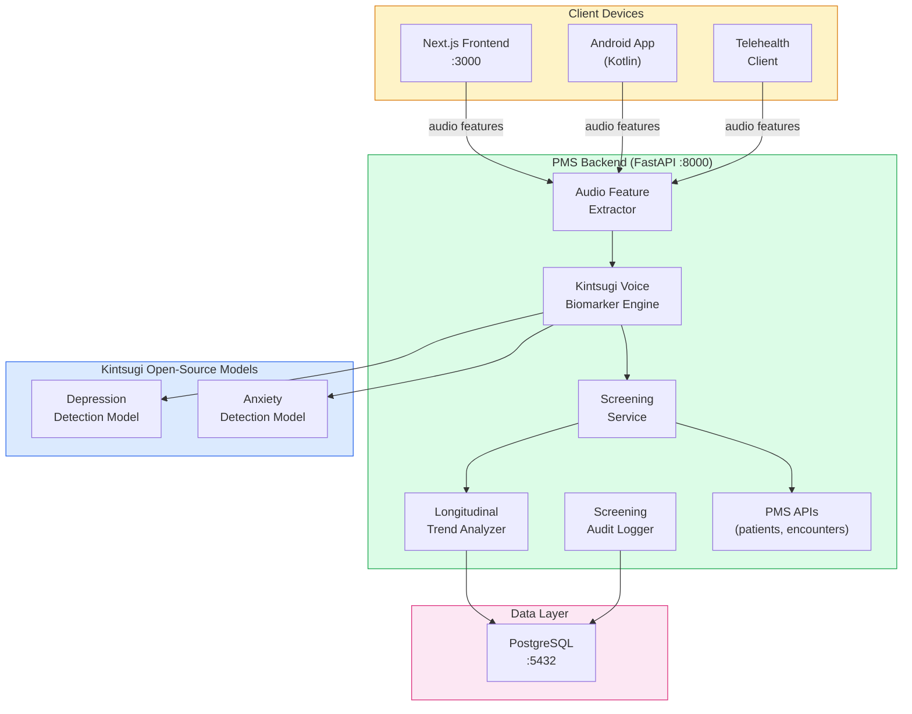

# Product Requirements Document: Kintsugi Open-Source Voice Biomarker Integration into Patient Management System (PMS)

**Document ID:** PRD-PMS-KINTSUGI-001
**Version:** 1.0
**Date:** March 3, 2026
**Author:** Ammar (CEO, MPS Inc.)
**Status:** Draft

---

## 1. Executive Summary

Kintsugi is an open-source voice biomarker AI platform that detects signs of clinical depression and anxiety from 20 seconds of free-form speech. Originally developed by Kintsugi Health (which raised $30M+ in venture funding), the company open-sourced its entire technology stack — AI models, scientific methodologies, and formative research — in February 2026 after FDA regulatory costs made the venture-backed model unsustainable. The models analyze acoustic features (pitch, intonation, tone, pauses) rather than speech content, meaning they can screen for mental health conditions without processing or storing what the patient actually says — a significant privacy advantage.

Integrating Kintsugi into the PMS provides three critical capabilities: (1) **passive mental health screening** during routine clinical encounters, where the system analyzes ambient voice during patient intake or telehealth visits to flag potential depression/anxiety without requiring dedicated screening questionnaires; (2) **longitudinal mood monitoring** where patients' voice biomarkers are tracked across encounters to detect emerging mental health concerns before they become acute; and (3) **privacy-preserving screening** that analyzes acoustic properties rather than speech content, allowing mental health assessment without recording or transcribing patient conversations.

The clinical validation study published in the Annals of Family Medicine demonstrated 71.3% sensitivity and 73.5% specificity for moderate-to-severe depression (PHQ-9 >= 10), comparable to existing screening tools but requiring no patient questionnaire burden. As an open-source project, Kintsugi can be self-hosted with zero data egress — all voice analysis runs on-premise with no cloud dependency.

---

## 2. Problem Statement

- **Mental health screening is underperformed:** The US Preventive Services Task Force recommends universal depression screening in primary care, but PHQ-9 questionnaires are time-consuming, subject to patient self-report bias, and often skipped during busy clinical encounters.
- **No passive screening capability:** Current PMS mental health assessment requires patients to actively complete questionnaires — there is no way to passively screen during routine interactions like phone calls, telehealth visits, or in-person intake conversations.
- **No longitudinal voice biomarker tracking:** Patient mood patterns change over time, but current PMS encounters capture point-in-time assessments. Voice biomarkers could provide continuous monitoring between clinical visits.
- **Privacy concerns limit voice AI adoption:** Healthcare organizations hesitate to deploy voice analysis because traditional speech processing records and transcribes patient content — raising significant HIPAA concerns about PHI in audio recordings.
- **Commercial voice biomarker platforms are expensive:** Enterprise voice biomarker APIs charge per-analysis fees that scale poorly for high-volume screening. Kintsugi's open-source release eliminates this cost barrier.

---

## 3. Proposed Solution

Adopt **Kintsugi's open-source voice biomarker models** as a self-hosted mental health screening layer in the PMS, providing passive depression and anxiety detection during clinical encounters without recording speech content.

### 3.1 Architecture Overview

### 3.2 Deployment Model

- **Fully self-hosted:** Kintsugi models run on-premise — no audio data leaves the network perimeter
- **Privacy by design:** Models analyze acoustic features (pitch, tone, rhythm) — speech content is never processed, recorded, or stored
- **Open-source license:** Models and code are publicly available with no licensing fees
- **Docker deployment:** Biomarker engine packaged as a Docker service alongside the PMS backend
- **No GPU required:** Voice feature extraction and biomarker inference run efficiently on CPU
- **Clinical decision support only:** Results are advisory — never used for automated clinical decisions without clinician review

---

## 4. PMS Data Sources

| PMS Resource | Kintsugi Integration | Use Case |
|-------------|---------------------|----------|
| Patient Records API (`/api/patients`) | Store screening results linked to patient | Longitudinal biomarker tracking |
| Encounter Records API (`/api/encounters`) | Attach screening results to encounters | Point-in-time mental health assessment |
| Reporting API (`/api/reports`) | Aggregate screening statistics | Population health mental health dashboard |
| Telehealth API | Real-time audio feature extraction | Passive screening during telehealth visits |

---

## 5. Component/Module Definitions

### 5.1 Audio Feature Extractor

**Description:** Extracts acoustic features (pitch, intonation, tone, rhythm, pauses) from audio input without processing speech content. Only acoustic feature vectors are transmitted to the backend — raw audio is discarded immediately after feature extraction on the client.

**Input:** 20+ seconds of audio (any speech content, any language).
**Output:** Acoustic feature vector (numerical array, no speech content).
**Privacy guarantee:** Speech content is never recorded, transmitted, or stored.

### 5.2 Kintsugi Voice Biomarker Engine

**Description:** Self-hosted inference engine running Kintsugi's open-source depression and anxiety detection models on acoustic feature vectors.

**Input:** Acoustic feature vector from Audio Feature Extractor.
**Output:** Screening results: depression risk score (0-1), anxiety risk score (0-1), confidence level.
**Models:** Pre-trained Kintsugi models loaded from open-source repository.

### 5.3 Screening Service

**Description:** Clinical decision support service that interprets biomarker scores in the context of patient history, generates screening recommendations, and routes results to appropriate clinicians.

**Input:** Biomarker scores, patient ID, encounter context.
**Output:** Screening recommendation (normal/elevated/high-risk), suggested follow-up actions.
**PMS APIs:** `/api/patients`, `/api/encounters`.

### 5.4 Longitudinal Trend Analyzer

**Description:** Tracks voice biomarker scores across multiple encounters for each patient, detecting trends (worsening, improving, stable) and alerting clinicians to significant changes.

**Input:** Historical biomarker scores for a patient.
**Output:** Trend analysis (direction, rate of change, alert threshold).
**PMS APIs:** `/api/patients` (read history), `/api/reports` (aggregate statistics).

### 5.5 Screening Audit Logger

**Description:** HIPAA-compliant audit logging for all voice biomarker screenings, recording when screenings occurred, which encounters they were associated with, and screening outcomes — without storing acoustic data or speech content.

**Input:** Screening events (patient ID hash, encounter ID, timestamp, result category).
**Output:** Audit records in PostgreSQL.

---

## 6. Non-Functional Requirements

### 6.1 Security and HIPAA Compliance

- **No speech content processed:** Models analyze acoustic features only — speech content is never recorded, transcribed, or stored
- **Client-side feature extraction:** Raw audio is processed on the client device and only acoustic feature vectors are transmitted
- **No audio storage:** Raw audio is discarded immediately after feature extraction — only numerical feature vectors and screening results are stored
- **Patient consent required:** Voice biomarker screening requires documented patient consent before activation
- **Results are advisory only:** Screening results are clinical decision support — never used for automated diagnoses or treatment decisions
- **Audit trail:** Every screening event logged with patient hash, encounter, timestamp, and result category
- **Encrypted storage:** Screening results encrypted at rest (AES-256) and in transit (TLS 1.3)
- **Access control:** Screening results visible only to authorized clinicians with appropriate role-based permissions

### 6.2 Performance

| Metric | Target |
|--------|--------|
| Audio feature extraction | < 2 seconds for 20s audio clip |
| Biomarker inference | < 500ms per analysis |
| Screening result delivery | < 3 seconds end-to-end |
| Model memory footprint | < 500MB RAM |
| Concurrent analyses | 20+ per PMS instance |

### 6.3 Infrastructure

- **CPU-only inference:** No GPU required — biomarker models are lightweight
- **Docker service:** Single container for biomarker engine
- **Storage:** Minimal — only feature vectors and screening results stored (not audio)
- **Memory:** 1-2 GB RAM for model loading and inference

---

## 7. Implementation Phases

### Phase 1: Foundation — Model Deployment & Feature Extraction (Sprint 1)

- Deploy Kintsugi open-source models as self-hosted Docker service
- Build audio feature extraction pipeline (client-side)
- Create biomarker inference API endpoint
- Implement screening audit logging
- Validate model accuracy against published benchmarks (71.3% sensitivity, 73.5% specificity)

### Phase 2: Clinical Integration (Sprints 2-3)

- Build Screening Service with clinical decision support logic
- Integrate screening results with PMS encounter records
- Create Next.js screening dashboard for clinicians
- Build Android audio feature extraction for mobile encounters
- Implement patient consent management workflow
- Clinical staff training on interpreting screening results

### Phase 3: Longitudinal Monitoring & Population Health (Sprints 4-5)

- Build Longitudinal Trend Analyzer for multi-encounter tracking
- Create patient mood timeline visualization
- Build population health mental health dashboard
- Implement alerting for significant biomarker changes
- Integrate with telehealth platform for real-time passive screening
- Clinical validation study comparing Kintsugi screening vs PHQ-9 outcomes

---

## 8. Success Metrics

| Metric | Target | Measurement Method |
|--------|--------|-------------------|
| Screening completion rate | > 80% of eligible encounters | Encounter-screening correlation |
| Model sensitivity | >= 70% (matching published results) | Clinical validation benchmark |
| Model specificity | >= 72% (matching published results) | Clinical validation benchmark |
| Clinician satisfaction | > 4.0/5.0 with screening workflow | Team survey |
| Patient consent rate | > 85% acceptance | Consent management tracking |
| False positive follow-up rate | < 30% of flagged patients | Clinician outcome tracking |

---

## 9. Risks and Mitigations

| Risk | Impact | Mitigation |
|------|--------|------------|
| Model accuracy insufficient for clinical use | False positives/negatives affect patient care | Position as screening aid only — always pair with clinical judgment; validate locally before deployment |
| Patient discomfort with voice analysis | Low consent rates, trust erosion | Clear disclosure that speech content is not analyzed; opt-in only; visible indicators when screening is active |
| Open-source model maintenance uncertainty | Models become stale without commercial backing | Fork the repository; assign internal team to monitor and update; engage with open-source community |
| Regulatory ambiguity for voice biomarkers | Unclear if screening requires FDA clearance as SaMD | Consult regulatory counsel; position as CDS not diagnostic device; monitor FDA guidance on voice biomarkers |
| Bias in training data | Unequal accuracy across demographics | Validate model performance across age, gender, and ethnic groups; document limitations clearly |
| Scope creep beyond mental health screening | Pressure to use for diagnosis or treatment | Enforce advisory-only positioning; HITL required for all clinical decisions based on screening |

---

## 10. Dependencies

| Dependency | Version | Purpose |
|-----------|---------|---------|
| Kintsugi Open-Source Models | Latest release | Depression and anxiety voice biomarker models |
| Python | >= 3.11 | Model inference runtime |
| PyTorch or TensorFlow | Depends on model format | Deep learning inference framework |
| librosa | >= 0.10 | Audio feature extraction |
| FastAPI | >= 0.115 | Screening API endpoints |
| PostgreSQL | >= 15 | Screening results and audit log storage |

---

## 11. Comparison with Existing Experiments

| Aspect | Kintsugi (Exp 35) | ElevenLabs (Exp 30) | Speechmatics (Exp 10/33) | MedASR (Exp 7) |
|--------|-------------------|---------------------|--------------------------|----------------|
| **Primary function** | Mental health screening | TTS + STT + voice agents | Speech recognition | Medical transcription |
| **What it analyzes** | Acoustic features (pitch, tone) | Speech content | Speech content | Speech content |
| **Privacy model** | Content-free — no speech recorded | Audio processed in cloud | Audio processed in cloud/on-prem | Audio processed locally |
| **Clinical output** | Depression/anxiety risk scores | Text/audio | Transcription text | Transcription text |
| **Self-hosted** | Yes (open-source) | No (cloud only) | Yes (optional) | Yes |
| **Cost** | Free (open-source) | Per-minute API pricing | Per-minute API pricing | Self-hosted (compute cost) |
| **Clinical validation** | Published (Annals of Family Medicine) | None for clinical use | Medical model benchmarked | Medical vocabulary optimized |
| **Best for** | Passive mental health screening | Patient voice interactions | Clinical dictation | Real-time transcription |

**Complementary roles:**
- **Kintsugi (Exp 35)** provides privacy-preserving mental health screening from voice acoustics — a unique capability not covered by any other experiment
- **Speechmatics (Exp 10/33)** provides medical speech-to-text and voice agents — Kintsugi can analyze the same audio that Speechmatics transcribes, adding mental health screening as a parallel analysis layer
- **ElevenLabs (Exp 30)** provides TTS for patient communication — Kintsugi could screen patient voice during ElevenLabs Conversational AI interactions

---

## 12. Research Sources

### Official Announcements
- [Kintsugi's Next Chapter: Open-Source Announcement](https://www.kintsugihealth.com/blog/open-source) — CEO announcement of open-source release and company closure
- [Kintsugi Releases Voice Biomarker AI to the Public (Healthcare IT News)](https://www.healthcareitnews.com/news/kintsugi-releases-voice-biomarker-ai-public) — Industry coverage of the open-source release

### Clinical Validation
- [Evaluation of AI-Based Voice Biomarker Tool (PubMed)](https://pubmed.ncbi.nlm.nih.gov/39805690/) — Peer-reviewed study in Annals of Family Medicine: 71.3% sensitivity, 73.5% specificity
- [FDA Voice Biomarker AI Presentation](https://www.fda.gov/media/189837/download) — Kintsugi's FDA De Novo submission materials

### Technology & Architecture
- [Kintsugi Voice Biomarker Technology](https://www.kintsugihealth.com/solutions/kintsugivoice) — Platform overview: 20-second analysis, acoustic feature extraction, API integration
- [Kintsugi Voice API Documentation](https://www.kintsugihealth.com/api/intro-to-kintsugi-voice-stack) — API integration guide and SDK documentation

### GitHub & Open-Source
- [Kintsugi GitHub Organization](https://github.com/KintsugiMindfulWellness) — Python and Java SDKs, open-source model releases
- [Kintsugi on Hugging Face](https://huggingface.co/KintsugiHealth) — Model hosting and community

---

## 13. Appendix: Related Documents

- [Kintsugi Open-Source Setup Guide](35-KintsugiOpenSource-PMS-Developer-Setup-Guide.md)
- [Kintsugi Open-Source Developer Tutorial](35-KintsugiOpenSource-Developer-Tutorial.md)
- [ElevenLabs PRD (Experiment 30)](30-PRD-ElevenLabs-PMS-Integration.md)
- [Speechmatics Medical PRD (Experiment 10)](10-PRD-SpeechmaticsMedical-PMS-Integration.md)
- [Speechmatics Flow API PRD (Experiment 33)](33-PRD-SpeechmaticsFlow-PMS-Integration.md)
