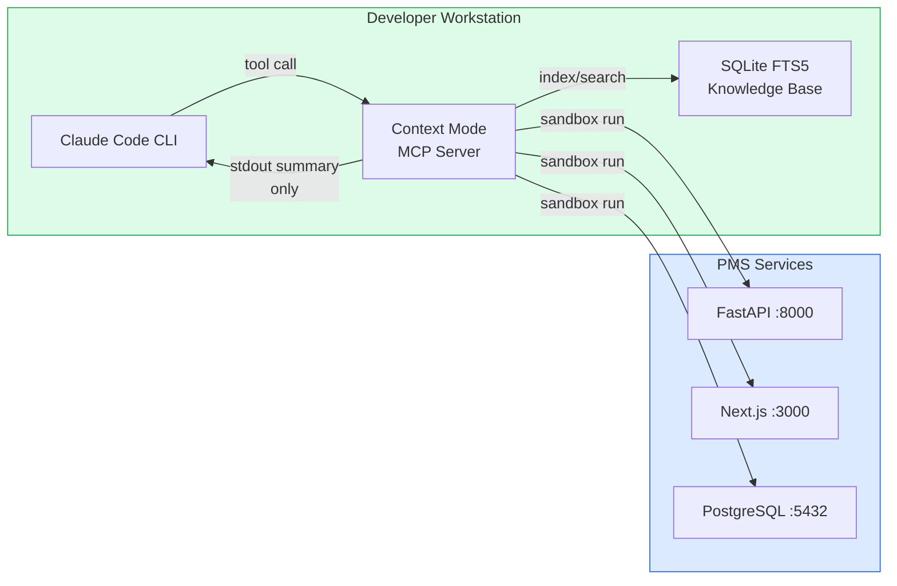

# Claude Context Mode Setup Guide for PMS Integration

**Document ID:** PMS-EXP-CONTEXTMODE-001
**Version:** 1.0
**Date:** March 3, 2026
**Applies To:** PMS project (all platforms)
**Prerequisites Level:** Beginner

---

## Table of Contents

1. [Overview](#1-overview)
2. [Prerequisites](#2-prerequisites)
3. [Part A: Install and Configure Context Mode](#3-part-a-install-and-configure-context-mode)
4. [Part B: Configure PMS-Specific Workflows](#4-part-b-configure-pms-specific-workflows)
5. [Part C: Integrate with PMS Development Workflow](#5-part-c-integrate-with-pms-development-workflow)
6. [Part D: Testing and Verification](#6-part-d-testing-and-verification)
7. [Troubleshooting](#7-troubleshooting)
8. [Reference Commands](#8-reference-commands)

---

## 1. Overview

This guide walks you through installing Claude Context Mode as a Claude Code plugin for PMS development. By the end, you will have:

- Context Mode installed as a Claude Code plugin with automatic PreToolUse hook routing
- PMS documentation indexed in the SQLite FTS5 knowledge base for instant retrieval
- Team conventions for PHI-safe sandbox execution vs persistent indexing
- Session monitoring via `/context-mode:stats` showing context savings per tool

### Architecture at a Glance



---

## 2. Prerequisites

### 2.1 Required Software

| Software | Minimum Version | Check Command |
|----------|----------------|---------------|
| Claude Code | Latest | `claude --version` |
| Node.js | 18.0+ | `node --version` |
| npm | 9.0+ | `npm --version` |
| Git | 2.30+ | `git --version` |
| Bun (optional) | Latest | `bun --version` |

### 2.2 Installation of Prerequisites

**Node.js 18+ (if not installed):**

```bash
# macOS with Homebrew
brew install node@18

# Verify
node --version  # Should show v18.x or higher
```

**Bun (optional, 3-5x faster JS/TS sandbox execution):**

```bash
# macOS / Linux
curl -fsSL https://bun.sh/install | bash

# Verify
bun --version
```

### 2.3 Verify PMS Services

Confirm the PMS stack is running before configuring Context Mode:

```bash
# Check PMS backend
curl -s http://localhost:8000/health | head -1
# Expected: {"status":"healthy"}

# Check PMS frontend
curl -s -o /dev/null -w "%{http_code}" http://localhost:3000
# Expected: 200

# Check PostgreSQL
pg_isready -h localhost -p 5432
# Expected: localhost:5432 - accepting connections
```

**Checkpoint:** All three PMS services are running and responding. You have Node.js 18+ and Claude Code installed.

---

## 3. Part A: Install and Configure Context Mode

### 3.1 Install via Plugin Marketplace (Recommended)

The plugin marketplace installation includes the PreToolUse hook, CLI commands, and subagent routing — the full experience:

```bash
# Step 1: Add the plugin from marketplace
claude /plugin marketplace add mksglu/claude-context-mode

# Step 2: Install the plugin
claude /plugin install context-mode@claude-context-mode

# Step 3: Restart Claude Code to activate
# Exit your current Claude Code session and start a new one
```

### 3.2 Install via MCP Add (MCP-Only, No Hooks)

If you only need the MCP tools without the PreToolUse hook and CLI commands:

```bash
claude mcp add context-mode -- npx -y context-mode
```

### 3.3 Verify Installation

Start a new Claude Code session and check:

```bash
# Inside Claude Code, run the diagnostics command
/context-mode:doctor
```

Expected output includes checks for:
- Plugin registration status
- PreToolUse hook activation
- Available language runtimes (Python, TypeScript, JavaScript, Shell, etc.)
- SQLite FTS5 availability
- npm/marketplace version match

### 3.4 Configure Bun for Faster Execution (Optional)

If Bun is installed, Context Mode auto-detects it for 3-5x faster JavaScript/TypeScript sandbox execution. Verify:

```bash
# Inside Claude Code
/context-mode:doctor
# Look for: "Bun detected: yes" in the runtime section
```

**Checkpoint:** Context Mode is installed as a Claude Code plugin. The `/context-mode:doctor` command reports all systems healthy. The PreToolUse hook is active (if using marketplace install).

---

## 4. Part B: Configure PMS-Specific Workflows

### 4.1 Update CLAUDE.md with Context Mode Conventions

Add the following section to your project's `CLAUDE.md` to establish team-wide conventions:

```markdown
## Context Mode Conventions

### PHI-Safe Processing Rules
- **ALWAYS use `execute` (sandbox-and-discard)** for any operation that touches patient data:
  - API calls to /api/patients, /api/encounters, /api/prescriptions
  - Database queries against patient/encounter/medication tables
  - Log analysis that may contain patient identifiers
- **Use `index` and `fetch_and_index`** ONLY for non-PHI content:
  - PMS documentation and API specs
  - Architecture decision records
  - Code examples and templates
  - Public dependency documentation

### Batch Processing Patterns
- Use `batch_execute` for multi-service health checks
- Use `batch_execute` for parallel test suite runs
- Use `search(queries: ["q1", "q2", "q3"])` instead of individual search calls

### Context Budget Monitoring
- Run `/context-mode:stats` periodically during long sessions
- Target: maintain >= 80% context savings ratio
- If savings drop below 80%, check for unbatched tool calls
```

### 4.2 Index PMS Documentation

Index the PMS documentation for instant searchable retrieval during development sessions:

```python
# Inside Claude Code, use the index tool to load PMS docs
# This indexes docs into SQLite FTS5 for BM25-ranked search

# Index architecture decisions
execute("cat docs/architecture/*.md", language="shell")

# Index API specifications
fetch_and_index("http://localhost:8000/docs")  # FastAPI OpenAPI spec

# Index system requirements
execute("cat docs/specs/requirements/SYS-REQ.md", language="shell")
```

Or index the full documentation directory:

```python
# Batch index all PMS documentation
batch_execute([
    {"code": "find docs/ -name '*.md' -print0 | xargs -0 cat", "language": "shell"},
])
```

### 4.3 Configure Credential Passthrough

Context Mode automatically inherits environment variables for CLI tools. Verify your credentials are accessible in sandbox:

```python
# Test GitHub CLI passthrough
execute("gh auth status", language="shell")

# Test Docker passthrough
execute("docker ps --format 'table {{.Names}}\t{{.Status}}'", language="shell")

# Test database connectivity
execute("pg_isready -h localhost -p 5432", language="shell")
```

**Checkpoint:** CLAUDE.md updated with Context Mode conventions. PMS documentation indexed in FTS5. CLI credentials pass through to sandboxes correctly.

---

## 5. Part C: Integrate with PMS Development Workflow

### 5.1 Backend Development (FastAPI)

When working on the PMS backend, use Context Mode to process large API responses:

```python
# Instead of raw curl that dumps 50KB+ into context:
# curl http://localhost:8000/api/patients

# Use execute to sandbox the response:
execute("""
import requests
resp = requests.get('http://localhost:8000/api/patients')
patients = resp.json()
print(f"Total patients: {len(patients)}")
print(f"Fields: {list(patients[0].keys()) if patients else 'none'}")
for p in patients[:3]:
    print(f"  - {p.get('id')}: {p.get('first_name', 'N/A')} {p.get('last_name', 'N/A')}")
print(f"... and {max(0, len(patients)-3)} more")
""", language="python")
# Result: ~200 bytes instead of 50KB+ raw JSON
```

### 5.2 Frontend Development (Next.js)

Use Context Mode for analyzing the clinical dashboard without large Playwright snapshots:

```python
# Instead of raw Playwright snapshot (56KB), use sandbox to extract structure:
execute("""
const { chromium } = require('playwright');
const browser = await chromium.launch();
const page = await browser.newPage();
await page.goto('http://localhost:3000/dashboard');

// Count UI elements by role
const buttons = await page.getByRole('button').count();
const inputs = await page.getByRole('textbox').count();
const links = await page.getByRole('link').count();
const headings = await page.getByRole('heading').allTextContents();

console.log(JSON.stringify({ buttons, inputs, links, headings }, null, 2));
await browser.close();
""", language="javascript")
# Result: ~300 bytes instead of 56KB snapshot
```

### 5.3 Database Analysis

Use sandbox for database queries to keep PHI out of context:

```python
# Analyze patient data patterns without loading raw PHI into context
execute("""
import psycopg2
conn = psycopg2.connect(host='localhost', port=5432, dbname='pms', user='pms_user', password='pms_pass')
cur = conn.cursor()
cur.execute('''
    SELECT
        COUNT(*) as total_patients,
        COUNT(DISTINCT encounter_id) as total_encounters,
        AVG(age) as avg_age,
        COUNT(CASE WHEN status = 'active' THEN 1 END) as active_patients
    FROM patients
''')
row = cur.fetchone()
print(f"Total patients: {row[0]}")
print(f"Total encounters: {row[1]}")
print(f"Average age: {row[2]:.1f}")
print(f"Active patients: {row[3]}")
conn.close()
""", language="python")
# Result: ~100 bytes of aggregated stats instead of full patient records
```

### 5.4 Test Suite Runs

Sandbox test output to capture pass/fail summary only:

```python
# Run backend tests in sandbox
execute("cd /path/to/pms-backend && python -m pytest tests/ --tb=short -q 2>&1 | tail -20", language="shell")

# Run frontend tests in sandbox
execute("cd /path/to/pms-frontend && npm test -- --watchAll=false 2>&1 | tail -30", language="shell")
```

### 5.5 Git History Analysis

Analyze repository history without loading full commit logs into context:

```python
# Analyze recent PMS commit patterns
execute("""
git log --oneline --since='2 weeks ago' --format='%h|%an|%s' | head -50 | \
  awk -F'|' '{
    authors[$2]++
    if ($3 ~ /^fix/) fixes++
    else if ($3 ~ /^feat/) feats++
    else if ($3 ~ /^docs/) docs++
    else other++
  }
  END {
    print "=== PMS Commit Summary (2 weeks) ==="
    print "Total commits:", NR
    print "Features:", feats+0, "| Fixes:", fixes+0, "| Docs:", docs+0, "| Other:", other+0
    print ""
    print "Top contributors:"
    for (a in authors) print "  " a ":", authors[a]
  }'
""", language="shell")
```

**Checkpoint:** Context Mode is integrated into backend, frontend, database, testing, and git workflows. Each pattern demonstrates sandbox processing with PHI-safe summarization.

---

## 6. Part D: Testing and Verification

### 6.1 Verify Context Savings

Run a quick benchmark to confirm Context Mode is reducing context consumption:

```bash
# Inside Claude Code, ask it to:
# 1. Read a large file using execute (sandboxed)
# 2. Check stats

# Step 1: Process a large data operation
# "Use context-mode execute to count lines and summarize the structure of docs/index.md"

# Step 2: Check savings
/context-mode:stats
```

Expected stats output:
```
Session Statistics
─────────────────
Duration: X minutes
Total data processed: X KB
Data kept in sandbox: X KB
Context entered: X bytes
Tokens consumed: ~X
Context savings: X% reduction

Per-Tool Breakdown:
  execute: X calls, X KB processed, X bytes in context
  search: X calls, X results returned
  batch_execute: X calls, X tasks completed
```

### 6.2 Test FTS5 Search

Verify documentation search returns relevant results:

```python
# Search for patient-related API documentation
search(queries=["patient records API endpoint", "encounter CRUD operations", "HIPAA audit logging"])
```

Expected: Ranked snippets from indexed PMS documentation with BM25 relevance scores.

### 6.3 Test Batch Processing

Verify parallel processing works across PMS services:

```python
# Batch health check all PMS services
batch_execute([
    {"code": "curl -s http://localhost:8000/health", "language": "shell"},
    {"code": "curl -s -o /dev/null -w '%{http_code}' http://localhost:3000", "language": "shell"},
    {"code": "pg_isready -h localhost -p 5432", "language": "shell"},
])
```

### 6.4 Test Subagent Routing

Verify the PreToolUse hook routes subagent tool calls through Context Mode:

```
# Inside Claude Code, launch a subagent task:
# "Use a subagent to research the FastAPI backend structure and list all API endpoints"

# The subagent should automatically use context-mode execute/search
# instead of raw Bash/Read tools (check via /context-mode:stats)
```

**Checkpoint:** Context savings ratio >= 90% confirmed. FTS5 search returns relevant PMS documentation. Batch processing works. Subagent routing is active.

---

## 7. Troubleshooting

### 7.1 Plugin Not Detected After Installation

**Symptom:** `/context-mode:doctor` returns "command not found" or Context Mode tools are unavailable.

**Solution:**
1. Verify installation: check `~/.claude/plugins/` for the context-mode directory
2. Restart Claude Code completely (exit and re-launch)
3. If using MCP-only install, verify with `claude mcp list` — look for `context-mode` entry
4. Re-install: `claude /plugin marketplace add mksglu/claude-context-mode`

### 7.2 PreToolUse Hook Not Routing Subagents

**Symptom:** Subagents use raw Bash/Read tools instead of Context Mode execute/search.

**Solution:**
1. Verify hook: check `~/.claude/plugins/context-mode/hooks/` exists
2. Ensure you used marketplace install (not MCP-only): hooks require full plugin installation
3. Run `/context-mode:doctor` and check the "Hooks" section
4. If hooks are missing, uninstall and re-install via marketplace

### 7.3 FTS5 Search Returns No Results

**Symptom:** `search(queries: [...])` returns empty results after indexing.

**Solution:**
1. Verify content was indexed: check SQLite database exists in the Context Mode data directory
2. Re-index content: use `index` or `fetch_and_index` to re-add documentation
3. Check query syntax: FTS5 uses different syntax than regex — use natural language queries
4. Try fuzzy search: Context Mode has three-layer fallback (Porter stemming, trigram, Levenshtein)

### 7.4 Sandbox Fails for Python

**Symptom:** `execute("...", language="python")` returns runtime errors.

**Solution:**
1. Verify Python is installed and on PATH: `python3 --version`
2. Check if required packages are installed in the system Python (requests, psycopg2, etc.)
3. For PMS-specific packages, activate the virtual environment before starting Claude Code:
   ```bash
   source /path/to/pms-backend/.venv/bin/activate && claude
   ```

### 7.5 Progressive Throttle Blocks Searches

**Symptom:** Search calls return "throttled" after 8+ sequential searches.

**Solution:**
1. This is by design — switch to batch search: `search(queries: ["q1", "q2", "q3"])`
2. Use `batch_execute` for multi-step research workflows
3. Reset throttle counter by using `execute` or `batch_execute` between search blocks

### 7.6 Context Savings Below Expected

**Symptom:** `/context-mode:stats` shows < 80% savings ratio.

**Solution:**
1. Check if tools are being called correctly — some outputs may bypass sandbox
2. Ensure large operations use `execute` instead of raw Bash tool
3. Use `batch_execute` to consolidate multiple small operations
4. Check if PreToolUse hook is routing correctly (`/context-mode:doctor`)

---

## 8. Reference Commands

### CLI Commands

| Command | Purpose |
|---------|---------|
| `/context-mode:stats` | Display session context savings, per-tool breakdown |
| `/context-mode:doctor` | Run diagnostics on runtimes, hooks, FTS5, plugin |
| `/context-mode:upgrade` | Pull latest version, rebuild, migrate cache |

### Context Mode MCP Tools

| Tool | Purpose | Example |
|------|---------|---------|
| `execute` | Run code in sandbox, return stdout only | `execute("curl localhost:8000/health", language="shell")` |
| `execute_file` | Process a file in sandbox | `execute_file("access.log")` |
| `batch_execute` | Run multiple commands in parallel | `batch_execute([{code: "...", language: "shell"}, ...])` |
| `index` | Index content in SQLite FTS5 | `index("# API Docs\n...")` |
| `search` | Query indexed content with BM25 ranking | `search(queries: ["patient API", "encounter CRUD"])` |
| `fetch_and_index` | Fetch URL, convert to markdown, index | `fetch_and_index("http://localhost:8000/docs")` |

### PMS Development Workflow

```bash
# Daily startup
claude                                    # Start Claude Code
/context-mode:doctor                     # Verify plugin health
/context-mode:stats                      # Check clean session state

# During development
# Use execute for any large data operation
# Use search for documentation lookup
# Use batch_execute for parallel operations

# End of session
/context-mode:stats                      # Review session efficiency
```

### Useful URLs

| Resource | URL |
|----------|-----|
| Context Mode GitHub | https://github.com/mksglu/claude-context-mode |
| Context Mode Releases | https://github.com/mksglu/claude-context-mode/releases |
| Claude Code Plugin Docs | https://github.com/anthropics/claude-code/blob/main/plugins/README.md |
| MCP Specification | https://modelcontextprotocol.io |

---

## Next Steps

After completing this setup:

1. **[Claude Context Mode Developer Tutorial](36-ClaudeContextMode-Developer-Tutorial.md)** — Build your first PMS-specific context-optimized workflow end-to-end
2. **[MCP PMS Integration (Exp 09)](09-PRD-MCP-PMS-Integration.md)** — Combine Context Mode with PMS MCP tools for maximum efficiency
3. **[Claude Code Mastery Tutorial (Exp 27)](27-ClaudeCode-Developer-Tutorial.md)** — Deep-dive into Claude Code features that complement Context Mode

---

## Resources

- [Context Mode GitHub Repository](https://github.com/mksglu/claude-context-mode)
- [Context Mode Benchmark Results](https://github.com/mksglu/claude-context-mode/blob/main/BENCHMARK.md)
- [Claude Code Plugin Framework](https://github.com/anthropics/claude-code/blob/main/plugins/README.md)
- [Claude Code Best Practices](https://code.claude.com/docs/en/best-practices)
- [Awesome Claude Code Plugins](https://github.com/ccplugins/awesome-claude-code-plugins)
