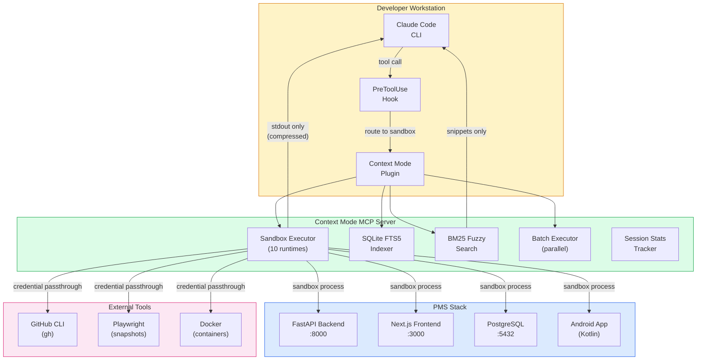

# Product Requirements Document: Claude Context Mode Integration into Patient Management System (PMS)

**Document ID:** PRD-PMS-CONTEXTMODE-001
**Version:** 1.0
**Date:** March 3, 2026
**Author:** Ammar (CEO, MPS Inc.)
**Status:** Draft

---

## 1. Executive Summary

Claude Context Mode is an open-source MCP (Model Context Protocol) server that reduces Claude Code's context window consumption from tool outputs by up to 98%. It intercepts large data streams — Playwright snapshots, API responses, log files, database query results — and processes them in isolated sandbox subprocesses, allowing only compact summaries to enter the conversation context. In benchmarks, 315 KB of raw tool output compresses to 5.4 KB, extending productive Claude Code session time from approximately 30 minutes to 3 hours without context degradation.

For the PMS development team, Context Mode addresses a critical productivity bottleneck: Claude Code sessions working with the healthcare codebase routinely consume the 200K context window within 30-45 minutes due to large patient record API responses, database query results, test suite outputs, and Playwright snapshot data from the Next.js frontend. Once context is exhausted, the AI assistant begins losing earlier discussion points and code context, forcing developers to start new sessions and re-explain project context. Context Mode eliminates this by sandboxing all large outputs — only structured summaries and search-indexed content enter the conversation.

The tool is installed as a Claude Code plugin with a PreToolUse hook that automatically routes subagent prompts through the sandbox. It supports 10+ language runtimes (Python, TypeScript, Go, Rust, Shell, etc.), includes SQLite FTS5 full-text search with BM25 ranking for indexed content retrieval, and passes through CLI credentials (gh, aws, docker) without exposing them in the conversation context. At 2.2K GitHub stars and 25 releases since its February 23, 2026 launch, it is the fastest-growing Claude Code plugin in the ecosystem.

---

## 2. Problem Statement

- **Context window exhaustion during PMS development:** Claude Code sessions working on the PMS backend (FastAPI), frontend (Next.js), and Android app routinely exhaust the 200K context window within 30-45 minutes. Large API responses from `/api/patients` (patient records with nested encounters, medications, allergies), Playwright snapshots of the clinical dashboard (56 KB each), test suite outputs (6-85 KB), and git log analysis (11+ KB) rapidly consume available context.
- **Session restarts lose accumulated knowledge:** When context is exhausted, developers must start new Claude Code sessions, re-explain the PMS architecture, re-read key files, and re-establish the working context. This wastes 10-15 minutes per restart and risks losing nuanced understanding of in-progress work.
- **Subagent inefficiency with large outputs:** PMS development heavily uses Claude Code subagents for parallel research, code exploration, and test execution. Each subagent's tool outputs flow back into the main context window. A typical research subagent analyzing 20 GitHub issues consumes 59 KB of context — Context Mode reduces this to 1.1 KB.
- **PHI exposure risk in context window:** When Claude Code reads patient record API responses or database queries containing PHI during development, that data persists in the conversation context for the duration of the session. Context Mode's sandbox processing means raw PHI data is processed and discarded — only structured summaries (counts, categories, anonymized statistics) enter the conversation.
- **No standardized approach to context management:** Individual developers use ad hoc strategies (limiting grep output, truncating file reads, avoiding large files) that are inconsistent and often insufficient. Context Mode provides a systematic, team-wide solution.

---

## 3. Proposed Solution

Adopt **Context Mode** as a standard Claude Code plugin across the PMS development team, providing automated context compression for all tool outputs during AI-assisted development sessions.

### 3.1 Architecture Overview

### 3.2 Deployment Model

- **Local developer tool:** Context Mode runs entirely on each developer's workstation — no server deployment required
- **Plugin installation:** One-command install via Claude Code plugin marketplace or MCP add command
- **No network dependency:** SQLite FTS5 database is local; no cloud service or external API required
- **Credential passthrough:** CLI tools (gh, aws, docker, kubectl) inherit environment variables securely without credentials entering the conversation context
- **Zero PHI egress:** All data processing happens in local sandboxes — raw tool outputs (including any PHI encountered during development) are discarded after summary extraction
- **MIT license:** Open-source with no licensing fees or usage restrictions

---

## 4. PMS Data Sources

| PMS Resource | Context Mode Interaction | Context Savings |
|-------------|------------------------|-----------------|
| Patient Records API (`/api/patients`) | Sandbox processes patient list responses; only counts and field summaries enter context | 50-100 KB responses → 200-500 B summaries |
| Encounter Records API (`/api/encounters`) | Index encounter data for searchable retrieval; batch process encounter analysis | 30-80 KB → 1-2 KB indexed |
| Medication API (`/api/prescriptions`) | Sandbox processes drug interaction queries; structured results only | 20-40 KB → 300-600 B |
| Reporting API (`/api/reports`) | Batch execute report generation; aggregate statistics returned | 85 KB CSV → 222 B summary |
| PostgreSQL queries | Execute SQL in sandbox; return row counts and column summaries | Variable → 95-99% reduction |
| Playwright snapshots | Process clinical dashboard snapshots in sandbox; accessibility summary returned | 56 KB → 299 B |
| Test suite output | Sandbox test execution; pass/fail counts and failure details only | 6-30 KB → 337 B |
| Git log / blame | Analyze commit history in sandbox; contributor and change summaries | 11.6 KB → 107 B |

---

## 5. Component/Module Definitions

### 5.1 Context Mode Plugin Package

**Description:** Claude Code plugin bundle containing the MCP server, PreToolUse hook, CLI commands, and skill definitions. Installed via the plugin marketplace and activated automatically on Claude Code startup.

**Input:** Claude Code plugin installation command.
**Output:** Registered MCP server with 6 tools, PreToolUse hook for automatic routing, and 3 CLI commands.

### 5.2 Sandbox Executor

**Description:** Isolated subprocess environment that runs code in 10+ language runtimes (Python, TypeScript, JavaScript, Shell, Go, Rust, Ruby, PHP, Perl, R). Each execution spawns a process-boundary-isolated subprocess; only stdout enters the conversation context. Raw data (API responses, database results, log files) never leaves the sandbox.

**Input:** Code string, language runtime selection, optional environment variables.
**Output:** Stdout content only (typically 95-99% smaller than raw tool output).
**PMS use:** Execute FastAPI test suites, run database queries, process API responses, analyze log files.

### 5.3 SQLite FTS5 Knowledge Base

**Description:** Local full-text search index using SQLite FTS5 virtual tables with Porter stemming and BM25 ranking. Content is chunked by headings while preserving code blocks intact. Three-layer fuzzy search: (1) Porter stemming via FTS5 MATCH, (2) trigram substring matching, (3) Levenshtein distance correction.

**Input:** Markdown content, URLs, file contents for indexing; search queries for retrieval.
**Output:** Ranked snippets with context windows around query term matches.
**PMS use:** Index PMS documentation, API specs, clinical workflow descriptions for on-demand retrieval without consuming context.

### 5.4 Batch Executor

**Description:** Parallel execution engine that runs multiple commands, queries, or code blocks in a single tool call. Reduces tool call overhead and enables efficient multi-step workflows. In benchmarks, a 5-subagent research task compresses from 986 KB to 62 KB (94% savings).

**Input:** Array of execution tasks (code blocks, shell commands, queries).
**Output:** Aggregated results from all tasks, structured as a single compact response.
**PMS use:** Run parallel test suites across backend/frontend/Android, batch API health checks, concurrent database queries.

### 5.5 Progressive Search Throttle

**Description:** Automatic rate limiting that encourages efficient search patterns. Calls 1-3 return normal results (2 per query), calls 4-8 return reduced results (1 per query) with a warning, and calls 9+ are blocked with redirection to batch_execute. Prevents wasteful sequential searches that consume context.

**Input:** Search queries (individual or batched).
**Output:** Results with throttle status; batch suggestion when threshold exceeded.

### 5.6 Subagent Routing Hook

**Description:** PreToolUse hook that automatically injects Context Mode routing instructions into subagent (Task tool) prompts. Bash subagents are upgraded to `general-purpose` type to access MCP tools. Subagents learn to use `batch_execute` as their primary tool and `search(queries: [...])` for follow-ups without manual configuration.

**Input:** Subagent task prompts (automatically intercepted).
**Output:** Modified prompts with Context Mode tool routing instructions.
**PMS use:** All PMS research subagents (code exploration, dependency analysis, test runners) automatically use Context Mode.

---

## 6. Non-Functional Requirements

### 6.1 Security and HIPAA Compliance

- **Sandbox isolation:** All tool outputs processed in isolated subprocesses with process-boundary separation — raw data never persists in the conversation context
- **PHI minimization:** Patient record API responses, database queries, and clinical data processed in sandbox; only anonymized summaries (counts, categories, statistics) enter context
- **Credential passthrough:** CLI credentials (gh tokens, AWS keys, database passwords) pass through environment variables to sandboxes without appearing in conversation context or SQLite indices
- **Local-only processing:** No network calls, cloud dependencies, or external data egress — all processing happens on the developer's workstation
- **Index content control:** SQLite FTS5 indices store documentation and code context only — PHI-containing data should be processed via `execute` (sandbox-and-discard), not `index` (persist in SQLite)
- **Session cleanup:** SQLite indices can be cleared between sessions to prevent accumulation of sensitive context

### 6.2 Performance

| Metric | Target |
|--------|--------|
| Context reduction ratio | >= 95% for typical tool outputs |
| Sandbox execution overhead | < 500ms per execute call |
| FTS5 search latency | < 50ms per query |
| Batch execution (5 tasks) | < 3 seconds total |
| Session duration before context degradation | >= 2 hours (vs 30 min baseline) |
| Plugin startup time | < 2 seconds |

### 6.3 Infrastructure

- **Node.js 18+:** Required runtime for the MCP server
- **Optional Bun:** 3-5x faster JS/TS execution when available
- **SQLite:** Embedded database for FTS5 indices (no external database needed)
- **Storage:** < 50 MB for plugin code; SQLite indices grow with indexed content (typically < 100 MB per session)
- **Memory:** < 200 MB for MCP server and sandbox processes
- **No Docker required:** Runs directly on developer workstation

---

## 7. Implementation Phases

### Phase 1: Team-Wide Installation & Baseline Measurement (Sprint 1)

- Install Context Mode plugin on all PMS developer workstations
- Configure PreToolUse hook for automatic subagent routing
- Establish baseline metrics: average session duration, context usage patterns, session restart frequency
- Create PMS-specific CLAUDE.md guidance for Context Mode usage patterns
- Document which PMS workflows benefit most from sandboxing vs indexing

### Phase 2: PMS-Optimized Workflows & Knowledge Base (Sprints 2-3)

- Build PMS documentation index (API specs, architecture docs, clinical workflows) in Context Mode's FTS5
- Create PMS-specific batch execution templates for common workflows (test all backends, health check all services, analyze patient data patterns)
- Configure PHI-safe execution patterns: establish team conventions for when to use `execute` (sandbox-and-discard) vs `index` (persist) based on data sensitivity
- Integrate with CI/CD: use Context Mode in GitHub Actions for AI-assisted code review with context-efficient tool output processing
- Measure improvement: compare session duration, context usage, and developer productivity metrics against Phase 1 baseline

### Phase 3: Advanced Integration & Custom Tools (Sprints 4-5)

- Build custom Context Mode skills for PMS-specific workflows (e.g., `/context-mode:pms-health` that batch-checks all PMS services)
- Create PMS knowledge base auto-indexing: automatically index updated documentation, API schemas, and changelog entries on git pull
- Develop Context Mode integration with PMS-specific MCP servers (Experiment 09) for context-efficient tool chaining
- Evaluate Context Mode's subagent routing for multi-agent PMS development workflows (Experiment 14, 31, 32)
- Contribute PMS-relevant improvements back to the open-source project

---

## 8. Success Metrics

| Metric | Target | Measurement Method |
|--------|--------|--------------------|
| Average session duration | >= 2 hours (from 30 min baseline) | `/context-mode:stats` session tracking |
| Context savings ratio | >= 95% per session | `/context-mode:stats` per-tool breakdown |
| Session restart frequency | < 2 per day (from 6+ baseline) | Developer self-report survey |
| Developer satisfaction | >= 4.5/5.0 | Team survey after 2 weeks |
| Tool output compression | >= 90% for PMS API responses | Benchmark PMS-specific scenarios |
| Subagent context efficiency | >= 80% reduction in subagent context | Compare subagent sessions with/without Context Mode |
| PHI exposure in context | Zero raw PHI entries in conversation context | Audit session transcripts for PHI patterns |

---

## 9. Risks and Mitigations

| Risk | Impact | Mitigation |
|------|--------|------------|
| Over-compression loses critical details | Developers miss important error messages or data patterns hidden by summarization | Use `execute` with explicit stdout formatting for critical debugging; train team on when to bypass sandbox |
| SQLite FTS5 indexes accumulate PHI | PHI inadvertently indexed via `index` or `fetch_and_index` persists on disk | Establish team convention: PHI data uses `execute` only (sandbox-and-discard); never `index`. Add to CLAUDE.md |
| Plugin version incompatibility | Context Mode updates break Claude Code integration | Pin plugin version in team configuration; test upgrades in dev before team-wide rollout |
| Sandbox credential exposure | CLI credentials passed to sandbox processes could be captured by malicious code | Only execute trusted code in sandboxes; review any third-party scripts before sandbox execution |
| Learning curve disrupts productivity | Developers spend time learning Context Mode instead of coding | Phase 1 includes guided onboarding; pair experienced users with newcomers; provide PMS-specific examples |
| Dependency on community-maintained project | Single maintainer (mksglu) could abandon the project | MIT license allows forking; monitor GitHub activity; maintain internal fork capability |
| Search throttling blocks legitimate workflows | Progressive throttle (9+ searches blocked) interrupts complex debugging sessions | Train team to use batch search patterns: `search(queries: ["q1", "q2", "q3"])` instead of individual calls |

---

## 10. Dependencies

| Dependency | Version | Purpose |
|-----------|---------|---------|
| Context Mode | >= 0.9.17 | MCP server plugin |
| Claude Code | Latest | Host environment with MCP and plugin support |
| Node.js | >= 18 | MCP server runtime |
| SQLite | Embedded | FTS5 full-text search indices |
| Bun (optional) | Latest | 3-5x faster JS/TS sandbox execution |
| npm / npx | Latest | Package installation and execution |

---

## 11. Comparison with Existing Experiments

| Aspect | Context Mode (Exp 36) | MCP Integration (Exp 09) | Claude Code Mastery (Exp 27) | Knowledge Work Plugins (Exp 24) | Multi-Agent Modes (Exp 14) |
|--------|----------------------|-------------------------|----------------------------|---------------------------------|---------------------------|
| **Primary function** | Context window optimization | PMS API exposure via MCP | Claude Code feature guide | Plugin framework for healthcare | Agent orchestration |
| **Problem solved** | Context exhaustion in AI sessions | AI tools access PMS data | Developer onboarding | Standardized healthcare skills | Parallel development tasks |
| **Scope** | Developer tooling (all platforms) | Backend integration | Documentation | Plugin packaging | Agent coordination |
| **PHI handling** | Sandbox-and-discard PHI from context | OAuth + audit for PHI access | Best practices documentation | HIPAA compliance enforcement | Agent isolation |
| **Installation** | Plugin marketplace / MCP add | FastMCP server deployment | Reading material | Plugin directory setup | Built-in Claude Code feature |
| **Context impact** | 95-98% context reduction | Adds tools to context | Informational | Adds skills/commands to context | Multiplies context across agents |

**Complementary roles:**
- **Context Mode (Exp 36)** optimizes the context efficiency of ALL other experiments — every MCP tool (Exp 09), every subagent (Exp 14), every plugin command (Exp 24) produces output that Context Mode can compress
- **MCP Integration (Exp 09)** exposes PMS APIs as MCP tools — Context Mode ensures their large responses don't exhaust the context window
- **Multi-Agent Modes (Exp 14)** orchestrates parallel agents — Context Mode's subagent routing hook automatically optimizes each agent's context usage
- **Knowledge Work Plugins (Exp 24)** provides PMS-specific skills — Context Mode is itself a plugin that complements the healthcare plugin bundle

---

## 12. Research Sources

### Official Repository & Documentation
- [Context Mode GitHub Repository](https://github.com/mksglu/claude-context-mode) — Source code, README, benchmarks, installation instructions
- [Context Mode Demo Script](https://github.com/mksglu/claude-context-mode/blob/main/demo.md) — Three-phase comparison demo with benchmark methodology

### Technical Analysis
- [MCP Context Mode: Cut Claude Code Token Burn 98%](https://modelslab.com/blog/api/mcp-context-mode-ai-api-developers-2026) — Technical deep-dive on architecture and API developer use cases
- [Context Mode for Claude Code (The Unwind AI)](https://www.theunwindai.com/p/context-mode-for-claude-code) — Technical walkthrough of FTS5, BM25, and sandbox architecture

### User Experience & Adoption
- [Claude Context Mode Best Thing for Sessions](https://topaiproduct.com/2026/02/28/claude-context-mode-might-be-the-best-thing-thats-happened-to-my-claude-code-sessions/) — Real-world user experience review with session duration improvements
- [Context Mode on Glama MCP Directory](https://glama.ai/mcp/servers/@mksglu/claude-context-mode) — MCP server listing with community ratings

### Ecosystem Context
- [Claude Code Best Practices](https://code.claude.com/docs/en/best-practices) — Official Anthropic guidance on context management
- [Understanding Claude Code Full Stack](https://alexop.dev/posts/understanding-claude-code-full-stack/) — MCP, Skills, Subagents, and Hooks architecture explained
- [Awesome Claude Code Plugins](https://github.com/ccplugins/awesome-claude-code-plugins) — Plugin ecosystem directory including Context Mode

---

## 13. Appendix: Related Documents

- [Claude Context Mode Setup Guide](36-ClaudeContextMode-PMS-Developer-Setup-Guide.md)
- [Claude Context Mode Developer Tutorial](36-ClaudeContextMode-Developer-Tutorial.md)
- [MCP PMS Integration PRD (Experiment 09)](09-PRD-MCP-PMS-Integration.md)
- [Claude Code Developer Tutorial (Experiment 27)](27-ClaudeCode-Developer-Tutorial.md)
- [Knowledge Work Plugins PRD (Experiment 24)](24-PRD-KnowledgeWorkPlugins-PMS-Integration.md)
- [Multi-Agent Modes Tutorial (Experiment 14)](14-AgentTeams-Developer-Tutorial.md)
