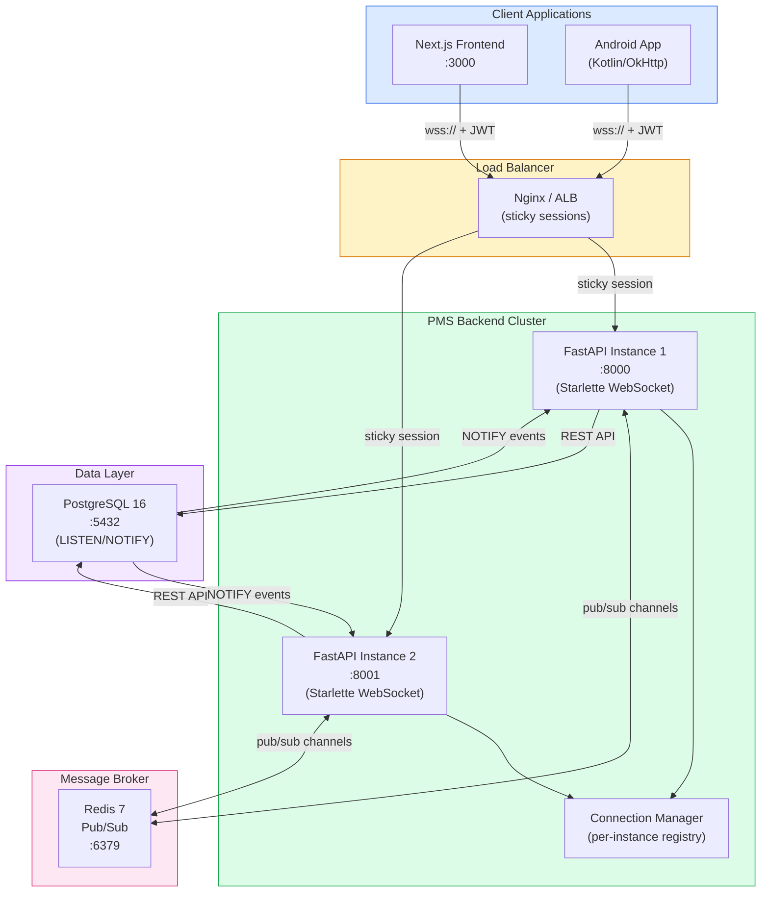

# Product Requirements Document: WebSocket Integration into Patient Management System (PMS)

**Document ID:** PRD-PMS-WEBSOCKET-001
**Version:** 1.0
**Date:** March 3, 2026
**Author:** Ammar (CEO, MPS Inc.)
**Status:** Draft

---

## 1. Executive Summary

WebSocket (RFC 6455) is a full-duplex communication protocol that establishes a persistent, bidirectional connection between client and server over a single TCP socket. Unlike HTTP's request-response model, WebSocket allows both parties to send messages at any time without the overhead of repeated handshakes, enabling sub-50ms message delivery for real-time interactions. The protocol is natively supported in all modern browsers, Android (via OkHttp), and server frameworks including FastAPI/Starlette, making it a universal foundation for real-time clinical workflows.

For the PMS, WebSocket addresses a critical gap: the absence of real-time data synchronization across the clinical environment. Today, clinicians working on the Next.js dashboard or Android app must manually refresh to see updated patient records, new lab results, medication changes, or encounter status updates made by other providers. In a busy multi-provider clinic, this polling-based model introduces 5-30 second delays in data visibility, risks duplicate data entry, and prevents time-sensitive clinical alerts (drug interaction warnings, critical lab values, encounter lock conflicts) from reaching providers instantly. WebSocket replaces this with push-based, event-driven updates that propagate changes to all connected clients within milliseconds.

The integration leverages FastAPI's native Starlette WebSocket support on the backend, PostgreSQL LISTEN/NOTIFY for database-driven change events, Redis pub/sub for horizontal scaling across multiple backend instances, a custom React hook (`useWebSocket`) for the Next.js frontend, and an OkHttp-based WebSocket client with Kotlin Flow for the Android app. All connections use WSS (TLS 1.3) with JWT token authentication, HIPAA-compliant audit logging, and automatic reconnection with exponential backoff and jitter.

---

## 2. Problem Statement

- **Stale data across concurrent users:** When multiple clinicians access the same patient's record simultaneously (common during shift handoffs, multi-provider encounters, and care coordination), changes made by one provider are invisible to others until they manually refresh. This leads to conflicting medication orders, duplicate encounter notes, and overwritten data — patient safety risks in a clinical setting.
- **No real-time clinical alerts:** Critical events — drug interaction warnings when a new prescription is added, critical lab value notifications (e.g., potassium > 6.0 mEq/L), or encounter lock conflicts — cannot be delivered instantly. The current architecture requires the client to poll `/api/patients` or `/api/prescriptions` on a timer, which is both resource-intensive (unnecessary HTTP overhead) and too slow for time-sensitive clinical alerts.
- **Polling overhead degrades performance:** The Next.js frontend polls 3-5 API endpoints every 10-30 seconds per active tab. With 20+ concurrent clinician sessions, this generates 200+ unnecessary HTTP requests per minute against the FastAPI backend, consuming bandwidth, database connections, and server CPU on unchanged data.
- **No encounter collaboration awareness:** When two providers open the same encounter, neither knows the other is editing. This leads to "last write wins" conflicts where one provider's notes overwrite another's. Real-time presence indicators and collaborative editing signals require persistent connections that HTTP polling cannot efficiently provide.
- **Android app disconnection handling:** The Android app on clinical tablets frequently transitions between Wi-Fi networks, cellular, and offline states during patient rounds. Without a persistent connection with reconnection logic, the app cannot gracefully handle network transitions or queue messages for delivery upon reconnection.

---

## 3. Proposed Solution

Adopt **WebSocket** as the real-time communication layer across the PMS stack, providing instant bidirectional data synchronization, clinical alerts, presence awareness, and encounter collaboration for all connected clients.

### 3.1 Architecture Overview

### 3.2 Deployment Model

- **Self-hosted, Docker-based:** All WebSocket infrastructure runs within the existing PMS Docker Compose stack — no external cloud dependencies
- **Redis 7 sidecar:** A Redis container handles pub/sub for cross-instance message broadcasting; the same Redis instance can serve caching duties
- **TLS termination at load balancer:** Nginx or ALB terminates WSS (TLS 1.3) and routes to backend instances using sticky sessions (IP hash or cookie-based)
- **Horizontal scaling:** Each FastAPI instance maintains its own in-memory connection registry; Redis pub/sub ensures messages reach clients on any instance
- **HIPAA compliance:** All WebSocket connections use WSS (encrypted), JWT tokens are validated on connection upgrade, PHI in messages is minimized to identifiers and change deltas (not full records), and all events are audit-logged with user ID, timestamp, and event type
- **Zero additional ports:** WebSocket connections share the existing HTTP port (8000) via the `/ws` path prefix — the Starlette ASGI server handles both HTTP and WebSocket on the same port

---

## 4. PMS Data Sources

| PMS Resource | WebSocket Interaction | Event Types |
|-------------|----------------------|-------------|
| Patient Records API (`/api/patients`) | Push patient record updates (demographics, status changes) to all providers viewing the same patient | `patient.updated`, `patient.created`, `patient.status_changed` |
| Encounter Records API (`/api/encounters`) | Real-time encounter lock/unlock, collaborative editing presence, status transitions (draft → signed) | `encounter.locked`, `encounter.unlocked`, `encounter.updated`, `encounter.signed` |
| Medication & Prescription API (`/api/prescriptions`) | Instant drug interaction alerts when prescriptions are added, medication reconciliation updates | `prescription.created`, `prescription.interaction_alert`, `prescription.reconciled` |
| Reporting API (`/api/reports`) | Long-running report completion notifications, real-time dashboard metric updates | `report.completed`, `report.progress`, `dashboard.metrics_updated` |
| System Events | Connection health, maintenance notifications, session expiry warnings | `system.maintenance`, `session.expiring`, `system.alert` |

---

## 5. Component/Module Definitions

### 5.1 WebSocket Connection Manager

**Description:** Server-side registry that tracks all active WebSocket connections, maps connections to authenticated users and their subscribed channels (patient IDs, encounter IDs, global alerts), and routes incoming messages to the correct recipients. Maintains per-instance connection state with Redis pub/sub for cross-instance broadcasting.

**Input:** WebSocket upgrade requests with JWT token; subscription requests for specific patients/encounters.
**Output:** Authenticated connection with channel subscriptions; message routing to subscribed clients.
**PMS APIs used:** Authentication service for JWT validation; `/api/patients` and `/api/encounters` for authorization checks (does this user have access to this patient?).

### 5.2 PostgreSQL Change Event Listener

**Description:** Background asyncio task that maintains a persistent connection to PostgreSQL, listening on NOTIFY channels (`patient_changes`, `encounter_changes`, `prescription_changes`). Database triggers fire NOTIFY with a JSON payload (table, operation, record ID, changed fields) whenever clinical data is modified. The listener receives these events and publishes them to Redis for distribution to all backend instances.

**Input:** PostgreSQL NOTIFY events with JSON payload (table name, operation type, record ID, changed column names).
**Output:** Redis pub/sub messages containing typed change events.
**PMS APIs used:** Direct PostgreSQL connection via asyncpg; triggers on `patients`, `encounters`, `prescriptions`, and `medications` tables.

### 5.3 Clinical Alert Dispatcher

**Description:** Event processing pipeline that evaluates incoming data changes against clinical rules and generates priority-classified alerts. When a prescription is created, it checks for drug interactions via the medication API. When a lab result arrives, it checks for critical values. Alerts are tagged with severity (info, warning, critical) and routed to the appropriate providers via WebSocket.

**Input:** Change events from the PostgreSQL listener; clinical rules configuration.
**Output:** Typed alert messages with severity, target users, and contextual data (medication names, lab values, thresholds).
**PMS APIs used:** `/api/prescriptions` for drug interaction checks; `/api/encounters` for provider-patient relationships; clinical rules engine.

### 5.4 Encounter Collaboration Service

**Description:** Real-time presence and conflict detection for concurrent encounter editing. Tracks which providers have an encounter open, broadcasts cursor/section focus indicators, and prevents conflicting writes via optimistic locking with version numbers. If two providers attempt to modify the same encounter section simultaneously, the service notifies both and offers merge or override options.

**Input:** Encounter open/close events, section focus changes, save attempts with version numbers.
**Output:** Presence indicators (who is viewing/editing), conflict warnings, lock acquisition/release notifications.
**PMS APIs used:** `/api/encounters` for version checking and conflict resolution; `/api/encounters/{id}/lock` for explicit locking.

### 5.5 React WebSocket Hook (`useWebSocket`)

**Description:** Custom React hook that manages the WebSocket lifecycle in the Next.js frontend. Handles connection establishment with JWT authentication, automatic reconnection with exponential backoff (1s → 2s → 4s → 8s → max 30s) and jitter, heartbeat ping/pong every 30 seconds, message parsing and type-safe event dispatch, and connection state management (connecting, connected, reconnecting, disconnected).

**Input:** WebSocket URL, JWT token, subscription channels.
**Output:** Connection state, typed event callbacks, send function, subscription management.
**PMS APIs used:** Authentication API for JWT refresh; consumes events from all PMS change channels.

### 5.6 Android WebSocket Client

**Description:** OkHttp-based WebSocket client integrated with Kotlin Flow and ViewModel lifecycle. Maintains a persistent connection with automatic reconnection on network transitions (Wi-Fi ↔ cellular ↔ offline), queues outbound messages during disconnection for delivery on reconnect, and exposes real-time events as SharedFlow for Jetpack Compose UI consumption.

**Input:** WebSocket URL, JWT token, network state changes from ConnectivityManager.
**Output:** SharedFlow of typed events for UI consumption; StateFlow of connection status.
**PMS APIs used:** Authentication API for token refresh; consumes the same event channels as the web frontend.

---

## 6. Non-Functional Requirements

### 6.1 Security and HIPAA Compliance

- **Transport encryption:** All WebSocket connections use WSS (WebSocket Secure) with TLS 1.3; plain `ws://` connections are rejected
- **Authentication:** JWT token is validated during the WebSocket upgrade handshake; tokens are refreshed via a dedicated `token.refresh` message before expiry
- **Authorization:** Channel subscriptions are validated against the user's access permissions — a provider can only subscribe to patients assigned to their care team
- **PHI minimization in messages:** WebSocket messages contain record IDs and change metadata (field names, operation types), not full PHI records; clients fetch updated data via REST API after receiving a change notification
- **Audit logging:** Every WebSocket event (connection, disconnection, subscription, message sent/received) is logged with user ID, timestamp, IP address, and event type to the HIPAA audit trail
- **Session management:** Connections are terminated after JWT expiry if not refreshed; idle connections are closed after 5 minutes of no activity (beyond ping/pong)
- **Origin validation:** WebSocket upgrade requests are validated against an allowlist of origins (PMS frontend domains) to prevent cross-site WebSocket hijacking
- **Rate limiting:** Per-connection message rate limits (100 messages/minute) prevent abuse; connections exceeding limits are throttled then disconnected

### 6.2 Performance

| Metric | Target |
|--------|--------|
| Message delivery latency (server → client) | < 50ms (p95) |
| WebSocket upgrade handshake time | < 100ms |
| Concurrent connections per backend instance | >= 5,000 |
| Total concurrent connections (cluster) | >= 20,000 |
| Heartbeat interval | 30 seconds |
| Reconnection time after network drop | < 5 seconds (first attempt) |
| Message throughput per instance | >= 10,000 messages/second |
| Memory per connection | < 50 KB |
| Redis pub/sub latency (cross-instance) | < 10ms |
| PostgreSQL NOTIFY latency | < 5ms |

### 6.3 Infrastructure

| Component | Specification |
|-----------|--------------|
| FastAPI/Starlette | Existing backend with ASGI WebSocket support (no additional dependency) |
| Redis 7 | New Docker container; 256 MB RAM minimum; pub/sub channels for cross-instance messaging |
| PostgreSQL 16 | Existing database; add NOTIFY triggers on clinical tables |
| Nginx | Existing load balancer; configure `proxy_pass` for WebSocket upgrade, sticky sessions |
| Docker Compose | Add Redis service; update Nginx config; no new ports required (WebSocket shares :8000) |
| Monitoring | Prometheus metrics for connection count, message rate, latency; Grafana dashboard |

---

## 7. Implementation Phases

### Phase 1: Foundation — WebSocket Infrastructure (Sprint 1-2)

- Implement WebSocket endpoint in FastAPI (`/ws`) with JWT authentication on upgrade
- Build Connection Manager with in-memory connection registry and channel subscriptions
- Add Redis pub/sub for cross-instance message broadcasting
- Create PostgreSQL NOTIFY triggers on `patients`, `encounters`, `prescriptions` tables
- Build PostgreSQL Change Event Listener (asyncpg LISTEN)
- Implement heartbeat ping/pong (30-second interval)
- Add WSS configuration to Nginx with sticky sessions
- Create basic audit logging for WebSocket events
- Write integration tests for connection lifecycle, authentication, and message routing

### Phase 2: Client Integration & Clinical Events (Sprints 3-4)

- Build `useWebSocket` React hook with reconnection, heartbeat, and type-safe events
- Integrate real-time patient record updates into the Next.js clinical dashboard
- Build Encounter Collaboration Service with presence indicators and conflict detection
- Implement Clinical Alert Dispatcher for drug interaction warnings and critical lab values
- Build Android WebSocket client with OkHttp, Kotlin Flow, and ViewModel lifecycle
- Add real-time encounter status updates (draft → signed → amended) to both frontends
- Create subscription management UI for providers to configure alert preferences
- Performance test with 1,000+ concurrent connections

### Phase 3: Advanced Features & Optimization (Sprints 5-6)

- Implement message queuing for offline Android clients with replay on reconnect
- Add real-time dashboard metric updates (patient volume, encounter throughput, wait times)
- Build long-running report completion notifications
- Implement connection draining for zero-downtime backend deployments
- Add Prometheus metrics and Grafana dashboard for WebSocket monitoring
- Load test at 10,000+ concurrent connections with message throughput benchmarks
- Create PMS-specific MCP tools for WebSocket debugging (Experiment 09 integration)
- Document scaling patterns for multi-clinic deployments

---

## 8. Success Metrics

| Metric | Target | Measurement Method |
|--------|--------|--------------------|
| Data synchronization delay | < 200ms end-to-end (change → client update) | Instrumented timing in WebSocket messages |
| Polling HTTP requests eliminated | >= 90% reduction | Compare HTTP request volume before/after |
| Encounter edit conflicts | Zero undetected conflicts | Audit log analysis of concurrent encounter edits |
| Clinical alert delivery time | < 1 second from trigger event | End-to-end timing: DB trigger → client notification |
| Connection stability | >= 99.5% uptime per session | Connection manager metrics (drops, reconnections) |
| Backend CPU from polling | >= 60% reduction | Server-side CPU profiling before/after |
| Concurrent connection capacity | >= 5,000 per instance | Load test with production-like traffic patterns |
| Clinician satisfaction (data freshness) | >= 4.5/5.0 | Team survey after 2-week pilot |

---

## 9. Risks and Mitigations

| Risk | Impact | Mitigation |
|------|--------|------------|
| Connection storms on backend restart | All clients reconnect simultaneously, overwhelming the server | Exponential backoff with random jitter (1-30s); connection rate limiting at Nginx (100 new connections/second) |
| Redis pub/sub message loss | Clients miss updates if Redis drops messages during high load | Redis pub/sub is fire-and-forget; mitigate with sequence numbers in messages and periodic REST sync (every 60s) as safety net |
| Stale connections consume memory | Abandoned connections (browser tab closed without clean disconnect) accumulate | Heartbeat timeout (60s without pong); idle timeout (5 min without activity); periodic connection audit |
| PHI leakage in WebSocket messages | Over-including patient data in real-time messages exposes PHI in transit logs | Enforce message schema: IDs and change metadata only; full data fetched via REST; message schema validation at send time |
| WebSocket not supported through corporate proxies | Hospital network proxies may strip WebSocket upgrade headers | Fallback to SSE (Server-Sent Events) for server→client; REST for client→server; automatic protocol negotiation |
| Horizontal scaling complexity | Adding Redis pub/sub increases infrastructure complexity | Use managed Redis (ElastiCache) in production; provide Docker Compose for development; thorough runbook documentation |
| JWT token expiry during long sessions | Providers leave sessions open for hours; token expires mid-connection | Proactive token refresh: send `token.refresh` message 5 minutes before expiry; disconnect with clear error on expired token |

---

## 10. Dependencies

| Dependency | Version | Purpose | License |
|-----------|---------|---------|---------|
| FastAPI / Starlette | >= 0.115 | ASGI WebSocket server (built-in, no additional package) | MIT |
| asyncpg | >= 0.29 | Async PostgreSQL driver for LISTEN/NOTIFY | Apache 2.0 |
| redis-py | >= 5.0 (async) | Redis pub/sub client for cross-instance messaging | MIT |
| Redis Server | 7.x | Message broker for pub/sub | BSD 3-Clause |
| PostgreSQL | 16.x | Database with NOTIFY triggers | PostgreSQL License |
| Nginx | >= 1.25 | Load balancer with WebSocket proxy support | BSD 2-Clause |
| OkHttp | >= 4.12 | Android WebSocket client | Apache 2.0 |
| react-use-websocket | >= 4.8 (optional) | React hook library (or custom implementation) | MIT |
| PyJWT | >= 2.8 | JWT token validation on WebSocket upgrade | MIT |

---

## 11. Comparison with Existing Experiments

| Aspect | WebSocket (Exp 37) | Speechmatics Flow (Exp 33) | MCP Integration (Exp 09) | n8n HITL (Exp 34) | LangGraph (Exp 26) |
|--------|--------------------|-----------------------------|-------------------------|-------------------|---------------------|
| **Primary function** | Real-time bidirectional data sync | Voice agent conversations | AI tool integration protocol | Visual workflow automation | Stateful agent orchestration |
| **Protocol** | WebSocket (RFC 6455) | WebSocket (audio streaming) | HTTP + stdio | HTTP webhooks | HTTP + SSE |
| **Direction** | Bidirectional (full-duplex) | Bidirectional (audio + events) | Request-response | Request-response | Server → client streaming |
| **Use case** | Live data sync, clinical alerts, presence | Voice-based clinical conversations | AI assistant PMS tool access | Workflow automation with approvals | Multi-step AI agent workflows |
| **Connection type** | Persistent, long-lived | Session-based (per conversation) | On-demand | Trigger-based | Session-based |
| **Scaling model** | Redis pub/sub, horizontal | Single session per agent | Stateless HTTP | n8n queue workers | PostgreSQL checkpointing |

**Complementary roles:**
- **WebSocket (Exp 37)** provides the real-time transport layer that ALL other experiments can leverage — Speechmatics Flow (Exp 33) already uses WebSocket for audio streaming; MCP tools (Exp 09) could push results via WebSocket instead of polling; LangGraph agent progress (Exp 26) can stream via WebSocket instead of SSE; n8n HITL approvals (Exp 34) can use WebSocket for instant clinician notifications
- **Speechmatics Flow (Exp 33)** uses WebSocket specifically for voice agent audio — Exp 37 provides the general-purpose data synchronization layer for the entire PMS
- **PostgreSQL LISTEN/NOTIFY** integration connects the database layer to real-time clients, enabling any database change to propagate instantly without application-level polling

---

## 12. Research Sources

### Official Documentation & Specification
- [FastAPI WebSockets Documentation](https://fastapi.tiangolo.com/advanced/websockets/) — Official FastAPI WebSocket endpoint implementation guide
- [WebSocket Protocol Comparisons (websocket.org)](https://websocket.org/comparisons/) — Protocol comparison reference with technical specifications

### Architecture & Scaling Patterns
- [Scaling Pub/Sub with WebSockets and Redis (Ably)](https://ably.com/blog/scaling-pub-sub-with-websockets-and-redis) — Redis pub/sub architecture for horizontal WebSocket scaling
- [WebSocket Scale in 2025 (VideoSDK)](https://www.videosdk.live/developer-hub/websocket/websocket-scale) — Cloud-native scaling patterns for millions of connections
- [PostgreSQL LISTEN/NOTIFY Real-Time (Pedro Alonso)](https://www.pedroalonso.net/blog/postgres-listen-notify-real-time/) — Database-driven change notifications without external brokers

### Client Implementation
- [FastAPI + WebSockets + React (Medium)](https://medium.com/@suganthi2496/fastapi-websockets-react-real-time-features-for-your-modern-apps-b8042a10fd90) — Full-stack WebSocket implementation pattern
- [WebSocket in Jetpack Compose with OkHttp and SharedFlow](https://medium.com/@danimahardhika/handle-websocket-in-jetpack-compose-with-okhttp-and-sharedflow-b1ed7c9fd713) — Android WebSocket client architecture
- [WebSockets with Next.js (Pedro Alonso)](https://www.pedroalonso.net/blog/websockets-nextjs-part-1/) — Next.js WebSocket integration patterns

### Security & Healthcare Compliance
- [HIPAA Compliance for API Integration (Censinet)](https://www.censinet.com/perspectives/hipaa-compliance-api-integration-healthcare) — HIPAA requirements for real-time API communication
- [TLS & HIPAA Compliance (HIPAA Vault)](https://www.hipaavault.com/resources/is-tls-enough-for-hipaa/) — TLS 1.2/1.3 requirements and layered security for HIPAA
- [FHIR Subscription APIs for Real-Time Monitoring (CapMinds)](https://www.capminds.com/blog/leveraging-fhir-subscription-apis-for-real-time-patient-monitoring-and-alerts/) — Healthcare real-time notification patterns via FHIR subscriptions

### Production Best Practices
- [WebSocket Heartbeat Ping/Pong Implementation](https://oneuptime.com/blog/post/2026-01-27-websocket-heartbeat-ping-pong/view) — Keepalive and dead connection detection patterns
- [Robust WebSocket Reconnection with Exponential Backoff](https://dev.to/hexshift/robust-websocket-reconnection-strategies-in-javascript-with-exponential-backoff-40n1) — Production reconnection strategies with jitter

---

## 13. Appendix: Related Documents

- [WebSocket PMS Setup Guide](37-WebSocket-PMS-Developer-Setup-Guide.md)
- [WebSocket PMS Developer Tutorial](37-WebSocket-Developer-Tutorial.md)
- [Speechmatics Flow API PRD (Experiment 33)](33-PRD-SpeechmaticsFlow-PMS-Integration.md) — Uses WebSocket for voice agent audio streaming
- [MCP PMS Integration PRD (Experiment 09)](09-PRD-MCP-PMS-Integration.md) — Tool integration that can push results via WebSocket
- [LangGraph PMS Integration PRD (Experiment 26)](26-PRD-LangGraph-PMS-Integration.md) — Agent orchestration with SSE streaming (WebSocket alternative)
- [FHIR PMS Integration PRD (Experiment 16)](16-PRD-FHIR-PMS-Integration.md) — FHIR Subscription API supports WebSocket channel delivery
