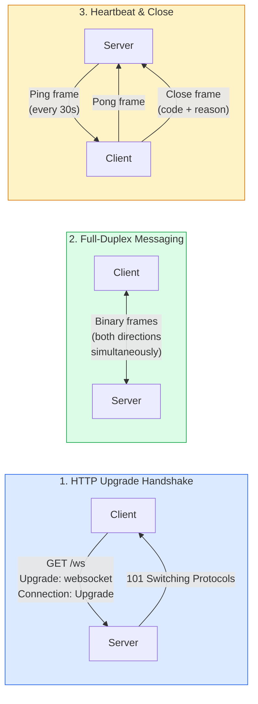
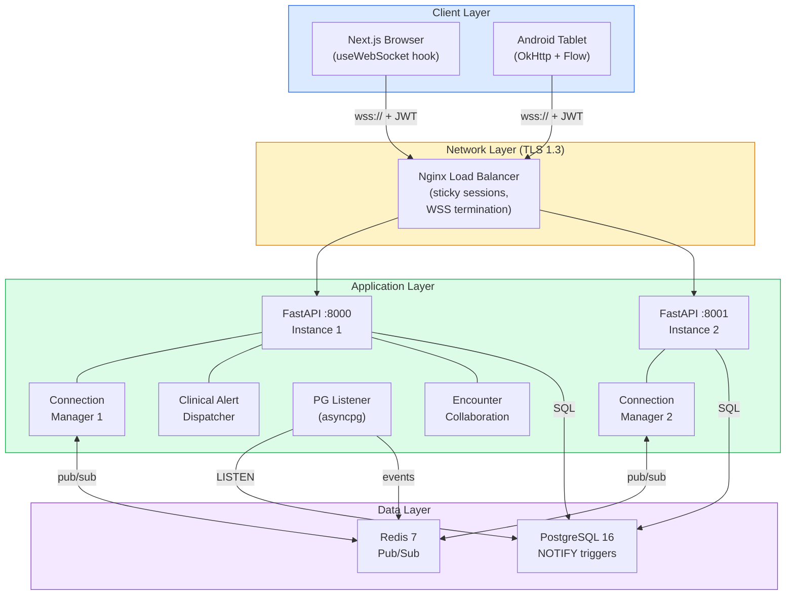

# WebSocket Developer Onboarding Tutorial

**Welcome to the MPS PMS WebSocket Integration Team**

This tutorial will take you from zero to building your first real-time clinical feature with WebSocket. By the end, you will understand how WebSocket works, have a running local environment, and have built and tested a live encounter collaboration system end-to-end.

**Document ID:** PMS-EXP-WEBSOCKET-002
**Version:** 1.0
**Date:** March 3, 2026
**Applies To:** PMS project (all platforms)
**Prerequisite:** [WebSocket Setup Guide](37-WebSocket-PMS-Developer-Setup-Guide.md)
**Estimated time:** 2-3 hours
**Difficulty:** Beginner-friendly

---

## What You Will Learn

1. How the WebSocket protocol works and why it is superior to HTTP polling for clinical real-time features
2. How FastAPI/Starlette handles WebSocket connections on the backend
3. How PostgreSQL LISTEN/NOTIFY propagates database changes to WebSocket clients
4. How Redis pub/sub enables horizontal scaling across multiple backend instances
5. How to build a custom React `useWebSocket` hook with reconnection and heartbeat
6. How to implement real-time encounter collaboration with presence indicators
7. How to build clinical alert notifications (drug interactions, critical lab values)
8. How to test and debug WebSocket connections using `wscat` and browser DevTools
9. How to handle WebSocket lifecycle on Android with OkHttp and Kotlin Flow
10. How to evaluate when WebSocket is the right choice vs SSE, polling, or gRPC

---

## Part 1: Understanding WebSocket (15 min read)

### 1.1 What Problem Does WebSocket Solve?

In a busy PMS clinic, multiple clinicians work on patient records simultaneously. Dr. Ramirez opens Patient 42's encounter on the Next.js dashboard. Nurse Chen opens the same patient on the Android tablet at bedside. The pharmacist reviews medications on a separate workstation. Without real-time communication:

- When Nurse Chen adds a vital sign observation, Dr. Ramirez's screen still shows the old data until she manually refreshes
- When the pharmacist flags a drug interaction, neither the doctor nor the nurse sees the alert until their next page load
- When Dr. Ramirez starts writing a clinical note, Nurse Chen unknowingly starts her own note on the same encounter — one will overwrite the other
- When a critical lab result arrives (potassium 6.8 mEq/L), no one is notified until they happen to check the results tab

WebSocket eliminates all of these gaps by establishing a persistent, bidirectional connection between each client and the server. Changes flow instantly from the database to every subscribed client — no polling, no refresh buttons, no stale data.

### 1.2 How WebSocket Works — The Key Pieces



**Three key concepts:**

1. **Upgrade Handshake:** The client sends a standard HTTP GET request with `Upgrade: websocket` headers. The server responds with `101 Switching Protocols`, and the connection is "upgraded" from HTTP to WebSocket. From this point, the same TCP socket is used for bidirectional messaging — no more HTTP request/response overhead.

2. **Full-Duplex Messaging:** Both client and server can send messages at any time, independently. Messages are small binary frames with 2-14 bytes of overhead (compared to ~800 bytes for an HTTP request with headers). This makes WebSocket ideal for high-frequency, low-latency communication.

3. **Heartbeat & Lifecycle:** The server sends Ping frames (every 30 seconds in our implementation) to detect dead connections. The client responds with Pong frames. If no Pong is received within the timeout, the server closes the connection. Clients implement reconnection with exponential backoff.

### 1.3 How WebSocket Fits with Other PMS Technologies

| Technology | Real-Time Method | Direction | Use Case | Relationship to WebSocket |
|-----------|-----------------|-----------|----------|--------------------------|
| **WebSocket (Exp 37)** | Persistent TCP connection | Bidirectional | Data sync, alerts, presence | Core real-time transport |
| **Speechmatics Flow (Exp 33)** | WebSocket (audio) | Bidirectional | Voice agent streaming | Uses WebSocket for audio; Exp 37 for data |
| **LangGraph (Exp 26)** | SSE streaming | Server → client | AI agent progress | Could upgrade to WebSocket for bidirectional |
| **MCP (Exp 09)** | HTTP request/response | Request/response | AI tool access | WebSocket can push MCP results to clients |
| **n8n HITL (Exp 34)** | HTTP webhooks | Server → server | Workflow approvals | WebSocket delivers approval requests to clinicians |
| **FHIR Subscriptions (Exp 16)** | REST hooks / WebSocket | Server → client | Resource change notifications | FHIR spec supports WebSocket as subscription channel |
| **ElevenLabs (Exp 30)** | WebSocket (audio) | Bidirectional | TTS/STT streaming | Uses WebSocket for voice; Exp 37 for metadata |

### 1.4 Key Vocabulary

| Term | Meaning |
|------|---------|
| **WSS** | WebSocket Secure — WebSocket over TLS (analogous to HTTPS for HTTP) |
| **Upgrade handshake** | The initial HTTP request that "upgrades" the connection from HTTP to WebSocket |
| **Full-duplex** | Both client and server can send messages simultaneously on the same connection |
| **Frame** | The basic unit of WebSocket communication — a small binary packet with 2-14 bytes of overhead |
| **Channel** | A named topic that clients subscribe to for receiving specific events (e.g., `patients:42`) |
| **Connection Manager** | Server-side registry that tracks active connections, their subscriptions, and routes messages |
| **Ping/Pong** | Heartbeat mechanism — server sends Ping frames, client responds with Pong to prove liveness |
| **LISTEN/NOTIFY** | PostgreSQL's built-in pub/sub mechanism for pushing database change events to connected listeners |
| **Sticky session** | Load balancer routing that ensures a client's WebSocket connection always reaches the same backend instance |
| **Exponential backoff** | Reconnection strategy where the delay between retry attempts doubles each time (1s → 2s → 4s → 8s) |
| **Jitter** | Random variation added to backoff delays to prevent all clients from reconnecting simultaneously |
| **Redis pub/sub** | Redis feature that broadcasts messages to subscribed clients across multiple server instances |

### 1.5 Our Architecture



---

## Part 2: Environment Verification (15 min)

### 2.1 Checklist

Run each command and verify the expected output:

```bash
# 1. PMS backend is running
curl -s http://localhost:8000/health
# Expected: {"status": "healthy"}

# 2. PostgreSQL is accepting connections
pg_isready -h localhost -p 5432
# Expected: localhost:5432 - accepting connections

# 3. Redis is running
redis-cli ping
# Expected: PONG

# 4. PostgreSQL NOTIFY triggers are installed
psql -h localhost -p 5432 -U pms_user -d pms -c "
SELECT trigger_name, event_object_table
FROM information_schema.triggers
WHERE trigger_name LIKE '%change_trigger'
ORDER BY event_object_table;
"
# Expected: patient_change_trigger | patients
#           encounter_change_trigger | encounters
#           prescription_change_trigger | prescriptions

# 5. wscat is available for testing
npx wscat --version
# Expected: version number (e.g., 6.0.1)

# 6. Next.js frontend is running
curl -s -o /dev/null -w "%{http_code}" http://localhost:3000
# Expected: 200
```

### 2.2 Quick Test

Run a complete end-to-end WebSocket test in under 60 seconds:

```bash
# Terminal 1: Connect via wscat
npx wscat -c "ws://localhost:8000/ws?token=YOUR_JWT_TOKEN"
# Type this after connecting:
{"type": "subscribe", "channel": "patients:1"}

# Terminal 2: Trigger a database change
psql -h localhost -p 5432 -U pms_user -d pms -c "
UPDATE patients SET updated_at = NOW() WHERE id = 1;
"

# Terminal 1 should show a real-time event:
# {"type": "patients.update", "table": "patients", "operation": "UPDATE", "id": 1, ...}
```

If you see the event in Terminal 1 within 1 second of the database update, the entire pipeline is working: PostgreSQL NOTIFY → asyncpg listener → Redis pub/sub → Connection Manager → WebSocket client.

---

## Part 3: Build Your First Integration (45 min)

### 3.1 What We Are Building

We will build a **Real-Time Encounter Collaboration Panel** — a component that shows:

1. **Presence indicators:** Who else is currently viewing/editing the same encounter
2. **Live activity feed:** Real-time log of changes as they happen (vitals added, notes updated, prescriptions written)
3. **Edit conflict warnings:** Instant alerts when two providers modify the same encounter section simultaneously

This is a high-value clinical feature: in multi-provider settings, encounter collaboration prevents data loss from conflicting edits and improves care coordination.

### 3.2 Create the Backend Encounter Collaboration Service

```python
# app/websocket/collaboration.py
import time
import logging
from dataclasses import dataclass, field

from app.websocket.manager import manager

logger = logging.getLogger(__name__)


@dataclass
class EncounterPresence:
    """Tracks who is viewing/editing an encounter."""
    user_id: int
    user_name: str
    role: str
    active_section: str | None = None  # e.g., "notes", "vitals", "prescriptions"
    joined_at: float = field(default_factory=time.time)
    last_activity: float = field(default_factory=time.time)


class EncounterCollaborationService:
    """Manages real-time encounter collaboration state."""

    def __init__(self):
        self._presence: dict[int, dict[int, EncounterPresence]] = {}
        # encounter_id -> {user_id -> presence}

    async def join_encounter(self, encounter_id: int, user_id: int, user_name: str, role: str):
        """Register a user as viewing an encounter and notify others."""
        self._presence.setdefault(encounter_id, {})
        self._presence[encounter_id][user_id] = EncounterPresence(
            user_id=user_id,
            user_name=user_name,
            role=role,
        )

        # Notify all users viewing this encounter
        await manager.publish(f"encounter:{encounter_id}", {
            "type": "encounter.presence_joined",
            "encounter_id": encounter_id,
            "user_id": user_id,
            "user_name": user_name,
            "role": role,
            "active_users": self._get_active_users(encounter_id),
        })

        logger.info(f"User {user_name} joined encounter {encounter_id}")

    async def leave_encounter(self, encounter_id: int, user_id: int):
        """Remove a user from encounter presence."""
        users = self._presence.get(encounter_id, {})
        removed = users.pop(user_id, None)
        if not users:
            self._presence.pop(encounter_id, None)

        if removed:
            await manager.publish(f"encounter:{encounter_id}", {
                "type": "encounter.presence_left",
                "encounter_id": encounter_id,
                "user_id": user_id,
                "user_name": removed.user_name,
                "active_users": self._get_active_users(encounter_id),
            })

    async def update_section_focus(
        self, encounter_id: int, user_id: int, section: str
    ):
        """Track which section a user is editing (for conflict detection)."""
        users = self._presence.get(encounter_id, {})
        presence = users.get(user_id)
        if not presence:
            return

        old_section = presence.active_section
        presence.active_section = section
        presence.last_activity = time.time()

        # Check for section conflicts
        conflicts = [
            p for uid, p in users.items()
            if uid != user_id and p.active_section == section
        ]

        event = {
            "type": "encounter.section_focus",
            "encounter_id": encounter_id,
            "user_id": user_id,
            "user_name": presence.user_name,
            "section": section,
            "previous_section": old_section,
        }

        if conflicts:
            event["conflict_warning"] = {
                "message": f"{len(conflicts)} other user(s) editing '{section}'",
                "users": [{"user_id": c.user_id, "user_name": c.user_name} for c in conflicts],
            }

        await manager.publish(f"encounter:{encounter_id}", event)

    def _get_active_users(self, encounter_id: int) -> list[dict]:
        """Get list of active users for an encounter."""
        users = self._presence.get(encounter_id, {})
        return [
            {
                "user_id": p.user_id,
                "user_name": p.user_name,
                "role": p.role,
                "active_section": p.active_section,
                "joined_at": p.joined_at,
            }
            for p in users.values()
        ]


# Singleton
collab_service = EncounterCollaborationService()
```

### 3.3 Add Collaboration Message Handling to the WebSocket Router

Extend the `_handle_message` function in `app/websocket/router.py`:

```python
# Add to app/websocket/router.py — inside _handle_message function

from app.websocket.collaboration import collab_service

# Add these cases to the if/elif chain in _handle_message:

    elif msg_type == "encounter.join":
        encounter_id = message.get("encounter_id")
        if encounter_id:
            await manager.subscribe(conn_id, f"encounter:{encounter_id}")
            await collab_service.join_encounter(
                encounter_id=encounter_id,
                user_id=user["id"],
                user_name=user.get("name", f"User {user['id']}"),
                role=user.get("role", "provider"),
            )

    elif msg_type == "encounter.leave":
        encounter_id = message.get("encounter_id")
        if encounter_id:
            await manager.unsubscribe(conn_id, f"encounter:{encounter_id}")
            await collab_service.leave_encounter(encounter_id, user["id"])

    elif msg_type == "encounter.section_focus":
        encounter_id = message.get("encounter_id")
        section = message.get("section")
        if encounter_id and section:
            await collab_service.update_section_focus(encounter_id, user["id"], section)
```

### 3.4 Build the Frontend Encounter Collaboration Panel

```typescript
// src/components/EncounterCollaboration.tsx
"use client";

import { useEffect, useState, useCallback } from "react";
import { useWS } from "@/providers/WebSocketProvider";
import { WSEvent } from "@/hooks/useWebSocket";

interface ActiveUser {
  user_id: number;
  user_name: string;
  role: string;
  active_section: string | null;
  joined_at: number;
}

interface ActivityItem {
  id: string;
  type: string;
  message: string;
  timestamp: Date;
  severity: "info" | "warning" | "critical";
}

interface ConflictWarning {
  message: string;
  users: { user_id: number; user_name: string }[];
}

interface EncounterCollaborationProps {
  encounterId: number;
  currentUserId: number;
  currentUserName: string;
}

export function EncounterCollaboration({
  encounterId,
  currentUserId,
  currentUserName,
}: EncounterCollaborationProps) {
  const { state, send, addEventListener } = useWS();
  const [activeUsers, setActiveUsers] = useState<ActiveUser[]>([]);
  const [activities, setActivities] = useState<ActivityItem[]>([]);
  const [conflict, setConflict] = useState<ConflictWarning | null>(null);

  // Join encounter on mount
  useEffect(() => {
    if (state !== "connected") return;

    send({ type: "encounter.join", encounter_id: encounterId });

    return () => {
      send({ type: "encounter.leave", encounter_id: encounterId });
    };
  }, [state, encounterId, send]);

  // Listen for presence events
  useEffect(() => {
    const removers = [
      addEventListener("encounter.presence_joined", (event: WSEvent) => {
        if (event.encounter_id === encounterId) {
          setActiveUsers(event.active_users as ActiveUser[]);
          if ((event.user_id as number) !== currentUserId) {
            addActivity("info", `${event.user_name} joined the encounter`);
          }
        }
      }),
      addEventListener("encounter.presence_left", (event: WSEvent) => {
        if (event.encounter_id === encounterId) {
          setActiveUsers(event.active_users as ActiveUser[]);
          addActivity("info", `${event.user_name} left the encounter`);
        }
      }),
      addEventListener("encounter.section_focus", (event: WSEvent) => {
        if (event.encounter_id === encounterId) {
          if ((event as Record<string, unknown>).conflict_warning) {
            setConflict((event as Record<string, unknown>).conflict_warning as ConflictWarning);
            addActivity("warning", (event as Record<string, unknown>).conflict_warning
              ? ((event as Record<string, unknown>).conflict_warning as ConflictWarning).message
              : "Edit conflict detected");
            // Auto-dismiss conflict after 10 seconds
            setTimeout(() => setConflict(null), 10000);
          }
        }
      }),
      addEventListener("encounters.update", (event: WSEvent) => {
        if (event.id === encounterId) {
          addActivity("info", `Encounter updated (${event.operation})`);
        }
      }),
      addEventListener("prescription.interaction_alert", (event: WSEvent) => {
        addActivity("critical", `Drug interaction alert: ${event.description || "Check medications"}`);
      }),
    ];

    return () => removers.forEach((remove) => remove());
  }, [encounterId, currentUserId, addEventListener]);

  const addActivity = useCallback((severity: ActivityItem["severity"], message: string) => {
    setActivities((prev) => [
      { id: `${Date.now()}-${Math.random()}`, type: severity, message, timestamp: new Date(), severity },
      ...prev.slice(0, 49), // Keep last 50 activities
    ]);
  }, []);

  const handleSectionFocus = useCallback(
    (section: string) => {
      send({
        type: "encounter.section_focus",
        encounter_id: encounterId,
        section,
      });
    },
    [encounterId, send]
  );

  const otherUsers = activeUsers.filter((u) => u.user_id !== currentUserId);

  return (
    <div className="w-80 border-l border-gray-200 bg-gray-50 flex flex-col h-full">
      {/* Connection Status */}
      <div className="px-4 py-2 border-b border-gray-200 flex items-center gap-2">
        <span
          className={`h-2 w-2 rounded-full ${
            state === "connected" ? "bg-green-500" : "bg-yellow-500 animate-pulse"
          }`}
        />
        <span className="text-xs text-gray-500 font-medium">
          {state === "connected" ? "Live" : "Reconnecting..."}
        </span>
      </div>

      {/* Active Users */}
      <div className="px-4 py-3 border-b border-gray-200">
        <h3 className="text-xs font-semibold text-gray-500 uppercase tracking-wide mb-2">
          Active ({otherUsers.length + 1})
        </h3>
        {/* Current user */}
        <div className="flex items-center gap-2 mb-1">
          <span className="h-6 w-6 rounded-full bg-blue-500 text-white text-xs flex items-center justify-center font-medium">
            {currentUserName.charAt(0)}
          </span>
          <span className="text-sm font-medium">{currentUserName} (you)</span>
        </div>
        {/* Other users */}
        {otherUsers.map((user) => (
          <div key={user.user_id} className="flex items-center gap-2 mb-1">
            <span className="h-6 w-6 rounded-full bg-purple-500 text-white text-xs flex items-center justify-center font-medium">
              {user.user_name.charAt(0)}
            </span>
            <div className="flex flex-col">
              <span className="text-sm">{user.user_name}</span>
              {user.active_section && (
                <span className="text-xs text-gray-400">
                  Editing: {user.active_section}
                </span>
              )}
            </div>
          </div>
        ))}
      </div>

      {/* Conflict Warning */}
      {conflict && (
        <div className="px-4 py-3 bg-amber-50 border-b border-amber-200">
          <div className="flex items-start gap-2">
            <span className="text-amber-600 text-lg">!</span>
            <div>
              <p className="text-sm font-medium text-amber-800">Edit Conflict</p>
              <p className="text-xs text-amber-700">{conflict.message}</p>
            </div>
          </div>
        </div>
      )}

      {/* Activity Feed */}
      <div className="flex-1 overflow-y-auto px-4 py-3">
        <h3 className="text-xs font-semibold text-gray-500 uppercase tracking-wide mb-2">
          Activity
        </h3>
        {activities.length === 0 ? (
          <p className="text-xs text-gray-400">No activity yet</p>
        ) : (
          <div className="space-y-2">
            {activities.map((item) => (
              <div
                key={item.id}
                className={`text-xs rounded px-2 py-1 ${
                  item.severity === "critical"
                    ? "bg-red-50 text-red-800 border border-red-200"
                    : item.severity === "warning"
                    ? "bg-amber-50 text-amber-800 border border-amber-200"
                    : "bg-white text-gray-600 border border-gray-100"
                }`}
              >
                <span>{item.message}</span>
                <span className="block text-gray-400 mt-0.5">
                  {item.timestamp.toLocaleTimeString()}
                </span>
              </div>
            ))}
          </div>
        )}
      </div>

      {/* Section Focus Buttons (for demo) */}
      <div className="px-4 py-3 border-t border-gray-200">
        <h3 className="text-xs font-semibold text-gray-500 uppercase tracking-wide mb-2">
          Focus Section
        </h3>
        <div className="flex flex-wrap gap-1">
          {["notes", "vitals", "prescriptions", "assessment"].map((section) => (
            <button
              key={section}
              onClick={() => handleSectionFocus(section)}
              className="px-2 py-1 text-xs rounded bg-white border border-gray-200 hover:bg-blue-50 hover:border-blue-300 transition-colors"
            >
              {section}
            </button>
          ))}
        </div>
      </div>
    </div>
  );
}
```

### 3.5 Use the Component in an Encounter Page

```typescript
// src/app/encounters/[id]/page.tsx
"use client";

import { useParams } from "next/navigation";
import { EncounterCollaboration } from "@/components/EncounterCollaboration";
import { useAuth } from "@/hooks/useAuth";

export default function EncounterPage() {
  const params = useParams();
  const encounterId = Number(params.id);
  const { user } = useAuth();

  return (
    <div className="flex h-screen">
      {/* Main encounter content */}
      <div className="flex-1 p-6 overflow-y-auto">
        <h1 className="text-2xl font-bold mb-4">Encounter #{encounterId}</h1>
        {/* ... existing encounter form components ... */}
      </div>

      {/* Real-time collaboration sidebar */}
      {user && (
        <EncounterCollaboration
          encounterId={encounterId}
          currentUserId={user.id}
          currentUserName={user.name}
        />
      )}
    </div>
  );
}
```

### 3.6 Test the Collaboration Feature

Open two browser tabs to the same encounter:

1. **Tab 1:** Navigate to `http://localhost:3000/encounters/1`
2. **Tab 2:** Open a private/incognito window, log in as a different user, navigate to the same encounter

**Expected behavior:**
- Both tabs show each other in the "Active" list
- When Tab 1 clicks "notes" focus button, Tab 2 sees "Editing: notes" under that user
- When both tabs click "notes", both see the conflict warning banner
- The activity feed in both tabs shows real-time join/leave/focus events

**Checkpoint:** You have built a real-time encounter collaboration panel with presence indicators, section focus tracking, and conflict detection — all powered by WebSocket.

---

## Part 4: Evaluating Strengths and Weaknesses (15 min)

### 4.1 Strengths

- **Sub-50ms latency:** Messages travel through persistent TCP connections without HTTP overhead — ideal for clinical alerts where every second matters
- **Bidirectional communication:** Both client and server push data at any time; essential for presence indicators, live editing, and two-way clinical interactions
- **Native browser support:** The WebSocket API is built into every modern browser — no polyfills, no external libraries required
- **Efficient for high-frequency updates:** Each message has 2-14 bytes of frame overhead vs ~800 bytes per HTTP request; 100x more efficient for frequent small messages
- **FastAPI native support:** Starlette provides first-class WebSocket handling with no additional dependencies
- **PostgreSQL LISTEN/NOTIFY integration:** Database-driven events flow directly to clients without polling — changes propagate from the source of truth
- **Horizontal scalability:** Redis pub/sub distributes messages across any number of backend instances

### 4.2 Weaknesses

- **Stateful connections require sticky sessions:** Unlike stateless HTTP, WebSocket connections are bound to a specific server instance; load balancers need session affinity configuration
- **Connection management complexity:** Each open connection consumes memory and file descriptors; 10,000 connections = ~500 MB RAM minimum
- **Reconnection logic is client-side responsibility:** The WebSocket API has no built-in reconnection; developers must implement exponential backoff, message queuing, and state synchronization
- **Proxy and firewall challenges:** Some corporate/hospital network proxies strip WebSocket upgrade headers; fallback to SSE or long polling may be needed
- **No message persistence:** WebSocket is a transport protocol, not a message queue; messages sent while a client is disconnected are lost unless an external queue (Redis Streams, Kafka) is used
- **Debugging is harder than HTTP:** WebSocket messages don't appear in standard HTTP logs or browser Network tab (unless specifically enabled); requires specialized tools like wscat

### 4.3 When to Use WebSocket vs Alternatives

| Scenario | Best Choice | Why |
|----------|-------------|-----|
| Live encounter collaboration (presence, conflicts) | **WebSocket** | Bidirectional, low-latency, both parties send events |
| Clinical alert notifications (one-way server push) | **SSE** or **WebSocket** | SSE is simpler if only server→client; WebSocket if client needs to acknowledge |
| AI agent progress streaming (LangGraph, MCP) | **SSE** | Server-to-client only; SSE auto-reconnects and is simpler |
| Bulk data synchronization | **REST API** | WebSocket is for events, not bulk data transfer |
| Backend microservice communication | **gRPC streaming** | Type-safe, efficient binary protocol, built-in load balancing |
| File upload progress | **REST + polling** or **SSE** | File upload uses HTTP multipart; progress can be SSE |
| Patient dashboard auto-refresh | **WebSocket** | Multiple data sources changing simultaneously; bidirectional subscriptions |
| Report generation completion | **WebSocket** or **SSE** | Either works; WebSocket if report can be cancelled from client |

**Rule of thumb:** If both client and server need to send messages, use WebSocket. If only the server pushes updates, SSE is simpler and sufficient.

### 4.4 HIPAA / Healthcare Considerations

| Requirement | WebSocket Implementation |
|-------------|------------------------|
| **Encryption in transit** | WSS (TLS 1.3) mandatory; reject plain `ws://` connections |
| **Authentication** | JWT token validated on WebSocket upgrade handshake |
| **Authorization** | Channel subscriptions validated against user's patient access list |
| **PHI minimization** | WebSocket messages contain IDs and metadata only — not full patient records; clients fetch details via REST |
| **Audit logging** | Every connection, disconnection, subscription, and message logged with user ID, IP, timestamp |
| **Session timeout** | Connections closed after JWT expiry; idle timeout after 5 minutes of no activity |
| **Access control** | A provider can only subscribe to patients in their care team; admin access checked per channel |
| **Breach detection** | Unusual connection patterns (rapid reconnections, mass subscriptions) trigger alerts |

---

## Part 5: Debugging Common Issues (15 min read)

### Issue 1: Connection Immediately Closes

**Symptom:** WebSocket opens and closes within 1 second; error code 4001.
**Cause:** JWT token is invalid, expired, or missing from the query parameter.
**Fix:** Verify token: `curl -H "Authorization: Bearer TOKEN" http://localhost:8000/api/health`. Use a fresh token. Check that the token is passed as `?token=XXX` in the WebSocket URL.

### Issue 2: Subscriptions Don't Receive Events

**Symptom:** Connected and subscribed to `patients:1`, but database changes don't produce events.
**Cause:** PostgreSQL NOTIFY triggers are not installed, or the pg_listener is not running.
**Fix:** Check triggers: `psql -c "SELECT trigger_name FROM information_schema.triggers WHERE trigger_name LIKE '%change%'"`. Check server logs for "PostgreSQL LISTEN active." Test NOTIFY manually: `psql -c "NOTIFY patient_changes, '{\"id\":1}'"`.

### Issue 3: Events Arrive on One Instance But Not Another

**Symptom:** In a multi-instance deployment, clients on Instance 2 don't receive events.
**Cause:** Redis pub/sub is not connecting, or instances use different Redis URLs.
**Fix:** Verify Redis: `redis-cli subscribe "pms:*"` in one terminal, `redis-cli publish "pms:patients:1" '{"test":true}'` in another. Check that both instances log "WebSocket ConnectionManager started with Redis pub/sub."

### Issue 4: Connection Drops Every 60 Seconds

**Symptom:** WebSocket disconnects precisely every 60 seconds.
**Cause:** Load balancer or proxy has a 60-second idle timeout that kills inactive connections.
**Fix:** For Nginx: set `proxy_read_timeout 3600s`. For AWS ALB: increase idle timeout to 3600s in target group settings. Verify heartbeat ping/pong is working (every 30s).

### Issue 5: Reconnection Storm After Server Restart

**Symptom:** After restarting the backend, all clients reconnect simultaneously and overwhelm the server.
**Cause:** All clients have the same backoff timing.
**Fix:** Ensure your reconnection logic includes random jitter. Our `useWebSocket` hook adds `jitter = baseDelay * 0.5 * Math.random()` to prevent synchronized reconnections. Also add connection rate limiting in Nginx (`limit_req zone=ws_connect rate=10r/s`).

### Issue 6: Browser DevTools Don't Show WebSocket Messages

**Symptom:** You can't see WebSocket frames in Chrome DevTools Network tab.
**Cause:** DevTools requires you to click on the WebSocket connection entry to see its frames.
**Fix:** Open Chrome DevTools → Network tab → filter by "WS" → click the WebSocket connection → select the "Messages" tab. Each sent/received frame will appear with timestamp and direction.

---

## Part 6: Practice Exercise (45 min)

### Option A: Build a Clinical Alerts Panel

Build a component that subscribes to drug interaction alerts and critical lab value notifications:

1. Create a `ClinicalAlertPanel` component that subscribes to `alerts:global` and `alerts:patient:{id}` channels
2. Display alerts with severity-based color coding (info=blue, warning=amber, critical=red)
3. Add sound notification for critical alerts (using the Web Audio API)
4. Add "acknowledge" button that sends an acknowledgement back via WebSocket
5. Show unacknowledged alert count as a badge in the navigation header

**Hints:**
- Use the `addEventListener` pattern from `useWS()` to listen for `prescription.interaction_alert` events
- Critical alerts should persist until acknowledged; info alerts auto-dismiss after 30 seconds
- Test by adding a prescription with a known interaction via the API

### Option B: Build a Real-Time Patient Dashboard

Build a dashboard that updates live as patient data changes:

1. Create a `PatientDashboard` component showing active patients with their encounter status
2. Subscribe to the `patients` global channel for new/updated patients
3. Show patient count, active encounter count, and average wait time — all updating in real-time
4. Add a "recently changed" section showing the last 10 patient updates with timestamps
5. Implement animated transitions when data changes (fade-in for new entries)

**Hints:**
- Subscribe to the table-level channel `patients` (not per-patient) for dashboard-wide visibility
- Use React state transitions with `useTransition` for smooth updates
- Test by running SQL inserts/updates against the patients table

### Option C: Build an Android WebSocket Client

Build the Android WebSocket client with OkHttp and Kotlin Flow:

1. Create a `WebSocketManager` class using OkHttp's `WebSocket` API
2. Expose events as `SharedFlow<WSEvent>` for Compose consumption
3. Implement `ConnectivityManager.NetworkCallback` for automatic reconnection on network changes
4. Build a Compose UI showing connection status and live events
5. Handle lifecycle: connect in `ViewModel.init`, disconnect in `onCleared()`

**Hints:**
- Use `OkHttpClient.newWebSocket(request, listener)` for connection
- Map `WebSocketListener.onMessage()` to `MutableSharedFlow.emit()`
- Use `viewModelScope.launch` for coroutine-scoped reconnection logic

---

## Part 7: Development Workflow and Conventions

### 7.1 File Organization

```
pms-backend/
├── app/
│   ├── websocket/
│   │   ├── __init__.py
│   │   ├── config.py          # WSEventType enum, WebSocketSettings
│   │   ├── manager.py         # ConnectionManager (singleton)
│   │   ├── router.py          # /ws endpoint, message handling
│   │   ├── pg_listener.py     # PostgreSQL LISTEN/NOTIFY bridge
│   │   ├── collaboration.py   # Encounter collaboration service
│   │   └── alerts.py          # Clinical alert dispatcher
│   └── main.py                # Registers ws_router, starts lifespan tasks

pms-frontend/
├── src/
│   ├── hooks/
│   │   └── useWebSocket.ts    # Core WebSocket hook
│   ├── providers/
│   │   └── WebSocketProvider.tsx  # App-wide context
│   └── components/
│       ├── PatientRecordLive.tsx   # Per-patient live indicator
│       └── EncounterCollaboration.tsx  # Collaboration panel

pms-android/
├── app/src/main/java/.../
│   ├── websocket/
│   │   ├── WebSocketManager.kt   # OkHttp WebSocket client
│   │   └── WSEvent.kt            # Event data classes
│   └── ui/
│       └── components/
│           └── ConnectionStatus.kt  # Compose connection indicator
```

### 7.2 Naming Conventions

| Item | Convention | Example |
|------|-----------|---------|
| WebSocket event types | `resource.action` (lowercase, dot-separated) | `patient.updated`, `encounter.locked` |
| Channel names | `resource:id` or `resource` (for global) | `patients:42`, `encounters:7`, `alerts:global` |
| Python modules | Snake case in `app/websocket/` | `pg_listener.py`, `collaboration.py` |
| React hooks | `use` prefix, PascalCase | `useWebSocket`, `useWS` |
| TypeScript types | PascalCase with `WS` prefix | `WSEvent`, `WSConnectionState` |
| Android classes | PascalCase, `Manager` suffix for services | `WebSocketManager`, `WSEvent` |
| Redis channels | `pms:` prefix | `pms:patients:42`, `pms:encounter:7` |
| PostgreSQL channels | Snake case | `patient_changes`, `encounter_changes` |

### 7.3 PR Checklist

- [ ] WebSocket events use typed `WSEventType` enum (not raw strings)
- [ ] New channels are documented in `app/websocket/config.py`
- [ ] Channel subscriptions validate user authorization
- [ ] PHI is NOT included in WebSocket messages — IDs and metadata only
- [ ] All WebSocket events are audit-logged (connection, subscription, message)
- [ ] Frontend components handle all connection states (connecting, connected, reconnecting, disconnected)
- [ ] Reconnection uses exponential backoff with jitter (not immediate retry)
- [ ] New event handlers have corresponding unit tests
- [ ] PostgreSQL triggers include the table and operation in the NOTIFY payload
- [ ] Redis pub/sub channels use the `pms:` prefix

### 7.4 Security Reminders

1. **Never send PHI in WebSocket messages.** Messages contain record IDs and change metadata. Clients fetch full records via authenticated REST API calls.
2. **Always validate JWT on upgrade.** The `token` query parameter is checked before `websocket.accept()`. Expired tokens result in code 4001 close.
3. **Always validate channel subscriptions.** Before subscribing a user to `patients:42`, verify they have access to patient 42 via the authorization service.
4. **Use WSS in all environments.** Even in development, prefer `wss://` to catch TLS issues early. Never deploy `ws://` to staging or production.
5. **Log everything.** Connection events, subscriptions, message types, disconnections — all logged with user ID for HIPAA audit trail.
6. **Rate limit connections.** No user should have more than 5 concurrent WebSocket connections. No connection should send more than 100 messages per minute.

---

## Part 8: Quick Reference Card

### Key Commands

```bash
# Test WebSocket connection
npx wscat -c "ws://localhost:8000/ws?token=JWT"

# Subscribe to channel
> {"type":"subscribe","channel":"patients:1"}

# Check connection stats
curl http://localhost:8000/ws/stats

# Monitor Redis pub/sub
redis-cli psubscribe "pms:*"

# Check PostgreSQL triggers
psql -c "SELECT trigger_name, event_object_table FROM information_schema.triggers WHERE trigger_name LIKE '%change%'"

# Test NOTIFY manually
psql -c "NOTIFY patient_changes, '{\"operation\":\"UPDATE\",\"table\":\"patients\",\"id\":1}'"
```

### Key Files

| File | Purpose |
|------|---------|
| `app/websocket/config.py` | Event types, settings |
| `app/websocket/manager.py` | Connection registry, Redis pub/sub |
| `app/websocket/router.py` | `/ws` endpoint, message handling |
| `app/websocket/pg_listener.py` | PostgreSQL LISTEN bridge |
| `src/hooks/useWebSocket.ts` | React WebSocket hook |
| `src/providers/WebSocketProvider.tsx` | App-wide context |

### Key URLs

| Resource | URL |
|----------|-----|
| FastAPI WebSocket Docs | https://fastapi.tiangolo.com/advanced/websockets/ |
| WebSocket RFC 6455 | https://datatracker.ietf.org/doc/html/rfc6455 |
| PostgreSQL LISTEN/NOTIFY | https://www.postgresql.org/docs/16/sql-notify.html |
| Redis Pub/Sub | https://redis.io/docs/interact/pubsub/ |
| react-use-websocket | https://github.com/robtaussig/react-use-websocket |
| OkHttp WebSocket | https://square.github.io/okhttp/4.x/okhttp/okhttp3/-web-socket/ |

### Starter Template — New WebSocket Event

**Backend (Python):**
```python
# 1. Add event type to config.py
class WSEventType(str, Enum):
    MY_NEW_EVENT = "resource.action"

# 2. Add handler in router.py _handle_message()
elif msg_type == "resource.action":
    await handle_my_event(conn_id, message, user)

# 3. Publish from anywhere
await manager.publish("channel_name", {"type": "resource.action", ...})
```

**Frontend (TypeScript):**
```typescript
// Listen for the event
const remove = addEventListener("resource.action", (event) => {
  console.log("Event received:", event);
});
// Cleanup
return () => remove();
```

---

## Next Steps

1. **[WebSocket PRD](37-PRD-WebSocket-PMS-Integration.md)** — Review the full product requirements for WebSocket integration
2. **[Speechmatics Flow API (Exp 33)](33-PRD-SpeechmaticsFlow-PMS-Integration.md)** — See how WebSocket is used for voice agent audio streaming
3. **[LangGraph (Exp 26)](26-PRD-LangGraph-PMS-Integration.md)** — Consider upgrading SSE streaming to WebSocket for agent progress
4. **[FHIR (Exp 16)](16-PRD-FHIR-PMS-Integration.md)** — FHIR Subscription API supports WebSocket as a notification channel
5. **[MCP (Exp 09)](09-PRD-MCP-PMS-Integration.md)** — Push MCP tool results to clients via WebSocket for real-time AI integration
