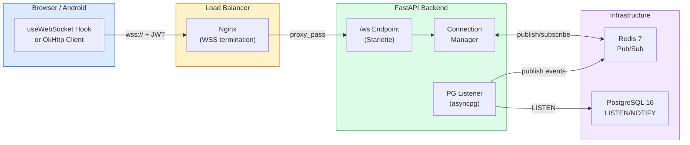

# WebSocket Setup Guide for PMS Integration

**Document ID:** PMS-EXP-WEBSOCKET-001
**Version:** 1.0
**Date:** March 3, 2026
**Applies To:** PMS project (all platforms)
**Prerequisites Level:** Intermediate

---

## Table of Contents

1. [Overview](#1-overview)
2. [Prerequisites](#2-prerequisites)
3. [Part A: Configure WebSocket Infrastructure](#3-part-a-configure-websocket-infrastructure)
4. [Part B: Integrate with PMS Backend](#4-part-b-integrate-with-pms-backend)
5. [Part C: Integrate with PMS Frontend](#5-part-c-integrate-with-pms-frontend)
6. [Part D: Testing and Verification](#6-part-d-testing-and-verification)
7. [Troubleshooting](#7-troubleshooting)
8. [Reference Commands](#8-reference-commands)

---

## 1. Overview

This guide walks you through adding real-time WebSocket communication to the PMS stack. By the end, you will have:

- A FastAPI WebSocket endpoint (`/ws`) with JWT authentication and channel subscriptions
- PostgreSQL NOTIFY triggers firing on patient, encounter, and prescription changes
- A Redis pub/sub layer for cross-instance message broadcasting
- A Connection Manager tracking active connections and routing messages
- A React `useWebSocket` hook for the Next.js frontend with auto-reconnection
- Nginx configured for WebSocket proxy with sticky sessions

### Architecture at a Glance



---

## 2. Prerequisites

### 2.1 Required Software

| Software | Minimum Version | Check Command |
|----------|----------------|---------------|
| Python | 3.11+ | `python3 --version` |
| FastAPI | 0.115+ | `pip show fastapi` |
| asyncpg | 0.29+ | `pip show asyncpg` |
| redis-py | 5.0+ | `pip show redis` |
| Redis Server | 7.x | `redis-server --version` |
| PostgreSQL | 16.x | `psql --version` |
| Node.js | 18+ | `node --version` |
| Nginx | 1.25+ | `nginx -v` |
| Docker & Docker Compose | Latest | `docker --version` |

### 2.2 Installation of Prerequisites

**Redis 7 (if not installed):**

```bash
# macOS with Homebrew
brew install redis

# Or add to Docker Compose (see Part A)

# Verify
redis-server --version  # Should show v7.x
```

**asyncpg (Python async PostgreSQL driver):**

```bash
cd /path/to/pms-backend
source .venv/bin/activate
pip install asyncpg redis[async]
```

### 2.3 Verify PMS Services

Confirm the PMS stack is running:

```bash
# Check PMS backend
curl -s http://localhost:8000/health | python3 -c "import sys,json; print(json.load(sys.stdin))"
# Expected: {"status": "healthy", ...}

# Check PMS frontend
curl -s -o /dev/null -w "%{http_code}" http://localhost:3000
# Expected: 200

# Check PostgreSQL
pg_isready -h localhost -p 5432
# Expected: localhost:5432 - accepting connections
```

**Checkpoint:** Python 3.11+, FastAPI 0.115+, Node.js 18+, PostgreSQL 16, and Docker are installed. PMS backend, frontend, and database are running.

---

## 3. Part A: Configure WebSocket Infrastructure

### 3.1 Add Redis to Docker Compose

Add the Redis service to your existing `docker-compose.yml`:

```yaml
# docker-compose.yml — add to services section
services:
  # ... existing pms-backend, pms-frontend, postgres services ...

  redis:
    image: redis:7-alpine
    container_name: pms-redis
    ports:
      - "6379:6379"
    volumes:
      - redis_data:/data
    command: redis-server --maxmemory 256mb --maxmemory-policy allkeys-lru
    healthcheck:
      test: ["CMD", "redis-cli", "ping"]
      interval: 10s
      timeout: 3s
      retries: 3
    restart: unless-stopped

volumes:
  redis_data:
```

Start Redis:

```bash
docker compose up -d redis
docker compose exec redis redis-cli ping
# Expected: PONG
```

### 3.2 Create PostgreSQL NOTIFY Triggers

Create a migration file for the database triggers:

```sql
-- migrations/add_websocket_notify_triggers.sql

-- Generic notification function that fires on INSERT, UPDATE, DELETE
CREATE OR REPLACE FUNCTION notify_table_change()
RETURNS TRIGGER AS $$
DECLARE
    payload JSON;
    channel TEXT;
BEGIN
    channel := TG_ARGV[0];

    IF TG_OP = 'DELETE' THEN
        payload := json_build_object(
            'operation', TG_OP,
            'table', TG_TABLE_NAME,
            'id', OLD.id,
            'timestamp', NOW()
        );
    ELSE
        payload := json_build_object(
            'operation', TG_OP,
            'table', TG_TABLE_NAME,
            'id', NEW.id,
            'timestamp', NOW()
        );
    END IF;

    PERFORM pg_notify(channel, payload::TEXT);
    RETURN COALESCE(NEW, OLD);
END;
$$ LANGUAGE plpgsql;

-- Patient changes trigger
CREATE TRIGGER patient_change_trigger
    AFTER INSERT OR UPDATE OR DELETE ON patients
    FOR EACH ROW
    EXECUTE FUNCTION notify_table_change('patient_changes');

-- Encounter changes trigger
CREATE TRIGGER encounter_change_trigger
    AFTER INSERT OR UPDATE OR DELETE ON encounters
    FOR EACH ROW
    EXECUTE FUNCTION notify_table_change('encounter_changes');

-- Prescription changes trigger
CREATE TRIGGER prescription_change_trigger
    AFTER INSERT OR UPDATE OR DELETE ON prescriptions
    FOR EACH ROW
    EXECUTE FUNCTION notify_table_change('prescription_changes');
```

Apply the migration:

```bash
psql -h localhost -p 5432 -U pms_user -d pms -f migrations/add_websocket_notify_triggers.sql
```

Verify triggers are installed:

```bash
psql -h localhost -p 5432 -U pms_user -d pms -c "
SELECT trigger_name, event_manipulation, event_object_table
FROM information_schema.triggers
WHERE trigger_name LIKE '%change_trigger';
"
```

### 3.3 Configure Nginx for WebSocket Proxy

Update your Nginx configuration to support WebSocket upgrade:

```nginx
# nginx/conf.d/pms.conf

upstream pms_backend {
    ip_hash;  # Sticky sessions for WebSocket
    server pms-backend-1:8000;
    server pms-backend-2:8001;
}

server {
    listen 443 ssl;
    server_name pms.example.com;

    ssl_certificate     /etc/ssl/certs/pms.crt;
    ssl_certificate_key /etc/ssl/private/pms.key;
    ssl_protocols       TLSv1.3;

    # WebSocket endpoint
    location /ws {
        proxy_pass http://pms_backend;
        proxy_http_version 1.1;
        proxy_set_header Upgrade $http_upgrade;
        proxy_set_header Connection "upgrade";
        proxy_set_header Host $host;
        proxy_set_header X-Real-IP $remote_addr;
        proxy_set_header X-Forwarded-For $proxy_add_x_forwarded_for;
        proxy_set_header X-Forwarded-Proto $scheme;

        # WebSocket timeouts
        proxy_read_timeout 3600s;   # 1 hour max connection
        proxy_send_timeout 3600s;
        proxy_connect_timeout 10s;

        # Rate limiting for new WebSocket connections
        limit_req zone=ws_connect burst=50 nodelay;
    }

    # REST API (existing)
    location /api {
        proxy_pass http://pms_backend;
        proxy_set_header Host $host;
        proxy_set_header X-Real-IP $remote_addr;
    }

    # Frontend (existing)
    location / {
        proxy_pass http://pms-frontend:3000;
    }
}

# Rate limiting zone for WebSocket connections
limit_req_zone $binary_remote_addr zone=ws_connect:10m rate=10r/s;
```

Reload Nginx:

```bash
nginx -t && nginx -s reload
```

**Checkpoint:** Redis is running on :6379. PostgreSQL NOTIFY triggers are installed on `patients`, `encounters`, and `prescriptions` tables. Nginx is configured for WebSocket proxy with sticky sessions and TLS 1.3.

---

## 4. Part B: Integrate with PMS Backend

### 4.1 WebSocket Configuration

Create the WebSocket configuration module:

```python
# app/websocket/config.py
from pydantic_settings import BaseSettings
from enum import Enum


class WSEventType(str, Enum):
    """WebSocket event types for PMS real-time communication."""
    # Patient events
    PATIENT_CREATED = "patient.created"
    PATIENT_UPDATED = "patient.updated"
    PATIENT_STATUS_CHANGED = "patient.status_changed"

    # Encounter events
    ENCOUNTER_LOCKED = "encounter.locked"
    ENCOUNTER_UNLOCKED = "encounter.unlocked"
    ENCOUNTER_UPDATED = "encounter.updated"
    ENCOUNTER_SIGNED = "encounter.signed"

    # Prescription events
    PRESCRIPTION_CREATED = "prescription.created"
    PRESCRIPTION_INTERACTION_ALERT = "prescription.interaction_alert"
    PRESCRIPTION_RECONCILED = "prescription.reconciled"

    # System events
    SYSTEM_ALERT = "system.alert"
    SESSION_EXPIRING = "session.expiring"
    HEARTBEAT = "heartbeat"


class WebSocketSettings(BaseSettings):
    """WebSocket configuration."""
    redis_url: str = "redis://localhost:6379/0"
    heartbeat_interval: int = 30  # seconds
    idle_timeout: int = 300  # 5 minutes
    max_message_rate: int = 100  # per minute per connection
    max_connections_per_user: int = 5
    reconnect_grace_period: int = 60  # seconds to preserve subscriptions

    class Config:
        env_prefix = "WS_"


ws_settings = WebSocketSettings()
```

### 4.2 Connection Manager

Build the server-side connection registry:

```python
# app/websocket/manager.py
import asyncio
import json
import logging
import time
from dataclasses import dataclass, field
from typing import Optional

from fastapi import WebSocket
from redis.asyncio import Redis

from app.websocket.config import ws_settings, WSEventType

logger = logging.getLogger(__name__)


@dataclass
class WSConnection:
    """Represents an authenticated WebSocket connection."""
    websocket: WebSocket
    user_id: int
    user_role: str
    channels: set[str] = field(default_factory=set)
    connected_at: float = field(default_factory=time.time)
    last_activity: float = field(default_factory=time.time)
    message_count: int = 0


class ConnectionManager:
    """Manages WebSocket connections, subscriptions, and message routing."""

    def __init__(self):
        self._connections: dict[str, WSConnection] = {}  # connection_id -> WSConnection
        self._user_connections: dict[int, set[str]] = {}  # user_id -> set of connection_ids
        self._channel_subscribers: dict[str, set[str]] = {}  # channel -> set of connection_ids
        self._redis: Optional[Redis] = None
        self._pubsub = None

    async def startup(self):
        """Initialize Redis connection and start pub/sub listener."""
        self._redis = Redis.from_url(ws_settings.redis_url, decode_responses=True)
        self._pubsub = self._redis.pubsub()
        await self._pubsub.psubscribe("pms:*")
        asyncio.create_task(self._redis_listener())
        logger.info("WebSocket ConnectionManager started with Redis pub/sub")

    async def shutdown(self):
        """Clean up connections and Redis."""
        for conn_id in list(self._connections):
            await self.disconnect(conn_id)
        if self._pubsub:
            await self._pubsub.unsubscribe()
        if self._redis:
            await self._redis.aclose()
        logger.info("WebSocket ConnectionManager shut down")

    async def connect(self, websocket: WebSocket, user_id: int, user_role: str) -> str:
        """Accept a WebSocket connection and register it."""
        # Check per-user connection limit
        user_conns = self._user_connections.get(user_id, set())
        if len(user_conns) >= ws_settings.max_connections_per_user:
            await websocket.close(code=4008, reason="Too many connections")
            raise ConnectionError(f"User {user_id} exceeds max connections")

        await websocket.accept()
        conn_id = f"{user_id}:{id(websocket)}:{time.time()}"

        self._connections[conn_id] = WSConnection(
            websocket=websocket,
            user_id=user_id,
            user_role=user_role,
        )

        self._user_connections.setdefault(user_id, set()).add(conn_id)

        logger.info(f"WebSocket connected: user={user_id}, conn={conn_id}")
        return conn_id

    async def disconnect(self, conn_id: str):
        """Remove a connection and clean up subscriptions."""
        conn = self._connections.pop(conn_id, None)
        if not conn:
            return

        # Remove from user connections
        user_conns = self._user_connections.get(conn.user_id, set())
        user_conns.discard(conn_id)
        if not user_conns:
            self._user_connections.pop(conn.user_id, None)

        # Remove from channel subscriptions
        for channel in conn.channels:
            subs = self._channel_subscribers.get(channel, set())
            subs.discard(conn_id)
            if not subs:
                self._channel_subscribers.pop(channel, None)

        logger.info(f"WebSocket disconnected: user={conn.user_id}, conn={conn_id}")

    async def subscribe(self, conn_id: str, channel: str):
        """Subscribe a connection to a channel (e.g., 'patient:123')."""
        conn = self._connections.get(conn_id)
        if not conn:
            return

        conn.channels.add(channel)
        self._channel_subscribers.setdefault(channel, set()).add(conn_id)
        logger.info(f"Subscribed conn={conn_id} to channel={channel}")

    async def unsubscribe(self, conn_id: str, channel: str):
        """Unsubscribe a connection from a channel."""
        conn = self._connections.get(conn_id)
        if not conn:
            return

        conn.channels.discard(channel)
        subs = self._channel_subscribers.get(channel, set())
        subs.discard(conn_id)

    async def broadcast_to_channel(self, channel: str, event: dict):
        """Send an event to all subscribers of a channel (local instance only)."""
        subscriber_ids = self._channel_subscribers.get(channel, set())
        for conn_id in list(subscriber_ids):
            conn = self._connections.get(conn_id)
            if conn:
                try:
                    await conn.websocket.send_json(event)
                    conn.last_activity = time.time()
                except Exception:
                    await self.disconnect(conn_id)

    async def publish(self, channel: str, event: dict):
        """Publish an event to Redis for cross-instance delivery."""
        if self._redis:
            await self._redis.publish(
                f"pms:{channel}",
                json.dumps(event)
            )

    async def _redis_listener(self):
        """Listen for Redis pub/sub messages and route to local connections."""
        async for message in self._pubsub.listen():
            if message["type"] == "pmessage":
                channel = message["channel"].removeprefix("pms:")
                try:
                    event = json.loads(message["data"])
                    await self.broadcast_to_channel(channel, event)
                except (json.JSONDecodeError, TypeError):
                    logger.warning(f"Invalid message on channel {channel}")

    def get_stats(self) -> dict:
        """Return connection statistics."""
        return {
            "total_connections": len(self._connections),
            "unique_users": len(self._user_connections),
            "total_channels": len(self._channel_subscribers),
        }


# Singleton instance
manager = ConnectionManager()
```

### 4.3 PostgreSQL Change Event Listener

```python
# app/websocket/pg_listener.py
import asyncio
import json
import logging

import asyncpg

from app.websocket.manager import manager

logger = logging.getLogger(__name__)

PG_CHANNELS = ["patient_changes", "encounter_changes", "prescription_changes"]


async def start_pg_listener(dsn: str):
    """Listen for PostgreSQL NOTIFY events and publish to Redis."""
    conn = await asyncpg.connect(dsn)

    for channel in PG_CHANNELS:
        await conn.add_listener(channel, _handle_notification)

    logger.info(f"PostgreSQL LISTEN active on channels: {PG_CHANNELS}")

    # Keep the connection alive
    while True:
        await asyncio.sleep(60)


def _handle_notification(connection, pid, channel, payload):
    """Handle a PostgreSQL NOTIFY event."""
    try:
        data = json.loads(payload)
        table = data.get("table", "unknown")
        operation = data.get("operation", "UNKNOWN")
        record_id = data.get("id")

        # Map database channel to WebSocket channel
        ws_channel = f"{table}:{record_id}" if record_id else table

        event = {
            "type": f"{table}.{operation.lower()}",
            "table": table,
            "operation": operation,
            "id": record_id,
            "timestamp": data.get("timestamp"),
        }

        # Publish to Redis for cross-instance delivery
        asyncio.create_task(manager.publish(ws_channel, event))

        # Also broadcast to the table-level channel (for dashboard-wide listeners)
        asyncio.create_task(manager.publish(table, event))

        logger.info(f"PG NOTIFY: {channel} -> {operation} on {table}:{record_id}")

    except (json.JSONDecodeError, KeyError) as e:
        logger.warning(f"Invalid PG NOTIFY payload on {channel}: {e}")
```

### 4.4 WebSocket API Endpoint

```python
# app/websocket/router.py
import asyncio
import json
import logging
import time

from fastapi import APIRouter, WebSocket, WebSocketDisconnect, Query, Depends
from starlette.websockets import WebSocketState

from app.auth.dependencies import decode_jwt_token
from app.websocket.manager import manager
from app.websocket.config import ws_settings, WSEventType

logger = logging.getLogger(__name__)
router = APIRouter()


@router.websocket("/ws")
async def websocket_endpoint(
    websocket: WebSocket,
    token: str = Query(..., description="JWT authentication token"),
):
    """Main WebSocket endpoint for real-time PMS communication."""
    # Step 1: Validate JWT token
    try:
        user = decode_jwt_token(token)
    except Exception as e:
        await websocket.close(code=4001, reason="Invalid or expired token")
        logger.warning(f"WebSocket auth failed: {e}")
        return

    # Step 2: Register connection
    try:
        conn_id = await manager.connect(websocket, user["id"], user["role"])
    except ConnectionError as e:
        logger.warning(f"WebSocket connection rejected: {e}")
        return

    # Step 3: Send welcome message
    await websocket.send_json({
        "type": "connection.established",
        "connection_id": conn_id,
        "server_time": time.time(),
        "heartbeat_interval": ws_settings.heartbeat_interval,
    })

    # Step 4: Start heartbeat task
    heartbeat_task = asyncio.create_task(_heartbeat_loop(websocket, conn_id))

    # Step 5: Message receive loop
    try:
        while True:
            raw = await websocket.receive_text()
            try:
                message = json.loads(raw)
            except json.JSONDecodeError:
                await websocket.send_json({"type": "error", "message": "Invalid JSON"})
                continue

            await _handle_message(conn_id, message, user)

    except WebSocketDisconnect:
        logger.info(f"WebSocket disconnected: conn={conn_id}")
    except Exception as e:
        logger.error(f"WebSocket error: conn={conn_id}, error={e}")
    finally:
        heartbeat_task.cancel()
        await manager.disconnect(conn_id)


async def _handle_message(conn_id: str, message: dict, user: dict):
    """Route incoming WebSocket messages by type."""
    msg_type = message.get("type", "")

    if msg_type == "subscribe":
        channel = message.get("channel", "")
        # TODO: Validate user has access to this channel (e.g., patient:123)
        await manager.subscribe(conn_id, channel)
        conn = manager._connections.get(conn_id)
        if conn:
            await conn.websocket.send_json({
                "type": "subscribed",
                "channel": channel,
            })

    elif msg_type == "unsubscribe":
        channel = message.get("channel", "")
        await manager.unsubscribe(conn_id, channel)

    elif msg_type == "pong":
        # Client responded to heartbeat
        conn = manager._connections.get(conn_id)
        if conn:
            conn.last_activity = time.time()

    elif msg_type == "token.refresh":
        new_token = message.get("token", "")
        try:
            decode_jwt_token(new_token)
            # Token is valid; connection continues
        except Exception:
            conn = manager._connections.get(conn_id)
            if conn:
                await conn.websocket.send_json({
                    "type": "error",
                    "message": "Token refresh failed",
                })

    else:
        logger.warning(f"Unknown message type: {msg_type} from conn={conn_id}")


async def _heartbeat_loop(websocket: WebSocket, conn_id: str):
    """Send periodic heartbeat pings to detect dead connections."""
    while True:
        await asyncio.sleep(ws_settings.heartbeat_interval)
        conn = manager._connections.get(conn_id)
        if not conn:
            break
        try:
            if websocket.application_state == WebSocketState.CONNECTED:
                await websocket.send_json({"type": "ping", "timestamp": time.time()})
        except Exception:
            break


@router.get("/ws/stats")
async def websocket_stats():
    """Return WebSocket connection statistics (admin only)."""
    return manager.get_stats()
```

### 4.5 Register WebSocket in FastAPI Application

```python
# app/main.py — add to existing FastAPI app setup
from contextlib import asynccontextmanager

from app.websocket.manager import manager
from app.websocket.pg_listener import start_pg_listener
from app.websocket.router import router as ws_router


@asynccontextmanager
async def lifespan(app):
    # Startup
    await manager.startup()
    pg_task = asyncio.create_task(start_pg_listener(DATABASE_URL))
    yield
    # Shutdown
    pg_task.cancel()
    await manager.shutdown()


app = FastAPI(lifespan=lifespan)
app.include_router(ws_router)
```

**Checkpoint:** WebSocket endpoint is registered at `/ws` with JWT authentication. Connection Manager handles subscriptions and Redis pub/sub. PostgreSQL LISTEN triggers fire on data changes and publish events via Redis.

---

## 5. Part C: Integrate with PMS Frontend

### 5.1 Create the `useWebSocket` React Hook

```typescript
// src/hooks/useWebSocket.ts
import { useCallback, useEffect, useRef, useState } from "react";

export type WSConnectionState =
  | "connecting"
  | "connected"
  | "reconnecting"
  | "disconnected";

export interface WSEvent {
  type: string;
  [key: string]: unknown;
}

interface UseWebSocketOptions {
  url: string;
  token: string;
  onEvent?: (event: WSEvent) => void;
  heartbeatInterval?: number; // ms, default 30000
  reconnectMaxDelay?: number; // ms, default 30000
  enabled?: boolean;
}

interface UseWebSocketReturn {
  state: WSConnectionState;
  send: (message: object) => void;
  subscribe: (channel: string) => void;
  unsubscribe: (channel: string) => void;
  lastEvent: WSEvent | null;
}

export function useWebSocket({
  url,
  token,
  onEvent,
  heartbeatInterval = 30000,
  reconnectMaxDelay = 30000,
  enabled = true,
}: UseWebSocketOptions): UseWebSocketReturn {
  const wsRef = useRef<WebSocket | null>(null);
  const reconnectAttempt = useRef(0);
  const reconnectTimer = useRef<ReturnType<typeof setTimeout>>();
  const heartbeatTimer = useRef<ReturnType<typeof setInterval>>();

  const [state, setState] = useState<WSConnectionState>("disconnected");
  const [lastEvent, setLastEvent] = useState<WSEvent | null>(null);

  const connect = useCallback(() => {
    if (!enabled || !token) return;

    const wsUrl = `${url}?token=${encodeURIComponent(token)}`;
    setState("connecting");

    const ws = new WebSocket(wsUrl);
    wsRef.current = ws;

    ws.onopen = () => {
      setState("connected");
      reconnectAttempt.current = 0;

      // Start heartbeat response listener (server sends ping, we send pong)
      heartbeatTimer.current = setInterval(() => {
        if (ws.readyState === WebSocket.OPEN) {
          ws.send(JSON.stringify({ type: "pong" }));
        }
      }, heartbeatInterval);
    };

    ws.onmessage = (event) => {
      try {
        const data: WSEvent = JSON.parse(event.data);

        // Handle ping from server
        if (data.type === "ping") {
          ws.send(JSON.stringify({ type: "pong" }));
          return;
        }

        setLastEvent(data);
        onEvent?.(data);
      } catch {
        console.warn("Invalid WebSocket message:", event.data);
      }
    };

    ws.onclose = (event) => {
      if (heartbeatTimer.current) clearInterval(heartbeatTimer.current);

      if (event.code === 4001) {
        // Auth failure — don't reconnect
        setState("disconnected");
        return;
      }

      // Reconnect with exponential backoff + jitter
      setState("reconnecting");
      const attempt = reconnectAttempt.current++;
      const baseDelay = Math.min(1000 * Math.pow(2, attempt), reconnectMaxDelay);
      const jitter = baseDelay * 0.5 * Math.random();
      const delay = baseDelay + jitter;

      reconnectTimer.current = setTimeout(connect, delay);
    };

    ws.onerror = () => {
      // onclose will fire after onerror
    };
  }, [url, token, enabled, onEvent, heartbeatInterval, reconnectMaxDelay]);

  // Connect on mount, reconnect on token change
  useEffect(() => {
    connect();
    return () => {
      if (reconnectTimer.current) clearTimeout(reconnectTimer.current);
      if (heartbeatTimer.current) clearInterval(heartbeatTimer.current);
      reconnectAttempt.current = 0;
      wsRef.current?.close(1000, "Component unmounted");
    };
  }, [connect]);

  const send = useCallback((message: object) => {
    if (wsRef.current?.readyState === WebSocket.OPEN) {
      wsRef.current.send(JSON.stringify(message));
    }
  }, []);

  const subscribe = useCallback(
    (channel: string) => send({ type: "subscribe", channel }),
    [send]
  );

  const unsubscribe = useCallback(
    (channel: string) => send({ type: "unsubscribe", channel }),
    [send]
  );

  return { state, send, subscribe, unsubscribe, lastEvent };
}
```

### 5.2 Create WebSocket Provider Context

```typescript
// src/providers/WebSocketProvider.tsx
"use client";

import { createContext, useContext, useEffect, ReactNode, useCallback, useState } from "react";
import { useWebSocket, WSConnectionState, WSEvent } from "@/hooks/useWebSocket";
import { useAuth } from "@/hooks/useAuth";

interface WebSocketContextValue {
  state: WSConnectionState;
  subscribe: (channel: string) => void;
  unsubscribe: (channel: string) => void;
  addEventListener: (type: string, handler: (event: WSEvent) => void) => () => void;
}

const WebSocketContext = createContext<WebSocketContextValue | null>(null);

export function WebSocketProvider({ children }: { children: ReactNode }) {
  const { token } = useAuth();
  const [handlers, setHandlers] = useState<Map<string, Set<(event: WSEvent) => void>>>(new Map());

  const handleEvent = useCallback(
    (event: WSEvent) => {
      const typeHandlers = handlers.get(event.type);
      if (typeHandlers) {
        typeHandlers.forEach((handler) => handler(event));
      }
      // Also fire wildcard handlers
      const wildcardHandlers = handlers.get("*");
      if (wildcardHandlers) {
        wildcardHandlers.forEach((handler) => handler(event));
      }
    },
    [handlers]
  );

  const wsUrl = process.env.NEXT_PUBLIC_WS_URL || "wss://localhost:8000/ws";

  const { state, subscribe, unsubscribe } = useWebSocket({
    url: wsUrl,
    token: token || "",
    onEvent: handleEvent,
    enabled: !!token,
  });

  const addEventListener = useCallback(
    (type: string, handler: (event: WSEvent) => void) => {
      setHandlers((prev) => {
        const next = new Map(prev);
        const set = next.get(type) || new Set();
        set.add(handler);
        next.set(type, set);
        return next;
      });

      // Return unsubscribe function
      return () => {
        setHandlers((prev) => {
          const next = new Map(prev);
          const set = next.get(type);
          if (set) {
            set.delete(handler);
            if (set.size === 0) next.delete(type);
          }
          return next;
        });
      };
    },
    []
  );

  return (
    <WebSocketContext.Provider value={{ state, subscribe, unsubscribe, addEventListener }}>
      {children}
    </WebSocketContext.Provider>
  );
}

export function useWS() {
  const ctx = useContext(WebSocketContext);
  if (!ctx) throw new Error("useWS must be used within WebSocketProvider");
  return ctx;
}
```

### 5.3 Real-Time Patient Record Updates Component

```typescript
// src/components/PatientRecordLive.tsx
"use client";

import { useEffect, useState } from "react";
import { useWS } from "@/providers/WebSocketProvider";
import { WSEvent } from "@/hooks/useWebSocket";

interface PatientRecordLiveProps {
  patientId: number;
  onPatientUpdate: () => void; // Callback to refetch patient data
}

export function PatientRecordLive({ patientId, onPatientUpdate }: PatientRecordLiveProps) {
  const { state, subscribe, unsubscribe, addEventListener } = useWS();
  const [lastUpdate, setLastUpdate] = useState<string | null>(null);

  // Subscribe to this patient's channel
  useEffect(() => {
    if (state === "connected") {
      subscribe(`patients:${patientId}`);
      return () => unsubscribe(`patients:${patientId}`);
    }
  }, [state, patientId, subscribe, unsubscribe]);

  // Listen for patient updates
  useEffect(() => {
    const removeListener = addEventListener("patients.update", (event: WSEvent) => {
      if (event.id === patientId) {
        setLastUpdate(new Date().toLocaleTimeString());
        onPatientUpdate(); // Trigger data refetch
      }
    });
    return removeListener;
  }, [patientId, addEventListener, onPatientUpdate]);

  return (
    <div className="flex items-center gap-2 text-sm">
      <span
        className={`h-2 w-2 rounded-full ${
          state === "connected"
            ? "bg-green-500"
            : state === "reconnecting"
            ? "bg-yellow-500 animate-pulse"
            : "bg-red-500"
        }`}
      />
      <span className="text-gray-500">
        {state === "connected"
          ? "Live"
          : state === "reconnecting"
          ? "Reconnecting..."
          : "Offline"}
      </span>
      {lastUpdate && (
        <span className="text-gray-400">Last update: {lastUpdate}</span>
      )}
    </div>
  );
}
```

### 5.4 Add Environment Variable

```bash
# .env.local (Next.js frontend)
NEXT_PUBLIC_WS_URL=wss://localhost:8000/ws
```

### 5.5 Wrap Application with Provider

```typescript
// src/app/layout.tsx — add WebSocketProvider to the component tree
import { WebSocketProvider } from "@/providers/WebSocketProvider";

export default function RootLayout({ children }: { children: React.ReactNode }) {
  return (
    <html lang="en">
      <body>
        <AuthProvider>
          <WebSocketProvider>
            {children}
          </WebSocketProvider>
        </AuthProvider>
      </body>
    </html>
  );
}
```

**Checkpoint:** The `useWebSocket` hook manages connection lifecycle with JWT auth, auto-reconnection, and heartbeat. `WebSocketProvider` wraps the app and provides typed event listeners. `PatientRecordLive` demonstrates real-time updates for a specific patient.

---

## 6. Part D: Testing and Verification

### 6.1 Test WebSocket Connection

```bash
# Install wscat for command-line WebSocket testing
npm install -g wscat

# Connect with a JWT token
wscat -c "ws://localhost:8000/ws?token=YOUR_JWT_TOKEN"

# You should receive:
# {"type": "connection.established", "connection_id": "...", "server_time": ..., "heartbeat_interval": 30}
```

### 6.2 Test Channel Subscriptions

```bash
# In the wscat session, subscribe to a patient channel:
> {"type": "subscribe", "channel": "patients:1"}

# Expected response:
# {"type": "subscribed", "channel": "patients:1"}
```

### 6.3 Test PostgreSQL NOTIFY → WebSocket Pipeline

In a separate terminal, trigger a patient update:

```bash
# Update a patient record to fire the NOTIFY trigger
psql -h localhost -p 5432 -U pms_user -d pms -c "
UPDATE patients SET status = 'active' WHERE id = 1;
"

# In your wscat session subscribed to patients:1, you should receive:
# {"type": "patients.update", "table": "patients", "operation": "UPDATE", "id": 1, "timestamp": "..."}
```

### 6.4 Test Connection Stats

```bash
curl -s http://localhost:8000/ws/stats | python3 -m json.tool
# Expected:
# {
#     "total_connections": 1,
#     "unique_users": 1,
#     "total_channels": 1
# }
```

### 6.5 Test Reconnection

```bash
# In wscat, disconnect and reconnect:
# 1. Kill the wscat process (Ctrl+C)
# 2. Reconnect immediately — should succeed
# 3. In the Next.js frontend, toggle network off/on in DevTools
#    — the connection indicator should show yellow (reconnecting) then green (connected)
```

### 6.6 Load Test (Optional)

```bash
# Install artillery for WebSocket load testing
npm install -g artillery

# Create artillery config
cat > ws-load-test.yml << 'YAML'
config:
  target: "ws://localhost:8000"
  phases:
    - duration: 60
      arrivalRate: 10
      name: "Ramp up"
  engines:
    ws: {}

scenarios:
  - engine: ws
    flow:
      - send:
          url: "/ws?token=TEST_TOKEN"
      - think: 5
      - send: '{"type": "subscribe", "channel": "patients:1"}'
      - think: 30
YAML

artillery run ws-load-test.yml
```

**Checkpoint:** WebSocket connection, authentication, subscriptions, PostgreSQL NOTIFY pipeline, and reconnection all verified. Connection stats endpoint returns accurate counts.

---

## 7. Troubleshooting

### 7.1 WebSocket Upgrade Fails (HTTP 426 or 400)

**Symptom:** Browser console shows `WebSocket connection to 'wss://...' failed` or HTTP 426 response.

**Solution:**
1. Verify Nginx has the `proxy_set_header Upgrade` and `proxy_set_header Connection "upgrade"` directives
2. Check that `proxy_http_version 1.1` is set (WebSocket requires HTTP/1.1 upgrade)
3. Confirm the backend is running an ASGI server (uvicorn), not a WSGI server (gunicorn without uvicorn workers)
4. Test direct connection to backend: `wscat -c "ws://localhost:8000/ws?token=TOKEN"` — if this works, the issue is in Nginx

### 7.2 Authentication Fails on Connect (Code 4001)

**Symptom:** WebSocket connects but immediately closes with code 4001 "Invalid or expired token."

**Solution:**
1. Verify the JWT token is valid: `curl -H "Authorization: Bearer TOKEN" http://localhost:8000/api/health`
2. Check token is passed as query parameter, not header: WebSocket API doesn't support custom headers during upgrade
3. Verify the token hasn't expired — JWT tokens used for WebSocket should have longer expiry or use the `token.refresh` mechanism
4. Check server logs for specific JWT decode errors

### 7.3 No Events Received After Subscription

**Symptom:** Connected and subscribed to a channel, but database changes don't produce WebSocket events.

**Solution:**
1. Verify PostgreSQL triggers exist: `SELECT trigger_name FROM information_schema.triggers WHERE trigger_name LIKE '%change_trigger'`
2. Test NOTIFY manually: `psql -c "NOTIFY patient_changes, '{\"test\": true}'"` — check server logs for receipt
3. Verify Redis is running: `redis-cli ping` should return PONG
4. Check that the pg_listener background task started: look for "PostgreSQL LISTEN active" in server logs
5. Ensure the asyncpg DSN uses the correct database credentials

### 7.4 Connection Drops Every Few Minutes

**Symptom:** WebSocket disconnects periodically (every 60-300 seconds).

**Solution:**
1. Check Nginx `proxy_read_timeout` — if set too low, Nginx closes idle connections. Set to 3600s
2. Verify heartbeat is working: server should send ping every 30s, client should respond with pong
3. Check for intermediate proxies (CloudFlare, AWS ALB) that may have their own idle timeouts
4. AWS ALB idle timeout default is 60s — increase to 3600s for WebSocket

### 7.5 Messages Not Reaching Clients on Other Instances

**Symptom:** In a multi-instance deployment, changes made via Instance 1 don't reach clients connected to Instance 2.

**Solution:**
1. Verify Redis pub/sub is working: `redis-cli subscribe "pms:*"` in one terminal, `redis-cli publish "pms:test" "hello"` in another
2. Check that both instances connect to the same Redis instance
3. Verify the `_redis_listener` task is running on both instances (check logs for "WebSocket ConnectionManager started with Redis pub/sub")
4. Ensure Redis URL is correct in both instance configurations

### 7.6 High Memory Usage with Many Connections

**Symptom:** Backend memory grows significantly with 1000+ connections.

**Solution:**
1. Check per-connection memory with `/ws/stats` — should be < 50 KB per connection
2. Ensure disconnected connections are being cleaned up (check for connection leaks)
3. Add connection limits: `ws_settings.max_connections_per_user = 5`
4. Implement idle timeout: close connections with no activity for 5+ minutes

---

## 8. Reference Commands

### Daily Development Workflow

```bash
# Start PMS stack with Redis
docker compose up -d

# Run backend with WebSocket support
cd pms-backend && uvicorn app.main:app --reload --host 0.0.0.0 --port 8000

# Run frontend
cd pms-frontend && npm run dev

# Test WebSocket connection
wscat -c "ws://localhost:8000/ws?token=$(curl -s -X POST http://localhost:8000/api/auth/login -H 'Content-Type: application/json' -d '{"email":"dev@pms.local","password":"dev"}' | python3 -c 'import sys,json; print(json.load(sys.stdin)["token"])')"
```

### Management Commands

| Command | Purpose |
|---------|---------|
| `curl http://localhost:8000/ws/stats` | Check active WebSocket connections |
| `redis-cli pubsub channels "pms:*"` | List active Redis pub/sub channels |
| `redis-cli pubsub numsub "pms:patients"` | Count subscribers per channel |
| `redis-cli monitor` | Watch all Redis commands in real-time |
| `wscat -c "ws://localhost:8000/ws?token=TOKEN"` | CLI WebSocket client for testing |

### Useful URLs

| Resource | URL |
|----------|-----|
| FastAPI WebSocket docs | https://fastapi.tiangolo.com/advanced/websockets/ |
| Starlette WebSocket reference | https://www.starlette.io/websockets/ |
| Redis pub/sub docs | https://redis.io/docs/interact/pubsub/ |
| PostgreSQL LISTEN/NOTIFY | https://www.postgresql.org/docs/16/sql-notify.html |
| asyncpg documentation | https://magicstack.github.io/asyncpg/ |
| react-use-websocket (alternative) | https://github.com/robtaussig/react-use-websocket |
| wscat CLI tool | https://github.com/websockets/wscat |

---

## Next Steps

After completing this setup:

1. **[WebSocket Developer Tutorial](37-WebSocket-Developer-Tutorial.md)** — Build an encounter collaboration system with presence indicators and conflict detection end-to-end
2. **[Speechmatics Flow API (Exp 33)](33-PRD-SpeechmaticsFlow-PMS-Integration.md)** — Explore voice agent WebSocket streaming integration
3. **[MCP PMS Integration (Exp 09)](09-PRD-MCP-PMS-Integration.md)** — Connect WebSocket events with MCP tool notifications

---

## Resources

- [FastAPI WebSockets Documentation](https://fastapi.tiangolo.com/advanced/websockets/)
- [Starlette WebSocket Reference](https://www.starlette.io/websockets/)
- [asyncpg — Async PostgreSQL Client](https://magicstack.github.io/asyncpg/)
- [Redis Pub/Sub Documentation](https://redis.io/docs/interact/pubsub/)
- [PostgreSQL LISTEN/NOTIFY](https://www.postgresql.org/docs/16/sql-notify.html)
- [WebSocket Protocol (RFC 6455)](https://datatracker.ietf.org/doc/html/rfc6455)
- [Scaling Pub/Sub with WebSockets and Redis](https://ably.com/blog/scaling-pub-sub-with-websockets-and-redis)
