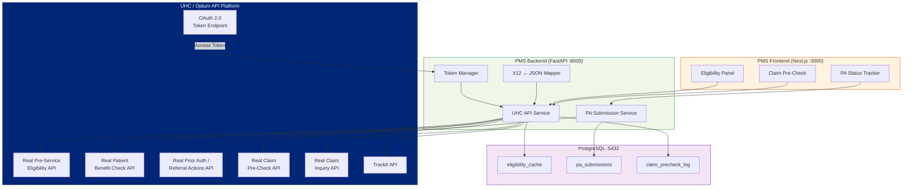

# Product Requirements Document: UHC API Marketplace Integration into Patient Management System (PMS)

**Document ID:** PRD-PMS-UHCAPI-001
**Version:** 1.0
**Date:** 2026-03-07
**Author:** Ammar (CEO, MPS Inc.)
**Status:** Draft

---

## 1. Executive Summary

The UHC API Marketplace (`apimarketplace.uhcprovider.com`) is UnitedHealthcare's provider-facing API platform offering real-time access to eligibility, benefits, claims, and prior authorization data via OAuth 2.0-secured REST APIs. Built on Optum's infrastructure, it provides JSON-wrapped X12 EDI transactions (270/271 for eligibility, 278 for prior authorization, 837 for claims) that can be integrated directly into EHR and practice management systems.

For Texas Retina Associates (TRA), this is the single most impactful integration opportunity. UHC is the largest Medicare Advantage payer nationally, and the API Marketplace provides the exact data the PA workflow needs: real-time eligibility verification, benefit checks (copays, deductibles, auth requirements), prior authorization submission and status tracking, and claim pre-submission validation. This replaces manual UHC Provider Portal lookups and phone calls with automated, sub-second API calls embedded in the PMS encounter workflow.

Combined with Experiment 45 (CMS Coverage API for Medicare FFS) and Experiment 44 (payer policy PDFs for other commercial payers), this integration gives the PMS real-time coverage and PA capabilities for UHC — the payer most frequently encountered by TRA's retina patient population.

## 2. Problem Statement

The current UHC workflow at a retina practice involves significant manual effort:

- **Eligibility verification**: Staff log into the UHC Provider Portal or call the automated line to verify patient eligibility before each visit. This takes 3-5 minutes per patient.
- **Benefit check**: Determining copay amounts, deductible status, and whether a referral or PA is needed requires navigating multiple portal screens. Staff often miss coordination of benefits (COB) details.
- **Prior authorization submission**: PA requests for anti-VEGF injections (CPT 67028) are submitted through the UHC Provider Portal web form or faxed. Turnaround is 24-72 hours for standard requests. There is no programmatic way to submit or check PA status.
- **Claim pre-validation**: Claims are submitted without pre-validation, leading to a 5-8% denial rate on first submission — primarily due to eligibility gaps, missing PA, or incorrect coding.
- **No Gold Card visibility**: TRA may qualify for UHC's Gold Card program (automatic PA approval for ~500 procedure codes), but staff have no automated way to check Gold Card status or leverage it in the workflow.

## 3. Proposed Solution

### 3.1 Architecture Overview

### 3.2 Deployment Model

- **Cloud API**: The UHC API Marketplace is a managed cloud platform. No self-hosting required.
- **Registration required**: Must create a OneHealthcare ID, register an organization, and get security review approval before API access is granted.
- **OAuth 2.0**: All API calls authenticated via client ID + client secret → access token. Tokens are short-lived.
- **Sandbox first**: UHC provides a sandbox environment with mock data for development and testing before production access.
- **Free for providers**: The APIs are free for registered healthcare providers.
- **HIPAA**: UHC API calls involve real patient data (eligibility, benefits, PA status). A BAA with UHC/Optum is required. All data must be encrypted in transit (HTTPS enforced) and at rest within PMS.
- **X12 EDI**: APIs accept and return X12-standard transactions (270/271, 278, 837) wrapped in JSON. The PMS mapper translates between FHIR/internal formats and X12 JSON.

## 4. PMS Data Sources

| PMS API | Endpoint | Interaction |
|---------|----------|-------------|
| Patient Records | `/api/patients` | Retrieve patient UHC member ID, subscriber info, and plan details for eligibility queries |
| Encounter Records | `/api/encounters` | Get procedure codes (CPT), diagnosis codes (ICD-10), and service dates for PA and claim pre-check |
| Prescription API | `/api/prescriptions` | Get drug HCPCS codes (J-codes) for Part B drug PA requirements |
| Reporting API | `/api/reports` | Track PA approval rates, claim pre-check pass rates, and eligibility verification volumes |

## 5. Component/Module Definitions

### 5.1 OAuth Token Manager

- **Description**: Manages OAuth 2.0 client credentials flow for the UHC API Marketplace. Obtains access tokens using client ID and secret, caches with TTL, and auto-refreshes.
- **Input**: Client ID, client secret (from UHC API Marketplace registration).
- **Output**: Access token for API calls.
- **Security**: Credentials stored in Docker secrets or environment variables, never in code or database.

### 5.2 Real Pre-Service Eligibility Service

- **Description**: Calls the Real Pre-Service Eligibility API before each patient visit to verify active coverage, plan type, PCP assignment, and coordination of benefits.
- **Input**: Patient member ID, date of service, provider NPI.
- **Output**: Eligibility status, plan details, network status, COB information.
- **X12 Standard**: 270/271 (Eligibility Inquiry/Response) wrapped in JSON.
- **PMS APIs used**: `/api/patients` (member ID lookup), `/api/encounters` (upcoming appointments).

### 5.3 Real Patient Benefit Check Service

- **Description**: Queries real-time benefit details including copay, coinsurance, deductible, out-of-pocket max, and whether prior authorization or referral is required for a specific service.
- **Input**: Patient member ID, CPT/HCPCS code, date of service.
- **Output**: Benefit details, patient responsibility estimate, PA/referral requirements.
- **PMS APIs used**: `/api/encounters` (procedure codes), `/api/patients` (member ID).

### 5.4 Prior Authorization Submission Service

- **Description**: Submits PA requests to UHC electronically via the Real Prior Auth/Referral Actions API. Accepts requests in JSON (internally mapped to X12-278), tracks submission status, and polls for decisions.
- **Input**: Patient info, provider info, procedure code, diagnosis codes, clinical documentation.
- **Output**: PA reference number, status (approved/pended/denied), decision details.
- **X12 Standard**: 278 (Prior Authorization Request/Response) wrapped in JSON.
- **PMS APIs used**: `/api/encounters`, `/api/patients`, `/api/prescriptions`.

### 5.5 Real Claim Pre-Check Service

- **Description**: Validates key claim components before submission — eligibility, COB, PA requirements, and claim edits. Catches errors before adjudication to reduce denial rates.
- **Input**: Claim data (X12 837P/837I format in JSON): patient, provider, procedure codes, diagnosis codes, charges.
- **Output**: Validation result with pass/fail on each component, actionable error messages.
- **X12 Standard**: 837P/837I → 277CA/999 responses.
- **PMS APIs used**: `/api/encounters` (claim data assembly).

### 5.6 Real Claim Inquiry Service

- **Description**: Queries real-time claim status after submission — summaries, details, and status updates.
- **Input**: Claim tracking number or patient/date-of-service.
- **Output**: Claim status, payment details, denial reasons.
- **PMS APIs used**: `/api/reports` (claim status dashboard).

### 5.7 TrackIt Integration

- **Description**: Tracks pended claims that need additional information and outlines required steps for reconsiderations and attachments.
- **Input**: Provider TIN, pended claim reference.
- **Output**: Required actions, attachment instructions, deadlines.
- **PMS APIs used**: `/api/reports` (worklist items).

## 6. Non-Functional Requirements

### 6.1 Security and HIPAA Compliance

- **BAA required**: UHC API calls involve real PHI (member IDs, eligibility, benefits, PA decisions). A Business Associate Agreement with UHC/Optum is required.
- **Encryption**: All API traffic over HTTPS (TLS 1.2+). All cached PHI encrypted at rest in PostgreSQL (AES-256).
- **Credential security**: OAuth client ID and secret stored in Docker secrets or environment variables. Never logged, never in source code.
- **Audit logging**: Every API call logged with timestamp, user ID, patient ID, endpoint called, response status. Logs retained 7 years per HIPAA.
- **Minimum necessary**: Only request the data fields needed for the clinical workflow. Do not cache eligibility data beyond the encounter date.

### 6.2 Performance

| Metric | Target |
|--------|--------|
| Eligibility check latency | < 2 seconds |
| Benefit check latency | < 3 seconds |
| PA submission latency | < 5 seconds |
| Claim pre-check latency | < 5 seconds |
| Daily API call volume | ~200-500 (based on TRA patient volume) |
| Cache TTL (eligibility) | Same day only |

### 6.3 Infrastructure

- **No new infrastructure**: API calls made from existing FastAPI backend.
- **PostgreSQL**: Cache tables for eligibility results, PA submissions, and claim pre-check logs.
- **Sandbox environment**: Development and testing against UHC sandbox before production.
- **Network**: Outbound HTTPS to `apimarketplace.uhcprovider.com` and Optum API endpoints.

## 7. Implementation Phases

### Phase 1: Registration and Eligibility (Sprint 1 — 2 weeks)

- Register organization on UHC API Marketplace
- Obtain sandbox credentials (client ID + secret)
- Implement OAuth Token Manager
- Build Real Pre-Service Eligibility Service
- Build Real Patient Benefit Check Service
- Create eligibility panel on frontend

### Phase 2: Prior Authorization (Sprint 2 — 2 weeks)

- Implement PA Submission Service with X12-278 JSON mapping
- Build PA status tracking and polling
- Create PA submission UI on frontend
- Integrate PA check into encounter workflow (auto-check if PA needed before injection)

### Phase 3: Claims and Production (Sprint 3 — 2 weeks)

- Implement Claim Pre-Check Service
- Implement Claim Inquiry Service
- Build TrackIt integration
- Request production credentials from UHC
- Cutover from sandbox to production
- Monitor and tune

## 8. Success Metrics

| Metric | Target | Measurement |
|--------|--------|-------------|
| Eligibility check time | < 2 sec (from 3-5 min manual) | API response time |
| PA submission time | < 5 sec (from 15-30 min portal/fax) | API response time |
| Claim first-pass rate | > 95% (from ~92%) | Claim pre-check pass rate |
| PA approval rate visibility | 100% of UHC PAs tracked | PA submission log completeness |
| Staff manual portal logins | -80% reduction | UHC Provider Portal login count |

## 9. Risks and Mitigations

| Risk | Impact | Mitigation |
|------|--------|------------|
| UHC registration approval delay | Cannot access APIs | Start registration immediately; sandbox does not require full approval |
| PA Submission API still in beta | May not be available for production use | Use Provider Portal as fallback; monitor Optum release notes for GA |
| X12 mapping complexity | Incorrect eligibility/PA data | Use Optum's JSON format (X12 handled server-side); validate against portal results |
| OAuth token expiry | Failed API calls | Token Manager auto-refreshes; retry on 401 |
| UHC API downtime | Cannot verify eligibility | Cache last-known eligibility for same-day fallback; show "unverified" badge |
| PHI in API responses | HIPAA compliance risk | Encrypt at rest, audit log all access, enforce minimum necessary, same-day cache TTL |

## 10. Dependencies

| Dependency | Type | Notes |
|------------|------|-------|
| UHC API Marketplace | External API | Free, requires OneHealthcare ID registration and security review |
| OneHealthcare ID | Account | Organization-level registration, one-time process |
| OAuth 2.0 credentials | Secret | Client ID + secret from API Marketplace registration |
| BAA with UHC/Optum | Legal | Required for production PHI access |
| Provider NPI | Data | National Provider Identifier for TRA |
| Provider TIN | Data | Tax Identification Number for TRA |
| PostgreSQL 14+ | Infrastructure | Already deployed in PMS |
| FastAPI | Framework | Already deployed in PMS |
| `httpx` | Python library | Async HTTP client for API calls |
| Experiment 44 | Internal | UHC PA requirement PDFs provide coverage context for PA submissions |
| Experiment 45 | Internal | CMS Coverage API provides Medicare FFS coverage; UHC API covers Medicare Advantage |

## 11. Comparison with Existing Experiments

| Aspect | Exp 44 (Payer Policy Download) | Exp 45 (CMS Coverage API) | Exp 46 (UHC API Marketplace) |
|--------|-------------------------------|--------------------------|------------------------------|
| **Payer** | 6 payers (CMS, UHC, Aetna, BCBS, Humana, Cigna) | CMS Medicare FFS only | UnitedHealthcare only |
| **Data type** | Policy documents (PDFs) | Coverage determinations (LCDs/NCDs) | Real-time eligibility, benefits, PA, claims |
| **Data freshness** | Snapshot at download time | Daily sync via API | Real-time per API call |
| **Patient-specific** | No (general policies) | No (general coverage rules) | **Yes** (real patient eligibility and benefits) |
| **PA submission** | No (rules only) | No (coverage only) | **Yes** (submit PA electronically) |
| **Claims** | No | No | **Yes** (pre-check and inquiry) |
| **Authentication** | None (public documents) | License agreement token (free) | OAuth 2.0 (registered provider) |
| **HIPAA/PHI** | No PHI | No PHI | **PHI** (patient data in every call) |

**Key relationship**: Experiments 44 and 45 provide the coverage rules and policy context. Experiment 46 provides real-time, patient-specific transactions. Together they form a complete PA workflow: check policy rules (Exp 44/45) → verify eligibility (Exp 46) → submit PA (Exp 46) → track status (Exp 46) → pre-check claim (Exp 46).

## 12. Research Sources

**Official Documentation:**
- [UHC API Marketplace](https://apimarketplace.uhcprovider.com/) — Registration, sandbox, API catalog
- [UHC API Types](https://www.uhcprovider.com/en/resource-library/Application-Programming-Interface/api-types.html) — Overview of available API transaction types
- [UHC API Connectivity](https://www.uhcprovider.com/en/resource-library/Application-Programming-Interface/api-connectivity.html) — Registration process and reference guides

**Optum Developer Portal:**
- [Optum Developer Portal](https://developer.optum.com/) — Technical documentation hub
- [Optum Real APIs for Medical Providers](https://marketplace.optum.com/products/optum-real/optum-real-apis-for-medical-providers.html) — Real API product overview
- [Prior Authorization Submission API](https://marketplace.optum.com/products/eligibility_and_claims/prior-authorization-submission-api.html) — PA API details (currently beta)
- [Eligibility API FAQs](https://developer.optum.com/eligibilityandclaims/docs/eligibility-api-faqs) — Common questions and sandbox guidance

**UHC Provider Resources:**
- [UHC Prior Authorization and Notification](https://www.uhcprovider.com/en/prior-auth-advance-notification.html) — PA requirements and submission methods
- [UHC Gold Card Program](https://www.uhcprovider.com/en/prior-auth-advance-notification/gold-card.html) — Automatic PA approval for qualifying providers
- [UHC Interoperability APIs](https://www.uhc.com/legal/interoperability-apis) — FHIR-based Patient Access, Provider Access, and Prior Authorization APIs

**Regulation:**
- [CMS-0057-F Interoperability Final Rule](https://www.cms.gov/cms-interoperability-and-prior-authorization-final-rule-cms-0057-f) — Mandates payer PA APIs by January 2027

## 13. Appendix: Related Documents

- [UHC API Marketplace Setup Guide](46-UHCAPIMarketplace-PMS-Developer-Setup-Guide.md)
- [UHC API Marketplace Developer Tutorial](46-UHCAPIMarketplace-Developer-Tutorial.md)
- [Experiment 44 PRD: Payer Policy Download](44-PRD-PayerPolicyDownload-PMS-Integration.md)
- [Experiment 45 PRD: CMS Coverage API](45-PRD-CMSCoverageAPI-PMS-Integration.md)
