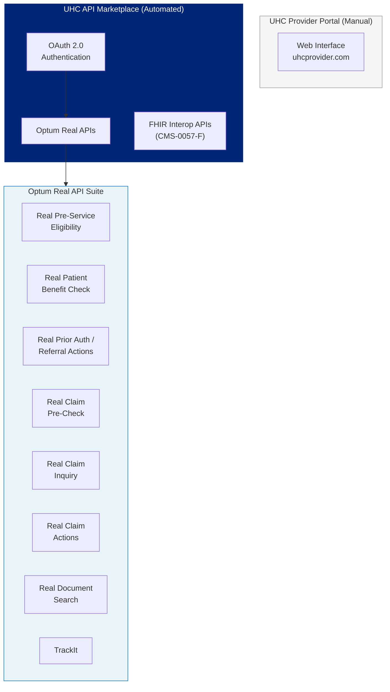
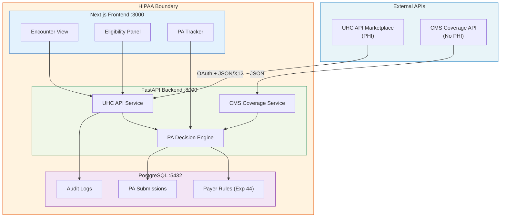

# UHC API Marketplace Developer Onboarding Tutorial

**Welcome to the MPS PMS UHC API Marketplace Integration Team**

This tutorial will take you from zero to building your first real-time eligibility verification and prior authorization submission using the UHC API Marketplace. By the end, you will understand UHC's API ecosystem, have tested against the sandbox, and built a workflow that checks eligibility, verifies benefits, and submits a PA request — all from a single encounter screen.

**Document ID:** PMS-EXP-UHCAPI-002
**Version:** 1.0
**Date:** 2026-03-07
**Applies To:** PMS project (all platforms)
**Prerequisite:** [UHC API Marketplace Setup Guide](46-UHCAPIMarketplace-PMS-Developer-Setup-Guide.md)
**Estimated time:** 2-3 hours
**Difficulty:** Beginner-friendly

---

## What You Will Learn

1. How UHC's API Marketplace fits into the healthcare revenue cycle
2. The relationship between UHC Provider Portal, API Marketplace, and Optum Real APIs
3. How OAuth 2.0 client credentials flow works for provider API access
4. How X12 EDI transactions (270/271, 278, 837) are wrapped in JSON
5. How to verify patient eligibility in real time before a visit
6. How to check benefits including copay, deductible, and PA requirements
7. How to submit a prior authorization request electronically
8. How to pre-validate a claim before submission to reduce denials
9. How Gold Card status affects the PA workflow
10. HIPAA requirements when handling real patient data from payer APIs

---

## Part 1: Understanding the UHC API Marketplace (15 min read)

### 1.1 What Problem Does This Solve?

Today's PA workflow for a UHC Medicare Advantage patient at Texas Retina Associates:

1. **Check-in** (5 min): Staff opens UHC Provider Portal, types member ID, verifies eligibility
2. **Benefit check** (5 min): Navigates to benefits screen, finds ophthalmology benefits, checks if PA is needed for intravitreal injection
3. **PA submission** (15-30 min): If PA needed, fills out web form with procedure code, diagnosis, clinical notes. Faxes supporting documentation.
4. **Wait** (24-72 hours): PA decision comes back via portal notification or fax
5. **Claim submission** (after procedure): Submit claim, hope it doesn't deny
6. **Denial management** (if denied): Review denial reason, gather documentation, appeal

With the UHC API Marketplace:

1. **Check-in** (< 2 sec): PMS auto-checks eligibility when patient is scheduled
2. **Benefit check** (< 3 sec): Benefits displayed inline on encounter screen
3. **PA submission** (< 5 sec): One-click PA submission from encounter screen
4. **Status tracking** (real-time): PA status polled automatically
5. **Claim pre-check** (< 5 sec): Claim validated before submission
6. **Denial prevention**: Pre-check catches errors before submission

### 1.2 How the UHC API Marketplace Works — The Key Pieces



**Two API ecosystems at UHC:**

1. **Optum Real APIs** (via API Marketplace): Provider-facing operational APIs for eligibility, benefits, PA, and claims. Uses OAuth 2.0 + JSON-wrapped X12. This is what we're integrating.

2. **FHIR Interoperability APIs** (via uhc.com): CMS-mandated Patient Access, Provider Access, and Prior Authorization APIs using HL7 FHIR. Required by CMS-0057-F. More standardized but less operational (designed for data exchange, not real-time transactions).

### 1.3 How UHC API Fits with Other PMS Technologies

| Technology | Experiment | What It Provides | UHC API Relationship |
|------------|-----------|-----------------|---------------------|
| CMS Coverage API | Exp 45 | Medicare FFS coverage rules (LCDs/NCDs) | UHC API serves Medicare **Advantage** patients; CMS API serves traditional Medicare FFS |
| Payer Policy Download | Exp 44 | PA requirement PDFs from 6 payers | Exp 44 provides UHC PA **rules**; Exp 46 provides real-time UHC **transactions** |
| CMS PA Dataset | Exp 43 | ML model predicting PA requirement | ML model predicts; UHC API confirms and submits |
| FHIR Integration | Exp 16 | Standard healthcare data exchange | UHC's FHIR APIs complement the Optum Real APIs |

### 1.4 Key Vocabulary

| Term | Meaning |
|------|---------|
| **API Marketplace** | UHC's developer portal where providers register apps and get OAuth credentials |
| **Optum Real APIs** | The suite of real-time APIs for eligibility, claims, and PA — branded as "Real" by Optum |
| **OneHealthcare ID** | UHC's single sign-on identity used for all provider-facing portals |
| **X12 EDI** | Electronic Data Interchange standard for healthcare transactions (270=eligibility request, 271=response, 278=PA, 837=claim) |
| **Gold Card** | UHC program that auto-approves PAs for providers with 92%+ approval rates |
| **COB** | Coordination of Benefits — which payer is primary vs secondary |
| **NPI** | National Provider Identifier — unique 10-digit number for each healthcare provider |
| **TIN** | Tax Identification Number — IRS-issued number for the provider organization |
| **Sandbox** | Test environment with mock data for development (no real PHI) |
| **Member ID** | UHC-assigned identifier for the patient/subscriber |

### 1.5 Our Architecture



---

## Part 2: Environment Verification (15 min)

### 2.1 Checklist

```bash
# 1. Python 3.11+ with httpx
python3 -c "import httpx; print(f'httpx {httpx.__version__}')"

# 2. UHC credentials configured
source .env
[ -n "$UHC_CLIENT_ID" ] && echo "PASS: Client ID set" || echo "FAIL"
[ -n "$UHC_CLIENT_SECRET" ] && echo "PASS: Client Secret set" || echo "FAIL"

# 3. Can obtain OAuth token from sandbox
TOKEN=$(curl -s -X POST "$UHC_OAUTH_URL" \
  -d "grant_type=client_credentials&client_id=$UHC_CLIENT_ID&client_secret=$UHC_CLIENT_SECRET" \
  | jq -r '.access_token')
[ -n "$TOKEN" ] && echo "PASS: OAuth token obtained" || echo "FAIL"

# 4. PMS backend running
curl -s -o /dev/null -w "%{http_code}" http://localhost:8000/health
```

### 2.2 Quick Test

```bash
# Hit the eligibility endpoint with sandbox mock data
curl -s -X POST "http://localhost:8000/api/uhc/eligibility" \
  -H "Content-Type: application/json" \
  -d '{"member_id":"SANDBOX123","date_of_service":"2026-03-07","provider_npi":"1234567890"}' \
  | jq '.'
```

---

## Part 3: Build Your First Integration (45 min)

### 3.1 What We Are Building

A **pre-visit eligibility and PA check** that runs automatically when a UHC Medicare Advantage patient is scheduled for an intravitreal injection:

1. Verify eligibility → Is the patient active?
2. Check benefits → Is PA required for CPT 67028?
3. If PA required → Auto-submit PA with diagnosis and procedure codes
4. Pre-check claim → Will the claim pass validation?

### 3.2 Create the Pre-Visit Workflow Script

Create `uhc_pre_visit_check.py`:

```python
#!/usr/bin/env python3
"""
UHC Pre-Visit Workflow: Eligibility → Benefits → PA → Claim Pre-Check.

Usage:
    python uhc_pre_visit_check.py --member-id SANDBOX123 --procedure 67028 --diagnosis H35.31
"""

import argparse
import json
import os
import sys

import httpx

PMS_URL = os.environ.get("PMS_URL", "http://localhost:8000")


def check_eligibility(client: httpx.Client, member_id: str, npi: str, dos: str) -> dict:
    """Step 1: Verify patient eligibility."""
    print("Step 1: Checking eligibility...")
    resp = client.post(f"{PMS_URL}/api/uhc/eligibility", json={
        "member_id": member_id,
        "date_of_service": dos,
        "provider_npi": npi,
    })
    result = resp.json()
    status = result.get("status", "Unknown")
    print(f"  Status: {status}")
    print(f"  Plan: {result.get('plan_name', 'N/A')}")
    return result


def check_benefits(client: httpx.Client, member_id: str, procedure: str, npi: str, dos: str) -> dict:
    """Step 2: Check benefits and PA requirements."""
    print(f"\nStep 2: Checking benefits for {procedure}...")
    resp = client.post(f"{PMS_URL}/api/uhc/benefits", params={
        "member_id": member_id,
        "service_code": procedure,
        "date_of_service": dos,
        "provider_npi": npi,
    })
    result = resp.json()
    pa_required = result.get("pa_required", False)
    print(f"  Copay: {result.get('copay', 'N/A')}")
    print(f"  Deductible remaining: {result.get('deductible_remaining', 'N/A')}")
    print(f"  PA Required: {'YES' if pa_required else 'No'}")
    return result


def submit_pa(client: httpx.Client, member_id: str, procedure: str,
              diagnosis: str, npi: str, dos: str) -> dict:
    """Step 3: Submit prior authorization."""
    print(f"\nStep 3: Submitting PA for {procedure} ({diagnosis})...")
    resp = client.post(f"{PMS_URL}/api/uhc/prior-auth/submit", json={
        "member_id": member_id,
        "provider_npi": npi,
        "procedure_code": procedure,
        "diagnosis_codes": [diagnosis],
        "date_of_service": dos,
    })
    result = resp.json()
    ref = result.get("referenceNumber", "N/A")
    status = result.get("status", "Unknown")
    print(f"  Reference #: {ref}")
    print(f"  Status: {status}")
    return result


def precheck_claim(client: httpx.Client, member_id: str, procedure: str,
                   diagnosis: str, npi: str, dos: str) -> dict:
    """Step 4: Pre-validate the claim."""
    print(f"\nStep 4: Pre-checking claim...")
    resp = client.post(f"{PMS_URL}/api/uhc/claims/precheck", params={
        "member_id": member_id,
        "provider_npi": npi,
        "procedure_code": procedure,
        "diagnosis_code": diagnosis,
        "date_of_service": dos,
    })
    result = resp.json()
    passed = result.get("passed", False)
    print(f"  Claim Pre-Check: {'PASSED' if passed else 'FAILED'}")
    if not passed:
        for err in result.get("errors", []):
            print(f"    - {err}")
    return result


def main():
    parser = argparse.ArgumentParser(description="UHC Pre-Visit Workflow")
    parser.add_argument("--member-id", required=True)
    parser.add_argument("--procedure", default="67028")
    parser.add_argument("--diagnosis", default="H35.31")
    parser.add_argument("--npi", default="1234567890")
    parser.add_argument("--dos", default="2026-03-10")
    args = parser.parse_args()

    client = httpx.Client(timeout=30.0)

    print("=" * 60)
    print("UHC PRE-VISIT WORKFLOW")
    print(f"Patient: {args.member_id}")
    print(f"Procedure: {args.procedure} | Diagnosis: {args.diagnosis}")
    print(f"Date of Service: {args.dos}")
    print("=" * 60)

    # Step 1: Eligibility
    elig = check_eligibility(client, args.member_id, args.npi, args.dos)
    if elig.get("status") != "Active":
        print("\n*** STOP: Patient not eligible. Cannot proceed. ***")
        sys.exit(1)

    # Step 2: Benefits
    benefits = check_benefits(client, args.member_id, args.procedure, args.npi, args.dos)

    # Step 3: PA (if required)
    if benefits.get("pa_required"):
        pa = submit_pa(client, args.member_id, args.procedure, args.diagnosis, args.npi, args.dos)
    else:
        print("\nStep 3: PA not required — skipping")

    # Step 4: Claim pre-check
    precheck = precheck_claim(client, args.member_id, args.procedure, args.diagnosis, args.npi, args.dos)

    print("\n" + "=" * 60)
    print("WORKFLOW COMPLETE")
    print("=" * 60)


if __name__ == "__main__":
    main()
```

### 3.3 Run the Workflow

```bash
python uhc_pre_visit_check.py --member-id SANDBOX123 --procedure 67028 --diagnosis H35.31
```

### 3.4 Test Variations

```bash
# Diabetic macular edema
python uhc_pre_visit_check.py --member-id SANDBOX456 --procedure 67028 --diagnosis E11.311

# Eylea HD (J0179) — newer drug, likely PA required
python uhc_pre_visit_check.py --member-id SANDBOX123 --procedure 67028 --diagnosis H35.31

# OCT scan — typically no PA
python uhc_pre_visit_check.py --member-id SANDBOX123 --procedure 92134 --diagnosis H35.31
```

**Checkpoint**: You have a working pre-visit workflow that chains eligibility → benefits → PA → claim pre-check through the UHC API.

---

## Part 4: Evaluating Strengths and Weaknesses (15 min)

### 4.1 Strengths

- **Real-time patient data**: Unlike Experiment 44's static policy PDFs, UHC API returns live eligibility and benefit data for specific patients
- **Free for providers**: No per-transaction cost for registered healthcare providers
- **Comprehensive**: Covers the full revenue cycle (eligibility → PA → claims → inquiry)
- **Sandbox**: Test with mock data before touching real PHI
- **Gold Card integration**: Providers with 92%+ approval rates get automatic PA approvals
- **JSON format**: X12 complexity is abstracted into JSON; you don't need to parse raw EDI

### 4.2 Weaknesses

- **UHC only**: These APIs work only for UnitedHealthcare patients. Other payers need separate integrations
- **Registration friction**: Organization registration requires security review (3-5 business days)
- **PA Submission API in beta**: The electronic PA submission is not generally available yet
- **X12 under the hood**: While JSON-wrapped, the payloads still follow X12 structure — field names and hierarchies can be confusing
- **No webhook/push**: Must poll for PA status updates (no real-time notifications)
- **Sandbox limitations**: Sandbox uses mock data; production behavior may differ

### 4.3 When to Use UHC API vs Alternatives

| Scenario | Use UHC API | Use Alternative |
|----------|------------|-----------------|
| Verify UHC patient eligibility | Yes | — |
| Check UHC benefit copay/deductible | Yes | — |
| Submit PA to UHC | Yes (when GA) | UHC Provider Portal (current fallback) |
| Check Medicare FFS coverage | No | Experiment 45 (CMS Coverage API) |
| Check Aetna/BCBS PA rules | No | Experiment 44 (policy PDFs) |
| Predict PA requirement (any payer) | No | Experiment 43 (ML model) |
| Get UHC PA rule documents | No | Experiment 44 (PDF download) |

### 4.4 HIPAA / Healthcare Considerations

- **PHI in every call**: Unlike the CMS Coverage API (no PHI), every UHC API call contains PHI — member IDs, eligibility status, benefit details, diagnosis codes.
- **BAA required**: Must have a Business Associate Agreement with UHC/Optum before using production APIs.
- **Minimum necessary**: Only request data fields needed for the workflow. Don't cache eligibility beyond the date of service.
- **Audit everything**: Every API call must be logged with user ID, patient ID, timestamp, and response status. Retain 7 years.
- **Credential security**: OAuth client ID and secret are equivalent to database passwords. Store in Docker secrets, never in source code.

---

## Part 5: Debugging Common Issues (15 min read)

### Issue 1: OAuth Token Request Returns 401

**Symptom**: `{"error": "invalid_client"}` on token request.
**Cause**: Client ID or secret is wrong, or credentials have been rotated.
**Fix**: Log in to the API Marketplace, verify credentials, and regenerate the secret if needed.

### Issue 2: Eligibility Returns "Subscriber Not Found"

**Symptom**: Valid token, but eligibility check returns subscriber not found.
**Cause**: Member ID format mismatch. UHC member IDs may include prefix/suffix characters.
**Fix**: Verify the exact member ID format from the patient's insurance card. Some plans use a 9-digit ID, others include letters.

### Issue 3: Benefits Check Missing PA Requirement Info

**Symptom**: Benefits response doesn't indicate whether PA is required.
**Cause**: Not all plan types return PA requirement data in the benefits response. Some require a separate PA inquiry.
**Fix**: Use the Real Prior Auth/Referral Actions API to explicitly check PA requirements. Cross-reference with Experiment 44's UHC PA requirement PDFs.

### Issue 4: Claim Pre-Check Returns Unexpected Errors

**Symptom**: Claim validation fails with cryptic X12 error codes.
**Cause**: X12 837 payload is missing required segments or has invalid formatting.
**Fix**: Download the X12 837P/I implementation guide from the API Marketplace. Common issues: missing provider taxonomy code, incorrect place of service, date format.

### Issue 5: Sandbox Data Doesn't Match Expected Responses

**Symptom**: Sandbox returns unexpected data or empty responses.
**Cause**: Sandbox uses pre-loaded mock data with specific member IDs and scenarios.
**Fix**: Use the sandbox test values documented in the API Marketplace. After initial testing, UHC allows sending live data to the sandbox (with sandbox credentials) for more realistic testing.

---

## Part 6: Practice Exercises (45 min)

### Option A: Build a Patient Schedule Eligibility Batch

Build a script that reads tomorrow's patient schedule from the PMS, identifies UHC patients, and runs eligibility checks for all of them in batch. Output a report showing which patients are eligible, which have benefit issues, and which need PA.

**Hints:**
1. Query `/api/encounters?date=tomorrow&payer=UHC` for scheduled patients
2. For each patient, call eligibility and benefits
3. Generate a summary table in markdown

### Option B: Build a PA Status Dashboard

Build a frontend component that displays all pending PA submissions, auto-refreshes status, and alerts when decisions arrive.

**Hints:**
1. Query `uhc_pa_submissions` table for status != 'approved' and status != 'denied'
2. For each pending PA, poll the status endpoint
3. Show a badge: green (approved), yellow (pended), red (denied)

### Option C: Build a Claim Denial Analyzer

Build a script that queries claim inquiry for recent claims, identifies denials, and cross-references denial reasons with the PA rules from Experiment 44.

**Hints:**
1. Query recent claims via `/api/uhc/claims/{id}` for each encounter
2. Filter for denied claims
3. Match denial reason codes against Experiment 44 rule evidence

---

## Part 7: Development Workflow and Conventions

### 7.1 File Organization

```
pms-backend/
├── app/
│   ├── services/
│   │   ├── uhc_api.py           # UHC API client + OAuth
│   │   └── cms_coverage.py      # CMS Coverage API client (Exp 45)
│   ├── routers/
│   │   ├── uhc.py               # UHC API endpoints
│   │   └── coverage.py          # CMS Coverage endpoints (Exp 45)
│   └── models/
│       └── uhc.py               # SQLAlchemy models for UHC tables
└── tests/
    └── test_uhc_api.py          # Unit and integration tests
```

### 7.2 Naming Conventions

| Item | Convention | Example |
|------|-----------|---------|
| API client class | Payer prefix + `APIClient` | `UHCAPIClient` |
| FastAPI router | Payer name, lowercase | `uhc.router` |
| DB table | `uhc_` prefix | `uhc_eligibility_log`, `uhc_pa_submissions` |
| Environment variable | `UHC_` prefix | `UHC_CLIENT_ID`, `UHC_API_BASE_URL` |
| Frontend component | Payer prefix + descriptive | `UHCEligibilityPanel` |

### 7.3 PR Checklist

- [ ] OAuth credentials loaded from environment (never hardcoded)
- [ ] All UHC API calls go through `UHCAPIClient` (no raw httpx to UHC endpoints)
- [ ] Every API call is audit-logged (user ID, patient ID, timestamp, endpoint, response status)
- [ ] PHI is encrypted at rest in PostgreSQL
- [ ] Eligibility cache TTL is same-day only
- [ ] Error handling includes fallback behavior (show "unverified" badge, don't block workflow)
- [ ] Sandbox tests pass before production deployment

### 7.4 Security Reminders

- **Never log PHI fields**: Member IDs, names, and diagnosis codes must not appear in application logs. Log only reference numbers and status codes.
- **Same-day cache only**: Eligibility data is valid for the date of service only. Never cache beyond the encounter date.
- **Credential rotation**: Rotate OAuth client secret every 90 days. Update Docker secrets without downtime.
- **Production lockdown**: Production credentials must not be accessible from development environments. Use separate `.env` files or Docker secret scopes.

---

## Part 8: Quick Reference Card

### API Endpoints (via PMS Backend)

| PMS Endpoint | UHC API | Purpose |
|-------------|---------|---------|
| `POST /api/uhc/eligibility` | Real Pre-Service Eligibility | Verify patient coverage |
| `POST /api/uhc/benefits` | Real Patient Benefit Check | Check copay, deductible, PA required |
| `POST /api/uhc/prior-auth/submit` | Real Prior Auth Actions | Submit PA request |
| `GET /api/uhc/prior-auth/status/{ref}` | Real Prior Auth Actions | Check PA decision |
| `POST /api/uhc/claims/precheck` | Real Claim Pre-Check | Validate claim before submission |
| `GET /api/uhc/claims/{id}` | Real Claim Inquiry | Check claim status |

### Key Environment Variables

```bash
UHC_CLIENT_ID=your-client-id
UHC_CLIENT_SECRET=your-client-secret
UHC_API_BASE_URL=https://apimarketplace.uhcprovider.com   # or sandbox URL
UHC_OAUTH_URL=https://apimarketplace.uhcprovider.com/oauth/token
```

### Quick Commands

```bash
# Get OAuth token
source .env && curl -s -X POST "$UHC_OAUTH_URL" \
  -d "grant_type=client_credentials&client_id=$UHC_CLIENT_ID&client_secret=$UHC_CLIENT_SECRET" \
  | jq '.access_token[:30]'

# Check eligibility via PMS
curl -s -X POST "http://localhost:8000/api/uhc/eligibility" \
  -H "Content-Type: application/json" \
  -d '{"member_id":"TEST","date_of_service":"2026-03-07","provider_npi":"1234567890"}'

# View PA submissions
psql -U pms -d pms_db -c "SELECT reference_number, status, submitted_at FROM uhc_pa_submissions ORDER BY submitted_at DESC LIMIT 10;"
```

---

## Next Steps

1. **Register on UHC API Marketplace**: Start the organization registration process — it takes 3-5 business days for security review
2. **Test in sandbox**: Run the pre-visit workflow against sandbox mock data
3. **Integrate with encounter workflow**: Auto-trigger eligibility check when a UHC patient is checked in
4. **Monitor PA Submission API**: Watch for GA release of the PA Submission API (currently beta)
5. **Explore Gold Card**: Check if TRA qualifies for UHC Gold Card status at [uhcprovider.com/gold-card](https://www.uhcprovider.com/en/prior-auth-advance-notification/gold-card.html)
