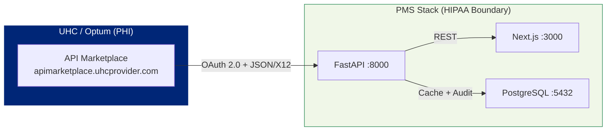

# UHC API Marketplace Setup Guide for PMS Integration

**Document ID:** PMS-EXP-UHCAPI-001
**Version:** 1.0
**Date:** 2026-03-07
**Applies To:** PMS project (all platforms)
**Prerequisites Level:** Intermediate

---

## Table of Contents

1. [Overview](#1-overview)
2. [Prerequisites](#2-prerequisites)
3. [Part A: Register on UHC API Marketplace](#3-part-a-register-on-uhc-api-marketplace)
4. [Part B: Set Up Sandbox Credentials](#4-part-b-set-up-sandbox-credentials)
5. [Part C: Build the UHC API Client](#5-part-c-build-the-uhc-api-client)
6. [Part D: Integrate with PMS Backend](#6-part-d-integrate-with-pms-backend)
7. [Part E: Integrate with PMS Frontend](#7-part-e-integrate-with-pms-frontend)
8. [Part F: Testing and Verification](#8-part-f-testing-and-verification)
9. [Troubleshooting](#9-troubleshooting)
10. [Reference Commands](#10-reference-commands)

---

## 1. Overview

This guide walks you through integrating the UHC API Marketplace into the PMS. By the end, you will have:

- A registered organization on the UHC API Marketplace with sandbox credentials
- An OAuth 2.0 client that authenticates and manages tokens automatically
- FastAPI endpoints for eligibility, benefits, PA submission, and claim pre-check
- A frontend panel showing patient eligibility and PA status inline on encounters
- Database tables tracking all UHC API interactions for HIPAA audit compliance



**Key facts about the UHC API Marketplace:**
- **Base URL**: `https://apimarketplace.uhcprovider.com`
- **Authentication**: OAuth 2.0 (client credentials flow)
- **Data format**: JSON (X12 EDI wrapped in JSON)
- **Cost**: Free for registered healthcare providers
- **Sandbox**: Available immediately after registration
- **PHI**: Yes — all calls involve real patient data (in production)
- **BAA**: Required for production access

---

## 2. Prerequisites

### 2.1 Required Software

| Software | Minimum Version | Check Command |
|----------|----------------|---------------|
| Python | 3.11+ | `python3 --version` |
| Node.js | 18+ | `node --version` |
| PostgreSQL | 14+ | `psql --version` |
| pip | 23+ | `pip --version` |
| curl | any | `curl --version` |

### 2.2 Required Credentials

| Item | Where to Get It |
|------|-----------------|
| OneHealthcare ID | [identity.onehealthcareid.com](https://identity.onehealthcareid.com) |
| Organization registration | UHC API Marketplace → App Owner portal |
| Provider NPI | NPPES (already on file for TRA) |
| Provider TIN | TRA's Tax ID (already on file) |

### 2.3 Python Dependencies

```bash
pip install httpx pydantic sqlalchemy alembic asyncpg
```

### 2.4 Verify PMS Services

```bash
# Backend
curl -s http://localhost:8000/health | jq .

# Frontend
curl -s -o /dev/null -w "%{http_code}" http://localhost:3000

# PostgreSQL
psql -U pms -d pms_db -c "SELECT 1;"
```

---

## 3. Part A: Register on UHC API Marketplace

### Step 1: Create a OneHealthcare ID

1. Go to [identity.onehealthcareid.com](https://identity.onehealthcareid.com/oneapp/index.html)
2. Click "Create an Account"
3. Complete the registration with your organization email
4. Verify your email address

### Step 2: Register Your Organization

1. Log in to the [UHC API Marketplace](https://apimarketplace.uhcprovider.com/)
2. Navigate to the "App Owner" section
3. Register your organization:
   - Organization name: Texas Retina Associates (or your practice name)
   - Organization type: Healthcare Provider
   - Provider NPI: Your NPI number
   - Provider TIN: Your Tax ID
4. Submit for review

**Note**: UHC's security and compliance team reviews organization registrations. This typically takes 3-5 business days. Sandbox access may be available before full approval.

### Step 3: Register Your Application

Once approved:

1. Navigate to "Register Application"
2. Choose **Sandbox** as the environment
3. Application details:
   - Name: `PMS-UHC-Integration`
   - Description: `Patient Management System integration for eligibility, PA, and claims`
   - APIs requested: Eligibility, Benefits, Prior Auth, Claim Pre-Check
4. You will receive:
   - **Client ID**: `your-client-id`
   - **Client Secret**: `your-client-secret`

**Checkpoint**: You have a OneHealthcare ID, a registered organization, and sandbox API credentials (client ID + secret).

---

## 4. Part B: Set Up Sandbox Credentials

### Step 1: Store Credentials Securely

Never hardcode credentials. Use environment variables or Docker secrets:

```bash
# Development: .env file (gitignored)
cat >> .env << 'EOF'
UHC_CLIENT_ID=your-sandbox-client-id
UHC_CLIENT_SECRET=your-sandbox-client-secret
UHC_API_BASE_URL=https://sandbox.apimarketplace.uhcprovider.com
UHC_OAUTH_URL=https://sandbox.apimarketplace.uhcprovider.com/oauth/token
EOF
```

```bash
# Production: Docker secrets
echo "your-production-client-id" | docker secret create uhc_client_id -
echo "your-production-client-secret" | docker secret create uhc_client_secret -
```

### Step 2: Verify Sandbox Access

```bash
# Test OAuth token endpoint
source .env
curl -s -X POST "$UHC_OAUTH_URL" \
  -H "Content-Type: application/x-www-form-urlencoded" \
  -d "grant_type=client_credentials&client_id=$UHC_CLIENT_ID&client_secret=$UHC_CLIENT_SECRET" \
  | jq '{access_token: .access_token[:20], token_type, expires_in}'
```

Expected response:
```json
{
  "access_token": "eyJhbGciOiJSUzI1Ni...",
  "token_type": "Bearer",
  "expires_in": 3600
}
```

**Checkpoint**: You can authenticate with the UHC sandbox and receive an OAuth access token.

---

## 5. Part C: Build the UHC API Client

### Step 1: Create the Client Module

Create `app/services/uhc_api.py`:

```python
"""UHC API Marketplace client with OAuth 2.0 token management."""

import os
import time
from typing import Optional

import httpx
from pydantic import BaseModel


class UHCToken:
    """Manages OAuth 2.0 token lifecycle for UHC API Marketplace."""

    def __init__(self):
        self._token: Optional[str] = None
        self._expires_at: float = 0
        self._client_id = os.environ["UHC_CLIENT_ID"]
        self._client_secret = os.environ["UHC_CLIENT_SECRET"]
        self._oauth_url = os.environ.get(
            "UHC_OAUTH_URL",
            "https://apimarketplace.uhcprovider.com/oauth/token",
        )

    async def get_token(self, client: httpx.AsyncClient) -> str:
        if self._token and time.time() < self._expires_at:
            return self._token

        resp = await client.post(
            self._oauth_url,
            data={
                "grant_type": "client_credentials",
                "client_id": self._client_id,
                "client_secret": self._client_secret,
            },
            headers={"Content-Type": "application/x-www-form-urlencoded"},
        )
        resp.raise_for_status()
        data = resp.json()
        self._token = data["access_token"]
        # Refresh 5 minutes before expiry
        self._expires_at = time.time() + data.get("expires_in", 3600) - 300
        return self._token


class UHCAPIClient:
    """Client for UHC API Marketplace (Optum Real APIs)."""

    def __init__(self):
        self._base_url = os.environ.get(
            "UHC_API_BASE_URL",
            "https://apimarketplace.uhcprovider.com",
        )
        self._client = httpx.AsyncClient(timeout=30.0)
        self._token_mgr = UHCToken()

    async def _get(self, path: str, params: dict = None) -> dict:
        token = await self._token_mgr.get_token(self._client)
        resp = await self._client.get(
            f"{self._base_url}{path}",
            params=params,
            headers={"Authorization": f"Bearer {token}"},
        )
        resp.raise_for_status()
        return resp.json()

    async def _post(self, path: str, payload: dict) -> dict:
        token = await self._token_mgr.get_token(self._client)
        resp = await self._client.post(
            f"{self._base_url}{path}",
            json=payload,
            headers={
                "Authorization": f"Bearer {token}",
                "Content-Type": "application/json",
            },
        )
        resp.raise_for_status()
        return resp.json()

    # --- Eligibility ---

    async def check_eligibility(
        self,
        member_id: str,
        date_of_service: str,
        provider_npi: str,
    ) -> dict:
        """Check patient eligibility (X12 270/271 in JSON)."""
        return await self._post("/api/eligibility", {
            "subscriber": {"memberId": member_id},
            "provider": {"npi": provider_npi},
            "dateOfService": date_of_service,
        })

    # --- Benefits ---

    async def check_benefits(
        self,
        member_id: str,
        service_code: str,
        date_of_service: str,
        provider_npi: str,
    ) -> dict:
        """Check patient benefits for a specific service (copay, deductible, PA required)."""
        return await self._post("/api/benefits", {
            "subscriber": {"memberId": member_id},
            "provider": {"npi": provider_npi},
            "serviceCode": service_code,
            "dateOfService": date_of_service,
        })

    # --- Prior Authorization ---

    async def submit_prior_auth(
        self,
        member_id: str,
        provider_npi: str,
        procedure_code: str,
        diagnosis_codes: list[str],
        date_of_service: str,
        clinical_info: dict = None,
    ) -> dict:
        """Submit a prior authorization request (X12-278 in JSON)."""
        payload = {
            "subscriber": {"memberId": member_id},
            "provider": {"npi": provider_npi},
            "serviceLines": [{
                "procedureCode": procedure_code,
                "diagnosisCodes": diagnosis_codes,
                "dateOfService": date_of_service,
            }],
        }
        if clinical_info:
            payload["clinicalInformation"] = clinical_info
        return await self._post("/api/prior-auth/submit", payload)

    async def check_prior_auth_status(self, reference_number: str) -> dict:
        """Check status of a submitted PA request."""
        return await self._get(f"/api/prior-auth/status/{reference_number}")

    # --- Claim Pre-Check ---

    async def claim_precheck(
        self,
        member_id: str,
        provider_npi: str,
        service_lines: list[dict],
        date_of_service: str,
    ) -> dict:
        """Pre-validate a claim before submission (X12 837 → 277CA)."""
        return await self._post("/api/claims/precheck", {
            "subscriber": {"memberId": member_id},
            "provider": {"npi": provider_npi},
            "serviceLines": service_lines,
            "dateOfService": date_of_service,
        })

    # --- Claim Inquiry ---

    async def claim_inquiry(self, claim_id: str) -> dict:
        """Query claim status."""
        return await self._get(f"/api/claims/{claim_id}")

    async def close(self):
        await self._client.aclose()
```

**Note**: The exact endpoint paths and payload structures shown above are illustrative. Refer to the Swagger documentation on the API Marketplace for exact specifications, which may vary based on your registered API access level. Download the JSON spec from each API's overview page.

**Checkpoint**: You have a Python client with OAuth 2.0 token management and methods for all UHC API operations.

---

## 6. Part D: Integrate with PMS Backend

### Step 1: Create the FastAPI Router

Create `app/routers/uhc.py`:

```python
"""UHC API Marketplace endpoints for the PMS."""

import logging
from datetime import datetime, timezone

from fastapi import APIRouter, HTTPException, Query
from pydantic import BaseModel

from app.services.uhc_api import UHCAPIClient

router = APIRouter(prefix="/api/uhc", tags=["uhc"])
client = UHCAPIClient()
log = logging.getLogger("uhc")


class EligibilityRequest(BaseModel):
    member_id: str
    date_of_service: str  # YYYY-MM-DD
    provider_npi: str


class PARequest(BaseModel):
    member_id: str
    provider_npi: str
    procedure_code: str
    diagnosis_codes: list[str]
    date_of_service: str


@router.post("/eligibility")
async def check_eligibility(req: EligibilityRequest):
    """Check patient UHC eligibility."""
    try:
        result = await client.check_eligibility(
            member_id=req.member_id,
            date_of_service=req.date_of_service,
            provider_npi=req.provider_npi,
        )
        log.info(f"Eligibility check: member={req.member_id}, status={result.get('status')}")
        return result
    except Exception as e:
        raise HTTPException(status_code=502, detail=f"UHC API error: {e}")


@router.post("/benefits")
async def check_benefits(
    member_id: str,
    service_code: str,
    date_of_service: str,
    provider_npi: str,
):
    """Check patient benefits for a specific service."""
    try:
        return await client.check_benefits(
            member_id=member_id,
            service_code=service_code,
            date_of_service=date_of_service,
            provider_npi=provider_npi,
        )
    except Exception as e:
        raise HTTPException(status_code=502, detail=f"UHC API error: {e}")


@router.post("/prior-auth/submit")
async def submit_prior_auth(req: PARequest):
    """Submit a prior authorization request to UHC."""
    try:
        result = await client.submit_prior_auth(
            member_id=req.member_id,
            provider_npi=req.provider_npi,
            procedure_code=req.procedure_code,
            diagnosis_codes=req.diagnosis_codes,
            date_of_service=req.date_of_service,
        )
        log.info(f"PA submitted: member={req.member_id}, ref={result.get('referenceNumber')}")
        return result
    except Exception as e:
        raise HTTPException(status_code=502, detail=f"UHC API error: {e}")


@router.get("/prior-auth/status/{reference_number}")
async def get_prior_auth_status(reference_number: str):
    """Check PA request status."""
    try:
        return await client.check_prior_auth_status(reference_number)
    except Exception as e:
        raise HTTPException(status_code=502, detail=f"UHC API error: {e}")


@router.post("/claims/precheck")
async def claim_precheck(
    member_id: str,
    provider_npi: str,
    procedure_code: str,
    diagnosis_code: str,
    date_of_service: str,
):
    """Pre-validate a claim before submission."""
    try:
        return await client.claim_precheck(
            member_id=member_id,
            provider_npi=provider_npi,
            service_lines=[{
                "procedureCode": procedure_code,
                "diagnosisCode": diagnosis_code,
            }],
            date_of_service=date_of_service,
        )
    except Exception as e:
        raise HTTPException(status_code=502, detail=f"UHC API error: {e}")
```

### Step 2: Create Database Tables

```sql
-- uhc_eligibility_log: Audit trail for eligibility checks
CREATE TABLE uhc_eligibility_log (
    id SERIAL PRIMARY KEY,
    patient_id INTEGER REFERENCES patients(id),
    member_id TEXT NOT NULL,
    date_of_service DATE NOT NULL,
    eligible BOOLEAN,
    plan_name TEXT,
    response JSONB NOT NULL,
    checked_by INTEGER,  -- user ID
    checked_at TIMESTAMPTZ NOT NULL DEFAULT NOW()
);

-- uhc_pa_submissions: Track PA submissions and outcomes
CREATE TABLE uhc_pa_submissions (
    id SERIAL PRIMARY KEY,
    patient_id INTEGER REFERENCES patients(id),
    encounter_id INTEGER,
    member_id TEXT NOT NULL,
    procedure_code TEXT NOT NULL,
    diagnosis_codes TEXT[] NOT NULL,
    reference_number TEXT,
    status TEXT,  -- submitted, approved, pended, denied
    response JSONB,
    submitted_by INTEGER,
    submitted_at TIMESTAMPTZ NOT NULL DEFAULT NOW(),
    last_checked_at TIMESTAMPTZ,
    resolved_at TIMESTAMPTZ
);

-- uhc_claim_precheck_log: Claim pre-check results
CREATE TABLE uhc_claim_precheck_log (
    id SERIAL PRIMARY KEY,
    encounter_id INTEGER,
    member_id TEXT NOT NULL,
    procedure_codes TEXT[] NOT NULL,
    passed BOOLEAN,
    errors JSONB,
    response JSONB NOT NULL,
    checked_at TIMESTAMPTZ NOT NULL DEFAULT NOW()
);

CREATE INDEX idx_uhc_elig_member ON uhc_eligibility_log (member_id, date_of_service);
CREATE INDEX idx_uhc_pa_ref ON uhc_pa_submissions (reference_number);
CREATE INDEX idx_uhc_pa_status ON uhc_pa_submissions (status, submitted_at);
```

### Step 3: Register the Router

In `app/main.py`:

```python
from app.routers import uhc

app.include_router(uhc.router)
```

**Checkpoint**: The PMS backend exposes `/api/uhc/eligibility`, `/api/uhc/prior-auth/submit`, `/api/uhc/claims/precheck`, and related endpoints with HIPAA audit logging.

---

## 7. Part E: Integrate with PMS Frontend

### Step 1: Create Eligibility Panel Component

Create `components/UHCEligibilityPanel.tsx`:

```tsx
"use client";

import { useState } from "react";

interface EligibilityResult {
  status: string;
  plan_name: string;
  network_status: string;
  copay: string;
  deductible_remaining: string;
  pa_required: boolean;
}

interface Props {
  memberId: string;
  dateOfService: string;
  providerNpi: string;
}

export default function UHCEligibilityPanel({ memberId, dateOfService, providerNpi }: Props) {
  const [result, setResult] = useState<EligibilityResult | null>(null);
  const [loading, setLoading] = useState(false);
  const [error, setError] = useState<string | null>(null);

  const checkEligibility = async () => {
    setLoading(true);
    setError(null);
    try {
      const res = await fetch("/api/uhc/eligibility", {
        method: "POST",
        headers: { "Content-Type": "application/json" },
        body: JSON.stringify({
          member_id: memberId,
          date_of_service: dateOfService,
          provider_npi: providerNpi,
        }),
      });
      if (!res.ok) throw new Error(`HTTP ${res.status}`);
      setResult(await res.json());
    } catch (e) {
      setError(e instanceof Error ? e.message : "Failed to check eligibility");
    } finally {
      setLoading(false);
    }
  };

  return (
    <div className="border rounded-lg p-4">
      <h3 className="font-semibold">UHC Eligibility</h3>
      <button
        onClick={checkEligibility}
        disabled={loading}
        className="mt-2 px-4 py-2 bg-blue-600 text-white rounded"
      >
        {loading ? "Checking..." : "Verify Eligibility"}
      </button>
      {error && <p className="text-red-600 mt-2">{error}</p>}
      {result && (
        <dl className="mt-4 grid grid-cols-2 gap-2 text-sm">
          <dt className="font-medium">Status</dt>
          <dd className={result.status === "Active" ? "text-green-600" : "text-red-600"}>
            {result.status}
          </dd>
          <dt className="font-medium">Plan</dt>
          <dd>{result.plan_name}</dd>
          <dt className="font-medium">Network</dt>
          <dd>{result.network_status}</dd>
          <dt className="font-medium">Copay</dt>
          <dd>{result.copay}</dd>
          <dt className="font-medium">Deductible Remaining</dt>
          <dd>{result.deductible_remaining}</dd>
          <dt className="font-medium">PA Required</dt>
          <dd className={result.pa_required ? "text-orange-600 font-bold" : ""}>
            {result.pa_required ? "Yes" : "No"}
          </dd>
        </dl>
      )}
    </div>
  );
}
```

**Checkpoint**: The frontend has a UHC Eligibility Panel that triggers real-time eligibility checks from the encounter view.

---

## 8. Part F: Testing and Verification

### Sandbox Functional Tests

```bash
# 1. OAuth token works
source .env
TOKEN=$(curl -s -X POST "$UHC_OAUTH_URL" \
  -d "grant_type=client_credentials&client_id=$UHC_CLIENT_ID&client_secret=$UHC_CLIENT_SECRET" \
  | jq -r '.access_token')
[ -n "$TOKEN" ] && echo "PASS: OAuth token obtained" || echo "FAIL: No token"

# 2. Eligibility check (sandbox mock data)
curl -s -X POST "http://localhost:8000/api/uhc/eligibility" \
  -H "Content-Type: application/json" \
  -d '{"member_id":"SANDBOX123","date_of_service":"2026-03-07","provider_npi":"1234567890"}' \
  | jq '.status'

# 3. PA submission (sandbox)
curl -s -X POST "http://localhost:8000/api/uhc/prior-auth/submit" \
  -H "Content-Type: application/json" \
  -d '{
    "member_id":"SANDBOX123",
    "provider_npi":"1234567890",
    "procedure_code":"67028",
    "diagnosis_codes":["H35.31"],
    "date_of_service":"2026-03-10"
  }' | jq '.'

# 4. Database audit log populated
psql -U pms -d pms_db -c "SELECT COUNT(*) FROM uhc_eligibility_log;"
```

**Checkpoint**: All UHC API endpoints work against the sandbox, and audit logs are being written to PostgreSQL.

---

## 9. Troubleshooting

### OAuth 401 Unauthorized

**Symptom**: Token request returns 401.
**Cause**: Invalid client ID or secret, or credentials expired.
**Fix**: Verify credentials in `.env` match the API Marketplace dashboard. Regenerate the secret if needed.

### Sandbox vs Production URL Mismatch

**Symptom**: 404 errors on API calls.
**Cause**: Using production URLs with sandbox credentials (or vice versa).
**Fix**: Ensure `UHC_API_BASE_URL` matches the environment (sandbox vs production).

### X12 Mapping Errors

**Symptom**: 400 Bad Request on eligibility or PA calls.
**Cause**: Missing required fields in the JSON payload.
**Fix**: Download the Swagger spec from the API Marketplace and validate your payload structure. Common missing fields: member ID format, NPI format, date format (YYYY-MM-DD).

### Rate Limiting

**Symptom**: 429 Too Many Requests.
**Fix**: Add exponential backoff. For typical practice volumes (200-500 calls/day), rate limiting should not be an issue.

### PA Submission API Beta Limitations

**Symptom**: PA submission endpoint returns unexpected errors.
**Cause**: The PA Submission API is currently in beta with limited availability.
**Fix**: Fall back to the UHC Provider Portal for PA submission until GA release. Monitor the Optum Marketplace newsletter for release updates.

---

## 10. Reference Commands

### Daily Development

```bash
# Start with sandbox credentials
source .env && uvicorn app.main:app --reload --port 8000

# Test eligibility endpoint
curl -s -X POST "http://localhost:8000/api/uhc/eligibility" \
  -H "Content-Type: application/json" \
  -d '{"member_id":"TEST","date_of_service":"2026-03-07","provider_npi":"1234567890"}'

# Check audit logs
psql -U pms -d pms_db -c "SELECT * FROM uhc_eligibility_log ORDER BY checked_at DESC LIMIT 5;"
```

### Useful URLs

| Resource | URL |
|----------|-----|
| UHC API Marketplace | https://apimarketplace.uhcprovider.com |
| OneHealthcare ID | https://identity.onehealthcareid.com |
| Optum Developer Portal | https://developer.optum.com |
| UHC Provider Portal | https://www.uhcprovider.com |
| Gold Card Status | https://www.uhcprovider.com/en/prior-auth-advance-notification/gold-card.html |

---

## Next Steps

1. Complete the [UHC API Marketplace Developer Tutorial](46-UHCAPIMarketplace-Developer-Tutorial.md)
2. Apply for production credentials after sandbox testing is complete
3. Execute BAA with UHC/Optum for production PHI access
4. Integrate eligibility check into the encounter creation workflow

## Resources

- [UHC API Marketplace](https://apimarketplace.uhcprovider.com/)
- [Optum Developer Portal](https://developer.optum.com/)
- [UHC Interoperability APIs](https://www.uhc.com/legal/interoperability-apis)
- [UHC Prior Auth Requirements](https://www.uhcprovider.com/en/prior-auth-advance-notification.html)
- [Experiment 44: Payer Policy Download PRD](44-PRD-PayerPolicyDownload-PMS-Integration.md)
- [Experiment 45: CMS Coverage API PRD](45-PRD-CMSCoverageAPI-PMS-Integration.md)
