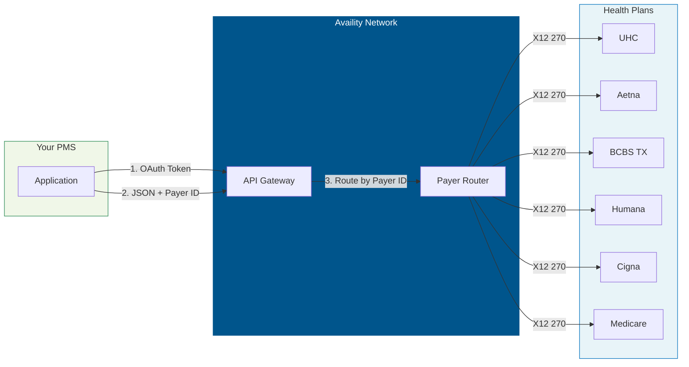
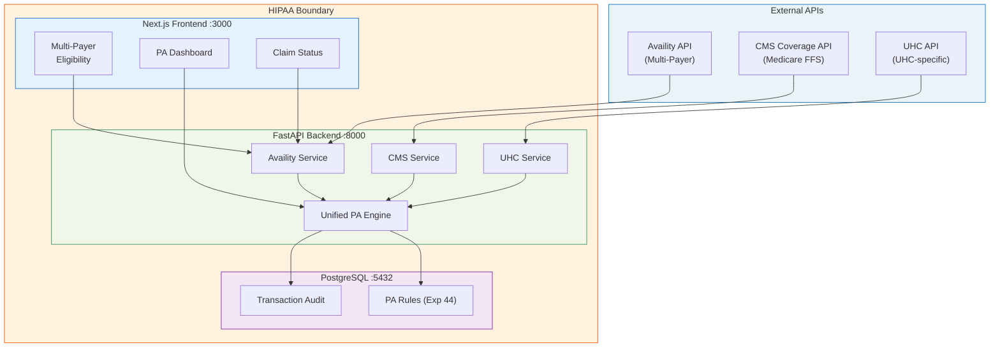

# Availity API Developer Onboarding Tutorial

**Welcome to the MPS PMS Availity API Integration Team**

This tutorial will take you from zero to building your first multi-payer eligibility verification and prior authorization submission using Availity's REST APIs. By the end, you will understand how Availity connects to all major payers, have tested eligibility and PA flows in the sandbox, and built a unified workflow that works for UHC, Aetna, BCBS, Humana, and Cigna through a single API.

**Document ID:** PMS-EXP-AVAILITY-002
**Version:** 1.0
**Date:** 2026-03-07
**Applies To:** PMS project (all platforms)
**Prerequisite:** [Availity API Setup Guide](47-AvailityAPI-PMS-Developer-Setup-Guide.md)
**Estimated time:** 2-3 hours
**Difficulty:** Beginner-friendly

---

## What You Will Learn

1. Why a multi-payer clearinghouse is essential for practice management
2. How Availity routes transactions to the correct payer via payer IDs
3. The X12 transaction lifecycle: submit → poll → complete
4. How to verify eligibility for any payer through one API call
5. How to use the Configurations API for payer-specific field requirements
6. How to submit a prior authorization to any connected payer
7. How to check claim status across all payers from one dashboard
8. How Demo mock scenarios enable comprehensive testing
9. How Availity complements the UHC-specific API (Experiment 46)
10. HIPAA audit requirements for multi-payer clearinghouse data

---

## Part 1: Understanding Availity (15 min read)

### 1.1 What Problem Does This Solve?

Texas Retina Associates contracts with 6 payers. Without Availity, the PMS needs 6 separate API integrations:

| Payer | Portal | API Available? | Credential Type |
|-------|--------|---------------|-----------------|
| CMS Medicare FFS | cms.gov | Yes (Exp 45) | License token |
| UnitedHealthcare | uhcprovider.com | Yes (Exp 46) | OAuth |
| Aetna | availity.com | No public API | Portal only |
| BCBS of Texas | availity.com | No public API | Portal only |
| Humana | humana.com | No public API | Portal only |
| Cigna | cigna.com | No public API | Portal only |

With Availity: **one API, one set of credentials, all 6 payers.**

### 1.2 How Availity Works — The Key Pieces



**The key insight**: You send JSON with a `payerId` field. Availity converts it to the appropriate X12 EDI format, routes it to the correct payer, and returns the payer's response as JSON.

### 1.3 How Availity Fits with Other PMS Technologies

| Technology | Experiment | Relationship to Availity |
|------------|-----------|-------------------------|
| Payer Policy Download | Exp 44 | Provides PA rules (what's required). Availity provides transactions (submit the PA). |
| CMS Coverage API | Exp 45 | Provides Medicare FFS coverage rules. Availity can also query Medicare eligibility. |
| UHC API Marketplace | Exp 46 | Deep UHC-specific features (Gold Card, TrackIt). Availity covers UHC eligibility/PA too. |
| Availity API | Exp 47 | **The multi-payer clearinghouse — one API for all payers.** |

**Decision**: Use Availity as the default for all payers. Use Experiment 46 (UHC API) only for UHC-specific features not available through Availity.

### 1.4 Key Vocabulary

| Term | Meaning |
|------|---------|
| **Clearinghouse** | An intermediary that routes healthcare transactions between providers and payers |
| **Payer ID** | Availity's identifier for a health plan (e.g., "UHC", "AETNA"). Use Payer List API to find. |
| **X12 270/271** | Eligibility inquiry/response. You ask "Is this patient covered?" and get benefits back. |
| **X12 278** | Prior authorization request/response. You ask "Can I do this procedure?" |
| **X12 276/277** | Claim status request/response. You ask "What happened to my claim?" |
| **X12 837** | Claim submission (professional = 837P, institutional = 837I) |
| **Service Review** | Availity's term for a prior authorization or referral request |
| **Coverage** | Availity's term for an eligibility inquiry |
| **Polling** | Eligibility is asynchronous: POST returns an ID, then poll GET until complete |
| **Demo Plan** | Sandbox with canned responses, 5 req/s, 500 req/day, no PHI |
| **Standard Plan** | Production with real data, 100 req/s, 100K req/day, requires contract |

### 1.5 Our Architecture



---

## Part 2: Environment Verification (15 min)

### 2.1 Checklist

```bash
# 1. Credentials set
source .env
[ -n "$AVAILITY_CLIENT_ID" ] && echo "PASS: Client ID" || echo "FAIL"

# 2. Token works
TOKEN=$(curl -s -X POST "$AVAILITY_TOKEN_URL" \
  -d "grant_type=client_credentials&client_id=$AVAILITY_CLIENT_ID&client_secret=$AVAILITY_CLIENT_SECRET&scope=$AVAILITY_SCOPE" \
  | jq -r '.access_token')
[ -n "$TOKEN" ] && echo "PASS: Token" || echo "FAIL"

# 3. PMS backend running
curl -s -o /dev/null -w "%{http_code}" http://localhost:8000/health

# 4. Payer list accessible
curl -s "http://localhost:8000/api/availity/payers" | jq '.totalCount'
```

### 2.2 Quick Test

```bash
# Check eligibility via PMS (Demo sandbox)
curl -s -X POST "http://localhost:8000/api/availity/eligibility" \
  -H "Content-Type: application/json" \
  -d '{"payer_id":"UHC","member_id":"TEST123","provider_npi":"1234567890","date_of_service":"2026-03-07"}' \
  | jq '.'
```

---

## Part 3: Build Your First Integration (45 min)

### 3.1 What We Are Building

A **multi-payer pre-visit batch** that checks eligibility for all scheduled patients across all payers in one run.

### 3.2 Create the Multi-Payer Eligibility Script

Create `availity_batch_eligibility.py`:

```python
#!/usr/bin/env python3
"""
Multi-Payer Batch Eligibility Check via Availity.

Demonstrates checking eligibility across multiple payers with one API.

Usage:
    python availity_batch_eligibility.py
"""

import json
import os

import httpx

PMS_URL = os.environ.get("PMS_URL", "http://localhost:8000")

# Simulated tomorrow's schedule (would come from /api/encounters in production)
SCHEDULE = [
    {"patient": "Smith, John", "member_id": "UHC123456", "payer_id": "UHC", "payer_name": "UnitedHealthcare", "npi": "1234567890", "dos": "2026-03-08"},
    {"patient": "Jones, Mary", "member_id": "AET789012", "payer_id": "AETNA", "payer_name": "Aetna", "npi": "1234567890", "dos": "2026-03-08"},
    {"patient": "Garcia, Carlos", "member_id": "BCBS345678", "payer_id": "BCBSTX", "payer_name": "BCBS of Texas", "npi": "1234567890", "dos": "2026-03-08"},
    {"patient": "Williams, Sue", "member_id": "HUM901234", "payer_id": "HUMANA", "payer_name": "Humana", "npi": "1234567890", "dos": "2026-03-08"},
    {"patient": "Brown, David", "member_id": "CIG567890", "payer_id": "CIGNA", "payer_name": "Cigna", "npi": "1234567890", "dos": "2026-03-08"},
]


def main():
    client = httpx.Client(timeout=30.0)

    print("=" * 70)
    print("MULTI-PAYER BATCH ELIGIBILITY CHECK")
    print(f"Date: 2026-03-08 | Patients: {len(SCHEDULE)}")
    print("=" * 70)
    print()

    results = []
    for appt in SCHEDULE:
        print(f"Checking: {appt['patient']} ({appt['payer_name']})...", end=" ")
        try:
            resp = client.post(f"{PMS_URL}/api/availity/eligibility", json={
                "payer_id": appt["payer_id"],
                "member_id": appt["member_id"],
                "provider_npi": appt["npi"],
                "date_of_service": appt["dos"],
            })
            data = resp.json()
            status = data.get("statusCode", "?")
            eligible = status == "4"
            print(f"{'ELIGIBLE' if eligible else f'STATUS {status}'}")
            results.append({**appt, "eligible": eligible, "status": status})
        except Exception as e:
            print(f"ERROR: {e}")
            results.append({**appt, "eligible": False, "status": "error"})

    # Summary
    print()
    print("-" * 70)
    eligible_count = sum(1 for r in results if r["eligible"])
    print(f"Results: {eligible_count}/{len(results)} eligible")
    print()

    print(f"{'Patient':<20s} {'Payer':<20s} {'Status':<10s}")
    print(f"{'-'*20} {'-'*20} {'-'*10}")
    for r in results:
        status_str = "Eligible" if r["eligible"] else f"Check ({r['status']})"
        print(f"{r['patient']:<20s} {r['payer_name']:<20s} {status_str:<10s}")


if __name__ == "__main__":
    main()
```

### 3.3 Run the Batch Check

```bash
python availity_batch_eligibility.py
```

### 3.4 Build a Multi-Payer PA Submission Script

Create `availity_submit_pa.py`:

```python
#!/usr/bin/env python3
"""
Submit Prior Authorization via Availity for any payer.

Usage:
    python availity_submit_pa.py --payer UHC --member UHC123 --procedure 67028 --diagnosis H35.31
    python availity_submit_pa.py --payer AETNA --member AET789 --procedure 67028 --diagnosis H35.31
"""

import argparse
import json
import os

import httpx

PMS_URL = os.environ.get("PMS_URL", "http://localhost:8000")

PAYER_NAMES = {
    "UHC": "UnitedHealthcare",
    "AETNA": "Aetna",
    "BCBSTX": "BCBS of Texas",
    "HUMANA": "Humana",
    "CIGNA": "Cigna",
}


def main():
    parser = argparse.ArgumentParser(description="Submit PA via Availity")
    parser.add_argument("--payer", required=True, choices=PAYER_NAMES.keys())
    parser.add_argument("--member", required=True)
    parser.add_argument("--procedure", default="67028")
    parser.add_argument("--diagnosis", default="H35.31")
    parser.add_argument("--npi", default="1234567890")
    parser.add_argument("--dos", default="2026-03-10")
    args = parser.parse_args()

    client = httpx.Client(timeout=30.0)
    payer_name = PAYER_NAMES[args.payer]

    print(f"Submitting PA to {payer_name} via Availity")
    print(f"  Member: {args.member}")
    print(f"  Procedure: {args.procedure}")
    print(f"  Diagnosis: {args.diagnosis}")
    print()

    # Step 1: Check payer configuration
    print("1. Getting payer configuration...")
    cfg = client.get(
        f"{PMS_URL}/api/availity/configurations/{args.payer}",
        params={"config_type": "service-reviews"},
    ).json()
    print(f"   Configuration loaded for {args.payer}")

    # Step 2: Submit PA
    print("2. Submitting PA request...")
    result = client.post(f"{PMS_URL}/api/availity/prior-auth", json={
        "payer_id": args.payer,
        "member_id": args.member,
        "provider_npi": args.npi,
        "procedure_code": args.procedure,
        "diagnosis_codes": [args.diagnosis],
        "date_of_service": args.dos,
    }).json()

    review_id = result.get("id", "N/A")
    status = result.get("status", "Unknown")
    print(f"   Review ID: {review_id}")
    print(f"   Status: {status}")

    # Step 3: Check status
    if review_id != "N/A":
        print("3. Checking PA status...")
        status_result = client.get(f"{PMS_URL}/api/availity/prior-auth/{review_id}").json()
        print(f"   Current status: {status_result.get('status', 'Unknown')}")

    print()
    print(json.dumps(result, indent=2))


if __name__ == "__main__":
    main()
```

### 3.5 Test PA Submission

```bash
# Submit PA to different payers
python availity_submit_pa.py --payer UHC --member UHC123 --procedure 67028 --diagnosis H35.31
python availity_submit_pa.py --payer AETNA --member AET789 --procedure 67028 --diagnosis H35.31
python availity_submit_pa.py --payer BCBSTX --member BCBS456 --procedure 67028 --diagnosis H35.31
```

**Checkpoint**: You can submit PAs to any payer through the same Availity API.

---

## Part 4: Evaluating Strengths and Weaknesses (15 min)

### 4.1 Strengths

- **Multi-payer**: One API, one set of credentials, every major health plan
- **Industry standard**: Largest healthcare clearinghouse, 3.4M connected providers
- **Comprehensive**: Eligibility, PA, claims, cost estimation — full revenue cycle
- **Payer-aware**: Configurations API provides payer-specific field requirements dynamically
- **HIPAA compliant**: Certified clearinghouse with established BAA process

### 4.2 Weaknesses

- **5-minute token TTL**: Must refresh OAuth tokens frequently (counts against rate limit)
- **Asynchronous eligibility**: POST → poll GET (adds latency vs direct payer APIs)
- **Demo plan limits**: 5 req/s and 500 req/day is tight for development (OAuth calls count)
- **Standard plan requires contract**: Production access needs Availity sales engagement
- **Payer-specific quirks**: Some payers require enrollment through Availity before accepting transactions
- **No payer-specific features**: UHC Gold Card, TrackIt, etc. not available through Availity

### 4.3 When to Use Availity vs Alternatives

| Scenario | Use Availity | Use Alternative |
|----------|-------------|-----------------|
| Eligibility check for any payer | Yes | — |
| PA submission for Aetna, BCBS, Humana, Cigna | Yes | No other option (no public APIs) |
| PA submission for UHC | Either | Exp 46 (UHC API) for Gold Card integration |
| Medicare FFS coverage rules | No | Exp 45 (CMS Coverage API) |
| UHC-specific features (Gold Card, TrackIt) | No | Exp 46 (UHC API) |
| PA rule lookup (what's required?) | No | Exp 44 (payer policy PDFs) |
| Claim status across all payers | Yes | — |

### 4.4 HIPAA / Healthcare Considerations

- **PHI in production**: All Availity production calls contain real patient data. BAA required.
- **Demo is safe**: Demo plan uses canned responses with no real PHI.
- **Audit everything**: Log every transaction with user, patient, payer, timestamp, and response status.
- **Minimum necessary**: Don't request more data than needed. Don't cache beyond the date of service.
- **Clearinghouse as BA**: Availity is a Business Associate. They sign BAAs with providers.

---

## Part 5: Debugging Common Issues (15 min read)

### Issue 1: 429 Rate Limit on Demo Plan

**Symptom**: Getting 429 errors after a few API calls.
**Cause**: Demo plan allows 5 req/s and 500 req/day. OAuth token requests count.
**Fix**: Cache tokens for 4.5 minutes. Batch eligibility checks. Plan for Standard plan upgrade.

### Issue 2: Eligibility Never Completes (Status 0)

**Symptom**: Polling returns status 0 (In Progress) indefinitely.
**Cause**: Demo plan returns canned responses that may not include a "Complete" status for all scenarios.
**Fix**: Use the `X-Api-Mock-Scenario-ID` header to select specific demo scenarios that return complete responses.

### Issue 3: Payer ID Not Found

**Symptom**: 400 error with "Invalid payerId."
**Cause**: Availity payer IDs don't match common abbreviations.
**Fix**: Query `/api/availity/payers` to get the exact payer ID string for each health plan.

### Issue 4: PA Submission Missing Required Fields

**Symptom**: 400 error with field validation messages.
**Cause**: Different payers require different fields for PA submissions.
**Fix**: Call the Configurations API first (`GET /v1/configurations?type=service-reviews&payerId=X`) to get payer-specific required fields, then build your request accordingly.

### Issue 5: Token Refresh Fails

**Symptom**: 401 on API calls, token refresh returns error.
**Cause**: Client credentials may have been rotated or account suspended.
**Fix**: Log in to developer.availity.com, verify credentials, check subscription status.

---

## Part 6: Practice Exercises (45 min)

### Option A: Build a Payer Capability Matrix

Query the Payer List API for all payers TRA contracts with. For each, query the Configurations API to determine what transactions are supported (eligibility, PA, claims). Output a matrix showing capability gaps.

### Option B: Build a Unified PA Dashboard

Build a frontend page that shows all pending PAs across all payers (from `availity_pa_submissions` table), with status polling and color-coded badges.

### Option C: Build a Cost Estimation Tool

Use the Care Cost Estimator API to build a tool that takes a procedure code and patient's payer/member info and returns an estimated out-of-pocket cost before the visit.

---

## Part 7: Development Workflow and Conventions

### 7.1 File Organization

```
pms-backend/
├── app/
│   ├── services/
│   │   ├── availity_api.py      # Availity multi-payer client
│   │   ├── uhc_api.py           # UHC-specific client (Exp 46)
│   │   └── cms_coverage.py      # CMS Coverage client (Exp 45)
│   ├── routers/
│   │   ├── availity.py          # Multi-payer endpoints
│   │   ├── uhc.py               # UHC-specific endpoints
│   │   └── coverage.py          # CMS Coverage endpoints
│   └── models/
│       └── clearinghouse.py     # Shared audit models
```

### 7.2 Naming Conventions

| Item | Convention | Example |
|------|-----------|---------|
| API client | Platform name + `Client` | `AvailityClient` |
| Router | Platform name, lowercase | `availity.router` |
| DB table | `availity_` prefix | `availity_pa_submissions` |
| Environment var | `AVAILITY_` prefix | `AVAILITY_CLIENT_ID` |

### 7.3 PR Checklist

- [ ] Credentials loaded from environment (never hardcoded)
- [ ] Token manager handles 5-minute TTL with auto-refresh
- [ ] All API calls audit-logged (user, patient, payer, timestamp, status)
- [ ] Payer-specific configurations fetched via Configurations API
- [ ] Demo mock headers used for sandbox testing
- [ ] PHI encrypted at rest, cached same-day only
- [ ] Rate limit awareness (count OAuth calls against daily limit)

### 7.4 Security Reminders

- **Availity is a BA**: Include Availity in your HIPAA compliance documentation
- **5-minute tokens**: Short-lived by design. Never persist to database.
- **Production isolation**: Sandbox and production credentials must be in separate environments
- **X12 data sensitivity**: Even though it's JSON, the underlying X12 data contains PHI

---

## Part 8: Quick Reference Card

### Endpoints

| Availity API | Endpoint | X12 | Purpose |
|-------------|----------|-----|---------|
| Token | `POST /v1/token` | — | OAuth 2.0 (5-min TTL) |
| Payer List | `GET /v1/availity-payer-list` | — | Find payer IDs |
| Configurations | `GET /v1/configurations` | — | Payer-specific rules |
| Coverages | `POST /v1/coverages` | 270/271 | Eligibility |
| Coverages (poll) | `GET /v1/coverages/{id}` | 271 | Eligibility result |
| Service Reviews | `POST /v2/service-reviews` | 278 | Submit PA |
| Service Reviews | `GET /v2/service-reviews/{id}` | 278 | PA status |
| Claim Statuses | `GET /v1/claim-statuses/{id}` | 276/277 | Claim status |

### Status Codes (Eligibility)

| Code | Meaning |
|------|---------|
| 0 | In Progress |
| 4 | Complete |
| 7 | Communication Error |
| 13 | Unknown Connection |
| 14 | Payer Timeout |
| 15 | Connection Lost |
| 19 | Request Error |

---

## Next Steps

1. **Register on Availity**: Create developer account, subscribe to Demo plan
2. **Map TRA's payer IDs**: Query Payer List API to find correct IDs for all 6 payers
3. **Test all payers in sandbox**: Run eligibility and PA for each payer
4. **Contact Availity for Standard plan**: partnermanagement@availity.com
5. **Integrate with PA Decision Engine**: Combine Exp 44 rules + Exp 45 CMS data + Availity transactions
