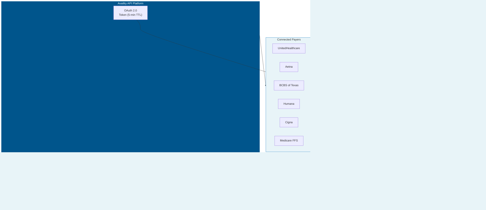

# Product Requirements Document: Availity API Integration into Patient Management System (PMS)

**Document ID:** PRD-PMS-AVAILITY-001
**Version:** 1.0
**Date:** 2026-03-07
**Author:** Ammar (CEO, MPS Inc.)
**Status:** Draft

---

## 1. Executive Summary

Availity is the nation's largest real-time health information network, connecting over 3.4 million providers to every major health plan nationwide. Its REST API platform provides a single integration point for HIPAA-standard X12 EDI transactions — eligibility (270/271), prior authorization (278), claim status (276/277), and claim submission (837) — across all connected payers through one set of credentials.

For the PMS, Availity solves the multi-payer integration problem. While Experiment 46 (UHC API Marketplace) provides deep integration with a single payer, Availity provides broad coverage across all payers through one API. This is critical for Texas Retina Associates (TRA), which contracts with CMS Medicare, UHC, Aetna, BCBS of Texas, Humana, and Cigna — all of which are connected through Availity. Instead of building separate integrations for each payer, the PMS can route all eligibility checks, PA submissions, and claim status queries through Availity's unified API.

Combined with Experiment 45 (CMS Coverage API for Medicare FFS coverage rules) and Experiment 44 (payer-specific PA policy PDFs), Availity provides the transactional backbone: verify eligibility, submit PAs, check claim status — for any payer, through one connection.

## 2. Problem Statement

Without a multi-payer clearinghouse integration, the PMS faces these challenges:

- **Payer-by-payer API integration**: Each payer (UHC, Aetna, BCBS, Humana, Cigna) has its own portal, credentials, and API format. Building separate integrations for 6 payers is 6× the development and maintenance effort.
- **No PA submission API for most payers**: Experiment 46 covers UHC only. Aetna, BCBS, Humana, and Cigna have no publicly accessible provider APIs for PA submission. Availity provides PA submission (X12 278) for all connected payers.
- **Eligibility verification is manual**: Staff currently check eligibility by logging into each payer's portal separately. Availity provides a single eligibility API that works across all payers.
- **Claim status requires multiple portals**: Tracking claim status across 6 payers means logging into 6 portals. Availity unifies claim status queries.
- **No cost estimation**: TRA cannot currently estimate patient responsibility (copay + deductible + coinsurance) before the visit. Availity's Care Cost Estimator API enables this.

## 3. Proposed Solution

### 3.1 Architecture Overview

### 3.2 Prior Authorization Workflow

The following diagram shows the end-to-end flow when a new prior authorization request is initiated, integrating data sources from Experiments 44, 45, 46, and 47.

```mermaid
flowchart TD
    START(["PA Request Initiated<br/>(Provider / Staff / Encounter Trigger)"])

    subgraph PMS_DATA["PMS Data Collection"]
        PAT["Retrieve Patient Record<br/>/api/patients<br/>(member ID, DOB, payer info)"]
        ENC["Retrieve Encounter<br/>/api/encounters<br/>(CPT, ICD-10, DOS)"]
        RX["Retrieve Prescription<br/>/api/prescriptions<br/>(drug HCPCS code)"]
    end

    PAYER{"Identify<br/>Patient Payer"}

    subgraph ELIG_CHECK["Step 1: Eligibility Verification"]
        ELIG["Availity Coverages API<br/>POST /v1/coverages<br/>(X12 270/271)"]
        ELIG_POLL["Poll GET /v1/coverages/{id}<br/>until status = 4 (Complete)"]
    end

    ELIG_OK{"Patient<br/>Eligible?"}
    ELIG_FAIL(["Eligibility Failed<br/>→ Notify Staff"])

    subgraph COVERAGE_RULES["Step 2: Coverage Rule Lookup"]
        CMS_CHECK{"Payer =<br/>Medicare?"}
        CMS_API["CMS Coverage API (Exp 45)<br/>GET /v1/lcd?search=<br/>LCD/NCD rules + ICD-10 codes"]
        PAYER_PDF["Payer Policy Rules (Exp 44)<br/>payer_rules.json<br/>(step therapy, line of therapy,<br/>diagnosis requirements)"]
    end

    subgraph PA_DECISION["Step 3: PA Decision Engine"]
        DECIDE{"PA Required<br/>for this procedure<br/>+ payer?"}
        AUTO_APPROVE(["No PA Required<br/>→ Proceed to Scheduling"])
        BUILD["Build PA Request<br/>(patient, provider, procedure,<br/>diagnosis, dates, quantity)"]
    end

    subgraph PAYER_CONFIG["Step 4: Payer-Specific Configuration"]
        CFG_API["Availity Configurations API<br/>GET /v1/configurations<br/>(required fields, validations,<br/>subtypes per payer)"]
        VALIDATE["Validate PA Request<br/>against payer rules"]
    end

    subgraph UHC_BRANCH["Step 4a: UHC-Specific Path"]
        UHC_CHECK{"Payer =<br/>UHC?"}
        GOLD_CARD["Check Gold Card Status<br/>UHC API (Exp 46)<br/>(92%+ approval rate?)"]
        GOLD_OK{"Gold Card<br/>Eligible?"}
        GOLD_SKIP(["Gold Card Auto-Approved<br/>→ Log & Proceed"])
    end

    subgraph PA_SUBMIT["Step 5: PA Submission"]
        SUBMIT["Availity Service Reviews API<br/>POST /v2/service-reviews<br/>(X12 278)"]
        POLL["Poll GET /v2/service-reviews/{id}<br/>until terminal status"]
    end

    subgraph PA_RESULT["Step 6: Result Processing"]
        STATUS{"PA<br/>Status?"}
        APPROVED(["Approved<br/>→ Store auth number<br/>→ Proceed to scheduling"])
        DENIED(["Denied<br/>→ Store denial reason<br/>→ Alert staff for appeal"])
        PENDED(["Pended / Info Requested<br/>→ Queue for staff review<br/>→ Attach clinical docs"])
    end

    subgraph AUDIT["Audit & Logging"]
        LOG["PostgreSQL: pa_submissions<br/>(timestamp, user, patient,<br/>payer, status, auth #,<br/>response payload)"]
    end

    START --> PMS_DATA
    PAT --> PAYER
    ENC --> PAYER
    RX --> PAYER
    PAYER --> ELIG

    ELIG --> ELIG_POLL
    ELIG_POLL --> ELIG_OK

    ELIG_OK -->|No| ELIG_FAIL
    ELIG_OK -->|Yes| COVERAGE_RULES

    CMS_CHECK -->|Yes| CMS_API
    CMS_CHECK -->|No| PAYER_PDF
    CMS_API --> PAYER_PDF

    PAYER_PDF --> DECIDE

    DECIDE -->|No| AUTO_APPROVE
    DECIDE -->|Yes| BUILD

    BUILD --> CFG_API
    CFG_API --> VALIDATE

    VALIDATE --> UHC_CHECK

    UHC_CHECK -->|Yes| GOLD_CARD
    UHC_CHECK -->|No| SUBMIT

    GOLD_CARD --> GOLD_OK
    GOLD_OK -->|Yes| GOLD_SKIP
    GOLD_OK -->|No| SUBMIT

    SUBMIT --> POLL
    POLL --> STATUS

    STATUS -->|Approved| APPROVED
    STATUS -->|Denied| DENIED
    STATUS -->|Pended| PENDED

    APPROVED --> LOG
    DENIED --> LOG
    PENDED --> LOG
    AUTO_APPROVE --> LOG
    GOLD_SKIP --> LOG
    ELIG_FAIL --> LOG

    style PMS_DATA fill:#f0f7e8,stroke:#2e8b57
    style ELIG_CHECK fill:#00558c,stroke:#00558c,color:#fff
    style COVERAGE_RULES fill:#e8f4f8,stroke:#0071bc
    style PA_DECISION fill:#fff3e0,stroke:#e65100
    style PAYER_CONFIG fill:#00558c,stroke:#00558c,color:#fff
    style UHC_BRANCH fill:#d4edda,stroke:#28a745
    style PA_SUBMIT fill:#00558c,stroke:#00558c,color:#fff
    style PA_RESULT fill:#f3e5f5,stroke:#7b1fa2
    style AUDIT fill:#f3e5f5,stroke:#7b1fa2
```

**Workflow Summary:**

| Step | System | Experiment | What Happens |
|------|--------|------------|--------------|
| 1. Eligibility | Availity Coverages API | Exp 47 | Verify patient is active and covered for the date of service |
| 2. Coverage Rules | CMS Coverage API + Payer Policy Rules | Exp 45 + Exp 44 | Look up LCD/NCD rules (Medicare) and payer-specific PA requirements |
| 3. PA Decision | PA Decision Engine | Internal | Determine if PA is required based on procedure + payer + diagnosis |
| 4. Configuration | Availity Configurations API | Exp 47 | Get payer-specific field requirements and validations |
| 4a. Gold Card | UHC API (optional) | Exp 46 | If UHC, check Gold Card auto-approval eligibility |
| 5. Submission | Availity Service Reviews API | Exp 47 | Submit X12 278 PA request to the payer |
| 6. Result | PA Decision Engine | Internal | Process approval/denial/pend and route to appropriate workflow |

### 3.3 Deployment Model

- **Cloud API**: Availity is a managed cloud clearinghouse. No self-hosting.
- **Registration**: Create a developer account at `developer.availity.com`, register an application, subscribe to API products.
- **Two subscription tiers**:
  - **Demo** (sandbox): Free, automatic approval, canned responses, 5 req/s, 500 req/day
  - **Standard** (production): Requires contract with Availity, 100 req/s, 100,000 req/day
- **OAuth 2.0**: Client credentials flow. Tokens valid for **5 minutes** (much shorter than UHC's 60-minute tokens).
- **HIPAA**: Availity handles PHI (eligibility, benefits, PA, claims). BAA with Availity is required for production.
- **X12 EDI over JSON**: All HIPAA transactions use standard X12 formats (270, 271, 276, 277, 278, 837) wrapped in JSON REST calls.
- **Multi-payer**: One set of Availity credentials covers all connected payers. Payer-specific configuration is handled via the Configurations API.

## 4. PMS Data Sources

| PMS API | Endpoint | Interaction |
|---------|----------|-------------|
| Patient Records | `/api/patients` | Retrieve patient payer info, member ID, subscriber details for eligibility queries |
| Encounter Records | `/api/encounters` | Get procedure codes (CPT/HCPCS), diagnosis codes (ICD-10), dates for PA and claims |
| Prescription API | `/api/prescriptions` | Get drug HCPCS codes for Part B drug authorization |
| Reporting API | `/api/reports` | Track eligibility, PA, and claim metrics across all payers |

## 5. Component/Module Definitions

### 5.1 OAuth Token Manager

- **Description**: Manages OAuth 2.0 client credentials flow. Tokens expire in 5 minutes — must refresh frequently.
- **Input**: client_id, client_secret, scope.
- **Output**: Bearer token, cached with 4.5-minute TTL.
- **Endpoint**: `POST https://api.availity.com/v1/token`

### 5.2 Coverages Service (Eligibility)

- **Description**: Checks patient eligibility across any Availity-connected payer using the X12 270/271 transaction.
- **Input**: Member ID, patient demographics, provider NPI, payer ID, date of service.
- **Output**: Eligibility status, plan details, copay, deductible, COB.
- **Endpoint**: `POST /v1/coverages`, `GET /v1/coverages/{id}`
- **Polling**: Initial POST returns status 0 (In Progress). Poll GET until status 4 (Complete).

### 5.3 Service Reviews Service (Prior Authorization)

- **Description**: Submits, searches, and manages PA requests via the X12 278 transaction. Supports outpatient (HS), inpatient (AR), and referral (SC) subtypes.
- **Input**: Patient info, provider info, payer ID, procedure code, diagnosis codes, service dates, quantity.
- **Output**: Authorization number, status, approval/denial details.
- **Endpoint**: `POST /v2/service-reviews`, `GET /v2/service-reviews/{id}`, `PUT /v2/service-reviews`

### 5.4 Claim Statuses Service

- **Description**: Queries claim status across any connected payer via X12 276/277.
- **Input**: Claim reference or patient/provider/date-of-service.
- **Output**: Claim status, payment details, denial reasons.
- **Endpoint**: `GET /v1/claim-statuses/{id}`

### 5.5 Payer List Service

- **Description**: Queries Availity's payer directory to find supported payers and their transaction capabilities.
- **Input**: Optional filters (transaction type, availability, enrollment mode).
- **Output**: Payer name, ID, supported transactions, enrollment requirements.
- **Endpoint**: `GET /v1/availity-payer-list`

### 5.6 Configurations Service

- **Description**: Retrieves payer-specific validation rules and field requirements before submitting a transaction. Essential for building payer-aware forms.
- **Input**: Transaction type (e.g., "270", "service-reviews"), payer ID.
- **Output**: Required fields, field validations, subtypes.
- **Endpoint**: `GET /v1/configurations`

### 5.7 Care Cost Estimator

- **Description**: Estimates patient out-of-pocket costs using X12 837P/837I predetermination.
- **Input**: Procedure codes, diagnosis codes, provider, payer, patient.
- **Output**: Estimated copay, coinsurance, deductible, total patient responsibility.
- **PMS APIs used**: `/api/encounters` (procedure/diagnosis), `/api/patients` (payer info).

## 6. Non-Functional Requirements

### 6.1 Security and HIPAA Compliance

- **BAA required**: Availity transactions involve real PHI. BAA with Availity required for production.
- **Encryption**: All traffic over HTTPS (TLS 1.2+). Cached PHI encrypted at rest (AES-256).
- **Token security**: Tokens valid only 5 minutes. Store in memory, never persist.
- **Audit logging**: Every API call logged with timestamp, user ID, patient ID, payer, endpoint, response status. 7-year retention.
- **Input sanitization**: Availity rejects unsafe characters. Sanitize inputs before API calls.

### 6.2 Performance

| Metric | Target |
|--------|--------|
| Eligibility check latency | < 5 seconds (includes polling) |
| PA submission latency | < 10 seconds (includes polling) |
| Claim status latency | < 5 seconds |
| Token refresh overhead | < 500ms |
| Daily transaction volume | ~500-1000 (across all payers) |

### 6.3 Infrastructure

- **No new infrastructure**: API calls from existing FastAPI backend.
- **PostgreSQL**: Audit and cache tables.
- **Network**: Outbound HTTPS to `api.availity.com`.

## 7. Implementation Phases

### Phase 1: Setup and Eligibility (Sprint 1 — 2 weeks)

- Register on Availity developer portal
- Subscribe to Demo plan (sandbox)
- Implement OAuth Token Manager (5-minute refresh)
- Build Payer List and Configurations Services
- Build Coverages Service (eligibility 270/271)
- Create multi-payer eligibility panel on frontend

### Phase 2: Prior Authorization (Sprint 2 — 2 weeks)

- Build Service Reviews Service (PA 278)
- Implement PA submission workflow with payer-specific configurations
- Build PA status tracking with polling
- Integrate with PA Decision Engine (combine with Exp 44 rules + Exp 45 CMS data)

### Phase 3: Claims and Production (Sprint 3 — 2 weeks)

- Build Claim Statuses Service (276/277)
- Build Care Cost Estimator integration
- Contract with Availity for Standard plan (production)
- Execute BAA
- Cutover from sandbox to production

## 8. Success Metrics

| Metric | Target | Measurement |
|--------|--------|-------------|
| Payers supported | 6 (CMS, UHC, Aetna, BCBS, Humana, Cigna) | Payer List API verification |
| Eligibility check time | < 5 sec (from 3-5 min per-portal) | API response time |
| PA submission coverage | All 6 payers via single API | PA submission success rate by payer |
| Claim status access | All payers, one dashboard | Claim status query success rate |
| Staff portal logins | -90% reduction | Payer portal login count |

## 9. Risks and Mitigations

| Risk | Impact | Mitigation |
|------|--------|------------|
| Availity Standard plan cost | Operating expense | Free for basic provider use; negotiate contract terms |
| 5-minute token TTL | More frequent auth calls | Token Manager auto-refreshes; count OAuth calls against rate limit |
| Payer-specific configuration variations | PA submissions fail for some payers | Use Configurations API to dynamically build payer-aware forms |
| Rate limit (Demo: 500/day, Standard: 100K/day) | Throttled during bulk operations | Demo limit is tight for testing; Standard is adequate for practice volume |
| Polling latency for eligibility | Slower than direct payer APIs | Eligibility POST → poll GET. Typically 1-3 seconds. Cache same-day results |
| Availity downtime | Cannot verify eligibility or submit PAs | Cache last-known eligibility; queue PA submissions for retry |

## 10. Dependencies

| Dependency | Type | Notes |
|------------|------|-------|
| Availity Developer Portal | External | developer.availity.com — registration and API management |
| Availity Standard Plan | Contract | Production access requires contract (partnermanagement@availity.com) |
| OAuth 2.0 credentials | Secret | client_id + client_secret from Availity app registration |
| BAA with Availity | Legal | Required for production PHI access |
| Payer enrollment | Administrative | Some payers require enrollment via Availity before transactions are accepted |
| PostgreSQL 14+ | Infrastructure | Already deployed in PMS |
| FastAPI | Framework | Already deployed in PMS |
| `httpx` | Python library | Async HTTP client |
| Experiment 44 | Internal | Payer-specific PA rules from downloaded PDFs |
| Experiment 45 | Internal | CMS Coverage API for Medicare FFS coverage data |
| Experiment 46 | Internal | UHC-specific deep integration (may run in parallel or be replaced by Availity for UHC) |

## 11. Comparison with Existing Experiments

| Aspect | Exp 44 (Payer Download) | Exp 45 (CMS API) | Exp 46 (UHC API) | Exp 47 (Availity) |
|--------|------------------------|-------------------|-------------------|-------------------|
| **Payers** | 6 (static PDFs) | CMS FFS only | UHC only | **All payers (multi-payer)** |
| **Data type** | Policy documents | Coverage rules | Real-time transactions | **Real-time transactions** |
| **Eligibility** | No | No | UHC only | **All payers** |
| **PA submission** | No | No | UHC only (beta) | **All payers (278)** |
| **Claim status** | No | No | UHC only | **All payers (276/277)** |
| **Cost estimation** | No | No | No | **Yes (837P/I predetermination)** |
| **Authentication** | None | License token | OAuth 2.0 | OAuth 2.0 (5-min TTL) |
| **PHI** | No | No | Yes | **Yes** |
| **Integration effort** | Per-payer scraping | Single API | Single payer API | **Single API, all payers** |

**Key relationship**: Availity is the multi-payer clearinghouse that unifies transactional operations. Experiment 46 (UHC API) may be retained for UHC-specific features not available through Availity (e.g., Gold Card status, TrackIt). Experiments 44 and 45 provide coverage rules and policy context that inform the PA decision before Availity submits it.

## 12. Research Sources

**Official Documentation:**
- [Availity Developer Portal](https://developer.availity.com/) — API documentation hub
- [Getting Started Guide](https://developer.availity.com/partner/gettingstarted) — Registration, app creation, sandbox setup
- [Availity API Guide](https://developer.availity.com/blog/2025/3/25/availity-api-guide) — Complete API reference with authentication, endpoints, and examples
- [HIPAA Transaction APIs](https://developer.availity.com/blog/2025/3/25/hipaa-transactions) — Detailed endpoint documentation for all X12 transactions

**Product & Ecosystem:**
- [Availity API Marketplace](https://www.availity.com/api-marketplace/) — API product catalog
- [Availity Multi-Payer Portal](https://www.availity.com/multi-payer-portal/) — Portal overview and payer coverage
- [Availity Payer List](https://apps.availity.com/public-web/payerlist-ui/payerlist-ui/) — Searchable payer directory

**Compliance & Interoperability:**
- [End-to-End Prior Authorizations Using FHIR APIs](https://www.availity.com/case-studies/end-to-end-prior-authorizations-using-fhir-apis/) — FHIR PA case study
- [Interoperability & PA Compliance](https://www.availity.com/blog/next-steps-for-compliance-interoperability-prior-auth-final/) — CMS-0057-F compliance guidance

## 13. Appendix: Related Documents

- [Availity API Setup Guide](47-AvailityAPI-PMS-Developer-Setup-Guide.md)
- [Availity API Developer Tutorial](47-AvailityAPI-Developer-Tutorial.md)
- [Experiment 44 PRD: Payer Policy Download](44-PRD-PayerPolicyDownload-PMS-Integration.md)
- [Experiment 45 PRD: CMS Coverage API](45-PRD-CMSCoverageAPI-PMS-Integration.md)
- [Experiment 46 PRD: UHC API Marketplace](46-PRD-UHCAPIMarketplace-PMS-Integration.md)
