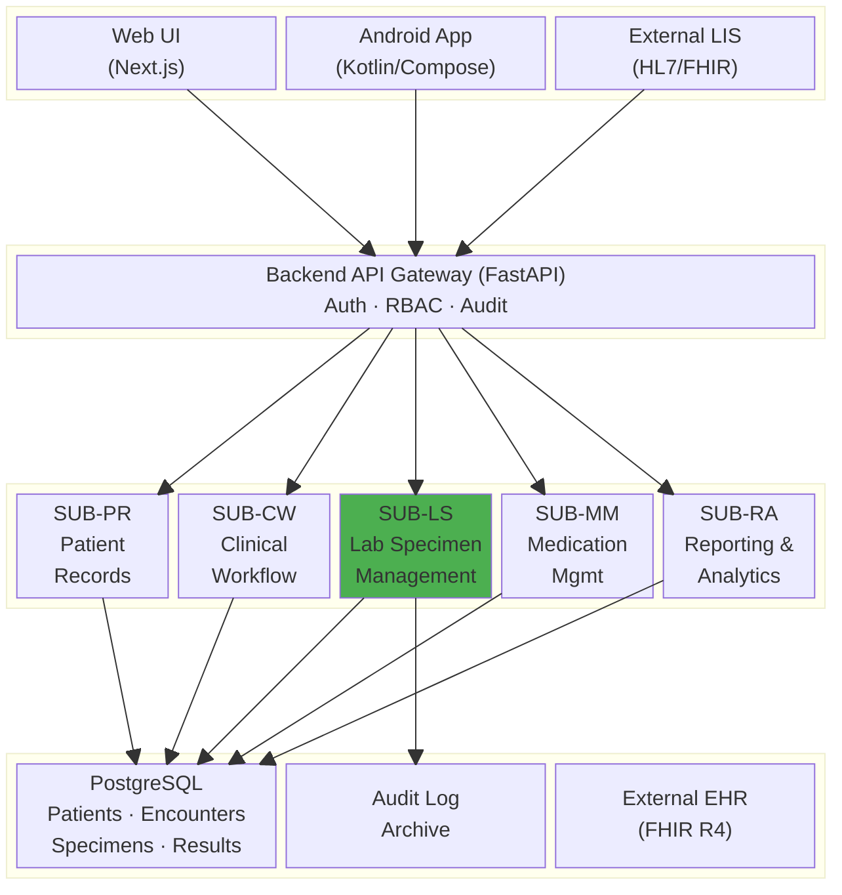
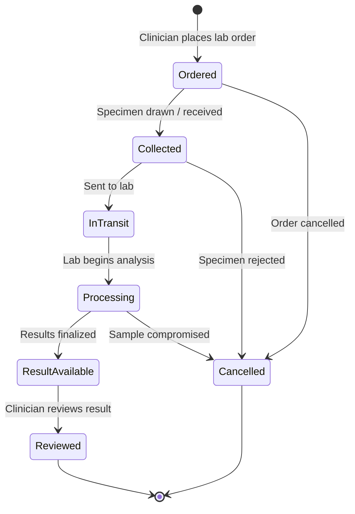
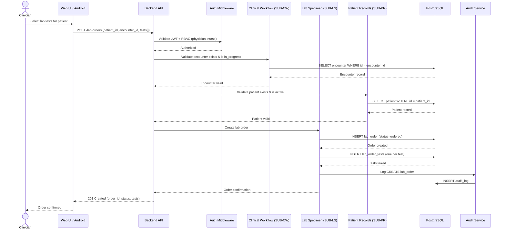
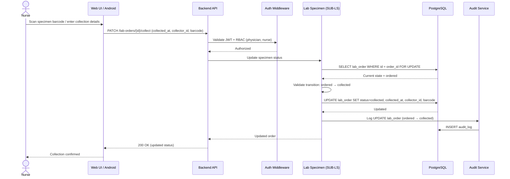
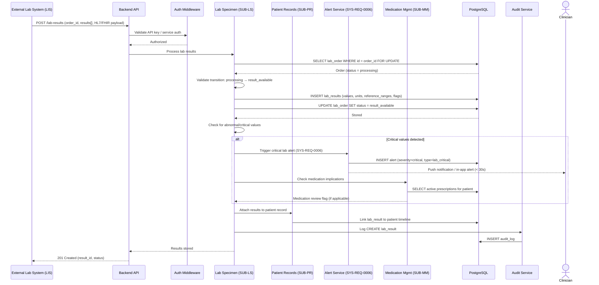
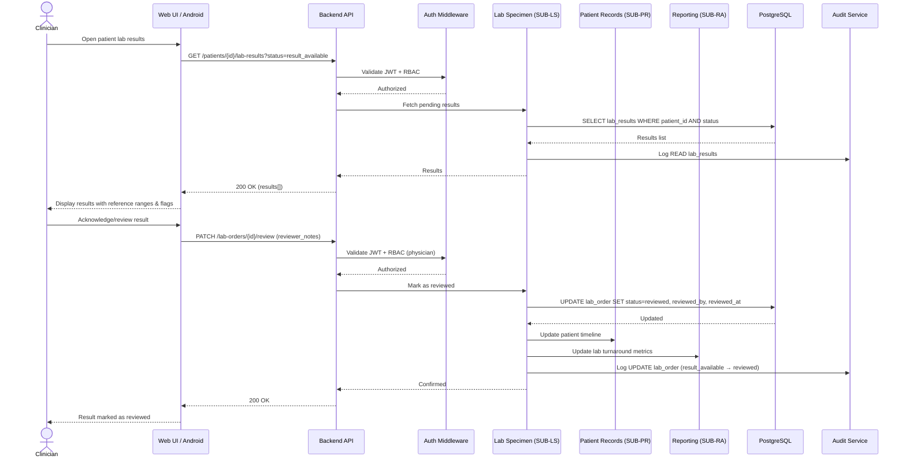
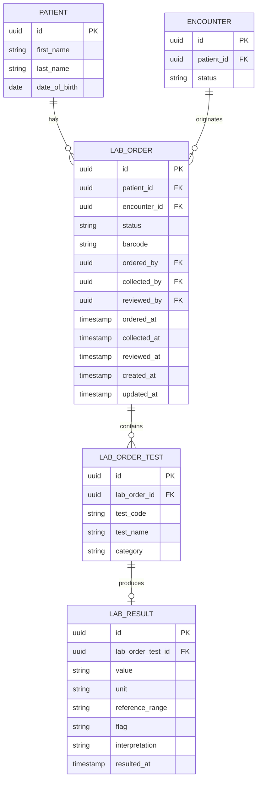

# Lab Specimen Management

**Status:** Draft
**Branch:** `feature/lab-specimen-management`
**Date:** 2026-02-18
**Subsystem Code:** SUB-LS

---

## Overview

This feature adds lab specimen tracking and management capabilities to the PMS, enabling clinicians to order lab tests, track specimen collection and processing, and view results within patient records. Lab Specimen Management introduces a new subsystem (SUB-LS) that integrates deeply with Patient Records (SUB-PR), Clinical Workflow (SUB-CW), Medication Management (SUB-MM), and Reporting & Analytics (SUB-RA).

---

## System Context — Block Diagram

The block diagram below shows where Lab Specimen Management sits within the overall PMS architecture and its interactions with existing subsystems and external systems.

### Subsystem Interactions

| Interaction | Direction | Description |
|---|---|---|
| SUB-LS ↔ SUB-PR | Bidirectional | Lab orders reference a patient (patient_id FK). Results are attached to the patient record. |
| SUB-LS ↔ SUB-CW | Bidirectional | Lab orders originate from encounters. Results may trigger encounter status updates or clinical notes. |
| SUB-LS → SUB-MM | Outbound | Critical lab results (e.g., renal function, drug levels) trigger medication review alerts. |
| SUB-LS → SUB-RA | Outbound | Lab volumes, turnaround times, and abnormal result rates feed reporting dashboards. |
| SUB-LS ↔ SYS-REQ-0003 | Bidirectional | All specimen operations are logged to the audit trail. |
| SUB-LS ↔ SYS-REQ-0006 | Bidirectional | Abnormal/critical lab values generate real-time clinical alerts within 30 seconds. |
| SUB-LS ↔ External LIS | Bidirectional | Inbound: receive results from external laboratory systems via HL7/FHIR. Outbound: send electronic orders. |

---

## Specimen Lifecycle — State Machine

| State | Description |
|---|---|
| Ordered | Lab test ordered by clinician during an encounter |
| Collected | Specimen physically collected and labeled |
| InTransit | Specimen dispatched to processing lab |
| Processing | Lab actively analyzing the specimen |
| ResultAvailable | Results finalized, pending clinician review |
| Reviewed | Clinician has reviewed and acknowledged results |
| Cancelled | Order or specimen cancelled at any pre-result stage |

---

## Sequence Diagrams

### 1. Lab Order Placement (During Encounter)

### 2. Specimen Collection and Tracking

### 3. Lab Result Ingestion (External LIS)

### 4. Clinician Reviews Lab Results

---

## Proposed API Endpoints

| Method | Path | Description | Auth | Roles |
|---|---|---|---|---|
| POST | `/lab-orders` | Create a lab order for a patient encounter | Yes | physician, nurse |
| GET | `/lab-orders` | List lab orders (filterable by patient, encounter, status) | Yes | physician, nurse, admin |
| GET | `/lab-orders/{id}` | Get lab order details with results | Yes | physician, nurse, admin |
| PATCH | `/lab-orders/{id}/collect` | Record specimen collection | Yes | physician, nurse |
| PATCH | `/lab-orders/{id}/status` | Update order status (in_transit, processing) | Yes | physician, nurse, admin |
| PATCH | `/lab-orders/{id}/review` | Clinician acknowledges and reviews results | Yes | physician |
| PATCH | `/lab-orders/{id}/cancel` | Cancel a lab order | Yes | physician, admin |
| POST | `/lab-results` | Ingest results from external LIS | Yes | service_account |
| GET | `/patients/{id}/lab-results` | Get all lab results for a patient | Yes | physician, nurse, admin |

---

## Data Model

---

## Requirements

_To be defined. This PRD will be expanded with:_

- System-level requirements linking to SYS-REQ-0006 (clinical alerts) and SYS-REQ-0003 (audit)
- Subsystem requirements (SUB-LS-*) for lab specimen workflows
- Platform decomposition (BE, WEB, AND)
- Acceptance criteria and verification methods

### Preliminary Requirement Areas

| Area | Description | Related SYS-REQ |
|---|---|---|
| Authentication | Require authenticated session for all lab operations | SYS-REQ-0001 |
| RBAC | Enforce role-based access: physician/nurse order & collect; physician reviews | SYS-REQ-0005 |
| Order Management | CRUD for lab orders with state machine validation | — |
| Specimen Tracking | Barcode-based specimen identification and status tracking | — |
| Result Ingestion | Ingest results from external LIS via HL7/FHIR | SYS-REQ-0004 |
| Critical Alerts | Trigger real-time alerts for abnormal/critical lab values within 30 seconds | SYS-REQ-0006 |
| Medication Impact | Flag results that affect active prescriptions (e.g., renal function, drug levels) | SYS-REQ-0006 |
| Audit Trail | Log all lab order and result operations | SYS-REQ-0003 |
| Patient Timeline | Attach lab results to the patient record timeline | — |
| Reporting | Feed lab metrics (volumes, turnaround, abnormal rates) to dashboards | — |

---

## Key Workflows

- **Specimen collection ordering** — Clinician places lab order during an encounter
- **Specimen labeling and tracking** — Barcode-based collection, transport, and processing tracking
- **Lab result ingestion and display** — External LIS pushes results via HL7/FHIR; clinician views in patient record
- **Abnormal result alerting** — Critical values trigger real-time alerts to ordering clinician (SYS-REQ-0006)
- **Medication review trigger** — Critical lab results prompt medication interaction review (SUB-MM)

---

## Known Limitations and Open Questions

- External LIS integration protocol (HL7 v2 vs FHIR R4) to be finalized with SYS-REQ-0004 implementation
- Offline specimen collection on Android requires offline-sync strategy (see SUB-PR-0003-AND pattern)
- Barcode format standard (Code 128, QR, etc.) TBD
- Whether lab results should be encrypted at rest like other PHI (likely yes per SYS-REQ-0002)

---

## Related Documents

- [System Specification](../specs/system-spec.md)
- [System Requirements](../specs/requirements/SYS-REQ.md)
- [Patient Records (SUB-PR)](../specs/requirements/SUB-PR.md)
- [Clinical Workflow (SUB-CW)](../specs/requirements/SUB-CW.md)
- [Medication Management (SUB-MM)](../specs/requirements/SUB-MM.md)
- [Reporting & Analytics (SUB-RA)](../specs/requirements/SUB-RA.md)
- [Backend API Endpoints](../api/backend-endpoints.md)
- [Testing Strategy](../testing/testing-strategy.md)
