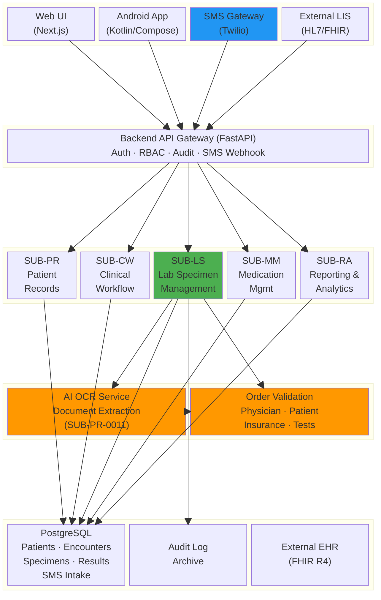
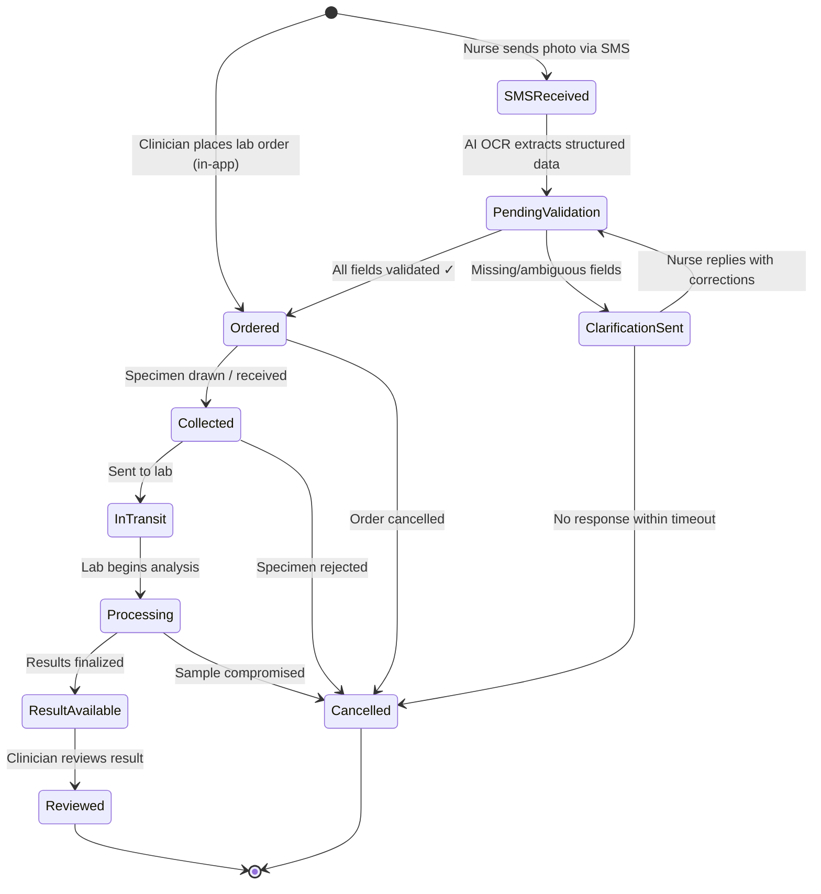
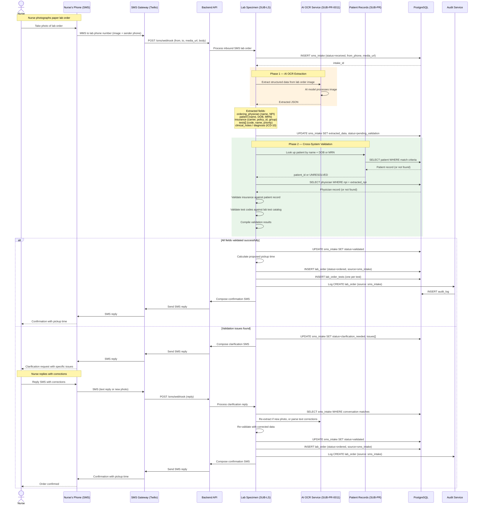
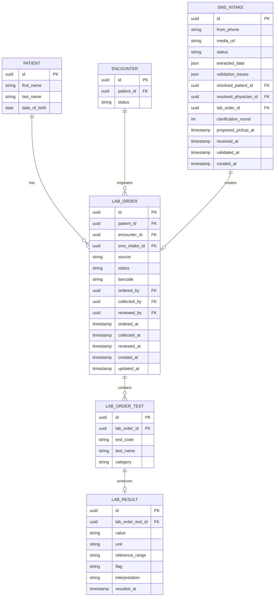

# Lab Specimen Management

**Status:** Draft
**Branch:** `feature/lab-specimen-management`
**Date:** 2026-02-18
**Subsystem Code:** SUB-LS

---

## Overview

This feature adds lab specimen tracking and management capabilities to the PMS, enabling clinicians to order lab tests, track specimen collection and processing, and view results within patient records. Lab Specimen Management introduces a new subsystem (SUB-LS) that integrates deeply with Patient Records (SUB-PR), Clinical Workflow (SUB-CW), Medication Management (SUB-MM), and Reporting & Analytics (SUB-RA).

---

## System Context — Block Diagram

The block diagram below shows where Lab Specimen Management sits within the overall PMS architecture and its interactions with existing subsystems and external systems.

### Subsystem Interactions

| Interaction | Direction | Description |
|---|---|---|
| SUB-LS ↔ SUB-PR | Bidirectional | Lab orders reference a patient (patient_id FK). Results are attached to the patient record. |
| SUB-LS ↔ SUB-CW | Bidirectional | Lab orders originate from encounters. Results may trigger encounter status updates or clinical notes. |
| SUB-LS → SUB-MM | Outbound | Critical lab results (e.g., renal function, drug levels) trigger medication review alerts. |
| SUB-LS → SUB-RA | Outbound | Lab volumes, turnaround times, and abnormal result rates feed reporting dashboards. |
| SUB-LS ↔ SYS-REQ-0003 | Bidirectional | All specimen operations are logged to the audit trail. |
| SUB-LS ↔ SYS-REQ-0006 | Bidirectional | Abnormal/critical lab values generate real-time clinical alerts within 30 seconds. |
| SUB-LS ↔ External LIS | Bidirectional | Inbound: receive results from external laboratory systems via HL7/FHIR. Outbound: send electronic orders. |
| SUB-LS ↔ SMS Gateway | Bidirectional | Inbound: nurse sends photo of lab order via SMS. Outbound: system replies with pickup time and clarifications. |
| SUB-LS → AI OCR (SUB-PR-0011) | Outbound | Photo of lab order is processed by AI OCR to extract structured data (physician, patient, insurance, tests). |
| SUB-LS ↔ Order Validation | Bidirectional | Extracted JSON is validated against PMS records: ordering physician, patient identity, insurance eligibility, and test catalog. |

---

## Specimen Lifecycle — State Machine

| State | Description |
|---|---|
| SMSReceived | Lab order photo received via SMS from nurse; queued for AI OCR processing |
| PendingValidation | AI OCR has extracted JSON; system is validating physician, patient, insurance, and order details against PMS records |
| ClarificationSent | System sent SMS reply requesting clarifications (e.g., illegible fields, unknown physician, missing insurance) |
| Ordered | Lab test order validated and created in PMS (from in-app or after SMS validation completes) |
| Collected | Specimen physically collected and labeled |
| InTransit | Specimen dispatched to processing lab |
| Processing | Lab actively analyzing the specimen |
| ResultAvailable | Results finalized, pending clinician review |
| Reviewed | Clinician has reviewed and acknowledged results |
| Cancelled | Order or specimen cancelled at any pre-result stage, or SMS intake timed out |

---

## Sequence Diagrams

### 1. Lab Order Placement (During Encounter)

### 2. Specimen Collection and Tracking

### 3. Lab Result Ingestion (External LIS)

### 4. Clinician Reviews Lab Results

### 5. SMS Photo Lab Order Intake

The nurse photographs a paper lab order and texts it to the lab's dedicated phone number. The system extracts structured data via AI OCR, validates it against PMS records, and replies with the proposed specimen pickup time or clarification requests.

#### SMS Confirmation Example

On successful validation, the system replies:

> Lab order confirmed
> Patient: Jane Doe (DOB 1985-03-15)
> Ordering MD: Dr. Smith (NPI 1234567890)
> Tests: CBC, BMP, TSH
> Insurance: Aetna — verified
> Proposed pickup: Today 2:30 PM
> Order #: LS-2026-00847

#### SMS Clarification Example

When validation issues are found:

> Lab order needs clarification:
> 1. Patient DOB is illegible — please confirm
> 2. Insurance policy # not found — please verify
> 3. Test "Lipid Panel" requires fasting — confirm fasting status
>
> Reply with corrections or send a clearer photo.

#### SMS Intake Validation Rules

| Field | Validation | On Failure |
|---|---|---|
| Ordering Physician | Match NPI against physician registry; confirm active/licensed status | Request physician name or NPI clarification |
| Patient Identity | Match (last_name + DOB) or MRN against SUB-PR patient records | Request patient DOB or MRN confirmation |
| Insurance | Verify carrier + policy ID against patient's insurance on file | Request insurance card photo or policy number |
| Test Codes | Match against lab test catalog; check special requirements (fasting, specimen type) | Flag unknown tests; ask for clarification |
| Clinical Notes / ICD-10 | Validate diagnosis codes if present; check medical necessity | Flag invalid ICD-10 codes |
| Specimen Priority | Parse STAT / Routine / Timed; apply scheduling rules | Default to Routine if unclear |

#### Pickup Time Calculation

The proposed specimen pickup time considers:

1. **Priority level** — STAT orders get next available slot; Routine follows standard schedule
2. **Nurse location** — Derived from registered phone number mapped to facility/unit
3. **Phlebotomy schedule** — Available collection rounds for the unit
4. **Test requirements** — Fasting tests may defer to morning collection windows
5. **Current queue depth** — Number of pending pickups in the same facility

---

## Proposed API Endpoints

| Method | Path | Description | Auth | Roles |
|---|---|---|---|---|
| POST | `/lab-orders` | Create a lab order for a patient encounter | Yes | physician, nurse |
| GET | `/lab-orders` | List lab orders (filterable by patient, encounter, status) | Yes | physician, nurse, admin |
| GET | `/lab-orders/{id}` | Get lab order details with results | Yes | physician, nurse, admin |
| PATCH | `/lab-orders/{id}/collect` | Record specimen collection | Yes | physician, nurse |
| PATCH | `/lab-orders/{id}/status` | Update order status (in_transit, processing) | Yes | physician, nurse, admin |
| PATCH | `/lab-orders/{id}/review` | Clinician acknowledges and reviews results | Yes | physician |
| PATCH | `/lab-orders/{id}/cancel` | Cancel a lab order | Yes | physician, admin |
| POST | `/lab-results` | Ingest results from external LIS | Yes | service_account |
| GET | `/patients/{id}/lab-results` | Get all lab results for a patient | Yes | physician, nurse, admin |
| POST | `/sms/webhook` | Twilio webhook — receive inbound MMS/SMS (lab order photo or clarification reply) | Twilio signature | — |
| GET | `/sms/intake` | List SMS intake records (filterable by status, phone, date) | Yes | admin, nurse |
| GET | `/sms/intake/{id}` | Get SMS intake details with extracted data and validation status | Yes | admin, nurse |
| POST | `/sms/intake/{id}/reprocess` | Re-trigger AI OCR extraction on an existing intake | Yes | admin |

---

## Data Model

---

## Requirements

_To be defined. This PRD will be expanded with:_

- System-level requirements linking to SYS-REQ-0006 (clinical alerts) and SYS-REQ-0003 (audit)
- Subsystem requirements (SUB-LS-*) for lab specimen workflows
- Platform decomposition (BE, WEB, AND)
- Acceptance criteria and verification methods

### Preliminary Requirement Areas

| Area | Description | Related SYS-REQ |
|---|---|---|
| Authentication | Require authenticated session for all lab operations | SYS-REQ-0001 |
| RBAC | Enforce role-based access: physician/nurse order & collect; physician reviews | SYS-REQ-0005 |
| Order Management | CRUD for lab orders with state machine validation | — |
| Specimen Tracking | Barcode-based specimen identification and status tracking | — |
| Result Ingestion | Ingest results from external LIS via HL7/FHIR | SYS-REQ-0004 |
| Critical Alerts | Trigger real-time alerts for abnormal/critical lab values within 30 seconds | SYS-REQ-0006 |
| Medication Impact | Flag results that affect active prescriptions (e.g., renal function, drug levels) | SYS-REQ-0006 |
| Audit Trail | Log all lab order and result operations | SYS-REQ-0003 |
| Patient Timeline | Attach lab results to the patient record timeline | — |
| Reporting | Feed lab metrics (volumes, turnaround, abnormal rates) to dashboards | — |
| SMS Photo Intake | Receive lab order photos via MMS, extract data with AI OCR, validate, and reply with pickup time | — |
| OCR Extraction | Convert lab order image to structured JSON (physician, patient, insurance, tests, ICD-10) using AI OCR | SUB-PR-0011 |
| Order Validation | Cross-validate extracted fields against PMS records (physician registry, patient records, insurance, test catalog) | — |
| SMS Clarification | Request and process clarification replies when extracted data is incomplete or ambiguous | — |
| Pickup Scheduling | Calculate proposed specimen pickup time based on priority, location, phlebotomy schedule, and queue depth | — |
| Phone-to-Facility Mapping | Map registered nurse phone numbers to facility/unit for location-aware pickup scheduling | — |

---

## Key Workflows

- **Specimen collection ordering** — Clinician places lab order during an encounter
- **Specimen labeling and tracking** — Barcode-based collection, transport, and processing tracking
- **Lab result ingestion and display** — External LIS pushes results via HL7/FHIR; clinician views in patient record
- **Abnormal result alerting** — Critical values trigger real-time alerts to ordering clinician (SYS-REQ-0006)
- **Medication review trigger** — Critical lab results prompt medication interaction review (SUB-MM)
- **SMS photo lab order intake** — Nurse photographs paper lab order, texts it to lab phone number; AI OCR extracts structured data, system validates against PMS records (physician, patient, insurance, tests), and replies with proposed pickup time or clarification requests

---

## Known Limitations and Open Questions

- External LIS integration protocol (HL7 v2 vs FHIR R4) to be finalized with SYS-REQ-0004 implementation
- Offline specimen collection on Android requires offline-sync strategy (see SUB-PR-0003-AND pattern)
- Barcode format standard (Code 128, QR, etc.) TBD
- Whether lab results should be encrypted at rest like other PHI (likely yes per SYS-REQ-0002)
- SMS Gateway provider selection (Twilio assumed; alternatives: AWS SNS, Vonage) — needs HIPAA BAA
- PHI in SMS messages — MMS images and reply text may contain PHI; requires HIPAA-compliant SMS provider with BAA and message encryption
- AI OCR model selection — reuse SUB-PR-0011 document OCR or train/fine-tune a lab-order-specific model for higher accuracy on handwritten orders
- Clarification timeout policy — how long to wait for nurse reply before auto-cancelling the intake (proposed: 4 hours)
- Maximum clarification rounds before requiring in-app order entry (proposed: 3 rounds)
- Nurse phone number registration and verification flow — how are phone numbers mapped to authenticated PMS users and facilities
- Support for multiple images per SMS (e.g., multi-page lab orders)

---

## Related Documents

- [System Specification](../specs/system-spec.md)
- [System Requirements](../specs/requirements/SYS-REQ.md)
- [Patient Records (SUB-PR)](../specs/requirements/SUB-PR.md)
- [Clinical Workflow (SUB-CW)](../specs/requirements/SUB-CW.md)
- [Medication Management (SUB-MM)](../specs/requirements/SUB-MM.md)
- [Reporting & Analytics (SUB-RA)](../specs/requirements/SUB-RA.md)
- [Backend API Endpoints](../api/backend-endpoints.md)
- [Testing Strategy](../testing/testing-strategy.md)
