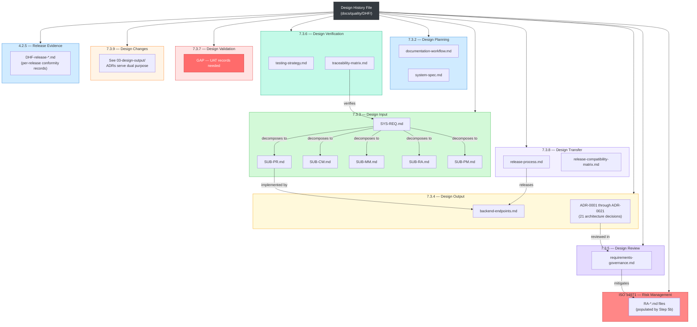

# Design History File (DHF) — Master Index

**Project:** Patient Management System (PMS)
**Standard:** ISO 13485:2016 — Medical devices — Quality management systems
**Date:** 2026-02-21
**Version:** 1.0

---

## Purpose

This Design History File (DHF) collects all design and development deliverables required by ISO 13485:2016 Clause 7.3 (Design and Development) for the PMS medical device software. Each sub-folder maps to a specific ISO 13485 clause and contains copies of the authoritative documents from the PMS documentation repository.

> **Source of truth:** The original files in `docs/` are authoritative. DHF copies are refreshed at each release (Step 10 of the [Documentation Workflow](../../documentation-workflow.md)).

---

## ISO 13485:2016 Clause 7.3 Traceability Matrix

| Clause | DHF Deliverable | DHF Folder | PMS Artifact(s) | Status |
|--------|----------------|------------|-----------------|--------|
| 7.3.2 | Design & Development Planning | `01-design-planning/` | `documentation-workflow.md`, `system-spec.md` | Exists |
| 7.3.3 | Design Input | `02-design-input/` | `SYS-REQ.md`, `domain/SUB-PR.md`, `domain/SUB-CW.md`, `domain/SUB-MM.md`, `domain/SUB-RA.md`, `domain/SUB-PM.md` | Exists |
| 7.3.4 | Design Output | `03-design-output/` | `api/backend-endpoints.md`, `architecture/0001–0021` (21 ADRs) | Exists |
| 7.3.5 | Design Review | `04-design-review/` | `quality/processes/requirements-governance.md` | Exists |
| 7.3.6 | Design Verification | `05-design-verification/` | `testing/testing-strategy.md`, `testing/traceability-matrix.md` | Exists |
| 7.3.7 | Design Validation | `06-design-validation/` | _(no user acceptance testing records yet)_ | **GAP** |
| 7.3.8 | Design Transfer | `07-design-transfer/` | `config/release-process.md`, `specs/release-compatibility-matrix.md` | Exists |
| 7.3.9 | Design Changes | `08-design-changes/` | ADRs (same as 03-design-output — see README) | Exists |
| ISO 14971 | Risk Management File | `09-risk-management/` | `quality/risk-management/RA-*.md` | **GAP** (populated by Step 5b workflow) |
| 4.2.5 / 7.3.2 | Release Conformity Records | `10-release-evidence/` | `DHF-release-YYYY-MM-DD-vX.Y.Z-*.md` | Exists |

---

## DHF Structure Diagram

---

## Gap Analysis

| Gap ID | Clause | Missing Deliverable | Priority | Resolution |
|--------|--------|---------------------|----------|------------|
| GAP-DHF-001 | 7.3.7 | User Acceptance Testing (UAT) records | High | Create UAT protocol and execute before first clinical release |
| GAP-DHF-002 | ISO 14971 | Risk assessment files (RA-*.md) | High | Execute Step 5b of documentation workflow for each feature |

---

## Refresh Process

DHF copies are refreshed during **Step 10a (Release Evidence & DHF Refresh)** of the documentation workflow:

1. For each file that changed in the release, copy the updated version into the corresponding DHF sub-folder
2. Verify DHF copies match source files: `diff docs/source docs/quality/DHF/XX-folder/copy`
3. Update this index if new deliverable types are added
4. Commit DHF updates as part of the release commit

---

## File Manifest

| DHF Folder | File Count | Source Directory |
|------------|-----------|-----------------|
| `01-design-planning/` | 2 | `docs/`, `docs/specs/` |
| `02-design-input/` | 6 | `docs/specs/requirements/`, `docs/specs/requirements/domain/` |
| `03-design-output/` | 22 | `docs/api/`, `docs/architecture/` |
| `04-design-review/` | 1 | `docs/quality/processes/` |
| `05-design-verification/` | 2 | `docs/testing/` |
| `06-design-validation/` | 0 (GAP) | — |
| `07-design-transfer/` | 2 | `docs/config/`, `docs/specs/` |
| `08-design-changes/` | 1 (README) | References `03-design-output/` |
| `09-risk-management/` | 0 (GAP) | `docs/quality/risk-management/` |
| `10-release-evidence/` | 1 | Per-release conformity records |
| **Total** | **~37** | |
