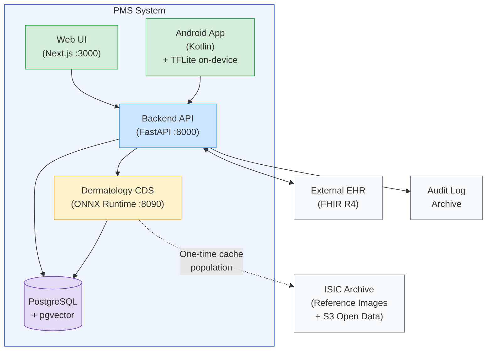

# System Specification: Patient Management System (PMS)

**Document ID:** PMS-SYS-SPEC-001
**Version:** 1.5
**Date:** 2026-02-21
**Status:** Approved

---

## 1. Purpose

This document defines the system-level specification for the Patient Management System (PMS), a HIPAA-compliant software suite for managing patient records, clinical workflows, medications, and reporting across a multi-facility healthcare organization.

## 2. Scope

The PMS consists of four deployable components sharing a common backend API, plus a dedicated AI platform for dermatology clinical decision support and other AI services:

| Component | Repository | Technology |
|---|---|---|
| Backend API | `ammar-utexas/pms-backend` | Python, FastAPI, PostgreSQL |
| Web Frontend | `ammar-utexas/pms-frontend` | Next.js, React, TypeScript |
| Android App | `ammar-utexas/pms-android` | Kotlin, Jetpack Compose |
| AI Platform (Dermatology CDS, AI Gateway) | `ammar-utexas/pms-ai` | Python, FastAPI, ONNX Runtime, pgvector |

All components share a documentation submodule (`ammar-utexas/demo`) containing specifications, requirements, and traceability evidence.

## 3. System Context

## 4. Subsystem Decomposition

| Code | Subsystem | Scope | Primary Actor |
|---|---|---|---|
| SUB-PR | Patient Records | Demographics, medical history, documents, consent, encrypted PHI, AI vision (wound assessment, patient ID verification, document OCR), dermatology CDS (EfficientNet-B4/MobileNetV3 skin lesion classification across 9 ISIC categories, pgvector similarity search against 50K reference embeddings, configurable threshold-based risk scoring, persistent lesion identity with longitudinal change detection via cosine distance), DermaCheck pipeline orchestration (parallel fan-out classification with graceful degradation, single-request lifecycle, per-stage timeout and audit) | All roles |
| SUB-CW | Clinical Workflow | Scheduling, encounters, status tracking, clinical notes, referrals, dermatology encounter integration (lesion assessments linked to encounters), DermaCheck encounter workflow (camera capture → image upload → results review → save/discard within encounter context) | Physicians, Nurses |
| SUB-MM | Medication Management | Prescriptions, drug interactions, formulary, dispensing | Physicians, Pharmacists |
| SUB-RA | Reporting & Analytics | Clinical dashboards, compliance reports, audit log queries, dermatology classification analytics (classification volumes, risk distributions, referral trends, model confidence metrics) | Administrators, Compliance |
| SUB-PM | Prompt Management | Centralized prompt CRUD, versioning, audit trail, LLM-powered version comparison | Administrators |

## 5. User Roles

| Role | Access Level | Description |
|---|---|---|
| Physician | Full clinical | All patient data, prescribe medications, clinical notes |
| Nurse | Clinical read/write | Patient vitals, encounter notes, medication administration |
| Administrator | System management | User management, configuration, compliance reports |
| Billing | Financial only | Insurance, billing codes, financial reports |
| Pharmacist | Medication management | Medication dispensing, formulary management, interaction review |

## 6. Regulatory Constraints

- **HIPAA Privacy Rule**: All PHI must be access-controlled with minimum necessary standard.
- **HIPAA Security Rule**: Encryption at rest (AES-256) and in transit (TLS 1.3), audit trails, access controls.
- **HIPAA Breach Notification**: System must support incident detection and reporting.
- **21 CFR Part 11**: Electronic signatures and audit trails for clinical records.

## 7. Quality Attributes

| Attribute | Target | Verification Method |
|---|---|---|
| Availability | 99.9% uptime | System test (monitoring) |
| Response Time | < 2 seconds for all API calls | Performance test |
| Concurrent Users | 500+ simultaneous | Load test |
| Data Integrity | Zero data loss | Integration test |
| Security | Zero critical vulnerabilities | Snyk + SonarQube scans |
| Auditability | 100% data access logged | Audit log inspection |

## 8. Requirement ID Convention

All requirements follow IEEE 830 / DOD-STD-498 conventions:

| Level | Format | Example |
|---|---|---|
| System | `SYS-REQ-XXXX` | SYS-REQ-0001 |
| Subsystem (Domain) | `SUB-{code}-XXXX` | SUB-PR-0001 |
| Platform | `SUB-{code}-XXXX-{platform}` | SUB-PR-0003-BE |
| Test Case (Domain) | `TST-{code}-XXXX` | TST-PR-0001 |
| Test Case (Platform) | `TST-{code}-XXXX-{platform}` | TST-PR-0003-BE |
| Test Run | `RUN-{YYYY-MM-DD}-{NNN}` | RUN-2026-02-15-001 |

### 8.1 Platform Codes

Requirements decompose into platform-specific requirements using the following platform codes:

| Platform Code | Platform | Repository | Technology |
|---|---|---|---|
| `BE` | Backend API | `ammar-utexas/pms-backend` | Python, FastAPI, PostgreSQL |
| `WEB` | Web Frontend | `ammar-utexas/pms-frontend` | Next.js, React, TypeScript |
| `AND` | Android App | `ammar-utexas/pms-android` | Kotlin, Jetpack Compose |
| `AI` | AI Infrastructure | `ammar-utexas/pms-ai` — Dermatology CDS Docker service, AI Gateway, Edge deployment (Jetson Thor) | Python, FastAPI, ONNX Runtime, TensorRT, pgvector |

A domain requirement (e.g., `SUB-PR-0003`) decomposes into one or more platform requirements (e.g., `SUB-PR-0003-BE`, `SUB-PR-0003-WEB`, `SUB-PR-0003-AND`). Not every domain requirement requires all platforms — backend-only concerns like encryption and audit logging may have only a `BE` platform requirement.

## 9. Traceability Policy

The PMS uses a **three-tier requirements decomposition**: System (SYS-REQ) → Domain (SUB-*) → Platform (SUB-*-BE/WEB/AND/AI). A domain requirement is considered "Verified" only when **all** of its platform requirements are verified (strict rollup). See each subsystem requirements document for the full platform decomposition.

Every requirement must trace forward to:
1. **Design** — Architecture decision or technical plan
2. **Implementation** — Source module(s) in the corresponding repository
3. **Test Case** — One or more test cases verifying the requirement
4. **Test Result** — Recorded pass/fail for every test run

Every test run must produce a **run record** linking to:
- Test case IDs executed
- Pass/fail status per case
- Timestamp and environment
- Commit SHA of the code under test

See [Traceability Matrix](../testing/traceability-matrix.md) for the live mapping.
